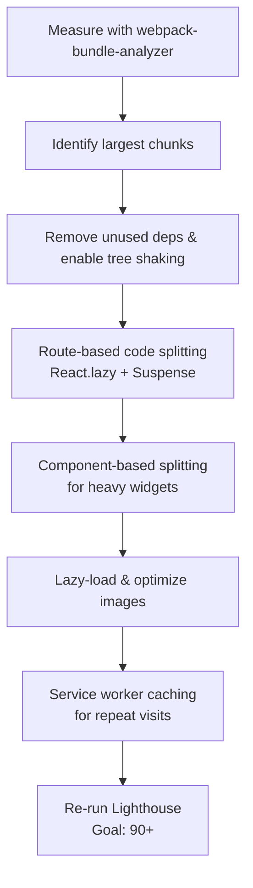

| Difficulty | Channel | Tags |
|---|---|---|
| intermediate | frontend | lighthouse, bundle, lazy-loading |

Picture this: your Lighthouse score reads a sad 65, your bundle weighs in at a whopping 2.1MB, and Time to Interactive is crawling along at 4.2 seconds. On fast fiber, users might forgive you. But for millions of people on expensive, throttled mobile data plans, that experience is a brick wall. Tinder understood this painfully well when it rebuilt its core experience as a Progressive Web App for low-end devices and constrained connections — and the results were staggering. Their combined main and vendor chunks dropped to roughly 160KB, and preloading slashed time-to-first-paint from ~1000ms to ~500ms [1].

---

> ### Real-World Case — Tinder
>
> To expand into markets where users have expensive, slow mobile data plans, Tinder built 'Tinder Online' — a React + Redux Progressive Web App meant to replicate the native experience on the web. The MVP shipped in 3 months, but the initial monolithic JavaScript bundles made the app slow to become interactive, and the team needed faster load times to win users on low-end devices and constrained connections.
>
> | | |
> |---|---|
> | **Challenge** | Tinder's web app had large, monolithic JavaScript bundles that delayed time-to-interactive because they shipped code not needed for booting the core experience. They needed to shrink initial payload, defer non-critical code, and make repeat visits fast — while avoiding performance regressions as the product evolved. |
> | **Solution** | They implemented route-based code-splitting with React Router and React Loadable, using webpack-bundle-analyzer (and source-map-explorer) to find what to split; introduced strict performance budgets (~155KB gzipped for main+vendor, ~55KB for async chunks, ~35KB CSS); enabled `` for critical bundles; added Workbox service-worker caching with long-term caching and a split-out webpack manifest; deferred non-critical work with requestIdleCallback(); upgraded to React 16 and enabled webpack scope hoisting to cut parse time. |
> | **Outcome** | Bundle size dropped to roughly 160KB for the combined main/vendor chunks; preloading reduced load time by ~1s and first paint from ~1000ms to ~500ms; scope hoisting improved initial parse time of the vendor bundle by 8%; updating React 15→16 cut the gzipped vendor chunk ~7%; and the PWA delivered the core experience at just 10% of the data cost of the native apps. |
> | **Lesson** | Winning on mobile means treating bytes as budget: measure with bundle analyzers, split at the route level and lazy-load the rest, enforce hard performance budgets to stop regressions, and cache aggressively. Even a massively popular native-first company found React web could be dramatically faster and cheaper for users once code splitting and service workers were done right. |

---

## Hook — The moment a slow website becomes a growing company's biggest liability

Ever shipped a feature, opened DevTools, and felt your stomach drop at the network tab full of giant JSON blobs and a single monolithic JavaScript file? If that sounds familiar, you are not alone. The real tension here isn't just about making a number go up — it's about the humans on the other end of that connection. Every extra kilobyte is a toll you're charging your users, and on a prepaid data plan, that toll can be the difference between a loyal customer and a bounced visitor. The stakes: a 100-millisecond delay in load time can measurably hurt engagement, so this optimization journey is not academic. It's survival.

## Problem — The monolithic bundle that strangles TTI

Here is the thing though: most React applications start small, then quietly balloon as routes, dashboards, third-party libraries, and charting libraries pile on. Before anyone notices, the webpack bundle has become a two-megabyte monolith, and the browser has to download, parse, and execute all of it before anything becomes interactive. That is the core problem — Time to Interactive (TTI) isn't just about download speed. It is about the main thread being held hostage while JavaScript parses and executes. A 2.1MB bundle could mean 4+ seconds where the user stares at a spinner, ghost buttons, or worse — a frozen, non-responsive page. On a modern desktop with a warm cache, this is annoying. On a mid-range Android on 3G, it is unusable. Many developers discover the hard way that bundlers happily hoard unused code unless you actively fight back.

## Real-World Case — Tinder

To expand into markets where users pay for expensive, slow mobile data, Tinder shipped 'Tinder Online' — a React + Redux Progressive Web App designed to replicate the native experience. The MVP came together in just three months, but the initial monolithic JavaScript bundles made the app sluggish to become interactive, and the team needed faster loads to win users on low-end devices [1]. The fix was a systematic assault on bundle size: combined main and vendor chunks dropped to roughly 160KB, preloading cut load time by about a second and first paint from ~1000ms to ~500ms, and scope hoisting improved the vendor bundle's initial parse time by 8%. Even the framework upgrade mattered — moving from React 15 to 16 trimmed the gzipped vendor chunk by about 7%. The result: the PWA delivered the core experience at just 10% of the data cost of the native apps [1]. The lesson here is that every byte you can defer or remove compounds into real, human-measurable wins.

## Deep Dive — Code splitting, tree shaking, and the trade-offs nobody mentions

Building on Tinder's story, let's unpack the three pillars of bundle slimming. First, code splitting with React.lazy() and Suspense lets you defer entire chunks until they're actually needed — but it comes with a plot twist: a naive split can create a waterfall of tiny requests that's slower than one big bundle. The trick is knowing what to split (routes and truly heavy, rarely-used components) versus what to leave in the critical path. Second, tree shaking only works if you're shipping proper ES modules; a CommonJS-transpiled dependency silently defeats the entire optimization [2][3]. Third, webpack-bundle-analyzer is your X-ray — you cannot fix what you cannot see [4]. Many developers start replacing imports before they even look at the bundle map, and they end up shaving kilobytes while a single chart library hogs megabytes. Audit first, optimize second.

## Workflow — A step-by-step plan to climb from 65 to 90+

The proven workflow mirrors Tinder's own playbook. Start with visibility: run webpack-bundle-analyzer and identify the largest chunks — this is where you find your chart libraries, moment.js replacements, and accidental duplicate copies of React. Then remove unused dependencies and upgrade imports to ES modules so tree shaking actually engages [3]. Next, implement route-based code splitting so each screen lazily loads only what it needs, then component-based splitting for heavy, non-critical widgets like charts and maps [5]. After that, tackle images: lazy-load them with native loading="lazy" and serve responsive, compressed formats. Finally, layer on caching with service workers so repeat visits bypass the network entirely [6]. Follow this order — measure, split, shake, lazy-load, cache — and you'll avoid the common trap of optimizing the wrong layer first.

## Code Example — Route-based splitting with React.lazy(), Suspense, and error boundaries

The elegant way to get Tinder-style wins in your own app combines React.lazy() with Suspense and route boundaries. The key nuance many developers miss: wrap lazy components in error boundaries so a failed dynamic import doesn't crash the whole app, and give Suspense a real fallback instead of a blank screen.

## Lessons Learned — Battle scars and what to do differently tomorrow

Three hard-won lessons come out of this journey. First, measure before you optimize — the bundle analyzer will tell you where the real weight lives, and guessing wastes days [4]. Second, code splitting has a ceiling: splitting everything creates a request waterfall that hurts, so split routes and heavy components, not every tiny import. Third, don't forget the invisible wins — upgrading from React 15 to 16 saved Tinder 7% on the gzipped vendor chunk without touching any application logic [1]. The real insight to share with your team: performance optimization is a compounding habit, not a one-time cleanup. Start with the audit, set a bundle-budget CI gate, and treat every new dependency as a tax you'll pay on every future load.

---

## Bundle Optimization Workflow

<strong>Original Interview Question</strong>

**Q:** You're tasked with improving a React app's Lighthouse performance score from 65 to 90+. The bundle size is 2.1MB and Time to Interactive is 4.2s. What specific steps would you take to optimize the bundle and implement lazy loading?

**A:** Implement code splitting with React.lazy() and Suspense, analyze bundle composition with webpack-bundle-analyzer to identify largest chunks, remove unused dependencies and optimize imports, add dynamic imports for heavy components and third-party libraries, implement route-based splitting for better initial load times, and utilize tree shaking with proper ES module configuration.

## Conclusion

The moral of Tinder's story is that a great Lighthouse score is the visible tip of a deeper engineering discipline: knowing your bundle, splitting ruthlessly, and letting every dependency earn its place on the critical path. You do not need to move from 65 to 90 overnight. Start today by running webpack-bundle-analyzer, deleting the one dependency you know you don't need, and wrapping one lazy route in Suspense. Make performance a habit with a CI budget gate, and tomorrow you'll thank yourself on a cold-cache, slow-network Friday. The takeaway to share with your team: "Every byte you defer is a user you keep."

---

## References

1. [Tinder incident report](https://calendar.perfplanet.com/2017/a-tinder-progressive-web-app-performance-case-study/) — article
2. [ES modules: beyond the basics](https://developer.mozilla.org/en-US/docs/Web/JavaScript/Guide/Modules) — documentation
3. [Webpack tree shaking documentation](https://webpack.js.org/guides/tree-shaking/) — documentation
4. [webpack-bundle-analyzer GitHub repository](https://github.com/webpack-contrib/webpack-bundle-analyzer) — blog
5. [React code splitting documentation](https://react.dev/reference/react/lazy) — documentation
6. [Service Worker API on MDN](https://developer.mozilla.org/en-US/docs/Web/API/Service_Worker_API) — documentation
7. [Lighthouse performance scoring reference](https://developer.chrome.com/docs/lighthouse/performance/) — documentation
8. [Suspense in React documentation](https://react.dev/reference/react/Suspense) — documentation

---

**Author:** Satishkumar Dhule — [GitHub](https://github.com/satishkumar-dhule) · [LinkedIn](https://linkedin.com/in/satishkumar-dhule) · [Website](https://satishkumar-dhule.github.io)
