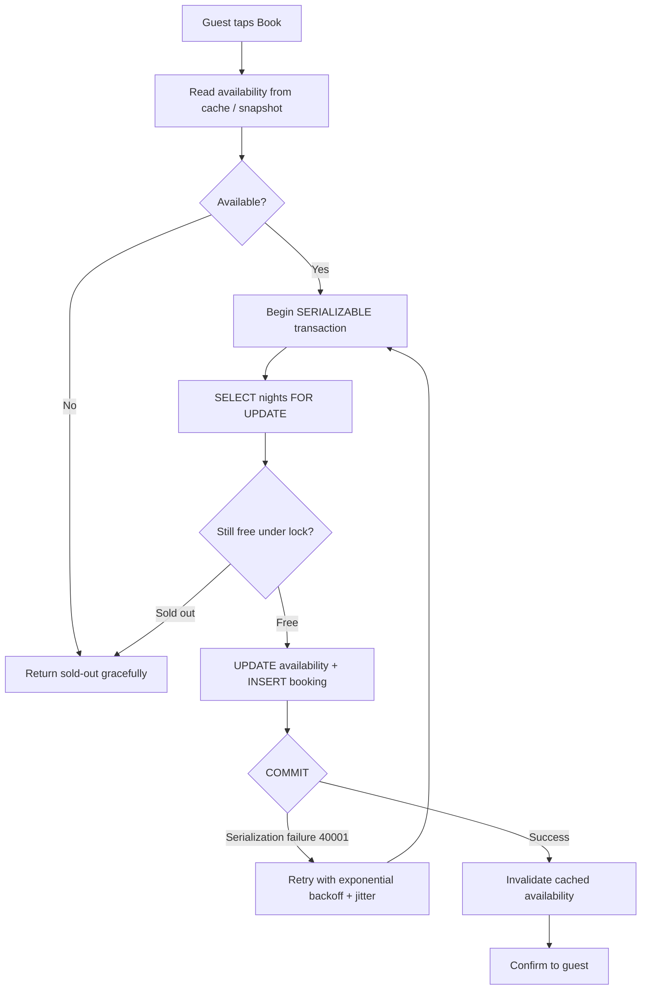

| Difficulty | Channel | Tags |
|---|---|---|
| intermediate | database | acid, isolation-levels, mvcc |

Picture this: two identical booking requests arrive at your payments service milliseconds apart. Both pass every check. Both succeed. Your guest is charged twice for one night [1]. That is the exact race condition Airbnb hit when it split payments across a service-oriented architecture — and the fix sparked one of the most instructive concurrency conversations in modern systems design. The same forces that double-charged Airbnb's community are lurking in every booking, checkout, and seat-reservation system you build. This post walks you through that battlefield: from the double charge, to SERIALIZABLE isolation, to the transaction pattern that keeps two guests from ever booking the same bed.

---

> ### Real-World Case — Airbnb
>
> After migrating its payments infrastructure to a Service-Oriented Architecture, Airbnb faced race conditions where a guest double-clicking "Book" (or an aggressive client retry, or a few seconds of replica lag on availability reads) could trigger two identical payment/booking requests that both succeeded — silently double-charging its community. The old assumption that "only one service touches a payment" broke once payments were split into many microservices.
>
> | | |
> |---|---|
> | **Challenge** | Guarantee that multiple identical, concurrent requests for the same payment or booking action — from double clicks, retries, and network timeouts — apply exactly once, while keeping ultra-low latency, staying correct under replica lag across MySQL replicas, and without every payments developer having to become a database-concurrency expert. |
> | **Solution** | Airbnb built Orpheus, a generic idempotency framework. Each request gets a deterministic idempotency key derived from the entity model (e.g. "payment-1234-refund", so any refund request for Payment 1234 maps to one key). Every API call then acquires a database row-level lock on that key, which grants an expiring 'lease' — a permission to proceed that other concurrent identical requests wait on (or get blocked by). Retries are only allowed after the lease expires, and completed responses are recorded so replays return the stored result. Crucially, idempotency state is written/read only on the master database and sharded by the high-cardinality key, because reading from replicas reintroduced duplicates via replication lag. |
> | **Outcome** | Orpheus became the safety net across Airbnb's Payments SOA services, giving them eventual consistency with correctness on their payment/booking flows — eliminating duplicate charges for the community. It replaced a bespoke per-team solution with one framework that product engineers use by default, so concurrency correctness no longer depended on individual teams' database expertise. |
> | **Lesson** | For high-availability booking/payment flows, prevent double-processing with deterministic idempotency keys plus database row-level locks that act as short expiring 'leases' — the lease lets you stay available (retries proceed after expiry) while never allowing two requests to act at once. And the subtlest attack on 'exactly once' isn't the lock — it's read-your-writes across replicas: idempotency state must be read from the master, not replicas. |

---

## Hook — The Double-Click That Charges Twice

Ever tapped "Book now" and felt time slow to a crawl, watching the spinner while your heart does the math on the last available night? Now imagine a second tap. On a flaky connection, your client retries. On a warm cache that is five seconds stale, your read says the room is still free. Before you know it, two requests are flying toward the database, each convinced the property is available.

Here is the uncomfortable truth: both of them can be right at read time and both can still fail you at write time. The classic read-check-and-write sequence — SELECT, verify, then INSERT — leaves a wide-open window. Inside that window, a second transaction slips through, and two guests walk away with the same confirmed reservation. Nobody got a wrong answer; the system just answered *concurrently*. Double bookings are rarely a sign of bad code. They are a sign that your database's default behavior was never designed to protect you from yourself.

So how do you sell one room to one guest, at scale, without turning your booking API into a single-lane toll booth? The answer starts inside a database feature most developers configure once and never truly understand: the isolation level.

## Problem — When Two Guests Want the Same Night

A booking is really a tiny economic transaction: exchange money for an inventory slot. Funding, availability calendars, and payment capture all have to move together or a customer gets hurt — either overbooked or overcharged.

Consider what a naive implementation looks like:

1. **Read** — query the availability table to confirm the night is free (possibly from a read replica or a cached snapshot).
2. **Check** — decide in application code whether it is free.
3. **Write** — insert the booking and decrement availability.

Steps 1 through 3 are three separate database round-trips. The gap between them is a race condition the database does not resolve for you, because each of those statements happens under a *different* isolation guarantee than you think. This is the classic **lost update**: two transactions read the same "available" state, both compute their answer in isolation, and whoever commits last silently clobbers the first reservation [3].

The stakes are not academic. Overbooking means an angry guest at a doorstep two time zones away. Double-charging means a support ticket, a chargeback, and a customer who tells five friends about it. And the cost compounds the less you control your own infra — the moment you add microservices, caches, or read replicas, your "safe" single-service assumptions quietly evaporate.

## Real-World Case — Airbnb

Airbnb learned this lesson the expensive way. After migrating its payments infrastructure to a service-oriented architecture, engineers discovered that a guest double-clicking "Book" — or an aggressive client retry, or a few seconds of replica lag on an availability read — could trigger two identical payment and booking requests that both succeeded, silently double-charging the community [1].

The root cause was an assumption that had served the company for years: *only one service touches a payment*. The moment payments were split across many microservices, that assumption broke. Two services could act on the same logical order because nothing in the system guaranteed that the second request was a duplicate rather than a brand-new booking.

Their answer was a framework called **Orpheus**, which became the safety net across Airbnb's Payments SOA services — providing eventual consistency *with correctness* on payment and booking flows and eliminating duplicate charges. What makes the story instructive is not the cleverness of the tooling, but the organizational pattern: Orpheus replaced a bespoke, per-team patchwork with one framework product engineers use **by default**, so concurrency correctness no longer depended on individual teams' database expertise [1].

That last sentence is the real lesson. Double-booking prevention is a *platform* problem, not a *feature* problem. Anyone who builds it by hand, in every route handler, in every team, in every codebase — will miss a spot. The durable fix is a primitive everyone uses without thinking.

## Deep Dive — SERIALIZABLE, MVCC, and the Art of the Armed COMMIT

Building on the Airbnb story, the mechanics of the fix live in how your database defines "simultaneous." By default, PostgreSQL runs at **READ COMMITTED**: each statement sees a fresh snapshot, and two statements in the same transaction can see *different* versions of the world. That is exactly the wrong tool for booking [2].

Escalate to **SERIALIZABLE** and everything changes. The database promises that the outcome of your concurrent transactions is identical to some serial (one-at-a-time) execution — as if the guests queued politely at the front desk instead of racing each other. PostgreSQL implements this with **Serializable Snapshot Isolation (SSI)**, which detects dangerous read/write patterns between snapshot-isolated transactions and aborts one of them with SQLSTATE 40001 [2][4]. In other words, the database does not *stop* the race; it *loses* it for you, cleanly, so you can retry.

You still have two concurrency philosophies to choose from, and this is where many developers split into camps [7]:

| Approach | Mechanism | Best when | Real tradeoff |
|---|---|---|---|
| **Optimistic** (you) | Snapshot read, then version-column check at write. No locks held | Contention is rare; reads outnumber writes | Every write competes; high contention means constant aborts and retries |
| **Pessimistic** (you, the host) | `SELECT ... FOR UPDATE` holds row locks before writing | Contention is hot; a few rows take the heat | Writers serialize on locks — latency climbs on popular items, lock waits pile up |

The strongest pattern is a hybrid: **MVCC snapshot reads for cheap availability checks**, then **row-level locking via `SELECT FOR UPDATE`** on the exact date-range rows, all inside a **SERIALIZABLE** transaction [5][6]. The snapshot keeps reads fast and lock-free; the locks make the actual writers queue; and SERIALIZABLE catches the subtle patterns that locks alone cannot (a table-check on a gap, a predicate that spans rows, a phantom).

💡 **Insight:** the commit is the only operation that can throw. Optimize for a fast happy path and a *well-handled* abort path, not for a zero-percent abort rate. Aborts are a signal your isolation level is actually earning its salary.

⚠️ **Watch Out:** MVCC snapshots are beautiful until they are stale. Read replicas are typically asynchronous — that "few seconds of replica lag" from the Airbnb case means your scale-out read layer can present availability that has already been sold. Use replicas for *display* checks, but never let them be the final say on a write.

Now add the operational layers: **retry logic with exponential backoff** for serialization failures, so a burst of aborts does not turn into a thundering herd [8]; **write-through cache invalidation** on successful bookings, so the hot property's availability does not lie to the next tenant [10]; and **circuit breakers** for genuinely hot properties, where no amount of retrying is worth the database cyclones. Buy a queue and serialize all bookings for a single property if your analytics show it is a magnet for concurrent writes.

## Workflow — Booking a Night, Step by Step

Connecting the pieces from the deep dive, here is the complete booking journey you would implement. The diagram below tells the visual story: a guest enters on the left, an armed transaction in the middle, and a retry loop guarding the end.



**The six steps, and why each one exists:**

1. **Check availability cheaply** — a cache or snapshot read answers 99% of guests instantly without touching hot rows.
2. **Open a SERIALIZABLE transaction** — your guarantee that the transaction's outcome looks as if it ran alone [2].
3. **`SELECT ... FOR UPDATE` on the date range** — physically lock the nights you are about to sell, so simultaneous writers queue behind you instead of overwriting you [5].
4. **Re-validate under the lock** — the world may have changed since the cheap check in step 1; the lock is where you learn the truth.
5. **Write availability + booking in one atomic burst** — the update and the insert live or die together [3].
6. **COMMIT, and fight for it** — if the database aborts a conflicting transaction with 40001, back off exponentially, add jitter, and retry from step 2 [8].

🔥 **Hot Take:** most "double booking" bugs are not fixed by adding more validation code — they are fixed by deleting validation code and moving the invariant *into the transaction*. Every hand-written `if` over a shared resource is a place a race can crawl through.

## Code Example — An Armed Booking Transaction in Python

Following the workflow, here is the implementation that actually protects a reservation. The snippet uses `psycopg2` against PostgreSQL and deliberately shows the full retry loop, because that loop is where most production systems quietly fall apart.

```python
import random
import time

import psycopg2
from psycopg2 import errors

MAX_ATTEMPTS = 5
BACKOFF_BASE_S = 0.1  # start small, double on every retry

def book_property(conn, property_id, start_date, end_date):
    """Reserve a property atomically under SERIALIZABLE isolation."""
    for attempt in range(MAX_ATTEMPTS):
        with conn.cursor() as cur:
            # 1. Every retry is a fresh, fully-serializable transaction.
            cur.execute("BEGIN TRANSACTION ISOLATION LEVEL SERIALIZABLE")

            # 2. Lock exactly the nights the guest wants. FOR UPDATE forces
            #    concurrent writers to queue behind this lock instead of
            #    silently overwriting each other's availability updates.
            cur.execute(
                """
                SELECT date, available
                FROM availability
                WHERE property_id = %s AND date BETWEEN %s AND %s
                FOR UPDATE
                """,
                (property_id, start_date, end_date),
            )
            nights = cur.fetchall()

            # 3. Sold out? Commit (nothing to undo) and tell the UI the truth.
            if not nights or any(not free for _, free in nights):
                conn.commit()
                return False

            # 4. Write the reservation and flip the calendar in the SAME tx.
            cur.execute(
                "UPDATE availability SET available = FALSE "
                "WHERE property_id = %s AND date BETWEEN %s AND %s",
                (property_id, start_date, end_date),
            )
            cur.execute(
                "INSERT INTO bookings (property_id, start_date, end_date, status) "
                "VALUES (%s, %s, %s, 'confirmed')",
                (property_id, start_date, end_date),
            )

            # 5. The commit is the only operation that can explode: under
            #    SERIALIZABLE, Postgres detects the race and aborts one
            #    transaction with SQLSTATE 40001. That is a FEATURE.
            try:
                conn.commit()
                return True
            except errors.SerializationFailure:
                conn.rollback()
                wait = BACKOFF_BASE_S * (2 ** attempt) + random.uniform(0, 0.05)
                time.sleep(wait)  # jitter stops a thundering herd of retries

    conn.rollback()
    raise RuntimeError("Too hot to handle: give this property a cooldown")
```

**Walking through it, step by step:**

- **The retry loop (lines 11-33)** is the heart. SERIALIZABLE guarantees correctness by *somebody* eventually losing — that somebody is often you. You loop a bounded number of times, roll back cleanly, and try again. Without this loop, a correct isolation level turns every spike into a user-facing failure [8].
- **`SELECT ... FOR UPDATE` (lines 19-27)** is where the pessimism lives. The snapshot gives every guest a fast, consistent read; the lock serializes the writers on the exact dates in question. Two requests for the same night become a queue, not a collision [5].
- **The `if not nights or any(...)` guard (line 31)** is your second chance to look at the world *under the lock*. The earlier cache check was a hint; this check is the verdict.
- **Bundling the UPDATE and INSERT in one transaction (lines 34-43)** is what makes the operation atomic: the availability flip and the booking row either both commit or both vanish. That is the whole ballgame [3].
- **Jitter in the backoff (line 50)** matters more than you think. A naive `2 ** attempt` backoff across a cluster of retrying services is a coordinated stampede; a few random milliseconds break the herd apart [8].

🎯 **Key Point:** notice there is no hand-written "version check" here. Between the row lock and SERIALIZABLE isolation, the database handles the optimistic-versus-pessimistic dance for you — you just have to be ready to retry.

## Lessons Learned — Battle Scars and the Path Forward

After seeing this pattern break in every possible place, here is the condensed list of scars — and the rules that keep them from reopening:

- **Do not trust replicas with money.** Replica lag *will* sell rooms twice [1]. Always resolve the final answer against the primary under lock.
- **Do not validate in application code what a transaction can enforce.** Every `if` over shared data is a race waiting for a slow Friday. Push invariants into the database.
- **Do not ship SERIALIZABLE without a retry loop.** You have just introduced a guaranteed abort source; leaving it unhandled is arming a landmine and walking away.
- **Do not retry without backoff and jitter.** Aborts are worst when traffic is spiky — which is precisely when a naive retry storm makes everything worse [8].
- **Do not hand this knowledge to each team separately.** Airbnb's Orpheus won because it was a shared default, not a per-team exercise in database heroics [1]. Build one booking primitive and let every product feature reuse it.
- **Do not forget the human layer.** Idempotency keys on the request side — a hash of the guest, the property, and the dates — catch duplicates *before* they reach the database, exactly the class of bug that double-charged Airbnb's guests [10].

⚠️ **Watch Out — the silent killer:** monitoring. Lock contention and abort rates are your two most informative booking metrics. If you are not graphing `SQLSTATE 40001` counts per endpoint, you are flying blind into the exact incident that opened this story.

If some of this feels like a lot, you are not alone — most teams learn it with a pager buzzing at 2 a.m. and a support queue of overcharged customers. The good news is the fix is now standard material: armed transactions, bounded retries, and one shared booking primitive.

---

## Booking Flow Under SERIALIZABLE Isolation


<details>
<summary><strong>Original Interview Question</strong></summary>

**Q:** You're building a booking system for Airbnb where multiple users can reserve the same property simultaneously. How would you design the transaction handling to prevent double bookings while maintaining high availability?

**A:** Use SERIALIZABLE isolation with optimistic concurrency control. Implement row-level locks on property availability tables, use MVCC snapshot reads for checking availability, and apply application-level validation to ensure atomic booking operations.

</details>

## Conclusion

The next time you reach for a read, a check, and a write, remember whose story that is: it is the story of two identical requests, one unlucky guest, and a silent duplicate charge [1]. Airbnb's fix was not more validation code — it was a shared primitive that moved the invariant into the transaction and let every team stop reinventing database expertise. Tomorrow, look at your own booking, checkout, or reservation flow with fresh eyes: are your invariants enforced by the database, or by hopeful `if` statements? Raise the isolation level, arm your commits, add a retry loop with jitter, and put idempotency keys on the request path. One memorable line to carry back to your team: concurrent systems do not fail loudly — they fail correctly, twice. Make sure your transaction is the one holding the door.

---

## References

1. [Airbnb incident report: Avoiding double payments in a distributed payments system](https://medium.com/airbnb-engineering/avoiding-double-payments-in-a-distributed-payments-system-2981f6b070bb) — article
2. [PostgreSQL documentation: Transaction Isolation](https://www.postgresql.org/docs/current/transaction-iso.html) — documentation
3. [ACID — Wikipedia](https://en.wikipedia.org/wiki/ACID) — article
4. [Multiversion Concurrency Control — Wikipedia](https://en.wikipedia.org/wiki/Multiversion_concurrency_control) — article
5. [PostgreSQL documentation: SELECT (including FOR UPDATE locking clause)](https://www.postgresql.org/docs/current/sql-select.html) — documentation
6. [DigitalOcean tutorial: PostgreSQL Transaction Isolation Levels Explained](https://www.digitalocean.com/community/tutorials/postgresql-transaction-isolation-levels) — documentation
7. [Optimistic concurrency control — Wikipedia](https://en.wikipedia.org/wiki/Optimistic_concurrency_control) — article
8. [Exponential backoff — Wikipedia](https://en.wikipedia.org/wiki/Exponential_backoff) — article
9. [Serializability — Wikipedia](https://en.wikipedia.org/wiki/Serializability) — article
10. [Stripe documentation: Idempotent Requests](https://docs.stripe.com/api/idempotent_requests) — documentation

---

**Author:** Satishkumar Dhule — [GitHub](https://github.com/satishkumar-dhule) · [LinkedIn](https://linkedin.com/in/satishkumar-dhule) · [Website](https://satishkumar-dhule.github.io)
