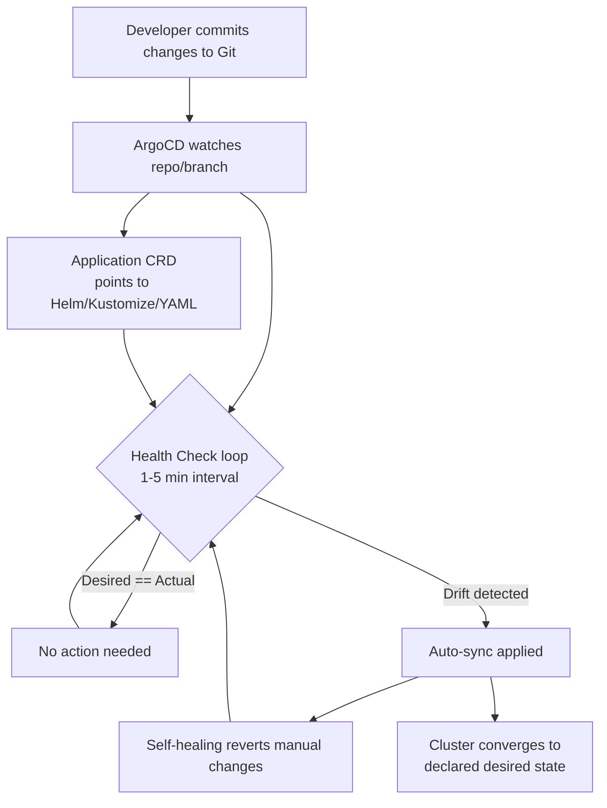

| Difficulty | Channel | Tags |
|---|---|---|
| beginner | devops | argocd, flux, declarative |

Modernizing delivery is rarely glamorous — it is usually a slow grind through legacy pipelines, drift, and deployment dread. When Adobe found its internal delivery platform buckling under enterprise scale, the fix was not another batch of clever scripts. It was a wholesale bet on GitOps: making Git the single source of truth and letting Kubernetes reconcile the rest [1]. Here is how you can borrow that playbook for your own microservices — and where the declarative-versus-imperative debate actually matters.

---

> ### Real-World Case — Adobe
>
> Adobe had a legacy internal delivery platform, Moonbeam (a Container-as-a-Service built on their older model), that had become increasingly difficult to scale, secure, and operate reliably across the enterprise. To modernize, they built Flex, a GitOps-based delivery platform on Kubernetes and the Argo project ecosystem (Argo CD, Workflows, Events, Rollouts).
>
> | | |
> |---|---|
> | **Challenge** | Adobe needed to migrate over 10,400 pipelines across hundreds of engineering teams to a new GitOps delivery model, while eliminating configuration drift, fragile queue-based deployment workflows, and manual intervention — all without breaking a massive, enterprise-scale production footprint. |
> | **Solution** | Flex uses Argo CD for continuous reconciliation and Git-based delivery (with Git as the single source of truth and declarative app definitions), Argo Workflows for CI/CD and migration orchestration, Argo Events for event-driven automation, and Argo Rollouts for progressive delivery. They built a governed, self-service migration interface with start/pause/continue/end controls backed by workflow orchestration, and defaulted to automated reconciliation to keep running environments aligned with approved state in source control. |
> | **Outcome** | 10,400 pipelines migrated or decommissioned; the platform now manages over 6,000 services across nearly 50,000 environments, including ~19,000 production environments supporting 3,300+ production services; 3,000+ developers onboarded; deployment queue times significantly reduced; and an unexpected ~80% of previously identified stale/duplicate services removed, contributing substantial infrastructure cost savings. |
> | **Lesson** | Adopting GitOps/Argo is only part of the challenge — building the governed workflow, migration tooling, and lifecycle controls around it is what makes enterprise-scale adoption practical. Also, a large-scale GitOps migration surfaces hidden value: it forced a platform hygiene audit that retired ~80% of stale services for significant cost savings. |

---

## Hook — Ever wondered why deployments still feel like a coin flip?

Ever wondered why deployments still feel like a coin flip? Your cluster says one thing, your repository says another, and nobody is brave enough to say which one is actually right. The deploy looked fine. Then a manual `kubectl scale` from three days ago silently drifted back to the old state and took down prod at 2am. Sound familiar? It should — because the gap between what you declared and what is actually running is the quiet tax every team pays for skipping GitOps. Here is the thing though: the fix is not about writing better YAML. It is about changing your entire relationship with your cluster — who holds the source of truth, and what fights back when the cluster disagrees.

## Problem — The invisible enemy: configuration drift

Here is the core pain point. When you run `kubectl apply`, you are not really updating your infrastructure — you are updating a remote cluster's live state, and that decision lives in nobody's memory. Every ad-hoc `kubectl exec` or emergency patch becomes a small, invisible fork in the road. Over weeks, that fork accumulates into configuration drift: environments that look the same on paper but behave completely differently under load. Consequently, rollbacks turn into archaeology, onboarding new developers means handing them tribal knowledge, and audits become guesswork. For a microservices architecture — where dozens of services each own their own manifests, secrets, and Helm charts — the stakes multiply quickly. Many developers discover too late that the real enemy is not their code. It is the silent divergence between "declared" and "actual", and no monitoring dashboard warns you about it in advance.

## Real-World Case — Adobe

Building on this problem, consider Adobe — a company with an enterprise-scale delivery problem that would overwhelm most infrastructure teams. Adobe had a legacy internal delivery platform called Moonbeam, a Container-as-a-Service built on an older operating model. As the company's engineering organization grew, Moonbeam became increasingly difficult to scale, secure, and operate reliably across the enterprise. The stakes were enormous: thousands of developers, tens of thousands of environments, and production reliability were all riding on a platform that was showing its age. Adobe's response was not incremental. They built Flex, a fully GitOps-based delivery platform on Kubernetes and the Argo project ecosystem — Argo CD, Workflows, Events, and Rollouts [1]. The results speak for themselves. Flex migrated or decommissioned 10,400 pipelines and now manages over 6,000 services across nearly 50,000 environments, including roughly 19,000 production environments supporting 3,300+ production services. More than 3,000 developers were onboarded, and deployment queue times dropped significantly. Perhaps the most surprising outcome: an unexpected ~80% of previously identified stale and duplicate services were removed, delivering substantial infrastructure cost savings [1]. That is the difference between treating GitOps as a buzzword and treating it as the operating model of your entire platform.

## Deep Dive — Declarative vs. imperative: why "declared" beats "described"

This leads to the heart of the question: what actually separates declarative from imperative infrastructure? The answer is not about syntax — it is about where authority lives. In the imperative approach, you execute `kubectl` commands to make direct changes to the cluster. The cluster is the source of truth, and your Git repository is just a suggestion. This is fast, familiar, and seductive — until the inevitable moment you need to reconstruct what changed, why it changed, and who changed it. Configuration drift becomes the norm, environments quietly diverge, and rollbacks require manual heroics. The declarative approach flips the model. You define the complete desired state in version control using YAML manifests, Helm charts, or Kustomize overlays [2]. ArgoCD continuously monitors the cluster and reconciles the actual state with the declared state — repairing drift automatically and reverting unauthorized manual changes [3]. Every change flows through a Git commit, which gives you auditability, collaboration, and automated rollbacks as free side effects. There is a catch, however: GitOps is not a silver bullet. It demands disciplined repo structure, secret management handled separately, and teams willing to treat any hands-on fix as a red flag rather than a shortcut. Here is the plot twist people rarely expect: the "slower" declarative path is often the faster one in practice — because the self-healing loop catches drift before users ever feel it.

## Workflow — From repo to reconciled cluster in five moves

So how does this all come together in practice? The workflow follows a predictable loop that, once internalized, becomes second nature. First, you establish a Git repository that holds your Kubernetes manifests, Helm charts, or Kustomize overlays — this is now your single source of truth. Second, you create an ArgoCD Application CRD that points at that repository, telling ArgoCD what to watch and where. Third, you enable auto-sync with a configurable health check interval, typically between one and five minutes; Adobe's platform runs on the Argo project's full suite so this loop scales across thousands of applications simultaneously [1]. Fourth, you turn on self-healing, which lets ArgoCD automatically revert any manual changes that deviate from the declared state. Finally, you watch your team's workflow transform — from "who changed this?" to "let's check the latest commit." The diagram below captures the full reconciliation loop, from Git commit to cluster convergence.

## Code Example — Configuring an ArgoCD Application with self-healing

To make this concrete, here is a production-style ArgoCD Application definition. This YAML points ArgoCD at a Helm chart in your repo, sets a sync policy that runs health checks every three minutes, and — critically — enables self-healing so any manual cluster edit gets reverted automatically. The `syncOptions` line is the real workhorse: it tells ArgoCD to prune resources that no longer exist in Git and to keep failed syncs from silently piling up. Combined with the `automated` sync policy, this turns your cluster into a system that actively enforces Git as the source of truth rather than merely hoping for it.

## Lessons Learned — Five rules worth stealing from Adobe's playbook

Stepping back, a few battle scars are worth passing on. First, treat Git as the only place state is *changed* — not just read from; if someone is debugging "why did this deploy fail," your first question should be about the last commit, not the last `kubectl` command. Second, enable self-healing early; a cluster that reverts unauthorized changes is a cluster that teaches your team good habits by default. Third, keep your health check interval pragmatic — every minute sounds great until you are paying for reconciliation across 50,000 environments; three minutes was the sweet spot for a platform at Adobe's scale [1]. Fourth, manage secrets separately from your manifests; even a GitOps platform does not make credentials magically safe to commit. Finally, expect the plot twist: as Adobe discovered with its 80% reduction in stale and duplicate services, GitOps surfaces the mess you did not know you had [1]. The journey is not just about faster deploys — it is about finally seeing your entire estate clearly for the first time.

---

## GitOps Reconciliation Loop with ArgoCD

<strong>Original Interview Question</strong>

**Q:** You're setting up GitOps for a microservices deployment. How would you configure ArgoCD to automatically sync changes from your Git repository to Kubernetes, and what's the difference between declarative and imperative approaches in this context?

**A:** I'd configure ArgoCD by setting up a Git repository containing Kubernetes manifests or Helm charts, creating an Application CRD that points to the Git repository, enabling auto-sync with a health check interval of 3 minutes, and implementing self-healing to automatically revert any manual changes. The declarative approach involves defining the desired state in Git through YAML manifests, Helm charts, or Kustomize configurations, where ArgoCD continuously reconciles the actual state with the desired state. In contrast, the imperative approach uses kubectl commands to make direct changes to the cluster, bypassing the Git repository as the single source of truth.

## Conclusion

The moral of this story is straightforward but transformative: stop asking your cluster what state it is in, and start telling your repository what state it should be in. Adobe's move to Flex did not just speed up deployments — it gave them a clear, single source of truth and exposed 80% of their stale infrastructure for cleanup [1]. Tomorrow, you can start smaller: pick one microservice, commit its manifests to Git, point an ArgoCD Application at it, and enable self-healing. The first time you watch a manual change get automatically reverted, you will understand the shift. That is the moment GitOps clicks — and the moment you stop guessing what is actually running in production.

---

## References

1. [Adobe incident report](https://www.cncf.io/case-studies/adobe/) — article
2. [Kubernetes Documentation - Configuration Management](https://kubernetes.io/docs/concepts/configuration/overview/) — documentation
3. [Argo CD Documentation](https://argo-cd.readthedocs.io/en/stable/) — documentation
4. [Argo Project on GitHub](https://github.com/argoproj/argo-cd) — blog
5. [GitOps - GitLab Documentation](https://docs.gitlab.com/ee/topics/gitops/) — documentation
6. [Flux CD - GitOps for Kubernetes](https://fluxcd.io/) — documentation
7. [Declarative Management of Kubernetes Objects Using Configuration Files](https://kubernetes.io/docs/tasks/manage-kubernetes-objects/declarative-config/) — documentation
8. [Set up a CI/CD pipeline - DigitalOcean Tutorial](https://www.digitalocean.com/community/tutorials/set-up-a-ci-cd-pipeline) — blog

---

**Author:** Satishkumar Dhule — [GitHub](https://github.com/satishkumar-dhule) · [LinkedIn](https://linkedin.com/in/satishkumar-dhule) · [Website](https://satishkumar-dhule.github.io)
