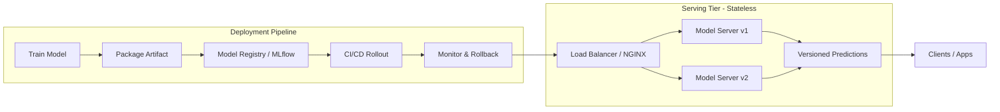

| Difficulty | Channel | Tags |
|---|---|---|
| beginner | devops | mlops, deployment |

By mid-2015, Uber's data scientists were building models with a patchwork of tools—R, scikit-learn, custom algorithms—while separate engineering teams hand-rolled one-off systems to shove each model into production [1]. The result was a sustainable-in-theory, unsustainable-in-practice mess. This is the story of how Uber split the ML lifecycle into two very different jobs—deployment and serving—and why every developer who ships a model to production needs to understand the difference.

---

> ### Real-World Case — Uber
>
> By mid-2015, Uber's data scientists built models with fragmented tools (R, scikit-learn, custom algorithms) while separate engineering teams hand-rolled one-off systems to push each model into production. This bespoke approach was unsustainable as Uber scaled, so the company built Michelangelo: an end-to-end ML platform that split the ML lifecycle into a managed deployment pipeline (training, packaging, CI/CD rollout, monitoring) and a dedicated low-latency serving tier (the near-real-time prediction service).
>
> | | |
> |---|---|
> | **Challenge** | Models powering core products needed two very different runtime paths: offline batch scoring (Spark jobs on a cadence) and online serving with sub-100ms latency for user-facing rides/Eats flows. Online serving had to handle massive request rates, route traffic to the right model version, pre-load model artifacts for fast inference, and support A/B testing and gradual rollouts - all while teams promoted new models without changing client code. |
> | **Solution** | Models were packaged as ZIP archives (metadata, parameters, compiled DSL) and pushed to containers across data centers via standard code-deployment infra (the deployment half: CI/CD-style rollout, versioned model repository, rollback via UUIDs). The serving half — a prediction service cluster of hundreds of hosts behind a load balancer — pre-loaded models into memory, used a routing layer keyed on request headers plus a compiled DSL to fetch features from a Cassandra-backed feature store at request time, and exposed one REST/Java API regardless of model framework. Since models were stateless, hot-swapping a new model UUID and shifting a percentage of traffic enabled safe A/B tests. |
> | **Outcome** | The highest-traffic models served more than 250,000 predictions per second, with P95 latency under 5ms for models needing no feature-store lookups and under 10ms when fetching from Cassandra. It became Uber's de-facto ML platform, scaling to roughly 100 use cases and later ~5,000 production models serving 10M real-time predictions per second at peak. Crucially, the stateless serving layer could scale out simply by adding hosts behind the load balancer. |
> | **Lesson** | Deployment and serving are genuinely different jobs: workforce-of-one deployment is a CI/CD + infrastructure problem (packaging, versioning, rollback), while serving is a stateless, scale-out web-service problem where latency is mostly determined by feature-fetching, not model compute. Decoupling the two — a model artifact pipeline feeding a load-balanced serving cluster — is what let Uber hit 250K+ QPS at P99-level latency well under 100ms. |

---

## Hook — The two words everyone conflates, and the 250,000-predictions-per-second reality

Ever wondered why your carefully trained model works beautifully in a notebook but starts falling apart the second real users touch it? Many developers discover that shipping a model to production is not one problem—it is two completely different problems wearing nearly identical names. Deployment and serving sound like synonyms. They are not. By mid-2015, Uber proved that treating them as the same job caused chaos: fragmented tools, hand-rolled one-off systems, and models that took forever to reach production [1]. The stakes are high because the difference between them is exactly where real-world ML systems either soar or collapse.

## Problem — The classic mistake: treating 'shipping a model' as a single task

Here is the thing though: most teams treat the entire ML lifecycle as one big blob. You train, you package, you deploy, you serve—and if you are lucky, all in one tool. But that mental model breaks down the moment traffic spikes. Deployment is about the *journey* to production: CI/CD pipelines, infrastructure setup, monitoring, rollback strategies. Serving is about the *moment of truth*: the runtime inference API that takes a request and returns a prediction in milliseconds. These demand different technologies, different scaling strategies, and different failure modes. Sound familiar? If you have ever watched a model fail under load that the training pipeline never prepared it for, you already know the pain—you just did not have the vocabulary for it yet.

## Real-World Case — Uber and the Michelangelo platform

This is where Uber's story turns into a cautionary tale with a happy ending. By mid-2015, data scientists at Uber built models with R, scikit-learn, and custom algorithms, while separate engineering teams maintained bespoke, one-off systems to push each model live [1]. It worked—until it could not scale. So Uber built Michelangelo, an end-to-end ML platform that drew a hard line between two responsibilities: a managed deployment pipeline (training, packaging, CI/CD rollout, monitoring) and a dedicated low-latency serving tier called the near-real-time prediction service [1]. The payoff was staggering: the highest-traffic models served more than 250,000 predictions per second, with P95 latency under 5ms for models needing no feature-store lookups and under 10ms when fetching from Cassandra [1]. Michelangelo scaled to roughly 100 use cases, then about 5,000 production models serving 10M real-time predictions per second at peak [1]. Crucially, the *stateless serving layer* could scale out simply by adding hosts behind the load balancer [1]. That last detail is the whole point.

## Deep Dive — Building on Uber's insight: what deployment and serving actually demand

Building on Uber's lesson, the real technical distinction becomes clear when you map out *what each layer actually does*. Deployment is infrastructure: Kubernetes, Docker, Terraform to provision; MLflow, SageMaker, or Vertex AI to manage the lifecycle; GitHub Actions or Jenkins to run CI/CD [2]. Serving is runtime: FastAPI, Flask, or gRPC for the API layer; TorchServe, TensorFlow Serving, or BentoML as the model servers; NGINX or Envoy as the load balancers [3][4]. But the deeper trade-offs are where the plot twists happen. Latency versus throughput is the classic tension: you optimize the serving tier for sub-100ms response times for real-time inference, or up to a second for batch jobs [5]. You must also decide between horizontal scaling (adding pod replicas through orchestration) and vertical scaling (throwing more GPU memory or CPU at a single instance) [2]. And then there is the cold-start problem—the painful reality that a freshly spun-up container has to load the model into memory before it can serve anything. Uber sidestepped this in part because its serving layer was stateless, so scaling out was just a matter of adding hosts [1]. Hot take: if you are thinking about serving and deployment as one undifferentiated task, you are already designing the bottleneck that will bite you at 2am.

## Workflow — The journey from trained artifact to live prediction

This leads to a repeatable workflow that separates the two concerns cleanly. The Mermaid diagram below traces the path: training produces an artifact, the deployment pipeline packages it, publishes it to a model registry, and rolls it out through CI/CD with monitoring and rollback. Meanwhile, the serving tier—a separate stateless layer—loads versioned models, routes requests through a load balancer, and scales out horizontally to absorb traffic. This is exactly the shape of Michelangelo's architecture: deployment on one side, a dedicated near-real-time serving tier on the other [1]. A/B testing lives here too—traffic splitting and gradual rollouts let you validate a new model version against a slice of real users before committing everyone to it [6]. If this feels overwhelming, you are not alone. Start small: get one model through both paths, measure it, then automate.

## Code Example — A minimal two-tier setup you can run today

Here is how those concepts translate into actual code. This example shows a single model packaged as a versioned artifact and then served through a lightweight inference service, mirroring the separation Uber institutionalized. The deployment half handles the artifact and versioning; the serving half handles the HTTP request and the prediction. The code below is a pragmatic, producible pattern—not a toy.

## Lessons Learned — What to take back to your team tomorrow

So what should you do differently tomorrow? First, stop treating 'deployment' and 'serving' as interchangeable words—they have different tools, different failure modes, and different scaling strategies (Kubernetes and MLflow on one side; TorchServe and load balancers on the other) [2][4]. Second, design your serving layer to be stateless so it can scale horizontally by simply adding hosts hidden behind a load balancer—the exact move that let Uber reach 10M predictions per second at peak [1]. Third, decide consciously between latency and throughput, real-time and batch, and invest in cold-start optimization before it becomes an outage. The battle scars are real: many developers discover the hard way that a training pipeline that works flawlessly tells you nothing about how the model behaves under live request load. 🎯 Key Point: Deployment gets your model to the door; serving is what happens when millions of users knock. Master both, and you will never be caught building hand-rolled one-off systems again.

---

## Deployment Pipeline vs. Stateless Serving Tier

<strong>Original Interview Question</strong>

**Q:** Explain the key differences between model serving and model deployment in ML systems, including specific technologies, scaling considerations, and real-world implementation patterns?

**A:** Deployment encompasses CI/CD pipelines, infrastructure setup, and monitoring using tools like Kubernetes, MLflow, and SageMaker. Serving focuses on runtime inference APIs with frameworks like TensorFlow Serving, TorchServe, or BentoML, handling request routing, model versioning, and autoscaling. Key trade-offs include latency vs throughput, batch vs real-time inference, and cold start optimization.

## Conclusion

The journey from Uber's fragmented tooling to Michelangelo's 10M predictions per second is really a lesson about separation of concerns [1]. Deployment gets your model ready to face the world; serving is where it actually performs under fire. If you take one thing back to your team tomorrow, make it this: design a stateless serving tier that can scale by adding hosts, keep your deployment pipeline versioned and monitored, and never again conflate the two. That single distinction is the difference between a model that ships, and a system that survives contact with millions of real users. Share it with your team—then go measure your own cold start.

---

## References

1. [Uber incident report](https://www.uber.com/blog/michelangelo-machine-learning-platform/) — article
2. [Kubernetes Documentation](https://kubernetes.io/docs/) — documentation
3. [TensorFlow Serving GitHub Repository](https://github.com/tensorflow/serving) — documentation
4. [TorchServe GitHub Repository](https://github.com/pytorch/serve) — documentation
5. [Kubernetes Horizontal Pod Autoscaling](https://kubernetes.io/docs/concepts/workloads/autoscaling/horizontal-pod-autoscale/) — documentation
6. [Kubernetes Deployments and Rollout Strategies](https://kubernetes.io/docs/concepts/workloads/controllers/deployment/) — documentation
7. [MLflow Documentation](https://mlflow.org/docs/latest/index.html) — documentation
8. [gRPC Documentation](https://grpc.io/docs/) — documentation

---

**Author:** Satishkumar Dhule — [GitHub](https://github.com/satishkumar-dhule) · [LinkedIn](https://linkedin.com/in/satishkumar-dhule) · [Website](https://satishkumar-dhule.github.io)
