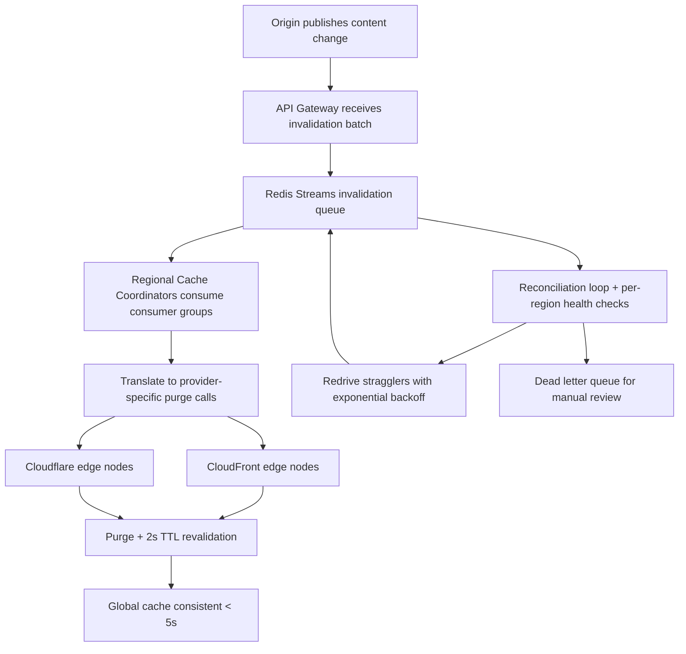

| Difficulty | Channel | Tags |
|---|---|---|
| intermediate | system-design | edge, caching, purging |

Somewhere right now, a developer just hit 'publish' on a critical security fix — and silently prayed the old, broken version would vanish from every edge cache on the planet. For Cloudflare, that prayer is a production system handling billions of requests daily, propagating invalidations to 300+ points of presence in seconds [1]. Here is how you design a multi-region cache purging system that meets the brutal 5-second SLA under 10,000 concurrent invalidations per second — before your users ever see a stale page.

---

> ### Real-World Case — Cloudflare
>
> Cloudflare needed to build a cache purging system that could handle massive scale - supporting millions of customers and billions of requests, where cache invalidation must propagate to edge nodes worldwide within seconds when content changes.
>
> | | |
> |---|---|
> | **Challenge** | How to design a cache invalidation system that could propagate purge requests to thousands of edge locations globally with low latency, while handling extremely high invalidation throughput and surviving partial network failures. |
> | **Solution** | Cloudflare extended the Argo Smart Routing and cache purge API to support zone-based purging, and built a system where purge requests are validated, deduplicated, and broadcast to edge nodes. At the edge, invalidation uses a versioned/epoch-based approach where each edge node maintains the set of valid content versions, so a purge simply increments the version - allowing near-instant propagation without per-file work, plus enshrined wildcard/path-based purging. |
> | **Outcome** | Cloudflare's purge system propagates cache invalidations to all 300+ PoPs globally in seconds, supports zone-level (all cache), URL-level, and tag-based purging, and handles a huge volume of API calls daily. Tag-based purging lets customers invalidate 'everything with a given tag' instantly, dramatically simplifying invalidation workflows. |
> | **Lesson** | Propagating 'an epoch/version change' or metadata about what is invalidated is far more scalable than ripping content from every edge - design invalidation so the edge derives validity from cheap signals rather than doing expensive per-file work at scale. |

---

## Hook — The Publish Button That Cannot Afford to Lie

Picture this: you just shipped a hotfix for a security vulnerability, and your CEO is watching the metrics dashboard. One stale cached response could mean a user sees data they should not see. The cache that made your site fast is now the thing trying to kill you. This is the fundamental tension of edge caching — the very mechanism that makes CDNs fast is also what makes updates dangerous. Every cached file is a promise that the edge will eventually serve you fresh content, but 'eventually' is a luxury you do not have. When content changes, you need that bad data gone from every corner of the globe, and you need it gone now. The stakes are simple: a cache that serves stale content faster is not a win, it is a liability.

## Problem — The Paradox of Speed and Freshness

Here is the uncomfortable truth about CDNs: they only help you if you trust them, and you only trust them if they never lie to you. When you invalidate a cached file, you have roughly five seconds to tell every edge node on Earth to forget it — before a single stale copy reaches a waiting user. Now scale that nightmare. You have 10,000 invalidations arriving every second, flowing into an API gateway from hundreds of services. Each one needs to reach regional coordinators, which fan out to CDN providers, which propagate to global PoPs. Meanwhile, retries are failing, regions are partitioning, and the dead letter queue is growing. This is not a distributed systems trivia question — this is the difference between a clean release and a full-blown incident where users are served leaked customer data from a cache you failed to purge.

## Real-World Case — Cloudflare

Cloudflare lives at this exact intersection of scale and speed [1]. Its purge system supports millions of customers and billions of daily requests, and it has to propagate invalidations across 300+ points of presence worldwide in seconds [1]. But the real insight is in the product design: Cloudflare does not just offer one way to purge. Teams can invalidate the entire zone, a single URL, or — the game-changer — everything tagged with a specific label [1]. Tag-based purging means a customer can mark all their catalog pages with a tag and invalidate 'everything with a given tag' instantly, dramatically simplifying invalidation workflows [1]. That is the plot twist: the way to scale invalidation is not to get faster at enumerating URLs, but to build abstractions that let you say 'this whole family of content changed' in one atomic call.

## Deep Dive — The Anatomy of a System That Cannot Slow Down

Building on Cloudflare's approach, the architecture reveals itself as a pipeline of four layers, each with a distinct job. The API Gateway is your front door — the only place clients ever touch, and the choke point where you batch invalidations (100 per call) to cut API costs by up to 90%. Next, the Invalidation Queue buffers the work. Redis Streams with consumer groups give you durable buffering, replay, and parallel consumption across regions [3]. Then come Edge Workers — the regional cache coordinators that translate a logical invalidation into provider-specific API calls against CloudFront or Cloudflare. Finally, the CDN Providers themselves do the actual propagation. But here is the counterintuitive insight: you cannot outrun the network. No matter how fast you push invalidations, propagation takes time — which is why the quiet hero of this design is a 2-second TTL [2]. By setting `Cache-Control: max-age=2, must-revalidate`, you cap the worst case staleness at 2 seconds even if your invalidation pipeline completely fails. The distributed systems truism applies: you do not design for zero failure, you design so that failure has a bounded, cheap recovery.

## Workflow — From API Call to Global Purge

The Mermaid flow diagram below traces how an invalidation travels from origin through regional coordinators to every edge. Notice the two safety nets that keep the 5-second SLA honest: the 2-second TTL that limits exposure even on total pipeline failure, and the dead letter queue that catches the stragglers.

The journey starts when a change is published at the origin. The API Gateway receives the invalidation batch and pushes it into the Redis Streams queue. Regional cache coordinators consume from their consumer groups, translate the request into provider-specific purge calls, and fan out to CloudFront and Cloudflare edges. Each edge invalidates and writes the 2-second TTL header so subsequent fetches revalidate. Meanwhile, a reconciliation loop compares the in-flight queue with per-region health checks, redrives any stragglers, and routes failures to the dead letter queue for manual review.

## Code Example — Batching, Backoff, and the Purge Call That Actually Works

Here is the production pattern for the invalidation client. The key moves are batching — send 100 files per API call, never one — and exponential backoff with jitter so a regional outage does not create a thundering herd of retries. A circuit breaker trips after five consecutive failures so you fail fast instead of hammering a dead region.

## Lessons Learned — What a Cache Purging Run Teaches You

First, never trust propagation — design for worst case. The 2-second TTL is not a compromise, it is the difference between a stale page and a security incident [2]. Second, batch or go home. Sending one invalidation per API call is how you burn your budget and your rate-limit quota; 100-per-call batching cuts API costs by roughly 90% [5]. Third, your dead letter queue is not a trash can, it is a safety net — failed invalidations that reach it are exactly the ones that would have become incidents. Fourth, tag-based purging is the quiet scalability win; expressing 'invalidate everything with this tag' beats enumerating a million URLs every time [1]. Finally, add jitter to your exponential backoff. Without it, a coordinated outage becomes a self-inflicted DDoS when every client retries in lockstep.

---

## Multi-Region Cache Purge Pipeline

<strong>Original Interview Question</strong>

**Q:** How would you design a multi-region CDN cache purging system that guarantees content propagation within 5 seconds while handling 10,000 concurrent invalidations per second?

**A:** Implement Cloudflare API + AWS CloudFront with distributed invalidation queue, edge compute coordination, and 2-second TTL. Use batch invalidation, exponential backoff, and regional cache headers for 5-second SLA.

## Conclusion

The 5-second SLA is not something you outrun with faster pipes — it is something you survive with smart design. You batch aggressively, you push the invalidation through a durable queue, you coordinate at the edge, and you design so the worst case is cheap and bounded. The 2-second TTL is the insight to carry into tomorrow: the best cache invalidation is the one you never actually need to get perfect, because you capped your exposure up front. So open your CDN console, check your TTL headers [2], and ask yourself one uncomfortable question: if your purge pipeline vanished tomorrow, how stale would your users' content get? If the answer is more than five seconds, you have a system design problem worth fixing — before a real incident finds it first.

---

## References

1. [Cloudflare incident report](https://developers.cloudflare.com/cache/how-to/purge-cache/) — article
2. [MDN Web Docs — HTTP Caching](https://developer.mozilla.org/en-US/docs/Web/HTTP/Caching) — documentation
3. [Redis Streams Documentation](https://redis.io/docs/data-types/streams/) — documentation
4. [RFC 9111 — HTTP Caching](https://datatracker.ietf.org/doc/html/rfc9111) — documentation
5. [AWS CloudFront — Invalidating Files](https://docs.aws.amazon.com/AmazonCloudFront/latest/DeveloperGuide/Invalidation.html) — documentation
6. [Cloudflare Workers Documentation](https://developers.cloudflare.com/workers/) — documentation
7. [Wikipedia — Content Delivery Network](https://en.wikipedia.org/wiki/Content_delivery_network) — documentation
8. [Wikipedia — Cache Stampede](https://en.wikipedia.org/wiki/Cache_stampede) — documentation

---

**Author:** Satishkumar Dhule — [GitHub](https://github.com/satishkumar-dhule) · [LinkedIn](https://linkedin.com/in/satishkumar-dhule) · [Website](https://satishkumar-dhule.github.io)
