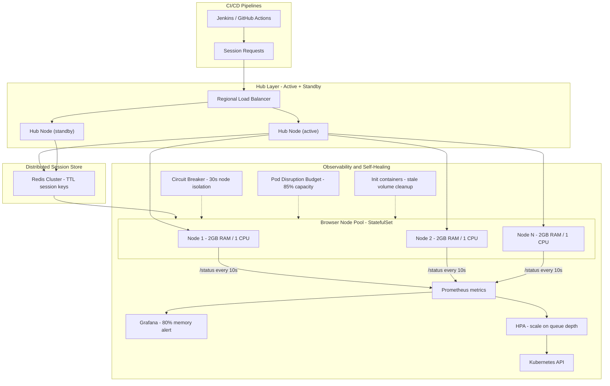

| Difficulty | Channel | Tags |
|---|---|---|
| advanced | system-design | selenium, webdriver, grid |

Picture the scene: it is late 2014, and Expedia's UI test suite has quietly ballooned to ~9,000 automated tests scattered across 350+ Jenkins jobs, running directly on executors. Feedback is painfully slow, and the third-party cross-browser vendors are only too happy to help — for roughly $350K for 120 parallel connections, or a staggering $2.41M for the 1,000 parallel connections Expedia's pipelines actually needed [1]. That quote was the catalyst: instead of writing the check, Expedia built its own grid on Kubernetes and cut the annual cost by ~97% while scaling to any level of parallelism [1]. Good news: the architecture that made that possible is the same one you need when someone asks you to design a Selenium Grid for 10,000 concurrent sessions with 99.9% uptime, zero memory leaks, real-time monitoring, and graceful recovery across data centers. Buckle up.

---

> ### Real-World Case — Expedia Group
>
> Until late 2014, Expedia ran its ~9,000 UI automation tests across 350+ Jenkins jobs directly on executors, making feedback painfully slow. Third-party cross-browser vendors were the alternative, but they quoted roughly $350K for just 120 parallel connections — and $2.41M for the 1,000 parallel connections Expedia's many CI/CD pipelines needed.
>
> | | |
> |---|---|
> | **Challenge** | Run thousands of UI tests in parallel so the whole suite finishes in the time of the slowest single test, while keeping browser infrastructure elastic, cost-controlled, and lifecycle-managed: nodes spun up only when tests demand them and terminated the moment they're idle to avoid paying for leaked/wasted instances. |
> | **Solution** | They built Distributed Automation using SeleniumGridScaler (Selenium Grid + EC2 API): each team's hub autoscales browser nodes up to match the number of queued tests, terminates idle nodes, and can shut itself down on demand. Nodes run 15 Chrome/Firefox sessions per c5.xlarge for cost efficiency, and hubs terminate after runs. Later they moved to DA-Kube (EKS + Docker + Helm + Traefik) for dynamic, per-branch hub creation and containerized nodes. |
> | **Outcome** | 100+ hubs running 140-150K tests daily; ~4,500 nodes created, used, and terminated on demand per day; 1,000 UI tests complete in ~5 minutes; internal solution costs ~$80K/year vs ~$2.41M for 1,000 vendor parallel connections — roughly a 97% cost reduction while scaling to any level of parallelism. |
> | **Lesson** | A Selenium Grid is only as scalable as its session lifecycle management — creating nodes on demand and terminating them on idle is what makes both cost and scale track real demand. And the test infrastructure itself must scale to match grid concurrency, or the whole suite's runtime stays bottlenecked. |

---

## Hook — It is 3:03 AM and your grid just went sideways

Let's set the scene. Your release train is running green, CI is churning through the nightly regression, and then — it is 3:03 AM — the pager goes off. Session creation latency just spiked through the roof. You open Grafana and six of your 40 browser containers are still holding sessions that finished hours ago, each one leaking a few hundred megabytes of browser memory. By the time anyone looks, the grid has quietly eaten 40% of its own capacity. Sound familiar? If you have operated a Selenium Grid at even moderate scale, you already know the villain: it is not flaky tests — it is zookeeping. Keeping 10,000 concurrent browser sessions alive and leak-free is less about raw hardware and more about lifecycle discipline. Every session must be born, tracked, monitored, and ruthlessly killed the moment its work is done or its health is gone. The stakes are concrete: a 99.9% uptime target leaves you roughly 8.76 hours of permitted downtime in an entire year — less than half a day to absorb every deploy, node failure, and bad release before the SLA dies [2]. One orphaned browser process erodes that budget. This is the story of designing an architecture that scales to 10,000 sessions, cleans up after itself, and keeps its promises at 3 AM.

## Problem — Why naive grids collapse under real load

The uncomfortable truth is that a default Selenium Grid is a single point of failure wearing headphones [2]. Standalone or one-hub-plus-a-few-nodes setups run 20 parallel sessions beautifully on a laptop — which is exactly what lulls teams into a false sense of security. Then production traffic arrives and the math turns ugly. Each browser session can burn 300–800 MB of RAM, and every browser container left running after a crashed test keeps those resources reserved indefinitely. Now multiply by 10,000 concurrent sessions: 10,000 processes, 10,000 ports, 10,000 little gremlins waiting for one logic error to cascade. Memory leaks, in grid terms, are really 'sessions that never end.' A test that times out client-side but never releases its slot leaves a container allocated, idle, and slowly growing until the node becomes a zombie — and the hub keeps routing fresh work straight into it. The second failure mode is availability. 99.9% uptime across multiple data centers means no single fat hub the whole world depends on; you need redundancy, health-based routing, and failure isolation. The third failure mode is the one nobody warns you about: garbage. Stale Docker volumes, orphaned logs, half-written session artifacts. Left alone, they accumulate until a node cannot even start a fresh container. Confronted with this triple threat, most teams reach for a vendor or a bigger cluster. Expedia reached for something smarter — and promptly made a $2.41M quote irrelevant.

## Real-World Case — Expedia Group, or the day the $2.41M quote died

Until late 2014, Expedia ran its roughly 9,000 UI automation tests across 350+ Jenkins jobs directly on executors, and feedback was painfully slow [1]. Their CI/CD pipelines needed serious parallelism, so they asked the cross-browser vendor for a quote. The answer: ~$350K for just 120 parallel connections — and a jaw-dropping ~$2.41M for the 1,000 parallel connections their pipelines really needed [1]. Faced with that bill, Expedia's engineering team did the only financially sane thing: they built their own grid on Kubernetes, using Docker, Helm, and Traefik [1]. The transformation was dramatic. A fleet of 100+ hubs now runs 140–150K tests every single day; roughly 4,500 nodes are created, used, and terminated on demand per day; and a 1,000-UI-test batch completes in about 5 minutes [1]. The annual cost settled around $80K — roughly a 97% reduction versus the $2.41M vendor path, with any level of parallelism available on demand [1]. Here is the plot twist: Expedia is a travel company, not an infrastructure vendor. They out-designed the very people trying to charge them millions for the privilege. That is the strongest argument on record for owning your grid — and the blueprint you are about to follow.

## Deep Dive — The architecture that holds 10,000 sessions without sweating

Building on Expedia's playbook, here is the anatomy of a grid that survives real scale. It starts with the hub-node pattern [2], but with a crucial upgrade: the hub is no longer a single fat server. You run stateless browser nodes as Kubernetes pods while hubs focus purely on routing, so each layer scales independently [2]. The first counterintuitive insight: the bottleneck is rarely the browser nodes — it is session bookkeeping. That is why the session store lives in Redis, not in the hub's heap memory. Every session becomes a Redis key with a TTL, a hard expiration that guarantees no session outlives its usefulness [5]. No TTL means no cleanup, and the session store itself becomes the leak; a Redis cluster with expiration scans every five minutes and connection pooling keeps orphaned keys from ever piling up [5]. The second counterintuitive insight: capacity planning is a memory problem, not a CPU problem. Work the numbers — 10,000 sessions ÷ 50 sessions per node = 200 nodes minimum. Give each node 2GB of RAM and 1 CPU, that is a 400GB baseline; add a 30% buffer and the cluster needs about 520GB of memory. No amount of clever scheduling replaces that budget, and going big only works if the horizontal pod autoscaler scales the node pool on queue depth, not idle CPU [3]. The third pillar is observability. Prometheus scrapes every node's memory and session duration [6], and Grafana turns those metrics into trends so a leak is visible while it is forming — the alert at 80% memory usage is your early-warning system, and weekly rolling restarts are the reset button. Finally, when a node dies, two guardrails catch the fall: health checks polling an HTTP /status endpoint every 10 seconds (a node is removed after 3 consecutive failures), and a circuit breaker with Hystrix semantics that isolates the failing node for a 30-second recovery window instead of letting one bad actor poison the pool [7]. Split-brain across zones is handled with leader election backed by distributed consensus [10], and P99 session initiation stays under two seconds thanks to regional load balancing and weighted round-robin that prefers healthy, low-latency nodes. The honest comparison below shows why self-hosting stopped being a cost center and started being a capability. | | Vendor (1,000 connections) | Self-built grid | |---|---|---| | Annual cost | ~$2.41M [1] | ~$80K [1] | | Max parallelism | fixed | effectively unlimited | | Node lifecycle | managed, opaque | created & terminated on demand [1] | | Failure control | vendor-dependent | health checks + circuit breakers | You might think self-hosting trades money for operational pain. In Expedia's case, the reverse happened — they gained scale and fresh capacity on demand, and the cost fell by 97% [1].

## Workflow — From bare repo to a self-healing grid in seven moves

Here is the thing though: the architecture above only pays off if you can stand it up in a repeatable order. This is the sequence that works — seven moves, and the diagram below ties it all together. First, provision a Kubernetes cluster spanning multiple availability zones so no single data center can take the grid down. Second, deploy the browser nodes as a StatefulSet so each node has a stable identity for logs and session affinity [4]. Third, put Redis in the middle of every session handoff, keyed with TTLs, so the hub never tracks state in its own heap [5]. Fourth, enable horizontal pod autoscaling based on queue depth — not CPU — so idle nodes destabilize and demand surges trigger scale-up [3]. Fifth, wire health checks and a circuit breaker so failing nodes are evicted or isolated before they can poison the pool [7]. Sixth, protect capacity with Pod Disruption Budgets that keep at least 85% of nodes available during maintenance [8]. Seventh, and most overlooked, make cleanup a first-class citizen: init containers scrub stale volumes and caches before each pod starts [9], and new node images roll out via canary traffic splitting so a zero-day regression can never take the whole fleet down. Every path in Figure 1 — from session request to node healing — is explicit, which is exactly what makes the system observable and, more importantly, fixable.

## Code Example — A session lifecycle manager that never leaks

Now the part that actually runs. This is a session lifecycle manager — a small Python service that sits between your hub and your Selenium nodes and makes 'zero memory leaks' a property of the system rather than a hope. It demonstrates every principle from the deep dive: TTL-backed sessions, heartbeats for health, and a graceful drain on shutdown.

## Lessons Learned — What scaling to 10,000 sessions actually teaches

The journey from 350 Jenkins jobs to a 140–150K-tests-a-day fleet leaves specific scars, and each one is a rule for your next grid. Rule one: every session needs a death date. If a session cannot be expired, it will leak [5]. Rule two: the session store is the real bottleneck — design it like your database, with TTLs, pooling, and cleanup jobs, before you buy a single node [1][5]. Rule three: automate the removal of sick nodes; health checks every 10 seconds and a circuit breaker beat any human heroics at 3 AM [7]. Rule four: memory is the capacity unit you should be tracking, not session counts — the 80% memory alert shows a leak while it is forming [6]. Rule five: protect the fleet during maintenance with Pod Disruption Budgets [8] and scrub pods with init containers [9] so stale state never survives a restart. Rule six: ship new node images like new production code — canary, watch, then roll. And the meta-lesson from Expedia: you do not need a $2.41M vendor to get enterprise parallel testing; you need about 520GB of memory, disciplined lifecycles, and the will to make cleanup a feature [1]. Start small — run a single zone, drag 50 sessions through it, watch the memory curves in Grafana — then scale the same architecture to 10,000.

---

## Self-Healing Selenium Grid Architecture

<strong>Original Interview Question</strong>

**Q:** Design a scalable Selenium Grid architecture to handle 10,000 concurrent test sessions with 99.9% uptime, ensuring zero memory leaks through automatic session lifecycle management, real-time monitoring, and graceful node failure recovery across multiple data centers?

**A:** Deploy Kubernetes cluster with auto-scaling node pools, Redis session store with TTL policies, Prometheus metrics for memory monitoring, circuit breakers for node isolation, and sidecar containers for session cleanup. Implement health checks, resource quotas, and rolling updates.

## Conclusion

What the 3:03 AM pager ultimately teaches: Expedia did not buy uptime, they built discipline [1]. The question that started this journey — 10,000 concurrent sessions, 99.9% uptime, zero leaks — stops being intimidating once you realize its real subject is session lifecycle management. Health checks, TTL keys, circuit breakers, and honest capacity math carry you the rest of the way. The highest-leverage move available tomorrow: make every session in your current grid expirable, add a memory dashboard, and add a drain hook for graceful shutdowns before you make a single scaling decision. And here is the insight to share with your team over stand-up: 'Your grid's uptime is not decided by the number of nodes you buy — it is decided by the discipline of the lifecycles you enforce.'

---

## References

1. [Expedia Group — DA-Kube: Selenium Grid using Kubernetes, Docker, Helm and Traefik](https://medium.com/expedia-group-tech/da-kube-selenium-grid-using-kubernetes-docker-helm-and-traefik-856b802d1d08) — blog
2. [Selenium Grid — Official Documentation](https://www.selenium.dev/documentation/grid/) — documentation
3. [Kubernetes Horizontal Pod Autoscaling](https://kubernetes.io/docs/tasks/run-application/horizontal-pod-autoscale/) — documentation
4. [Kubernetes StatefulSets](https://kubernetes.io/docs/concepts/workloads/controllers/statefulset/) — documentation
5. [Redis EXPIRE Command (TTL)](https://redis.io/docs/latest/commands/expire/) — documentation
6. [Prometheus — Overview](https://prometheus.io/docs/introduction/overview/) — documentation
7. [Martin Fowler — Circuit Breaker Pattern](https://martinfowler.com/bliki/CircuitBreaker.html) — blog
8. [Kubernetes Pod Disruption Budgets](https://kubernetes.io/docs/tasks/run-application/configure-pdb/) — documentation
9. [Kubernetes Init Containers](https://kubernetes.io/docs/concepts/workloads/pods/init-containers/) — documentation
10. [etcd — Distributed Consensus and Leader Election](https://etcd.io/docs/) — documentation

---

**Author:** Satishkumar Dhule — [GitHub](https://github.com/satishkumar-dhule) · [LinkedIn](https://linkedin.com/in/satishkumar-dhule) · [Website](https://satishkumar-dhule.github.io)
