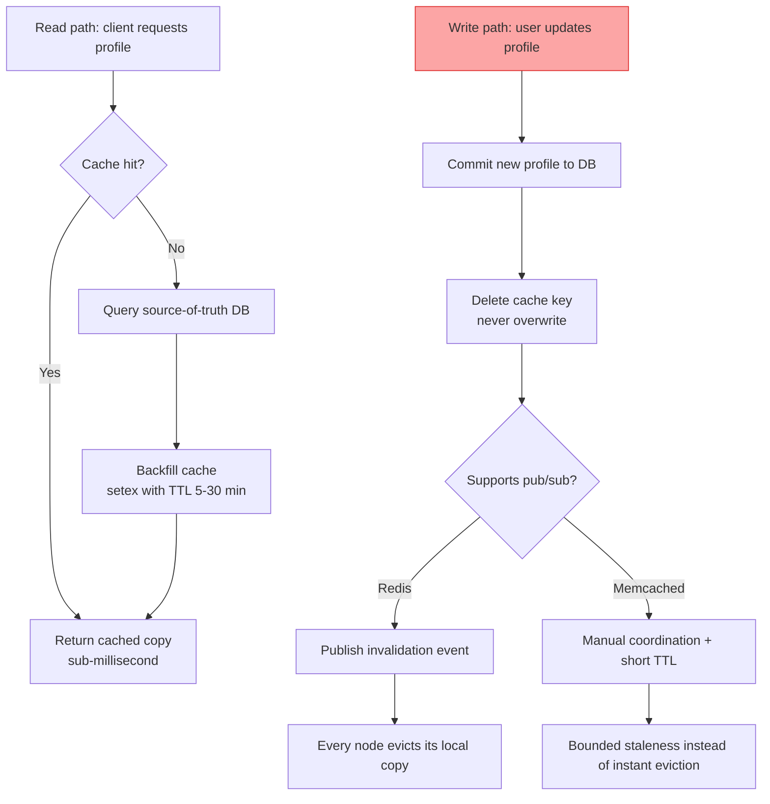

| Difficulty | Channel | Tags |
|---|---|---|
| beginner | backend | redis, memcached, cache-invalidation |

At Meta, the cache layer behind your news feed answers more than one quadrillion queries every single day — and for years a quiet class of bugs kept making that layer lie [1]. Meta's engineers found that cache invalidation bugs caused data inconsistency severe enough to be described as comparable to actual data loss [1]. This article turns the classic interview question — how do you invalidate a cached profile when a user updates it? — into the story of how you keep one version of the truth across millions of servers. By the end, you will never treat a cache delete as a throwaway line of code again.

---

> ### Real-World Case — Meta (Facebook)
>
> Meta operates some of the world's largest cache deployments (Memcache and TAO) serving over one quadrillion cache queries per day for 3+ billion users. They identified that cache invalidation bugs caused data inconsistency severe enough to be comparable to actual data loss in their systems.
>
> | | |
> |---|---|
> | **Challenge** | When a user updates their profile, that change must propagate instantly across all devices, friend views, and feed items. Meta needed to detect and eliminate stale-data inconsistencies from cache invalidations across hundreds of data centers and millions of distributed cache nodes, where race conditions between cache fills and invalidations could leave stale profile data serving indefinitely. |
> | **Solution** | Meta moved beyond TTL-based expiration (which only bounds how long you agree to be wrong) to systematic, explicit cache invalidation. They built 'Polaris', a monitoring service that measures cache consistency in real time by acting as a client, testing client-observable invariants, and alerting engineers to inconsistencies. They also drive invalidation directly from the database write path so cache keys are deleted synchronously rather than left to expire. |
> | **Outcome** | By measuring and fixing cache invalidation bugs, Meta improved cache consistency from 99.9999% to 99.99999999% — a jump to less than one inconsistent read per billion operations — across more than one quadrillion (10^15) cache queries a day and hundreds of data centers. |
> | **Lesson** | For data users care about — like their own profile — a TTL is not invalidation; it's just a bound on how long you're willing to serve stale data. At massive scale you must invalidate explicitly on the write path (not wait for expiration), and you must instrument cache consistency so stale-data bugs surface before users see old profiles. Even the 'simplest' of the two hard problems in computer science needs disciplined measurement. |

---

## Hook — One quadrillion queries and one invisible lie

Picture this: a user edits their profile photo at 9:00 AM. Ten follow-up requests still show the old photo. A second server returns the new one. A third returns a completely different version. No crash. No error message. Nothing in the logs. Now multiply that moment across three billion users and one quadrillion daily cache queries — the operating scale of the cache infrastructure behind Meta's products [1]. Meta's engineers had to squint hard to see these inconsistencies, and when they finally did, they classified the problem in startling terms: cache invalidation bugs hurt them like data loss [1]. That is the hook. Invalidation is not a chore you bolt on after the cache works. It is the entire game.

## Problem — The stale-data trap every cache eventually springs

Building on that picture, drop down to a far more familiar scale: a user profile service with a cache in front of a database. You add the cache because the database is slow, the traffic is hot, and nobody likes staring at a spinner — a bet, in other words, that a given profile rarely changes [2]. Reads get faster, and you feel like a hero. Then the writes start. When a user updates their bio, one of your app servers refreshes the cache with new data while another still holds the old copy, and suddenly two different clients are seeing two different truths. This is the cache invalidation problem, and it is the reason interviewers keep asking about it: the pattern that makes reads fast is precisely what makes writes dangerous. The stakes only grow from there. If the stale window is unbounded, users report bugs you cannot reproduce, support tickets pile up, and at enough scale the inconsistency becomes indistinguishable from corruption — Meta's engineers compared it directly to data loss [1]. And there is a second trap hiding under the first: shorten the TTL to shrink the stale window and you invite a cache stampede, where a hot key expires and the whole fleet thunders at the database at once [6]. Sound familiar? Here is the uncomfortable truth you will circle for your whole career: caches are easy, invalidating them correctly is not.

## Real-World Case — Meta and the hidden cost of stale reads

Meta is the perfect place to study this problem, because Meta cannot afford to ignore it. Its cache fleet — Memcache for general fan-out and TAO for the social graph — spans hundreds of data centers and absorbs more than a quadrillion queries per day for over three billion users [1]. At that volume, even a tiny inconsistency rate produces millions of wrong answers every second. So Meta did something most teams never do: they decided to measure. Their engineers built tooling to detect cache invalidation bugs and the inconsistency they cause, then set about fixing them. The results are a plot twist worth sitting down for: improving cache consistency from 99.9999 percent to 99.99999999 percent — fewer than one inconsistent read per billion operations — across more than one quadrillion queries a day and hundreds of data centers [1]. Note what did not happen. The fix was not a brand-new caching architecture or a rewrite; it was measurement plus relentless elimination of invalidation bugs. Moreover, the same discipline applies to your profile service: the bug is rarely the cache itself, it is the moment you stopped invalidating it correctly. Consequently, the next section arms you with the go-to solution — the write-through pattern — but first, why exactly does deleting a key beat overwriting it? Keep that question in your pocket; the Deep Dive answers it.

## Deep Dive — Write-through, delete-on-update, and the Redis-vs-Memcached arena

The classic, interview-grade answer is write-through caching with TTL-based expiration, and it is classic for a reason: it is simple enough to reason about and it keeps the database as the single source of truth [2]. On a read, you use the cache-aside pattern — check the cache, and only on a miss go to the database and backfill. On a write, you update the database first, then delete the cache key so the next read fetches fresh data. The order matters enormously: update the cache before the database commits and a concurrent read can serve data that never actually landed — a ghost profile.

Here is the bit most beginners get wrong: you delete the key on update instead of overwriting it. Overwriting opens a window where a stale write from another server lands last, clobbering newer data. Deleting forces the next read to miss and repopulate — so the cache converges to the database instead of fighting it. That is why the recommended TTL for profiles sits in the 5-30 minute range: long enough that repeat reads pay off, and short enough that even a missed invalidation eventually heals itself [5]. The HTTP world has known this forever — RFC 9111 formalizes exactly how expiration and validation keep caches honest [10].

Now for the question from the original Q&A: Redis or Memcached? Memcached is famously minimal — a pure key-value cache with simpler architecture, lower per-key memory overhead, and dead-simple horizontal scaling, which makes it superb when all you need is a fast dictionary [4][9]. Redis, by contrast, is a data structure server: persistence, advanced data types, transactions — and crucially for invalidation, pub/sub messaging that lets one node announce a key change to every other node in the fleet [3][8]. That single capability transforms the invalidation story: with Redis, an update on any node can evict the key on every node almost instantly; with Memcached, there is no such primitive, so you are stuck coordinating eviction yourself — often falling back on short TTLs as a safety net.

| Concern | Redis | Memcached |
| --- | --- | --- |
| Distributed invalidation | Pub/sub — one event, every node evicts [3] | Manual coordination, TTL as crutch [4] |
| Persistence / durability | Snapshots + append-only file [3] | None — cache only [4] |
| Data structures | Strings, hashes, sets, streams [8] | Plain key-value [9] |
| Memory overhead | Higher per key | Lower per key |
| Pure get/set latency | Fast with more features | Marginally leaner [4] |
| Best fit | Complex invalidation, shared state [3] | Pure caching workloads [4] |

But wait, there is a caveat. Redis pub/sub is not a distributed consensus mechanism; it is a fire-and-forget broadcast, so messages can be lost if a node is briefly partitioned or overloaded. This is the CAP theorem sneaking into your day: you can choose availability or consistency, and caches are built to choose availability and speed [7]. That is precisely why a short TTL remains your backstop even on Redis — invalidation accelerates convergence, while the TTL guarantees it eventually [5]. Also remember the lesser-known failure: the cache stampede. When a hot profile expires on a thousand nodes at once, all of them hammer the database simultaneously unless you add jitter to TTLs or a lock around backfill [6]. 💡 Insight: invalidation is about how fast the system corrects itself; TTL is about the worst case you are willing to tolerate. ⚠️ Watch Out: listen for the 'delete-and-pray' pattern in code reviews — no TTL, no broadcast, just hope. 🔥 Hot Take: if you reach for a cache to fix a slow read, you have taken on two jobs, not one — and the second job is invalidation. Now that the theory is on the table, here is where the rubber meets the road: a four-step workflow that keeps a distributed profile cache honest.

## Workflow — Four steps from write to consistent read

The whole strategy condenses into a workflow you can explain in one breath — and defend in any interview. The Cache Invalidation Flow diagram below is the visual story: reads short-circuit through the cache, while writes commit to the database, delete the key, and broadcast the change fleet-wide.

Step 1 — Commit to the source of truth. Write the new profile to the database first. The database is the single version of truth; everything else is a projection [2].

Step 2 — Delete, do not overwrite. Remove the cache key immediately after the database write. Any concurrent reader now misses and repopulates from fresh data, so the cache converges to the database.

Step 3 — Broadcast the invalidation. The stale copy must disappear on every node, not just the one that handled the write. With Redis, publish an invalidation event and every subscriber evicts its copy [3][8]. With Memcached, no such primitive exists, so you fall back to short TTLs plus manual coordination — acceptable, but slower to converge [4].

Step 4 — Backfill on demand with a bounded TTL. Reads that miss repopulate the cache with a set-plus-expire, and jittered TTLs prevent the stampede that haunts cold starts [6]. Monitor cache hit rate over time; if it drops, the profile data is changing faster than your TTL assumed — and that is your cue to tighten expiry or add invalidation [1].

That is the whole loop — and the loop only works because the read path and the write path are designed as one system. Now for the moment of truth: the actual code.

## Code Example — Production Python for a profile cache

Here is the pattern above as runnable Python, using Redis and an in-memory database stand-in. Pay attention to the two decisions that matter: the delete instead of the overwrite, and the TTL that caps how long the system tolerates a missed invalidation.

## Lessons Learned — What a quadrillion-query fleet can teach you

If this feels like several wheels spinning in your head at once, you are not alone. The good news is that the takeaway list is short, and each item is immediately actionable.

🎯 Key Point: delete-don't-overwrite is the default. Overwriting invites last-writer-wins races; deleting forces the cache to converge to the database on the next read.
- Treat TTLs as a worst-case budget, not a convenience. Set profiles to 5-30 minutes, and jitter them so hot keys do not expire together and stampede the database [6].
- Choose Redis when invalidation complexity is high — pub/sub gives you instant distributed eviction [3][8]. Choose Memcached when a lean pure cache is enough and you can live with short-TTL eventual convergence [4][9].
- Redis pub/sub is fire-and-forget, not a guarantee. Pair it with TTLs so consistency is eventual even when a broadcast is lost — a direct consequence of the CAP theorem [7].
- Measure, like Meta did. Consistency and hit rate are numbers you can track; Meta's jump from 99.9999 to 99.99999999 percent consistency began with simply measuring the problem [1].
- Never forget the stampede. A lock, single-flight request, or coalescing on backfill is cheap insurance that saves your database during a cold cache [6].

The assignment for tomorrow: add hit-rate logging to an existing cache, attempt the delete-not-overwrite change in one service, and watch convergence in your metrics. Ten minutes of work — and you will already be able to explain, with receipts, why Meta treats invalidation like data loss. The memorable line to share with your team: a cache is not a copy of your data — it is an opinion that must be corrected the instant the truth changes [1].

---

## Cache Invalidation Flow

<strong>Original Interview Question</strong>

**Q:** You're building a user profile service that caches frequently accessed profiles. How would you implement cache invalidation when a user updates their profile, and what trade-offs would you consider between Redis and Memcached?

**A:** Implement write-through caching with TTL-based expiration. On profile update, invalidate the cache by deleting the key and writing new data to both the database and cache. Redis offers pub/sub for automatic distributed invalidation, while Memcached requires manual coordination across nodes.

## Conclusion

Back where the story started: one quadrillion cache queries, and a bug so invisible that Meta classified it as data loss [1]. The arc of this journey is the arc of your career in distributed systems — fast reads, dangerous writes, and the discipline required to reconcile them. The good news is that the discipline is small: commit to the database, delete the key, broadcast the change, cap the damage with a TTL. Do those four things tomorrow and you graduate from 'set and forget' to designing caches that can admit their mistakes. That is the difference between serving a stale profile and accidentally replicating three billion users' confusion at the speed of light.

---

## References

1. [Meta (Facebook) incident report](https://engineering.fb.com/2022/06/08/core-infra/cache-made-consistent/) — article
2. [Cache (computing) — Wikipedia](https://en.wikipedia.org/wiki/Cache_(computing)) — documentation
3. [Redis — Wikipedia](https://en.wikipedia.org/wiki/Redis) — documentation
4. [Memcached — Wikipedia](https://en.wikipedia.org/wiki/Memcached) — documentation
5. [RFC 9111 — HTTP Caching](https://datatracker.ietf.org/doc/html/rfc9111) — documentation
6. [Cache stampede — Wikipedia](https://en.wikipedia.org/wiki/Cache_stampede) — documentation
7. [CAP theorem — Wikipedia](https://en.wikipedia.org/wiki/CAP_theorem) — documentation
8. [redis/redis — GitHub](https://github.com/redis/redis) — documentation
9. [memcached/memcached — GitHub](https://github.com/memcached/memcached) — documentation
10. [HTTP caching — MDN](https://developer.mozilla.org/en-US/docs/Web/HTTP/Caching) — documentation

---

**Author:** Satishkumar Dhule — [GitHub](https://github.com/satishkumar-dhule) · [LinkedIn](https://linkedin.com/in/satishkumar-dhule) · [Website](https://satishkumar-dhule.github.io)
