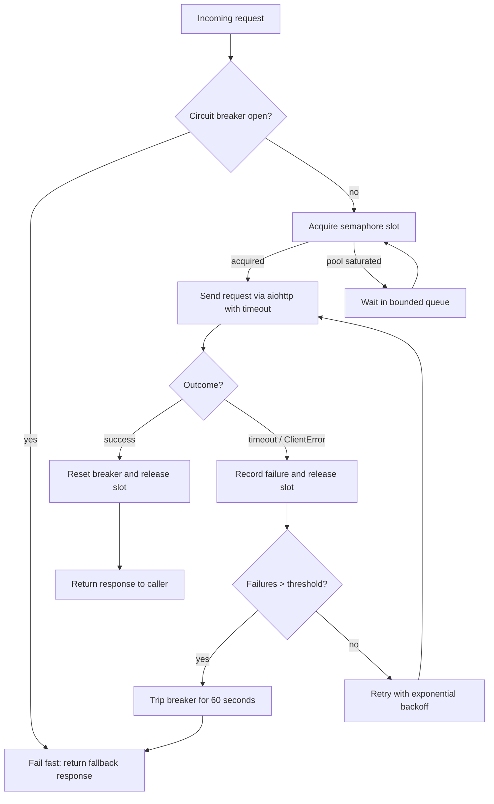

| Difficulty | Channel | Tags |
|---|---|---|
| advanced | backend | asyncio, aiohttp, concurrency |

On an ordinary Tuesday in 2011, Netflix's API was silently absorbing more than one billion incoming calls per day — each fanning out to roughly a dozen more. Then one dependency slowed down, and everything went dark [1]. This is the failure every backend developer fears: not the loud crash, but the quiet cascade that turns a single slow service into a full outage. The same physics applies to your aiohttp connection pool, no matter how small your scale starts out.

---

> ### Real-World Case — Netflix
>
> In 2011, Netflix's API received over 1 billion incoming calls per day, each fanning out to ~6 outgoing calls across dozens of dependency services. When a single dependency became slow or failed, latency saturated the Tomcat request threads and connection pools, cascading into full API outages even while all other dependencies stayed healthy. A single misconfigured client or saturated connection pool could take the entire streaming service down.
>
> | | |
> |---|---|
> | **Challenge** | A single latent or failing downstream service could saturate all available connections and threads in seconds, blocking user requests, exhausting the dependency connection pools, and causing cascading failures that took down the whole API. The math was brutal: 30 dependencies at 99.99% uptime each still equals 99.7% overall uptime—over 2 hours of downtime per month—and a single dependency failing could block even healthy traffic. |
> | **Solution** | Netflix built Hystrix, which combined exactly the patterns in this answer: tryable semaphores and per-dependency thread pools to limit concurrent connections (bulkhead pattern), aggressive network and thread timeouts to 'give up and move on', circuit breakers that open after error thresholds (rejecting requests fast so the failing dependency can recover), automatic retries and request collapsing, and fallbacks so the API degraded gracefully instead of failing hard. Each of ~100+ command types got its own sized pool, isolating one dependency's failure from the rest. |
> | **Outcome** | Hystrix scaled to process tens of billions of thread-isolated and 200+ billion semaphore-isolated calls per day across 40+ thread pools and 100+ command types, while the circuit breaker allowed a single failing dependency to trip and shed ~5000 fallbacks per second so the rest of the API kept serving users with degraded (but functional) responses and no 500s. Failures previously causing system-wide outages became isolated incidents on a dashboard. |
> | **Lesson** | The counterintuitive lesson: when a dependency is failing, the worst thing you can do is increase its pool size, queue, and timeout—'at an extreme you DDOS yourself.' The circuit breaker exists to 'release the pressure' on the struggling downstream service, letting it recover, while semaphores/pools and fail-fast isolation keep healthy calls flowing. Configure sizing for healthy systems and let timeouts, rejections, and open circuits shed load automatically. |

---

## Hook — The Silence Before the Outage

It starts with a single request that hangs 200 milliseconds too long. Then another. Then a thousand more pile onto the same saturated connection pool, and suddenly your pager lights up at 3am. Sound familiar? Here is the uncomfortable truth: connection pools look like a boring infrastructure detail right up until they are the reason your API returns 500s to everyone at once. Every developer hits this wall eventually — the question is whether you are following Netflix's playbook or learning their lesson the slow way.

## Problem — The Cascade Failure You Cannot See

Think of a connection pool as a fixed number of lanes on a highway. When traffic is light, nobody notices the lane count. But when one downstream service gets slow, every lane upstream fills with parked cars, and trucks waiting to reach the healthy services behind them are blocked too [4]. This is the real problem: slowness is contagious. A single misconfigured timeout or an oversized pool can starve your entire application of resources, because threads waiting on sockets cannot do anything else. Moreover, naive retries make it worse — hammering a dead service multiplies the damage instead of containing it. The stakes are high: connection leaks silently eat file descriptors, missing cleanup on shutdown turns restarts into freezes, and incorrectly handled errors bubble up and corrupt your whole async stack. So what does the right architecture actually look like?

## Real-World Case — Netflix's Near-Total API Outage

Building on that highway metaphor, Netflix lived the worst-case version of it in 2011. Their API processed over one billion incoming calls per day, with each call fanning out to roughly six outgoing requests across dozens of dependency services [1]. When just one dependency became slow or failed, it saturated the Tomcat request threads and connection pools — and the whole streaming service went down, even while every other dependency stayed perfectly healthy. A single misconfigured client could take out everything. Their solution was Hystrix, and the numbers tell the story: it scaled to tens of billions of thread-isolated calls and over 200 billion semaphore-isolated calls per day across more than 40 thread pools and 100+ command types. Meanwhile, the circuit breaker let one failing dependency trip independently and shed roughly 5,000 fallbacks per second, so the rest of the API kept serving degraded-but-functional responses with no 500s [1]. What was once a system-wide catastrophe became a single red tile on a dashboard. Retrospectively, the insight is almost embarrassing in its elegance: contain the damage, isolate the blast radius, and let the rest of the system carry on [9].

## Deep Dive — The Four Weapons of Graceful Degradation

So how do you translate Netflix-scale resilience into a Python async world? You combine four patterns, each solving one specific failure mode. First, the semaphore is your friend: a single concurrency limiter that caps how many requests run at once, so you never overload your pool, your database, or the downstream service you are calling [5]. Underneath the hood, aiohttp itself uses connection limits, but an app-level semaphore gives you explicit control that spans multiple sessions and even multiple services. Second, exponential backoff turns retries from an amplifier of doom into a controlled comeback: after each failure you wait 1s, then 2s, then 4s, capping out so the recovery period stays bounded [3]. Third, the circuit breaker acts as a trip switch that stops all traffic to a failing service for a cooldown window, giving it room to recover — the only retry policy that truly grants grace [2]. And fourth, health checking plus queue management make degradation feel deliberate instead of chaotic: prune dead connections, buffer surplus requests, and let users wait briefly rather than fail loudly [6]. Here is the plot twist though: many developers assume more connections equals more speed. Actually, open connections are a liability. Because every idle socket holds memory and file descriptors, sensible limits and keep-alive reuse often outperform brute force [8]. The real tradeoff is a balancing act between latency, throughput, and availability:

## Workflow — Building the Degradation Pipeline

Therefore, the architecture is less about clever code and more about a disciplined sequence of gates. The workflow below is the one Netflix formalized and you can steal wholesale for aiohttp: every request first checks the circuit breaker, then waits for a semaphore slot, executes with a strict timeout, and feeds every outcome back into the breaker. Here is the step-by-step journey: (1) Receive a request and pass it through the circuit breaker; if it is open, fail fast with a fallback instead of queueing forever. (2) Acquire a semaphore slot; if the pool is saturated, wait in a bounded queue instead of spawning unbounded work [5]. (3) Execute the aiohttp request with a connection timeout and a total timeout, because a request without a deadline is a leak waiting to happen [7]. (4) On success, reset the breaker and release the slot. (5) On timeout or client error, record the failure, release the slot, and retry with exponential backoff [3]. (6) If failures cross the threshold, trip the breaker open for the cooldown window [2]. The diagram below maps this flow visually:

## Code Example — A Production-Flavored ConnectionPoolManager

Consequently, you now have everything you need to build the manager itself. The class below marries all four patterns into roughly sixty lines of Python: a semaphore for concurrency, an aiohttp connector with sensible limits and keep-alive, an explicit timeout policy, and a real circuit breaker with failure counting and a cooldown window. Notice the details that production code cannot skip: 5xx responses count as failures, `keepalive_timeout` reuses TCP connections instead of rebuilding them, `enable_cleanup_closed` prunes dead sockets, and the `close()` method prevents the classic shutdown leak.

## Lessons Learned — Battle Scars and the Takeaways That Matter

Throughout this journey, a few lessons are worth writing on a sticky note above your monitor. First, the most common production failure is connection leaking: you acquire a slot, an exception fires, and the slot never returns — always use `async with` and always release in `finally`. Second, never skip SSL context validation in sanboxes or production; a pool that skips verification is a security incident waiting to wake you at 3am. Third, tune timeouts deliberately: a too-generous total timeout is a slow-motion outage, and a too-strict one turns a hiccup into an avalanche [7]. Fourth, clean up on shutdown — close your session and connector, or your restart becomes a freeze. Fifth, propagate errors through the async stack deliberately, because a swallowed exception hides the very failure the breaker was built to find. Here is what you need to know: no library makes your pool resilient by default; resilience is a policy you chose to enforce. And if this feels overwhelming, you are not alone — even Netflix needed a dedicated library, 40+ thread pools, and years of operational hardening to get here [1]. You get to start from their shoulders. Enable keep-alive, add metric monitoring, warm up connections during startup, and deploy the code example from this article behind feature flags — then watch your dashboards during the next dependency hiccup. That is the moment the lesson lands.

---

## Connection Pool Degradation Flow

<strong>Original Interview Question</strong>

**Q:** How would you implement a connection pool manager for aiohttp that handles graceful degradation under high load and connection timeouts?

**A:** Implement a connection pool manager for aiohttp using a semaphore to limit concurrent connections, exponential backoff for retrying failed requests, and circuit breaker pattern to gracefully degrade under high load and connection timeouts.

## Conclusion

The moral of the story: resilience is not a library you import, it is a set of decisions you enforce at every layer. Netflix did not survive a billion calls a day because their connections were faster — they survived because a single failing dependency could only hurt a single tile on a dashboard [1]. Tomorrow, before you add more threads or a bigger pool, ask yourself the real question: when something downstream burns, will your aiohttp pool burn with it, or will it close the gate and serve degraded-but-alive responses? Add a semaphore, an exponential backoff loop, and a circuit breaker to your next integration, deploy it behind a feature flag, and let the next dependency hiccup be the experiment. That is the one insight to share with your team tonight: the goal is not fewer failures — it is smaller failures.

---

## References

1. [Netflix incident report](https://github.com/Netflix/Hystrix/wiki/Operations) — article
2. [Circuit breaker design pattern](https://en.wikipedia.org/wiki/Circuit_breaker_design_pattern) — article
3. [Exponential backoff](https://en.wikipedia.org/wiki/Exponential_backoff) — article
4. [Connection pool](https://en.wikipedia.org/wiki/Connection_pool) — article
5. [asyncio synchronization primitives](https://docs.python.org/3/library/asyncio-sync.html) — documentation
6. [Graceful degradation](https://en.wikipedia.org/wiki/Graceful_degradation) — article
7. [asyncio coroutines and tasks (timeouts)](https://docs.python.org/3/library/asyncio-task.html) — documentation
8. [HTTP Keep-Alive header](https://developer.mozilla.org/en-US/docs/Web/HTTP/Headers/Keep-Alive) — documentation
9. [Bulkhead pattern (fault isolation)](https://en.wikipedia.org/wiki/Bulkhead_pattern) — article
10. [asyncio HOWTO](https://docs.python.org/3/howto/asyncio.html) — documentation

---

**Author:** Satishkumar Dhule — [GitHub](https://github.com/satishkumar-dhule) · [LinkedIn](https://linkedin.com/in/satishkumar-dhule) · [Website](https://satishkumar-dhule.github.io)
