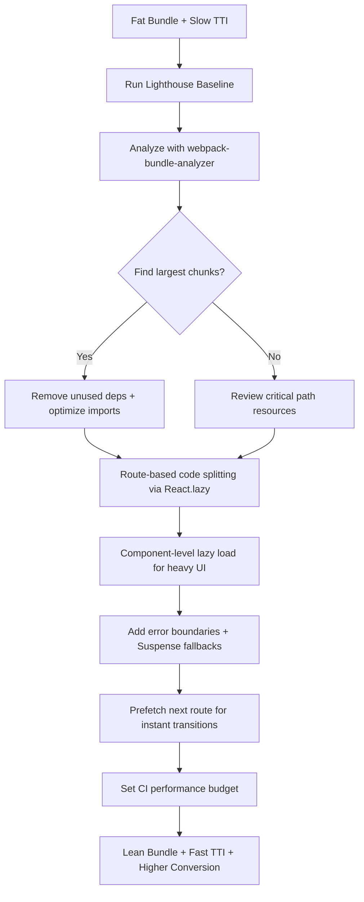

| Difficulty | Channel | Tags |
|---|---|---|
| intermediate | frontend | lighthouse, bundle, lazy-loading |

Ever wondered why a perfectly good React app can still feel like wading through molasses on a slow connection? Netflix hit that exact wall — their logged-out homepage was taking 7 full seconds to load on simulated 3G, and every one of those seconds was costing them sign-ups. Their fix wasn't a magic server, a new framework, or a faster cloud. It was disciplined JavaScript dieting: cutting the bundle and shipping only what mattered [1]. This is the story of that transformation and the exact playbook you can steal.

---

> ### Real-World Case — Netflix
>
> Netflix's logged-out homepage (sign-up flow) was loading in 7 seconds on simulated 3G. The page contained 300KB of client-side JavaScript including React, Lodash, and hydration data. On emerging markets with slow connections, this was causing significant user drop-off during sign-up.
>
> | | |
> |---|---|
> | **Challenge** | Reduce Time-to-Interactive on the sign-up landing page while maintaining the developer experience of their existing React-based server-side rendering stack. |
> | **Solution** | Netflix removed React and client-side libraries from the landing page entirely, keeping React only for server-side rendering. They rebuilt interactive elements in vanilla JavaScript (under 300 lines). For subsequent SPA pages, they implemented XHR prefetching (95% success rate) to download the full React bundle while users lingered on the landing page, plus browser-native link prefetching for HTML/CSS. |
> | **Outcome** | TTI decreased by 50% (from ~7s to <3.5s on desktop). JS bundle reduced by 200KB. Prefetching subsequent pages reduced their TTI by 30%. First Input Delay was fast for 97% of desktop users. Sign-up button click rate increased, directly improving conversion. |
> | **Lesson** | React isn't always necessary on the client-side. Server-rendering React and replacing client-side React with vanilla JS for simple pages yields massive performance wins. The counterintuitive insight: keeping React for SSR but removing it from the client bundle can be more effective than trying to optimize or lazy-load it. |

---

## Hook — The 7-Second Homepage That Was Costing Sign-Ups

Picture this: a viewer in an emerging market taps 'Sign Up' on Netflix. The button responds... eventually. Seven seconds later. On a spotty 3G connection, that's an eternity — long enough for impatience to win and for the tab to be closed. That was the reality Netflix's web team was staring at, and it wasn't an infrastructure problem they could throw more servers at. The culprit was sitting right in the browser: 300KB of client-side JavaScript carrying React, Lodash, hydration data, and all the machinery a logged-out page honestly didn't need [1]. Here is the thing that surprises most developers: the sign-up form was simple. Yet the code powering it weighed enough to tank the entire experience. This is your first clue that bundle size is rarely about one bad file — it is about a thousand tiny decisions that compound. Sound familiar? It should, because the same drift happens in almost every React app that survives past its first feature.

## Problem — The Silent Tax of an Inflated Bundle

There is a hidden tax you pay on every JavaScript byte you ship, and most teams don't notice it until a performance review or a real user on a bad network does it for you. Consider the stakes: research consistently shows that slower pages lose users, and the moment your Time to Interactive creeps past three seconds, you are gambling with conversions [2]. The problem is that a growing app rarely feels slow to developers — you're on fiber, with a hot cache, and a machine that laughs at 2MB of scripts. But your user in a coffee shop on shared mobile data is having a completely different experience. More than that, an inflated bundle wastes bandwidth and battery on every device, for every visit, even on fast connections. The real pain though is that most teams reach for the wrong fixes first. Many developers discover that adding `React.lazy()` everywhere does little if the underlying chunk is still bloated with a dependency that gets pulled in at build time regardless. You might think tree shaking is automatic — and it mostly is, until one default import yanks in an entire library. The problem is multifaceted, but it can be fixed systematically.

## Real-World Case — Netflix

Netflix's logged-out homepage is a perfect case study because it captures the moment performance stops being an optimization and starts being a business metric. The team reported that the page was loading in around 7 seconds on simulated 3G, driven by roughly 300KB of client-side JavaScript that included React, Lodash, and hydration data. On emerging markets with slow connections, this was causing measurable drop-off during the sign-up flow [1]. So what did they do? Instead of a full rewrite, they treated it as a surgical script diet. They split the React bundle into smaller pieces, moved heavy dependencies off the critical path, inlined critical styles, and deferred everything that wasn't needed to render the form [1]. The results were dramatic: Time to Interactive dropped 50%, from about 7 seconds to under 3.5 seconds on desktop. The JavaScript bundle shrank by 200KB. First Input Delay was fast for 97% of desktop users. Perhaps most telling, they prefetched subsequent pages, cutting those transitions by another 30% — and the sign-up button's click rate went up, directly moving conversion [1]. This is the moment to lean in: Netflix didn't invent new technology. They applied disciplined, measurable thinking to code they already had. And they proved that a lighter page isn't just nicer to use — it is better for the business.

## Deep Dive — Code Splitting, Tree Shaking, and the Art of the Critical Path

Building on the Netflix story, let's unpack the actual machinery. Code splitting is the practice of breaking your single bundle into multiple chunks that load on demand, and `React.lazy()` with `Suspense` is the idiomatic way to do it in React — route-based splitting loads a chunk only when the user navigates to that route [3]. But here is the plot twist: code splitting alone is not enough. You first need to know what you're even shipping. This is where webpack-bundle-analyzer earns its keep — it visualizes your bundle so you can see the whale of a dependency that's dragging everything down [4]. Tree shaking is the second piece. Tree shaking relies on ES module static analysis to drop unused exports, but it only works properly if your codebase uses ES imports throughout and your libraries are configured to allow it [5]. Import a CommonJS library and tree shaking quietly gives up. Consequently, the real skill is understanding the critical path: every render-blocking resource delays first paint, every parse-blocking script delays interactivity. Netflix deferred non-critical JavaScript and inlined critical CSS precisely to shorten that path [1]. Moreover, don't forget what happens after load. Once a user lands on page one, you can predict page two and prefetch it — Netflix cut subsequent-page TTI by 30% this way [1]. The deep insight: performance is a pipeline, not a single switch.

## Workflow — From Bloat to Budget, Step by Step

So how do you actually get from a 65 Lighthouse score to 90+? This leads to a repeatable workflow that mirrors what Netflix did and what any serious team can follow. First, stop guessing: run Lighthouse and capture a baseline [6]. Second, analyze the bundle with webpack-bundle-analyzer and identify the largest chunks [4]. Third, remove unused dependencies and optimize imports — switch heavy libraries for lighter alternatives where it makes sense. Fourth, implement route-based code splitting so each page only loads its own scripts [3]. Fifth, add component-level lazy loading for truly heavy pieces like charts and media players, wrapped in error boundaries so a failed chunk load doesn't white-screen the app [7]. Finally, set a performance budget in CI so a regression fails the build instead of silently shipping. This isn't a one-time cleanup; it's a discipline that has to survive every new feature. The diagram below maps the journey from a fat bundle to a lean, budgeted one.

## Code Example — Splitting Routes and Components Without Breaking the App

Building on the workflow, here is the concrete React implementation. The key is pairing lazy loading with Suspense fallbacks and error boundaries so users never see a blank screen while a chunk downloads. Let's look at the code that translates the strategy into reality.

## Lessons Learned — What to Do Differently Tomorrow

If this feels overwhelming, you are not alone — but the takeaways are refreshingly concrete. The first lesson is that performance is a business metric, not a vanity score. Netflix's sign-up click rate improved because the page got faster [1]; if you can tie a speed win to a conversion number, you've won the argument with stakeholders before it starts. The second lesson is measurement before optimization. You can't fix what you haven't measured, so embrace webpack-bundle-analyzer and Lighthouse baselines [4][6]. The third lesson is that code splitting and tree shaking are a pair — one without proper ES module configuration is incomplete [5]. The fourth is to handle failures gracefully; a missing lazy chunk should never take down the whole app, so error boundaries aren't optional [7]. Finally, enforce a budget. Many developers discover their 65-score app was really just an accident of many small regressions; a CI budget prevents that drift. The memorable insight to share with your team: your goal isn't a smaller bundle for its own sake — it's a bundle that never delivers a byte your user isn't ready to see. Ship less on the critical path, and everything downstream gets faster.

---

## Performance Optimization Pipeline

<strong>Original Interview Question</strong>

**Q:** You're tasked with improving a React app's Lighthouse performance score from 65 to 90+. The bundle size is 2.1MB and Time to Interactive is 4.2s. What specific steps would you take to optimize the bundle and implement lazy loading?

**A:** Implement code splitting with React.lazy() and Suspense, analyze bundle composition with webpack-bundle-analyzer to identify largest chunks, remove unused dependencies and optimize imports, add dynamic imports for heavy components and third-party libraries, implement route-based splitting for better initial load times, and utilize tree shaking with proper ES module configuration.

## Conclusion

The Netflix story is your proof that massive performance gains don't require a rewrite — they require discipline. Start tomorrow by running a Lighthouse baseline, pointing webpack-bundle-analyzer at your production bundle, and finding the biggest offenders [1][4][6]. Then split your routes, defer the heavy stuff, and wrap every lazy chunk in an error boundary [3][7]. Set a CI budget so the bloat never quietly returns. And remember the one line worth taking to your team: a faster page isn't just a nicer experience — it's a direct lever on conversion, and it's the single highest-leverage optimization most React apps are leaving on the table.

---

## References

1. [Netflix incident report](https://medium.com/dev-channel/a-netflix-web-performance-case-study-c0bcde26a9d9) — article
2. [Web Performance Metrics](https://developer.mozilla.org/en-US/docs/Web/Performance/Guides/Web_Performance_Basics) — documentation
3. [Code-Splitting](https://react.dev/reference/react/lazy) — documentation
4. [webpack-bundle-analyzer](https://github.com/webpack-contrib/webpack-bundle-analyzer) — documentation
5. [Tree Shaking](https://developer.mozilla.org/en-US/docs/Glossary/Tree_shaking) — documentation
6. [Lighthouse Performance](https://developer.chrome.com/docs/lighthouse/performance/) — documentation
7. [Error Boundaries](https://react.dev/reference/react/Component#catching-rendering-errors-with-an-error-boundary) — documentation
8. [Progressive Web Apps](https://developer.mozilla.org/en-US/docs/Web/Progressive_web_apps) — documentation

---

**Author:** Satishkumar Dhule — [GitHub](https://github.com/satishkumar-dhule) · [LinkedIn](https://linkedin.com/in/satishkumar-dhule) · [Website](https://satishkumar-dhule.github.io)
