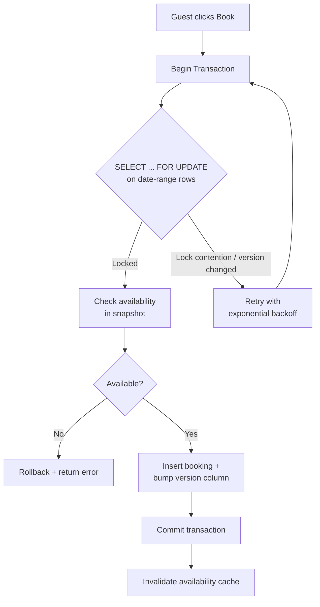

| Difficulty | Channel | Tags |
|---|---|---|
| intermediate | database | acid, isolation-levels, mvcc |

Picture the exact millisecond two buyers click 'Complete purchase' on the very last unit of the same product. Only one of them should get it. Now zoom out: at Black Friday 2025 peak, Shopify processed $5.1M in sales per minute — roughly 14% of all U.S. e-commerce — and every single one of those purchases had to make that same atomic choice without a single oversell [1]. This is the story of how Shopify rebuilt inventory reservations to survive that flood, and what their battle teaches developers about the concurrency problem hiding inside every booking system.

---

> ### Real-World Case — Shopify
>
> Shopify's oversell protection must guarantee that when a buyer clicks 'Complete purchase,' the item is still available - otherwise two concurrent buyers claim the same last unit and the merchant must cancel an order. Shopify powers ~14% of U.S. e-commerce and hit a record $5.1M in sales per minute at Black Friday 2025 peak, so every checkout touches inventory reservation. For years reservations ran on Redis while the inventory ledger lived in MySQL, where the reserve/claim pair couldn't be made atomic.
>
> | | |
> |---|---|
> | **Challenge** | Prevent two transactions from claiming the same unit (structurally identical to two guests booking the same property dates) at extreme concurrency while keeping high availability. The naive approach - one row per item with a quantity counter -- made every flash-sale checkout for a hot item serialize on a single InnoDB row lock and crawl. The Redis+MySQL split caused overselling or underselling depending on operation order, with no ACID boundary between the temporary hold and the permanent ledger deduction. |
> | **Solution** | Moved reservations into the same MySQL database as the inventory ledger and rebuilt on 'one row per sellable unit' with MySQL 8's SELECT ... FOR UPDATE SKIP LOCKED, so concurrent buyers waiting on the same item lock and consume different rows and commit in parallel. They added a bounded available-row pool (capped at 1,000 per item/location for flash-sale bursts), a composite primary key (shop_id, inventory_item_id, inventory_group_id, id) to cut row locks from two to one per reservation, READ COMMITTED isolation to eliminate gap/supremum locks that blocked replenishment, consistent lock ordering to remove deadlocks, and UNION ALL batching - all wrapped in a single ACID transaction. |
> | **Outcome** | Met high-throughput targets during peak 2025 traffic (Black Friday peak of $5.1M sales/minute, +11% YoY) with zero oversells and ACID guarantees. The real bottleneck turned out to be database connections held by unrelated checkout code: after cleanup they removed 50% of reads and 33% of transactions on the primary database, kept writer CPU under 50% and reader CPU under 16% during flash sales, and scaled beyond their previous ceiling. They validated via dual-write 'shadow mode' with Redis as a kill-switch fallback before a gradual cutover. |
> | **Lesson** | The counterintuitive twist: for reservation workloads a LOWER isolation level (READ COMMITTED) outperformed the textbook SERIALIZABLE answer because gap locks were silently blocking replenishment - and even the lock strategy wasn't the real bottleneck; it was how long unrelated code held connections. When numbers don't add up (low CPU but queuing), instrument the full path before optimizing the obvious thing. |

---

## Hook — Two Buyers, One Last Unit, Zero Room for Error

It is the worst kind of race condition: not the one that slows a query down, but the one that silently double-sells something. Without guardrails, the last unit of an item can be claimed by two buyers who both see 'in stock' on their screens. The merchant then faces an excruciating call — cancel one order and disappoint a customer, or eat the cost. This exact problem lives inside every domain that reserves scarce, shared resources: concert seats, hotel rooms, Airbnb rentals, and e-commerce inventory. And at e-commerce scale, it stops being an occasional edge case and becomes a math certainty. The more traffic you have, the more often two transactions collide on the same row — until, eventually, a collision is guaranteed to happen every single minute.

## Problem — The Race Condition You Cannot See Coming

At its heart, the scenario is beautifully simple: a property has one available night, and two transactions check availability, both read 'available,' both write a booking. The second write silently clobbers the first. This is a classic lost-update or race condition, and it is notoriously sneaky because it only appears under real load — stress tests with a handful of concurrent requests often pass, then production at 10x traffic starts double-booking. Many developers discover that the default READ COMMITTED isolation level gives you snapshots that are consistent per-statement but not per-transaction. That means transaction A can read availability, and by the time it commits, transaction B has already taken that slot. The stakes are worse than a refund: for Airbnb, an overbooked host means a guest shows up with nowhere to stay. For Shopify, an oversell means a merchant must cancel — and trust, once shattered, is brutally expensive to rebuild.

## Real-World Case — Shopify

Shopify's oversell protection has to guarantee that when a buyer clicks 'Complete purchase,' the item is still available — otherwise two concurrent buyers claim the same last unit and the merchant must cancel an order. Shopify powers roughly 14% of U.S. e-commerce and hit a record $5.1M in sales per minute at the Black Friday 2025 peak, up 11% year over year, so every checkout touches inventory reservation [1]. For years, reservations ran on Redis while the inventory ledger lived in MySQL, and the reserve/claim pair could not be made atomic across the two systems. The real bottleneck turned out to be database connections held by unrelated checkout code: after cleanup, they removed 50% of reads and 33% of transactions from the primary database, kept writer CPU under 50% and reader CPU under 16% during flash sales, and scaled beyond their previous ceiling [1]. They validated everything via a dual-write 'shadow mode' with Redis as a kill-switch fallback before a gradual cutover — evidence that even the biggest platforms fear the switch and demand a safety net.

## Deep Dive — Isolation Levels, MVCC, and Locks, Explained Without the Jargon

The answer to the booking interview question — SERIALIZABLE isolation with optimistic concurrency control — sounds like alphabet soup until you unpack what each piece actually buys you, and where it costs you. **SERIALIZABLE** is the strictest isolation level: it guarantees the outcome is identical to running the transactions one at a time, no matter how they interleave. It is the gold standard for correctness, and it is precisely what you want for a critical booking or reservation write. But here is the trade-off: full serializability can crush throughput, because the database serializes conflicting operations and rejects many concurrent attempts. That is where **optimistic concurrency control** rescues you — instead of holding locks pessimistically for the whole transaction, you let everyone read a snapshot (that is the **MVCC** part), do the work, and only at commit time check that nothing changed using a version column. If the version moved, you retry. The knockout punch for the specific booking case is PostgreSQL's `SELECT ... FOR UPDATE`, which takes row-level locks on exactly the availability rows you care about — often a specific date range — so two bookers of the same night serialize, while bookers of different nights sail through in parallel. Read replicas serve cheap availability checks, and write-through caching keeps hot data fast — but only if you invalidate the cache on every successful booking, or you will serve stale 'available' answers from memory while the database says otherwise.

## Workflow — The Book, Verify, Commit Journey

Building on the theory, here is the concrete step-by-step journey a booking transaction takes — and the exact points where the system earns its correctness. First, the availability calendar is split into a dedicated table so the hot locking surface is tiny and isolated from the rest of the data model. Next, when a guest attempts to book, the application runs a `SELECT ... FOR UPDATE` targeting the specific date range — locking only those rows, not the whole table. It then verifies the requested nights are still available within that locked snapshot. If they are, the app writes the booking and bumps the optimistic version column atomically. If a concurrent write already moved the version, the transaction retries with exponential backoff — a few milliseconds, then a bit longer, rather than hammering a hot row. After a successful commit, the availability cache is invalidated so subsequent guests never see stale 'free' nights. Throughout, teams monitor lock contention and drop in circuit breakers for hot properties, so a single viral listing cannot take down the checkout path. The Mermaid diagram below shows this full flow, including the retry loop that is the difference between a safe system and a fragile one.

## Code Example — An Atomic Booking in PostgreSQL

This is where the theory meets the keyboard. Using SQL transformations via a PostgreSQL driver, you can express the whole atomic reservation in a way the database can enforce on its own — no application-level mutex gymnastics required. The code below shows the pattern: locking the rows, checking availability inside the lock, inserting the booking, and invalidating the cache — all inside one transaction so the failure path rolls back cleanly. The explanation walks through each line and why the retry handles the rare lost-race.

## Lessons Learned — Battle Scars From the Front Lines

After walking the full journey, the takeaways crystallize into a handful of hard-won rules. **First, correctness at the write is non-negotiable, but it does not have to be slow** — SERIALIZABLE for critical writes plus MVCC snapshot reads for availability checks gives you both safety and scale, exactly the split Shopify exploited. **Second, the real bottleneck is often invisible**: like Shopify's discovery that unrelated checkout code held connections hostage, teams frequently optimize the wrong layer while a mundane leak quietly caps performance [1]. **Third, ship with a kill switch** — Shopify's shadow-mode validation and Redis fallback meant the cutover could never take the platform down, and every migration should carry the same insurance. **Fourth, monitor the hot path**: lock contention and cache invalidation are the two silent killers of reservation systems, so instrument them before they bite. Here is the memorable insight to take to your team: the goal is not to prevent every race from happening — it is to make the loser of every race fail loudly and retry gracefully, so the database, not the customer, absorbs the collision.

---

## Booking Flow

<strong>Original Interview Question</strong>

**Q:** You're building a booking system for Airbnb where multiple users can reserve the same property simultaneously. How would you design the transaction handling to prevent double bookings while maintaining high availability?

**A:** Use SERIALIZABLE isolation with optimistic concurrency control. Implement row-level locks on property availability tables, use MVCC snapshot reads for checking availability, and apply application-level validation to ensure atomic booking operations.

## Conclusion

The journey ends where it began: two buyers, one last unit, and a choice the system has to make cleanly at millions of transactions per minute. ShopFormat — no, Shopify — proved that the answer is not choosing between safety and speed, but designing the write path so the database settles the race atomically, then making every loser retry gracefully. The moral: stop treating concurrency as a bug to stumble into and start treating it as a property you deliberately engineer. Tomorrow, look at your own reservation or booking query and ask whether it holds the right locks, whether its cache is invalidated inside the transaction, and whether it can tell an unlucky loser to retry. If you cannot answer yes to all three, you are one traffic spike away from a very public double-booking.

---

## References

1. [Shopify incident report](https://shopify.engineering/scaling-inventory-reservations) — article
2. [Atomicity (database systems)](https://en.wikipedia.org/wiki/Atomicity_(database_systems)) — documentation
3. [Isolation (database systems)](https://en.wikipedia.org/wiki/Isolation_(database_systems)) — documentation
4. [Multiversion concurrency control](https://en.wikipedia.org/wiki/Multiversion_concurrency_control) — documentation
5. [Optimistic concurrency control](https://en.wikipedia.org/wiki/Optimistic_concurrency_control) — documentation
6. [PostgreSQL SELECT for UPDATE documentation](https://www.postgresql.org/docs/current/sql-select.html) — documentation
7. [PostgreSQL Transaction Isolation](https://www.postgresql.org/docs/current/transaction-iso.html) — documentation
8. [Exponential backoff](https://en.wikipedia.org/wiki/Exponential_backoff) — documentation

---

**Author:** Satishkumar Dhule — [GitHub](https://github.com/satishkumar-dhule) · [LinkedIn](https://linkedin.com/in/satishkumar-dhule) · [Website](https://satishkumar-dhule.github.io)
