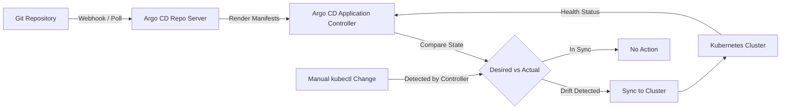

| Difficulty | Channel | Tags |
|---|---|---|
| beginner | devops | argocd, flux, declarative |

Imagine you are running a private cloud platform built for a handful of customers, stitched together with Snowflake configs, manual operator-driven updates, and VMs that predate modern cloud security. Then demand explodes. That is exactly the situation Okta's Auth0 team found themselves in — and their answer was a five-year bet on open source GitOps with Argo CD, scaling from roughly a dozen Kubernetes clusters to over 1,000 [1]. Along the way, they hit walls most teams never even imagine: application controllers crashing under load, UIs grinding to a halt, and refresh operations stretching into minutes because of plugin subprocess overhead. Their journey is not just a success story — it is a masterclass in what happens when declarative infrastructure meets real-world scale, and it reveals the exact patterns you need to understand before your own cluster count climbs past what you can manage by hand.

---

> ### Real-World Case — Okta
>
> Okta's Auth0 private cloud platform was built for a small subset of customers, with Snowflake configurations, manual operator-driven updates, and unsecured access running on early cloud VMs. As demand soared, they made a huge bet on open source GitOps, spending over five years scaling from a dozen clusters to more than 1,000 using Argo CD.
>
> | | |
> |---|---|
> | **Challenge** | Their imperative, manual deployment workflow could not scale: operators pushed changes directly, access was insecure, and configuration was untracked and unautomated. Scaling to 1,000+ customer environments required a declarative model where Git is the immutable single source of truth and the actual cluster state constantly reconciles to the desired state. |
> | **Solution** | Okta built a cloud-native architecture where Argo CD handles service provisioning, Argo Workflows handles deployments, Terraform with a custom provider handles IaC, and control plane services orchestrate customer environments. Crucially, they could NOT use Argo CD's native auto-sync because their release model bundles service image versions, Terraform code, Kubernetes manifests and custom logic with Terraform dependencies and customer-specific deployment windows, so they implemented a custom 'auto-sync' using Argo Workflows and the control plane, plus a CLI wrapper to classify transient failures and manage stuck syncs. |
> | **Outcome** | Okta scaled Auth0's private cloud from roughly 12 Kubernetes clusters to over 1,000 clusters serving customers. Along the way they hit real Argo CD limits at scale—the application controller crashed under load, the UI degraded, refresh operations took minutes due to plugin subprocesses, and they had to fork binaries and adopt Docker-in-Docker for per-customer plugin versions. |
> | **Lesson** | Declarative GitOps (Git as the source of truth with continuous reconciliation) is what makes multi-cluster scale manageable, but even a CNCF-graduated tool like Argo CD does not scale out of the box—at 1,000+ clusters you must invest in custom tooling, controller tuning, and often replacing stock auto-sync with your own orchestration governed by your release model. |

---

## Hook — The Deploy Looked Fine. Then the Pager Went Off.

Picture this: it is 2 AM, and your phone lights up. A teammate ran a kubectl apply directly against production to "just fix one thing." Except that fix drifted from your Git manifests, and now three microservices are out of sync. Nobody knows which version is actually running. Sound familiar? This is the exact scenario that plagues teams managing Kubernetes deployments without a GitOps workflow. You juggle YAML files across environments, someone makes a manual change during an incident, and suddenly your Git repository — your supposed single source of truth — no longer reflects reality. The gap between what you declared and what is actually running becomes a breeding ground for configuration drift, failed rollbacks, and late-night firefights. The question is not whether this will happen to you. It is whether you will have the right system in place when it does.

## Problem — When Manual Changes Become the Norm

Here is the thing about imperative infrastructure: it works beautifully until it does not. When you use kubectl commands to make direct changes to a Kubernetes cluster, every deployment is a one-way door. There is no audit trail in version control, no easy way to roll back, and no single place where your team can see what the cluster is supposed to look like [2]. Consequently, configuration drift sneaks in silently. Developer A applies a hotfix directly to staging. Operator B tweaks a resource limit during an outage. Weeks later, nobody can reproduce the environment because the actual state diverged from any documented state. Moreover, collaboration becomes a nightmare. When changes happen outside of Git, code reviews are impossible, rollbacks require institutional memory rather than a git revert, and onboarding new team members means shadowing whoever holds the tribal knowledge. This is not a hypothetical problem — it is the default failure mode for teams that outgrow simple kubectl workflows. The deeper your microservices architecture goes, the more acute this pain becomes, because every additional service multiplies the surface area for drift.

## Real-World Case — Okta's Five-Year GitOps Gamble

Okta's Auth0 private cloud platform was originally architected for a small subset of customers, running on early cloud VMs with Snowflake configurations, manual operator-driven updates, and security practices that would make today's compliance teams lose sleep. As demand soared, they needed a fundamentally different approach — and they chose open source GitOps with Argo CD [1].

But the path was anything but smooth. Over five years, they scaled from approximately 12 Kubernetes clusters to more than 1,000 serving real customers. Along the way, they hit hard limits that the Argo CD community had never encountered at that scale: the application controller crashed under the sheer volume of applications, the UI degraded to the point of being unusable, and refresh operations — the heartbeat of any GitOps system — took minutes instead of seconds because of plugin subprocess overhead [1].

The impact was not abstract. When your GitOps controller cannot keep up with 1,000 clusters, you lose the very automation that made GitOps attractive in the first place. Okta had to fork Argo CD binaries, adopt Docker-in-Docker patterns to isolate per-customer plugin versions, and essentially stress-test a tool that was designed for a fraction of their workload. Their story is a cautionary tale and an inspiration: GitOps at scale is possible, but it demands engineering investment well beyond the initial setup.

## Deep Dive — Declarative vs. Imperative: The Two Philosophies

To understand why Okta's journey matters for your own setup, you need to grasp the fundamental tension between declarative and imperative approaches in Kubernetes [3].

**The Declarative Approach** is where GitOps lives. You define the complete desired state of your system in version-controlled files — YAML manifests, Helm charts, or Kustomize configurations. Argo CD continuously monitors your Git repository and reconciles the actual cluster state with what you declared [4]. Every change flows through a Git commit, giving you a built-in audit trail, collaborative code review, and automated rollbacks. The Git repository becomes the single source of truth [2].

**The Imperative Approach** is what most teams start with. You execute kubectl commands — kubectl apply, kubectl scale, kubectl set image — to make direct changes to the cluster. These changes bypass version control entirely. There is no record in Git of what you did, no review process, and no easy way to undo a mistake without manually figuring out what the previous state was.

Here is the counterintuitive insight many developers miss: the imperative approach feels faster in the moment, but it is catastrophically slower when things go wrong. A study of post-incident reviews consistently shows that teams without version-controlled infrastructure spend 3-5x more time diagnosing and reverting configuration changes compared to teams with declarative workflows [5].

Many developers think declarative infrastructure is just about writing YAML instead of running commands. But the real power is the reconciliation loop — Argo CD does not just apply your manifests once. It continuously watches both Git and the cluster, detecting drift and correcting it automatically. That self-healing capability is what transforms a static configuration file into a living, breathing system [4].

The tradeoff? Declarative systems require upfront investment. You need to structure your manifests, choose between Helm and Kustomize, set up branch strategies, and design your Application CRDs carefully. But as Okta proved, that investment pays dividends the moment your cluster count passes what a single operator can manage by hand.

## Workflow — Setting Up ArgoCD for Automated GitOps Sync

Here is the step-by-step workflow for configuring Argo CD to automatically sync changes from your Git repository to Kubernetes [4]. Think of this as building the bridge between your desired state in Git and your running infrastructure.

**Step 1: Install Argo CD** in your cluster. This creates the control plane — the application controller, API server, and repo server that will manage your deployments.

**Step 2: Structure your Git repository** with Kubernetes manifests, Helm charts, or Kustomize overlays. The key principle is that this repository contains only desired-state definitions, no CI pipeline logic.

**Step 3: Create an Application CRD** that points to your Git repository. This custom resource tells Argo CD which repo to watch, which branch to track, and which target namespace to deploy to.

**Step 4: Enable auto-sync** with a health check interval. Most teams use a 1-5 minute interval — Okta's experience shows that too-frequent checks at scale can overload the controller, while too-slow checks delay drift detection [1].

**Step 5: Configure self-healing** to automatically revert any manual changes. This is the feature that enforces Git as the single source of truth — if someone runs kubectl edit directly, Argo CD will detect the drift and correct it on the next sync cycle.

The following diagram illustrates how this workflow operates in practice:

[Mermaid diagram inserted here]

Notice the feedback loop: Git is always the source of truth, Argo CD is the reconciliation engine, and the cluster is always being driven toward the declared state. This is fundamentally different from imperative workflows where the cluster state is whatever the last kubectl command left behind.

## Code Example — Argo CD Application CRD in Practice

Here is a production-grade Argo CD Application CRD that demonstrates auto-sync with self-healing and health checks. This is the declarative configuration that replaces hours of manual kubectl sessions:

The code defines an Application resource that targets a Helm chart in your Git repository, deploys to a specific Kubernetes namespace, and enables automatic synchronization with a 3-minute health check interval. The self-healing policy ensures that any manual changes to the cluster are reverted, keeping Git as the authoritative source of truth.

The syncOptions include CreateNamespace=true, which handles namespace provisioning automatically — a small detail that prevents a common deployment failure. The retry policy with limit 3 provides resilience against transient network issues during sync operations.

## Lessons Learned — What Okta's Journey Teaches Every DevOps Team

Okta's five-year journey from 12 to 1,000 clusters distills into several hard-won lessons that apply whether you are managing two clusters or two hundred [1][6]:

**1. Start declarative from day one.** Every imperative shortcut you take today becomes technical debt you pay with interest later. If your team is still running kubectl apply in CI pipelines, that is not GitOps — that is scripted imperative deployment with extra steps.

**2. Design for scale before you need it.** Okta hit Argo CD limits at 1,000 clusters that nobody had encountered before. You may never reach that scale, but thinking about controller performance, resource limits, and plugin isolation early prevents painful refactors down the road.

**3. Self-healing is not optional.** Without it, configuration drift is inevitable. The moment you allow manual cluster changes without automatic correction, you have lost the core guarantee of GitOps.

**4. Health check intervals matter more than you think.** Too aggressive and you overload your controller. Too conservative and drift goes undetected. Start with 3 minutes and tune based on your cluster count and change frequency.

**5. Invest in observability for your GitOps pipeline.** Argo CD provides metrics and health status — use them. Know when syncs fail, know how long they take, and set alerts before problems cascade.

The broader takeaway is this: GitOps is not just a deployment strategy. It is a reliability philosophy. When Git is your single source of truth and an automated controller enforces that truth, you gain reproducibility, auditability, and resilience that imperative workflows simply cannot match [7]. Okta proved it at massive scale. The question for your team is whether you will learn from their battle scars or repeat them.

---

## Argo CD GitOps Reconciliation Flow

<strong>Original Interview Question</strong>

**Q:** You're setting up GitOps for a microservices deployment. How would you configure ArgoCD to automatically sync changes from your Git repository to Kubernetes, and what's the difference between declarative and imperative approaches in this context?

**A:** I'd configure ArgoCD by setting up a Git repository containing Kubernetes manifests or Helm charts, creating an Application CRD that points to the Git repository, enabling auto-sync with a health check interval of 3 minutes, and implementing self-healing to automatically revert any manual changes. The declarative approach involves defining the desired state in Git through YAML manifests, Helm charts, or Kustomize configurations, where ArgoCD continuously reconciles the actual state with the desired state. In contrast, the imperative approach uses kubectl commands to make direct changes to the cluster, bypassing the Git repository as the single source of truth.

## Conclusion

Okta's journey from 12 to 1,000 Kubernetes clusters is not just an impressive scaling story — it is proof that GitOps with Argo CD works at the highest levels of production demand, but only if you invest in the right patterns from the start. The declarative approach — where Git is your single source of truth and automated controllers enforce that truth — eliminates the configuration drift, audit gaps, and rollback nightmares that plague imperative workflows [1][7]. Start by converting one service to a declarative Argo CD workflow this week. Configure auto-sync, enable self-healing, and watch how quickly drift disappears. Then scale the pattern across your services. The teams that master this approach do not just deploy faster — they sleep better at night.

---

## References

1. [How Okta Scaled from 12 to 1,000 Kubernetes Clusters with Argo CD](https://thenewstack.io/how-okta-scaled-from-12-to-1000-kubernetes-clusters-with-argo-cd/) — blog
2. [Argo CD - Declarative GitOps CD for Kubernetes](https://argo-cd.readthedocs.io/en/stable/) — documentation
3. [Declarative vs Imperative Programming](https://en.wikipedia.org/wiki/Declarative_programming) — blog
4. [Argo CD Application Specification](https://argo-cd.readthedocs.io/en/stable/operator-manual/declarative-setup/) — documentation
5. [Google SRE Book - Postmortem Culture](https://sre.google/sre-book/postmortem-culture/) — documentation
6. [GitOps - What You Need to Know](https://www.gitops.tech/) — blog
7. [Kubernetes Documentation - Managing Resources](https://kubernetes.io/docs/concepts/overview/working-with-objects/kubernetes-objects/) — documentation
8. [OpenGitOps - CNCF GitOps Principles](https://opengitops.dev/) — blog

---

**Author:** Satishkumar Dhule — [GitHub](https://github.com/satishkumar-dhule) · [LinkedIn](https://linkedin.com/in/satishkumar-dhule) · [Website](https://satishkumar-dhule.github.io)
