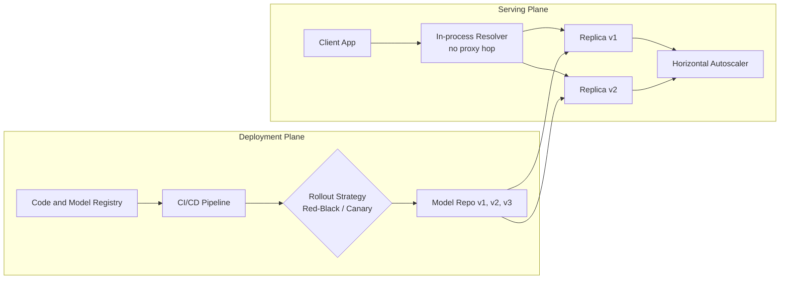

| Difficulty | Channel | Tags |
|---|---|---|
| beginner | devops | mlops, deployment |

Hundreds of model types. Millions of distinct model versions. More than one million inference requests hitting the platform every single second [1]. This was the scale Netflix's ML platform operated at when engineers discovered that Switchboard, their carefully built central routing service, was quietly taxing every request with 10 to 20 milliseconds of latency and looming as a single point of failure [1]. The story of how they escaped that bottleneck is really the story of the difference between model deployment and model serving, and it will change how you draw your next architecture diagram.

---

> ### Real-World Case — Netflix
>
> Netflix's ML platform serves hundreds of model types across 250 million users at over 1 million requests per second. They built a centralized routing service called Switchboard to let researchers safely experiment with model versions and route traffic to the right model instance. But at scale, Switchboard became a bottleneck — adding 10-20ms of latency per request and creating a single point of failure, forcing them to architecturally rethink their entire serving layer.
>
> | | |
> |---|---|
> | **Challenge** | Route the right request to the right model, on the right cluster shard, for the right user and use case — while researchers need to rapidly iterate on model versions, run A/B tests, and roll back broken models in seconds. Off-the-shelf solutions like AWS API Gateway couldn't handle ML-specific routing needs (context-aware model selection, experiment-driven traffic splitting, dynamic model-to-cluster assignment). |
> | **Solution** | Phase 1 (Switchboard): A centralized JVM-based routing proxy that served as the mandatory entry point for all ML inference traffic. It performed context-aware routing, enriched model inputs, and applied experiment-driven traffic splitting. Researchers configured A/B tests via a rules system, and Switchboard resolved which model version to use per request.

Phase 2 (Lightbulb): When Switchboard's limitations became clear — 10-20ms added latency from ser/de, single-point-of-failure risk, and error propagation between tenants — Netflix decomposed it into two layers: (1) Lightbulb, a lightweight metadata service that resolves request context into a routing key + model config, and (2) Envoy proxy, which already handled egress traffic at Netflix, now extended to perform the actual routing based on the routing key. The request body no longer flows through the routing layer.

Additionally, Netflix built in-house LLM serving on vLLM + NVIDIA Triton, integrated into their existing JVM-based serving system. They encountered a production surprise: vLLM V0's per-request logits processing hit CPU-bound bottlenecks under batch concurrency due to Python's GIL, causing tail latency to spike invisible in single-request benchmarks. They migrated to vLLM V1 which moved processing to batch-level with C++ multi-threading, fixing the issue. |
> | **Outcome** | The platform serves 1 million+ requests per second across hundreds of model types and versions. The Switchboard-to-Lightbulb migration eliminated the 10-20ms routing overhead by removing the proxy from the hot path while preserving the single client abstraction. The LLM serving system handles both existing ML models (XGBoost, TensorFlow, PyTorch) and LLMs through a unified gRPC interface, with Red-Black and Versioned deployment strategies solving the GPU cold-start and schema-change coordination problems. Netflix caches LLM models on Amazon FSx to avoid S3 download latency during cold starts. |
> | **Lesson** | The biggest lesson: a routing/serving abstraction that works brilliantly at moderate scale can become a single point of failure and latency bottleneck at extreme scale. Netflix didn't abandon their architecture — they decomposed responsibilities. Routing metadata resolution (Lightbulb) moved to a lightweight sidecar, while actual request routing delegated to infrastructure already in the path (Envoy). Also, Python's GIL creates invisible CPU bottlenecks in concurrent batch processing that only surface under production load, not benchmarks. |

---

## Hook — When your fast path becomes your slowest link

Here is the plot twist nobody wants to discover at 2am: the thing you built to make your ML system simple is often the exact thing that breaks it at scale [1]. Netflix's Switchboard was precisely that — a centralized router that let researchers safely experiment with model versions and steer traffic to the right model instance. It worked brilliantly. Until it didn't.

At over 1 million requests per second across hundreds of model types and versions, Switchboard added 10 to 20 milliseconds of pure overhead to every single call and became the platform's single point of failure [1]. Sound familiar? Before you dismiss that as a "Netflix-scale" problem, consider this: you probably run a smaller version of Switchboard in your own architecture today. Maybe it is an API gateway, a load balancer, or a router every request must cross. The uncomfortable question is whether it is paying rent or just collecting tolls. To answer it, you first need to understand the two halves of the ML lifecycle that everyone keeps conflating: deployment and serving.

## Problem — Deployment and serving: two words, one giant pile of confusion

Many developers use "deployment" and "serving" as if they were the same thing. They are not. Deployment is the journey: CI/CD pipelines, infrastructure setup, artifact versioning, and monitoring — the whole process of getting a trained model from a notebook into a production environment using platforms like Kubernetes, MLflow, or SageMaker [6][8]. Serving is the destination: the runtime layer that actually answers inference requests, where frameworks like TensorFlow Serving, TorchServe, or BentoML handle request routing, model loading, and response optimization [3][4][5].

Here is a mental model that sticks: deployment is building the restaurant — the kitchen, the licenses, the staff, the health inspection. Serving is the dinner rush — what actually happens when a customer orders and you have to get it hot, correct, and on the table in under 30 milliseconds. The confusion matters because teams optimize the wrong half. You can run a flawless deployment pipeline and still ship a broken product if your serving layer collapses under traffic. Conversely, you can pour months into a gorgeous serving stack and never ship a bug fix because your deployment process is a manual ritual passed down like folklore. The stakes are measurable: every network hop you add to the serving path is latency you pay on every request, forever [1]. So where exactly do these two worlds split?

## Real-World Case — Netflix's Switchboard-to-Lightbulb migration

Netflix's serving story began with an honest enabler. Switchboard was a centralized routing service that let researchers run experiments safely by splitting traffic between model versions, and for a long time it was the right call — a single abstraction the whole organization could lean on [1]. But scale is a merciless auditor. As the platform grew to over 1 million requests per second across hundreds of model types, Switchboard became the architectural equivalent of a single-lane bridge on a motorway: every request had to cross it, the crossing cost 10 to 20 milliseconds, and one bad day on that bridge took the whole platform down [1].

The fix was a hard-won lesson in architectural humility. Netflix replaced the central proxy with Lightbulb, a lightweight client library that keeps the same single-client abstraction developers loved but resolves routing in-process, sending gRPC requests directly to the right model instance over a unified interface that speaks to XGBoost, TensorFlow, PyTorch, and even LLMs alike [1][7]. No proxy hops. No bridge toll. Above that, they took on the two dragons that make model serving genuinely hard: GPU cold starts and schema changes across model generations. Red-Black and Versioned deployment strategies now orchestrate those migrations, and for LLMs they cache weights on Amazon FSx so cold starts never wait on S3 downloads [1]. The takeaway cuts deep: when your helpful abstraction starts taxing every request, the most valuable move can be deleting it from the hot path. That insight sets up the technical core of this story.

## Deep Dive — The real trade-offs under the hood

Building on the Netflix story, let's zoom into the two layers and the trade-offs that separate architects from amateurs. 

| Layer | Focus | Typical tools | Example task |
| --- | --- | --- | --- |
| Deployment | Getting models into production safely and reproducibly | Kubernetes, Terraform, MLflow, SageMaker, GitHub Actions | Build image, run CI/CD, roll out, monitor [6][8] |
| Serving | Answering requests fast and correctly | TorchServe, TensorFlow Serving, BentoML, FastAPI + gRPC | Load model, route request, autoscale, return result [3][4][5] |

Three trade-offs dominate the serving plane. First, latency versus throughput: real-time user-facing systems typically demand p99 latency well under 100ms, while batch pipelines accept results in under a second in exchange for far higher throughput. Second, real-time versus batch inference: streaming requests for online recommendations versus scheduled scoring jobs for offline signals — same model, totally different infrastructure. Third, cold start optimization: loading a model into GPU memory on demand can take seconds, which is why Netflix pre-caches LLM weights on Amazon FSx and why serverless-style cold-start research remains a hot topic [1][10].

Here is where many developers get blindsided: you assume the model is the serving bottleneck. Often, it is the plumbing around it. Load balancers like NGINX and Envoy are superb for HTTP traffic, but every hop adds milliseconds of latency [9]. gRPC helps by cutting serialization overhead versus JSON-over-HTTP for high-QPS tensor workloads [7]. And the scaling tooling differs too: deployment-time scaling is infrastructure-focused, with Kubernetes horizontal autoscaling reacting to CPU and memory; serving-time scaling is model-aware, driven by GPU memory, queue depth, and inference-specific load [2]. This leads to the three questions every interviewer asks — and every practitioner should be able to answer. How do you hit 10K QPS under 50ms? Direct routing, in-process resolvers, warmed models, and batched async gRPC. What do you monitor? Latency percentiles, throughput, queue depth, error rate, drift, and cold-start frequency. How do you version and roll back? A model registry that knows every artifact plus weighted canary rollouts with automated rollback on golden-signal regression [6][9].

## Workflow — From committed code to served predictions in six steps

Now the journey end to end. The Serving Architecture Flow diagram below shows how the two planes interact: the deployment plane feeds versioned artifacts down, and the serving plane resolves and serves them without a central proxy in the path. Use it as your mental checklist.

1. Register and version the model. Push every artifact, with its metrics and data snapshot, into a model registry such as MLflow so you can roll back to any historical winner [6].
2. Build a reproducible serving image. Package your model server — TorchServe, TensorFlow Serving, or BentoML — with pinned dependencies and a frozen weight snapshot [3][4][5].
3. Roll out with an intelligent strategy. Use Red-Black or canary splits rather than big-bang cutovers; Netflix uses exactly these patterns to dodge GPU cold starts and schema-change coordination problems [1].
4. Wire client-side resolution. Adopt the Lightbulb pattern: an in-process resolver that picks a target address locally, then talks gRPC straight to the replica — no proxy hop, no bridge toll [1][7].
5. Autoscale against serving signals. Point Kubernetes horizontal pod autoscaling at inference queue depth and GPU memory rather than raw CPU [2].
6. Monitor and auto-rollback. Track latency percentiles, throughput, errors, and saturation; when p99 crosses your SLA, the canary weight goes to zero before a human even opens a dashboard [1][2].

This pipeline reads cleanly on paper — but the real magic, as always, lives in the code.

## Code Example — Steal Netflix's routing playbook in Python

Here is a stripped-down version of the Lightbulb idea you can run today: a client-side resolver that keeps the routing table out of the network path. The service discovery table below replaces the central Switchboard-style router entirely.

## Lessons Learned — What the Switchboard story teaches every team

The Netflix journey condenses into five battle scars you can learn from without paying the tuition [1]:

- The abstraction tax is real. Any shared service that sits in the request path adds latency to every call. Keep hot-path abstractions thin or move them into the client — that single decision removed 10 to 20 milliseconds per request at Netflix [1].
- Deploy time is not serving time. You can be a deployment expert and still fail at serving; the skills, tools, and failure modes are different halves of the lifecycle [2][6].
- Weighted rollouts beat big-bang releases. Red-Black and Versioned strategies turned GPU cold starts and schema changes from outages into routine migrations [1].
- Cold starts are a serving problem, not a deployment problem. Cache weights on fast storage like Amazon FSx or keep warm replicas, because nobody wants to wait for an S3 download inside a user request [1][10].
- Measure the journey, not the engine. Watch p50/p95/p99 latency, throughput, error rate, queue depth, and cold-start frequency — raw CPU is a terrible proxy for serving health [2].

The classic mistake teams make: deploy a genuinely great model behind a gateway that adds 30 milliseconds of overhead, then blame the model when the SLA blows. Netflix's story is a reminder that the fastest model in the world is useless if the plumbing around it taxes every request [1]. Start small — even at a few hundred QPS you can adopt the client-resolver pattern, a model registry, and canary weights this week.

---

## Serving Architecture Flow

<strong>Original Interview Question</strong>

**Q:** Explain the key differences between model serving and model deployment in ML systems, including specific technologies, scaling considerations, and real-world implementation patterns?

**A:** Deployment encompasses CI/CD pipelines, infrastructure setup, and monitoring using tools like Kubernetes, MLflow, and SageMaker. Serving focuses on runtime inference APIs with frameworks like TensorFlow Serving, TorchServe, or BentoML, handling request routing, model versioning, and autoscaling. Key trade-offs include latency vs throughput, batch vs real-time inference, and cold start optimization.

## Conclusion

Netflix's Switchboard story is a reminder that the fastest model in the world is useless if the plumbing around it taxes every request [1]. Tomorrow, trace your own serving path, count every hop, and ask whether each one pays rent or just collects tolls. Then adopt the incremental wins — a model registry, canary weights, and a client-side resolver — before scale audits you the way it audited Netflix. The one insight worth sharing with your team: anything sitting in the request path is part of the model, so engineer it with the same rigor you give the weights.

---

## References

1. [Netflix incident report](https://netflixtechblog.com/state-of-routing-in-model-serving-16e22fe18741) — article
2. [Kubernetes Horizontal Pod Autoscaling](https://kubernetes.io/docs/tasks/run-application/horizontal-pod-autoscale/) — documentation
3. [TensorFlow Serving - GitHub](https://github.com/tensorflow/serving) — documentation
4. [TorchServe - GitHub](https://github.com/pytorch/serve) — documentation
5. [BentoML - GitHub](https://github.com/bentoml/BentoML) — documentation
6. [MLflow - GitHub](https://github.com/mlflow/mlflow) — documentation
7. [gRPC Documentation](https://grpc.io/docs/) — documentation
8. [Amazon SageMaker Documentation](https://docs.aws.amazon.com/sagemaker/latest/dg/whatis.html) — documentation
9. [Understanding NGINX HTTP Proxying, Load Balancing, Buffering, and Caching](https://www.digitalocean.com/community/tutorials/understanding-nginx-http-proxying-load-balancing-buffering-and-caching) — documentation
10. [SAND: Towards High-Performance Serverless Computing](https://arxiv.org/abs/1911.07712) — paper

---

**Author:** Satishkumar Dhule — [GitHub](https://github.com/satishkumar-dhule) · [LinkedIn](https://linkedin.com/in/satishkumar-dhule) · [Website](https://satishkumar-dhule.github.io)
