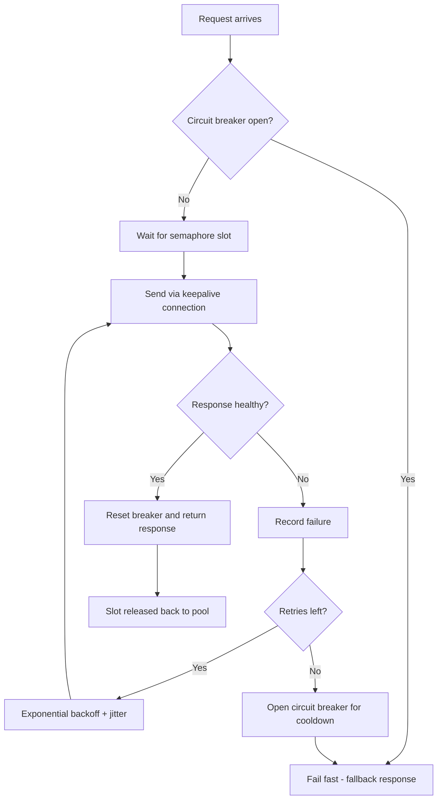

| Difficulty | Channel | Tags |
|---|---|---|
| advanced | backend | asyncio, aiohttp, concurrency |

Every day, Netflix's API absorbs over a billion incoming calls and fans them out into several billion more across dozens of microservices — a 1:6 ratio peaking past 100,000 dependency requests per second [1]. The team learned the hard way that one sluggish dependency can saturate every Tomcat thread in the API within seconds, dragging the entire system down with it [1]. That pain gave birth to Hystrix, and its lessons map directly onto the async world of aiohttp. This is the journey from "works on your laptop" to "survives peak traffic" — and it begins with the 2AM pager going off.

---

> ### Real-World Case — Netflix
>
> The Netflix API receives over 1 billion incoming calls per day, fanning out to several billion outgoing dependency calls (a 1:6 ratio) across dozens of underlying microservices, peaking above 100k dependency requests per second. The team found that with 30 dependencies each at 99.99% uptime, aggregate availability fell to ~99.7% — over 2 hours of downtime per month — and worse, a single lagging dependency could saturate all Tomcat request threads within seconds and take down the entire API. Hystrix evolved directly out of production incidents involving saturated connection pools, cascading failures, and misconfigured timeouts.
>
> | | |
> |---|---|
> | **Challenge** | How to keep a high-volume, fan-out API alive when any one of dozens of downstream services becomes latent or fails. A single dependency with increased latency (blocked request threads) could exhaust the entire connection/thread pool of every API instance, cascading into a full outage — a classic connection-pool exhaustion under load problem. |
> | **Solution** | Netflix built Hystrix, which applies exactly the patterns in the answer: (1) per-dependency thread pools and semaphores acting as bulkheads to limit concurrent connections/calls to each service, (2) aggressive per-command timeouts so callers can 'walk away' from latent calls, (3) circuit breakers that trip at a 50% error-rate threshold over a 10-second rolling window to shed load and stop pounding failing services, and (4) fallback behavior (custom fallback, fail-silent, fail-fast) so users get a degraded-but-functional experience during incidents. |
> | **Outcome** | A dramatic improvement in uptime and resilience; Hystrix now executes tens of billions of thread-isolated and hundreds of billions of semaphore-isolated calls per day. In one documented production incident (a cache bug forcing direct DB reads, then DB throttling), circuit breakers automatically tripped on 157 of 200 servers and served fallback responses with minimal impact on member experience — video views stayed essentially flat while the failing circuit was short-circuited. |
> | **Lesson** | When a connection pool saturates, the counterintuitive fix is NOT to increase pool sizes and timeouts — doing so amplifies the problem (Netflix's own words: 'you DDOS yourself'). The circuit breaker exists to 'release the pressure' on a failing system and let it recover, and bulkheads with semaphores/timeouts keep one latent dependency from stealing the resources healthy dependencies need. |

---

## Hook — The pager goes off, and the dashboard is a wall of red

Picture the scene: it's 2AM, the pager rips you out of a dream, and your latency chart is climbing like a rocket. One microservice — an internal one, the kind you forgot even existed — started answering slowly. On its own, that's survivable. But every request is queued behind it, every connection is waiting on it, and each new call just adds fuel to the fire. Within seconds, your entire API is unresponsive. This exact scenario is what Netflix engineers lived for real: a single lagging dependency flooding every Tomcat request thread and taking the entire API down [1]. Sound familiar? It should. Because the fix has less to do with picking fancy libraries and more to do with engineering boundaries around your connections, your timeouts, and your failure states — before the pager ever rings.

## Problem — asyncio's concurrency promise has a dark side

Here is the thing about asyncio: it makes concurrency look effortless. One event loop, ten thousand sockets, zero blocked threads. Many developers discover this and immediately fire off unbounded requests at a downstream service — and that is precisely when the trouble begins. An unbounded aiohttp.ClientSession is not a connection pool; it's a queue with no doors. Every socket consumes a file descriptor, a buffer, and a slice of the downstream service's patience. Aiohttp will happily create thousands of connections while the upstream service — with its own worker limits, its own rate limiter, its own patience — starts timing out and retrying, piling onto an already saturated network. Add a slow consumer, a misconfigured timeout, or a leaky session that never closes, and you have a textbook cascade failure where one sick dependency drags everything else down [9]. If this feels like an infrastructure-platform problem rather than a Python problem... that's the plot twist. It's a Python problem, and it can be solved entirely inside your code.

## Real-World Case — Netflix and the birth of Hystrix

Few companies have pushed fault tolerance as hard as Netflix, and their story is worth studying before a single line of code. The API processes more than 1 billion incoming calls per day, fanning out to several billion outgoing dependency calls across dozens of microservices — a 1:6 ratio on a normal day, peaking above 100,000 dependency requests per second [1]. Now do the math on availability: with 30 dependencies, each holding a theoretical 99.99% uptime, aggregate availability drops to roughly 99.7% — more than two hours of downtime every month, even when every dependency is technically "healthy" [1]. Worse, Netflix found that a single lagging dependency could saturate all Tomcat request threads within seconds and take down the entire API. Hystrix evolved directly out of production incidents involving saturated connection pools, cascading failures, and misconfigured timeouts [1]. The results speak for themselves: Hystrix now executes tens of billions of thread-isolated and hundreds of billions of semaphore-isolated calls per day [1]. And in one documented production incident — a cache bug forcing direct database reads, followed by a throttled database — circuit breakers automatically tripped on 157 of 200 servers and served fallback responses with minimal impact. Video views stayed essentially flat while that failing circuit was short-circuited [1]. That is graceful degradation: the system kept entertaining members while one of its organs quietly failed.

## Deep Dive — Four pillars of a resilient connection pool

Building on the Netflix story, let's translate those hard-won lessons into the async world. Four mechanisms do the heavy lifting: semaphore-based limiting, exponential backoff, health checks, and the circuit breaker. A semaphore caps concurrent connections — the async equivalent of a bounded thread pool. Instead of an unbounded pile-on, your code blocks politely until a slot frees up [3]. Exponential backoff spaces out retries so a recovering service isn't instantly re-flooded by a stampede of eager clients [6]. Health checks prune dead connections so you never send requests into sockets that vanished mid-conversation. And the crown jewel, the circuit breaker, stops requests to a failing service entirely, giving it room to breathe while healthy callers go about their day [5][8]. You might think these are separate concerns, but they compose into one behavior: fail fast, retry smart, isolate damage. There is a real tradeoff to weigh, however — thread isolation versus semaphore isolation. [table] | **Mechanism** | **Thread isolation** | **Semaphore isolation** | |---|---|---| | **Protects against** | Blocking calls, runaways | Request bursts, fast failures | | **Memory cost** | One thread per call | Negligible | | **Lock-in** | Let's call it what it is: expensive | Cheap, perfect for async code | | **Hystrix usage** | Tens of billions of calls/day | Hundreds of billions of calls/day [1] | For pure async Python, threads are overhead you don't need — blocking isn't really a thing when everything is awaiting. That's why semaphore isolation is the right default for aiohttp. ⚠️ **Watch Out:** a semaphore ceiling that doesn't match your connector limit will produce confusing behavior — the semaphore promises 100 "concurrent" requests while the socket layer admits only 30. Keep the two numbers in lockstep. 🎯 **Key Point:** timeouts are not decoration. A single 30-second timeout inside a chain of dependencies compounds into minutes of aggregate latency. Set connect and total separately — fail fast on the handshake, be generous on the transfer.

## Workflow — From raw session to production pool in six steps

So how does all of this come together in practice? The diagram below maps the journey of every request that enters your pool — the roadmap for a single HTTP call under load. 💡 **Insight:** notice the order of checks. The circuit breaker is evaluated *before* the semaphore is acquired, so a failing service never even consumes a slot. Step 1 — **Configure limits up front.** Decide your maximum concurrency and your timeouts (total and connect) before anything else; these numbers are your first line of defense. Step 2 — **Manage session lifecycle.** One long-lived ClientSession with connection keepalive beats creating a session per request, because TLS handshakes and TCP round-trips are expensive [4]. Step 3 — **Maintain breaker state.** Track consecutive failures and the last-failure timestamp; the breaker flips closed → open → half-open as the service degrades and recovers [8]. Step 4 — **Acquire before you send.** Every request passes through the semaphore, which buffers bursts by queuing work instead of blowing the pool wide open [3]. Step 5 — **Back off and retry.** On timeout or an upstream 5xx, record a failure, wait with exponential backoff plus jitter, then retry within your budget [6]. Step 6 — **Degrade cleanly.** When the breaker is open, return a fallback fast rather than letting a request dangle for 30 seconds. Work through the flow left to right and you'll notice something: every branch either advances the request or isolates the damage. There is no in-between.

## Code Example — A connection pool manager that won't crumble

With the mental model in place, it's time to write the thing. The class below is a production-minded aiohttp connection pool manager: a semaphore enforces the concurrency ceiling, a small circuit breaker tracks failures and trips open under duress, and a retry loop applies exponential backoff with jitter. Read it top to bottom — then the walkthrough unpacks every decision.

## Lessons Learned — Battle scars, best practices, and what to do tomorrow

After the pager finally stops buzzing, here is what sticks. First, connection leaks are the silent killer — always wrap sessions and responses in context managers and close the pool on shutdown [2]. Second, validate your SSL context; a session silently skipping TLS verification is a backdoor looking for a victim. Third, timeouts are not one number — set connect and total separately, and remember that a long timeout in a chain of dependencies compounds into minutes of aggregate latency. Fourth, don't swallow errors — propagate them with context so an async stack trace points at the failing dependency rather than a vague "Task exception was never retrieved." Monitoring is non-negotiable: pool utilization, timeout rates, and breaker state changes are the metrics you'll actually stare at during an incident. And about that retry loop — jitter isn't decoration; without it, a coordinated retry storm is exactly how you turn a small outage into a global one [6]. ⚠️ **Watch Out:** never retry idempotently-dangerous requests, and always cap your retry budget. Three respectful retries beat fifteen desperate ones. Some engineers believe a connection pool is just a dict plus a lock. That belief costs them their next weekend.

---

## Resilient Request Flow

<strong>Original Interview Question</strong>

**Q:** How would you implement a connection pool manager for aiohttp that handles graceful degradation under high load and connection timeouts?

**A:** Implement a connection pool manager for aiohttp using a semaphore to limit concurrent connections, exponential backoff for retrying failed requests, and circuit breaker pattern to gracefully degrade under high load and connection timeouts.

## Conclusion

Netflix's story proves that the health of a system isn't defined by its best day — it's defined by how it behaves on its worst. One billion calls a day, a 1:6 fan-out, and the API stayed up because engineers built failure isolation directly into the request path [1]. You don't need Netflix's scale to apply that lesson. Tomorrow, pick the one dependency your app can't live without and give it a circuit breaker, a semaphore ceiling, and a sane timeout budget. That's a constructor argument, a retry policy, and the confidence to sleep through the 2AM page — or at least to wake up to a fallback response instead of a full outage. Share this with the teammate who still creates a session per request. They'll thank you at 2:05AM.

---

## References

1. [Netflix incident report](https://netflixtechblog.com/fault-tolerance-in-a-high-volume-distributed-system-91ab4faae74a) — article
2. [Python asyncio documentation](https://docs.python.org/3/library/asyncio.html) — documentation
3. [asyncio synchronization primitives (Semaphore)](https://docs.python.org/3/library/asyncio-sync.html) — documentation
4. [aiohttp ClientSession reference](https://docs.aiohttp.org/en/stable/client_reference.html) — documentation
5. [Circuit breaker design pattern](https://en.wikipedia.org/wiki/Circuit_breaker_design_pattern) — documentation
6. [Exponential backoff](https://en.wikipedia.org/wiki/Exponential_backoff) — documentation
7. [Bulkhead pattern](https://en.wikipedia.org/wiki/Bulkhead_pattern) — documentation
8. [Martin Fowler - CircuitBreaker](https://martinfowler.com/bliki/CircuitBreaker.html) — article
9. [Fallacies of distributed computing](https://en.wikipedia.org/wiki/Fallacies_of_distributed_computing) — documentation

---

**Author:** Satishkumar Dhule — [GitHub](https://github.com/satishkumar-dhule) · [LinkedIn](https://linkedin.com/in/satishkumar-dhule) · [Website](https://satishkumar-dhule.github.io)
