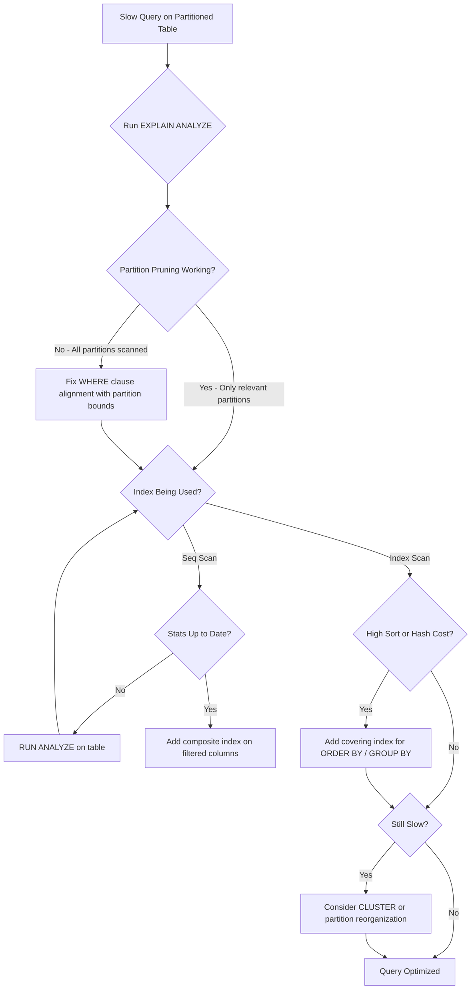

| Difficulty | Channel | Tags |
|---|---|---|
| intermediate | database | explain, query-plan, partitioning |

Your partitioned table has 100 million rows. You added partitions to fix performance. And yet, the query is still crawling. Sound familiar? You are not alone. CoinGecko, one of the world's largest crypto data aggregators, discovered this the hard way when their hourly prices table ballooned past 1TB — causing queries to take 30+ seconds and replica lag to spike during peak traffic [1]. The fix was not just "add partitions." It was a forensic investigation into what EXPLAIN was actually telling them, and a painful lesson about a query regression that nobody expected.

---

> ### Real-World Case — CoinGecko
>
> CoinGecko's hourly crypto prices table had grown past 1TB over 8+ years, causing queries to take 30+ seconds on average. IOPS usage spiked whenever price endpoints received traffic, replica lag increased, and their Apdex score dropped. They needed to solve this without downtime.
>
> | | |
> |---|---|
> | **Challenge** | A PostgreSQL RDS table with hundreds of millions of rows storing hourly price data became so large that queries were averaging 30+ seconds. Adding indexes on the JSONB columns was impractical (each index only helped one application). They needed a solution that would reduce IOPS and query latency while maintaining availability. |
> | **Solution** | They implemented monthly range partitioning by timestamp on the prices table. They created a new partitioned table, copied 1.2TB of data using Foreign Data Wrappers to avoid warming up the production table, then atomically swapped tables using triggers to sync changes during migration. Critically, they discovered that a query using `created_at > ?` with no upper bound was scanning ALL partitions (including empty future ones), which performed WORSE after partitioning. They fixed this by modifying the query to include an upper bound and removing pre-created empty future partitions. |
> | **Outcome** | p99 query latency dropped 86% (4.13s to 578ms), IOPS reduced by 20% (from maxing out at 24K), and replica lag disappeared entirely. The partitioned table achieved 6-8x performance improvement on the same queries. However, one query actually regressed because it lacked an upper date bound, scanning all partitions including empty future ones — a pitfall that required post-migration debugging. |
> | **Lesson** | Partition pruning only works if your query constraints actually bound the partition key in both directions. A query like `WHERE created_at > ?` without an upper bound will scan every partition, including empty future ones, making partitioned tables SLOWER than unpartitioned ones. Always verify partition pruning in your EXPLAIN plan after partitioning, and watch for queries that don't constrain both ends of the range. |

---

## Hook — The 30-Second Query That Refused to Cooperate

Picture this: your API is timing out. Users are refreshing the page. IOPS metrics are through the roof. You did everything "right" — you partitioned the table by date, you created indexes, you tuned the config. But the query planner is ignoring your partitions and doing a sequential scan across all of them anyway. This is the exact situation that database teams hit at scale. The query looks simple enough: filter by a date range, return some rows. But under the hood, the planner is making decisions that can either save you or bury you. And most developers never learn to read its language until something breaks.

## Problem — Partitioning Is Not a Silver Bullet

Here is the uncomfortable truth: partitioning is one of the most misunderstood PostgreSQL features. Teams implement it expecting automatic performance wins, only to find that a poorly constructed query can still scan every partition. The core issue is that partition pruning — the mechanism that lets PostgreSQL skip irrelevant partitions — only works when your WHERE clause aligns with the partition bounds [2]. If your query uses a non-deterministic function, a type mismatch, or lacks an upper date bound, pruning silently fails. Meanwhile, even when pruning works, index utilization becomes the next battleground. A single-column index on the partition key might not be enough if your query filters on additional columns. The planner could still choose a sequential scan within the relevant partition, especially if the planner's statistics are stale or the table is bloated from dead tuples. This cascading set of issues is exactly what makes slow partitioned queries so maddening — the root cause is rarely obvious.

## Real-World Case — CoinGecko's 1TB Wake-Up Call

CoinGecko, a major cryptocurrency data provider, faced this exact nightmare. Their hourly crypto prices table had accumulated over 1TB of data across 8+ years of historical records. The symptoms were brutal: average query times exceeded 30 seconds, IOPS usage spiked to 24K (the maximum on their instance), and their Apdex score tanked as p99 latency climbed. Replica lag kept growing, threatening data consistency across their cluster [1]. They decided to partition the table without downtime — a high-stakes migration on a production system serving real-time price data to millions of users. After implementing range partitioning and carefully optimizing their queries, the results were dramatic: p99 latency dropped 86% from 4.13 seconds to 578ms, IOPS decreased by 20%, and replica lag vanished entirely. The partitioned queries achieved a 6-8x performance improvement [1]. But here is the plot twist that catches everyone off guard — one query actually regressed. It lacked an upper date bound in its WHERE clause, so it scanned all partitions including empty future ones. This seemingly innocent omission turned a performance win into a debugging puzzle, proving that partitioning demands precision at every layer.

## Deep Dive — Reading the EXPLAIN Plan Like a Detective

When a query on a partitioned table is slow, EXPLAIN (ANALYZE, BUFFERS) is your first responder. But many developers glance at it and miss the critical signals. Here are the five things you need to systematically check [3]:

First, verify partition pruning is working. The EXPLAIN output should show only the relevant partitions being scanned. If you see an Append node touching every partition, pruning has failed — often because the WHERE clause uses a non-sargable expression or a type that does not match the partition key. PostgreSQL 14+ provides Subplans Removed in the output, which tells you exactly how many partitions were pruned [2].

Second, check index utilization. Within each partition, the planner should prefer an Index Scan over a Seq Scan when accessing a small fraction of rows. If you see Seq Scan on a partition with millions of rows but the query only needs a handful, your indexes are either missing, on the wrong columns, or the statistics are outdated [4].

Third, look for expensive sort and hash operations. Sort nodes with high cost estimates indicate missing indexes that could support ORDER BY. Hash Aggregates consuming significant memory suggest the planner chose to hash instead of index because no suitable covering index exists.

Fourth, evaluate composite index coverage. A single-column index on the partition key is a start, but queries filtering on multiple columns benefit enormously from composite indexes. The ideal index follows the pattern (partition_key, filtered_column_1, filtered_column_2) — this lets the planner satisfy both the partition filter and the additional predicates in a single index traversal [5].

Fifth, consider physical data ordering with CLUSTER. Even with perfect indexes, if the physical row order on disk does not match your access pattern, each index lookup requires random I/O. CLUSTER reorganizes the table to match the index order, which can dramatically reduce I/O for range queries — but it requires an exclusive lock and must be re-run after significant inserts [6].

## Workflow — The Step-by-Step Diagnostic Process

Here is a repeatable workflow for diagnosing slow queries on partitioned tables. The diagram below maps out the decision tree from initial symptom to resolution:



The key insight is that this is not a one-and-done process. Partition pruning can happen at planning time AND at execution time [2], which means some optimizations only become visible when you run the query with actual parameter values, not just in a static EXPLAIN. Always use EXPLAIN (ANALYZE, BUFFERS) with realistic data volumes to see the true picture.

## Code Example — From Slow to Fast in Four Steps

Let us walk through the optimization with a concrete example. Imagine you have a partitioned events table and a query that filters by date range and status. Here is the transformation:

```sql
-- Step 1: Identify the problem with EXPLAIN
-- The ANALYZE flag actually runs the query; BUFFERS shows I/O
EXPLAIN (ANALYZE, BUFFERS)
SELECT * FROM events
WHERE event_date BETWEEN '2024-01-01' AND '2024-01-31'
  AND status = 'completed';
-- Look for: Append nodes touching all partitions (pruning failure)
-- Look for: Seq Scan on large partitions (missing indexes)
-- Look for: Sort or Hash nodes with high actual time

-- Step 2: Ensure partition pruning works
-- The BETWEEN clause gives both lower AND upper bounds
-- This is critical: without the upper bound, ALL partitions scan
-- CoinGecko learned this lesson the hard way [1]

-- Step 3: Create a composite index for this query pattern
-- (partition_key, filtered_column) order matters!
-- The planner can use this index for both date AND status filtering
CREATE INDEX CONCURRENTLY idx_events_date_status
  ON events (event_date, status);
-- CONCURRENTLY avoids locking the table during index creation
-- This is essential for production systems with zero-downtime requirements

-- Step 4: Reorganize physical data for range query performance
-- CLUSTER reorders rows on disk to match the index
-- This eliminates random I/O for sequential range scans
CLUSTER events USING idx_events_date_status;
-- WARNING: CLUSTER requires an ACCESS EXCLUSIVE lock
-- Schedule during maintenance windows or use pg_repack for online clustering

-- Verify the improvement
EXPLAIN (ANALYZE, BUFFERS)
SELECT * FROM events
WHERE event_date BETWEEN '2024-01-01' AND '2024-01-31'
  AND status = 'completed';
-- You should now see: Index Scan using idx_events_date_status
-- Buffer hits should be dramatically lower
-- Partition pruning should show only 1 partition scanned
```

The code explanation: Step 1 establishes the baseline with actual runtime metrics. Step 2 confirms the query structure supports pruning — the BETWEEN provides both bounds, which is essential since range partition pruning depends on the planner being able to prove a partition contains no matching rows [2]. Step 3 creates the composite index using CONCURRENTLY to avoid production downtime [7]. The column order (event_date first) ensures the index serves double duty as both a partition-key index and a filtered-column index. Step 4 physically reorders the data, which reduces random I/O for range scans — but requires careful scheduling due to the lock it takes [6].

## Lessons Learned — What CoinGecko and Others Wish They Knew Earlier

The CoinGecko case teaches several hard-won lessons that apply to any team working with partitioned PostgreSQL tables [1]:

**Always bound your queries.** The regression they experienced — a query without an upper date bound scanning all partitions — is the single most common partitioning pitfall. Every query on a range-partitioned table needs both a lower AND upper bound on the partition key. This is not optional.

**Partition pruning is not automatic perfection.** The planner needs the right conditions to prune. Non-deterministic functions, type mismatches, and complex expressions in WHERE clauses can prevent pruning entirely. Keep partition constraints simple [2].

**Composite indexes beat single-column indexes.** A (date) index helps with partition access, but a (date, status) index eliminates the need for a secondary lookup. Map your most common query patterns to composite indexes early [5].

**Monitor after migration, not just before.** CoinGecko's regression was discovered post-migration. Always run your full query suite against the new partitioned structure and compare EXPLAIN plans before declaring victory.

**CLUSTER is powerful but expensive.** It requires exclusive locks and must be re-run after significant data changes. For online alternatives, consider pg_repack or CLUSTER during scheduled maintenance windows [6].

Here is the one insight to share with your team tomorrow: partitioning reduces the search space, but index design determines how fast you navigate what remains. The two work together — neither alone is sufficient.

---

## Partitioned Table Query Diagnostic Workflow


<details>
<summary><strong>Original Interview Question</strong></summary>

**Q:** You have a PostgreSQL table with 100M rows partitioned by date. A query filtering on a specific date range is still slow. What would you check in the EXPLAIN plan and how would you optimize it?

**A:** Check partition pruning effectiveness, index utilization patterns, and expensive sort operations. Create composite indexes on (date, filtered_columns) and evaluate clustering strategies for optimal data access.

</details>

## Conclusion

Partitioning your PostgreSQL table is not the finish line — it is the starting line. CoinGecko's journey from 30-second queries to sub-second responses required systematic EXPLAIN analysis, composite index design, and a painful lesson about query bounds [1]. The takeaway is clear: partition pruning eliminates irrelevant data, composite indexes navigate what remains, and CLUSTER optimizes physical access. Start by running EXPLAIN (ANALYZE, BUFFERS) on your slowest query tomorrow. Check whether pruning is actually happening. Verify that indexes are being used, not just created. And always — always — put upper bounds on your date range filters. Your future self, and your on-call rotation, will thank you.

---

## References

1. [CoinGecko: Scaling PostgreSQL Performance with Table Partitioning](https://dev.to/coingecko/scaling-postgresql-performance-with-table-partitioning-136o) — blog
2. [PostgreSQL Documentation: Table Partitioning](https://www.postgresql.org/docs/current/ddl-partitioning.html) — documentation
3. [PostgreSQL Documentation: Using EXPLAIN](https://www.postgresql.org/docs/current/using-explain.html) — documentation
4. [PostgreSQL Documentation: Indexes](https://www.postgresql.org/docs/current/indexes.html) — documentation
5. [PostgreSQL Documentation: Multicolumn Indexes](https://www.postgresql.org/docs/current/indexes-multicolumn.html) — documentation
6. [PostgreSQL Documentation: CLUSTER Command](https://www.postgresql.org/docs/current/sql-cluster.html) — documentation
7. [PostgreSQL Documentation: CREATE INDEX](https://www.postgresql.org/docs/current/sql-createindex.html) — documentation
8. [Wikipedia: Partition (Database)](https://en.wikipedia.org/wiki/Partition_(database)) — documentation

---

**Author:** Satishkumar Dhule — [GitHub](https://github.com/satishkumar-dhule) · [LinkedIn](https://linkedin.com/in/satishkumar-dhule) · [Website](https://satishkumar-dhule.github.io)
