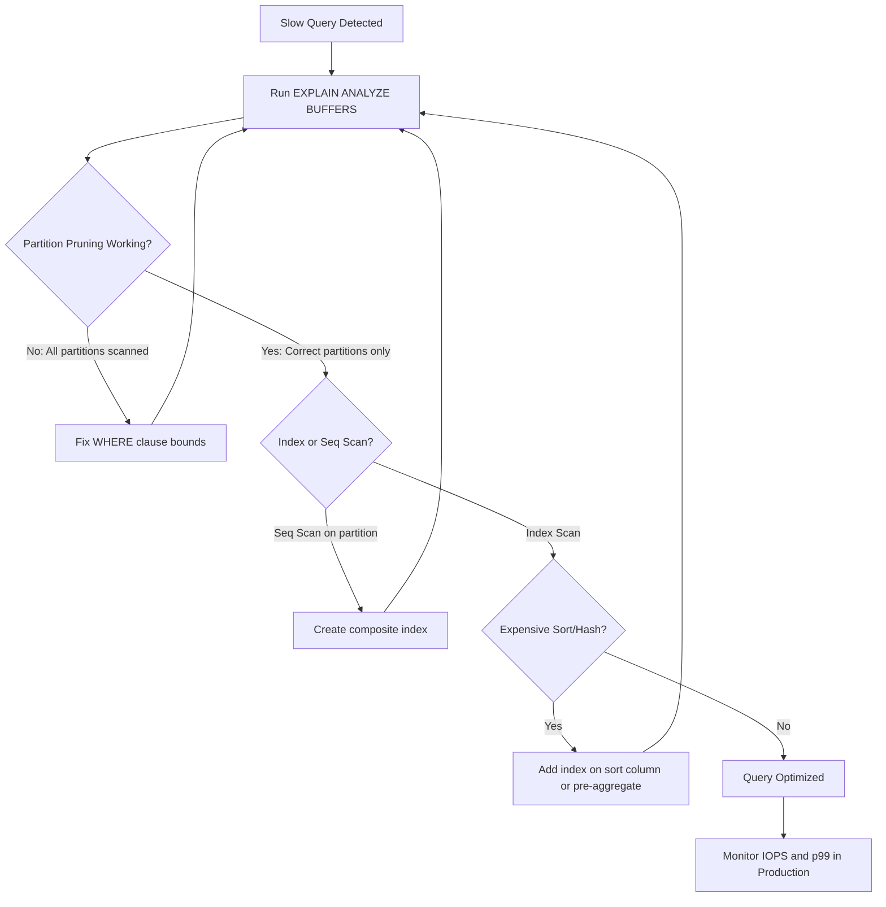

| Difficulty | Channel | Tags |
|---|---|---|
| intermediate | database | explain, query-plan, partitioning |

Picture this: it's a Tuesday morning, and your monitoring dashboard lights up red. CoinGecko's crypto price endpoint is timing out. Their hourly prices table, packed with over 8 years of data and exceeding 1TB, is now averaging 30-second queries. The p99 response time has ballooned to 4.13 seconds, IOPS limits are being breached daily, and the finance team is literally rerunning queries because they think the system is stuck [1]. What they discovered next — and the debugging playbook they followed — is exactly what you need to know the next time a 100M-row partitioned table refuses to cooperate.

---

> ### Real-World Case — CoinGecko
>
> CoinGecko's hourly crypto prices table had grown to 1TB+ after 8 years of data, with queries taking over 30 seconds on average. Their p99 response time hit 4.13 seconds, IOPS were being breached daily, and the finance team ran queries multiple times because they thought the system was stuck.
>
> | | |
> |---|---|
> | **Challenge** | A massive PostgreSQL table storing hourly price data across 8+ years had become unbearably slow. Queries filtering on date ranges were scanning the entire 1TB+ table. Adding indexes was considered but rejected because the JSONB column with currency-specific keys meant each index would only benefit a single application. IOPS usage spiked during request surges, causing replica lag and degraded Apdex scores. |
> | **Solution** | They implemented range partitioning by month, ensuring queries only access up to 4 partitions at a time. They created the new partitioned table alongside the original, used Foreign Data Wrappers to copy 1.2TB of data from a pre-warmed staging instance (avoiding production IOPS impact), and performed a careful cutover. Critically, they discovered that a query lacking an upper date limit (using 'created_at > ?' without an upper bound) scanned ALL partitions post-migration — worse than the unpartitioned table — and fixed it by adding the upper bound. |
> | **Outcome** | 86% reduction in p99 response time (from 4.13s to 578ms), 20% IOPS reduction across the cluster, 6-8x performance improvement on the same queries after switching to partitioned tables. Prewarming the new table took only 3 hours vs 10 hours for the original. The savings multiplied across multiple replicas. |
> | **Lesson** | Partition pruning only works when the query includes the partition key with proper bounds. A query like 'created_at > ?' without an upper limit will scan every single partition — making partitioning actively WORSE than a monolithic table. Always verify with EXPLAIN ANALYZE that your queries actually prune partitions, and check for queries that lack complete date range constraints. |

---

## Hook — When Your "Fix" Makes Things Worse

You did everything right. You partitioned your massive PostgreSQL table by date, added the right indexes, and your initial benchmarks looked great. But three months later, a query filtering on a specific date range is crawling — not faster than before, but sometimes even slower. The EXPLAIN plan shows a sequential scan across every partition, and you're staring at numbers that don't make sense. Sound familiar? Here is the thing though: partitioning is not a silver bullet. Without understanding what your EXPLAIN plan is actually telling you, you can make a well-partitioned table perform worse than an unpartitioned one. And the plot twist? Many developers create this problem themselves with a single missing clause in their WHERE statement.

## Problem — The Partition Trap You Didn't See Coming

When you partition a table by date, PostgreSQL splits the data into smaller physical chunks — each partition holds a range of dates [2]. On paper, this means queries with date filters should only touch the relevant partitions (a concept called partition pruning [2]). But in practice, several things can go wrong simultaneously. First, if your WHERE clause is missing an upper bound — say you write `WHERE event_date > '2024-01-01'` instead of `WHERE event_date BETWEEN '2024-01-01' AND '2024-01-31'` — the planner scans every partition from January onward, including empty future partitions [1]. Second, without a composite index covering both the partition key and your filter columns, PostgreSQL may fall back to sequential scans on each partition, which adds up to a full table scan across all partitions. Third, expensive sorts and hash aggregates in the plan can dwarf the benefits of partitioning entirely. The real danger? You might never notice these issues in staging with a 10M-row test dataset. They only surface when production data hits the thresholds where query planning time, cache miss rates, and IOPS saturation start compounding [3].

## Real-World Case — CoinGecko's 1TB Wake-Up Call

CoinGecko's engineering team faced exactly this scenario. Their hourly crypto prices table had grown past 1TB after 8 years of accumulated data. Queries were averaging over 30 seconds, p99 response times hit 4.13 seconds, and their IOPS were being breached daily [1]. The team initially considered adding indexes, but quickly abandoned that idea — the table used a JSONB column with keys varying by currency, and creating an index for every possible key was impractical. Each index would only benefit a single application. Instead, they chose table partitioning by month, knowing almost every query included a timestamp range in the WHERE clause [1]. The execution was brutal. A dry run revealed that warming up the unpartitioned table took 10 hours, while the partitioned version took just 3 hours. Copying 1.2TB of data spiked IOPS to 6,000 — equivalent to their entire production load [1]. They had to provision a separate production-grade database, prewarm it, set up a Foreign Data Wrapper to read from the warm database and write to production, and then carefully flip the switch using a table rename with a trigger-based fallback [1]. The results: 86% reduction in p99 response time (4.13s to 578ms), 20% IOPS reduction across the cluster, and 6-8x performance improvement on the same queries [1]. But the real lesson? They hit a regression because one query lacked a lower date bound, causing it to scan all partitions. Same query, unpartitioned table — fast. Same query, partitioned table — slower than before partitioning [1].

## Deep Dive — Reading Your EXPLAIN Plan Like a Senior Engineer

When you run `EXPLAIN (ANALYZE, BUFFERS)`, you get a tree of operations. Here is what to focus on in a partitioned table scenario, and what each node tells you about your performance problem.

**Partition Pruning Check.** Look for the Append node. If pruning is working, you should see only the relevant partition children — not all of them. For a query filtering on January 2024, you should see only the January partition listed. If every partition shows up, pruning has failed. Common causes include non-immutable expressions in your WHERE clause, missing an upper bound on the date range, or `enable_partition_pruning` being set to off [2].

**Index vs Sequential Scan.** Each partition child should ideally show an Index Scan or Index Only Scan. If you see Seq Scan, it means either the index isn't present on that partition, the planner decided it would be cheaper to scan (usually when selecting a large percentage of the partition's rows), or the composite index doesn't cover your filter columns [4].

**Sort and Hash Operations.** Look for Sort or HashAggregate nodes. If these appear above the partition scan and show high cost estimates, they are likely dominating your query time. A sort on a column that isn't indexed is a classic trap — partitioning helps you read less data, but it doesn't help you sort what you read [3].

**Buffers Row.** The `Buffers` line in EXPLAIN ANALYZE shows shared hit (cache) vs shared read (disk). If you see mostly `read` instead of `hit`, your working set is not fitting in memory, which is often a cache cold-start problem — exactly the issue CoinGecko faced during their migration [1].

## Workflow — From Slow Query to Optimized Partition

Here is the step-by-step workflow you should follow when a partitioned table query is slow.

1. **Capture the EXPLAIN plan.** Run `EXPLAIN (ANALYZE, BUFFERS, FORMAT TEXT)` to get both estimated and actual execution times plus buffer statistics [4].

2. **Verify partition pruning.** Count the number of partition children in the Append node. If all partitions appear, your WHERE clause is not pruning effectively — add the missing bounds or check for non-sargable expressions [2].

3. **Check index usage.** Look at each partition child. Are they using Index Scan or Seq Scan? If Seq Scan, check if a composite index exists that covers your partition key plus filter columns.

4. **Evaluate sort and aggregation cost.** If Sort or HashAggregate nodes have high cost, add an index on the sorted/aggregated column or consider materializing a CTE to pre-aggregate [3].

5. **Create composite indexes.** Build indexes that cover your most common WHERE clauses in order: partition key first, then filter columns. Use `CREATE INDEX CONCURRENTLY` to avoid locking production tables.

6. **Consider clustering.** For frequently accessed date ranges, `CLUSTER` the physical row order to match your index. This improves cache locality for range scans.

7. **Monitor and iterate.** After making changes, re-run EXPLAIN ANALYZE to verify the plan improved. Track IOPS and p99 latency over a production week to confirm real-world gains.

Here is the visual workflow:

## Code Example — The Full Optimization Playbook in SQL

Here is a practical SQL script that walks through the complete optimization process, from diagnosing the issue to creating the right indexes and verifying the fix.

## Lessons Learned — What to Do Differently Tomorrow

The CoinGecko story and the debugging playbook above distill into several hard-won lessons.

**Always add explicit date bounds to your queries.** This is the single most impactful change you can make. A missing upper bound turns partition pruning into a full table scan [1][2]. Make it a code review rule: every query against a partitioned table must have both lower and upper bounds on the partition key.

**Composite indexes should match your query patterns.** A single-column index on the date column is not enough if you're also filtering on status, type, or other columns. Build composite indexes ordered as: partition key → most selective filter → next filter. This is how you convert Seq Scans into Index Scans [5].

**Run EXPLAIN ANALYZE in staging with production-sized data.** A 10M-row test dataset will never reveal partition pruning failures or IOPS saturation. As CoinGecko discovered, even their dry run on an identical production database revealed surprises they didn't expect [1].

**Warm your cache before benchmarking.** PostgreSQL's shared buffers cache is empty after creating a new partitioned table. A cold cache produces misleadingly slow results. Use `pg_prewarm` to load hot data into memory before running performance tests [1][6].

**Block deployments during major migrations.** CoinGecko's biggest regret was not freezing deployments on migration day. A concurrent deployment introduced regressions that were mistaken for partitioning failures, causing unnecessary rollback discussions [1].

**Don't create too many partitions.** More partitions means more planning overhead and more metadata in memory. PostgreSQL handles a few thousand partitions well, but tens of thousands can degrade planning time [2][7]. Choose monthly or weekly granularity based on your data volume and query patterns.

**Monitor replica lag during and after partitioning.** CoinGecko saw their replica lag disappear after switching to partitioned tables, but only because they prewarmed the replicas too [1]. If you forget the replicas, you'll face cold-cache performance on read traffic.

The bottom line? Partitioning amplifies good query patterns and punishes bad ones. If your queries are well-bounded with composite indexes, partitioning delivers the 6-8x improvement CoinGecko saw [1]. If your queries have missing bounds or lack composite indexes, partitioning can make things worse. The EXPLAIN plan is your compass — learn to read it, and you'll never be guessing again.

---

## Partitioned Table Query Optimization Workflow

<strong>Original Interview Question</strong>

**Q:** You have a PostgreSQL table with 100M rows partitioned by date. A query filtering on a specific date range is still slow. What would you check in the EXPLAIN plan and how would you optimize it?

**A:** Check partition pruning effectiveness, index utilization patterns, and expensive sort operations. Create composite indexes on (date, filtered_columns) and evaluate clustering strategies for optimal data access.

## Conclusion

The next time a query on your partitioned table is slow, resist the urge to throw more indexes at it blindly. Open the EXPLAIN plan first. Check if partition pruning is actually happening. Verify the index you think exists is the one being used. And for the love of your p99 metrics, make sure every date-filtered query has both a lower AND upper bound. CoinGecko turned a 4.13-second p99 into 578 milliseconds — not by adding more hardware, but by understanding what their database was actually doing [1]. Your database is trying to tell you something. Learn to read the plan, and the plan will lead you to the fix.

---

## References

1. [CoinGecko: Scaling PostgreSQL Performance with Table Partitioning](https://amree.dev/2025/06/13/scaling-postgresql-performance-with-table-partitioning/) — blog
2. [PostgreSQL Documentation: Table Partitioning](https://www.postgresql.org/docs/current/ddl-partitioning.html) — documentation
3. [PostgreSQL EXPLAIN Documentation](https://www.postgresql.org/docs/current/using-explain.html) — documentation
4. [PostgreSQL: EXPLAIN ANALYZE and Buffer Statistics](https://www.postgresql.org/docs/current/execution-timing.html) — documentation
5. [PostgreSQL: Indexes and ORDER BY Optimization](https://www.postgresql.org/docs/current/indexes-order.html) — documentation
6. [pg_prewarm: Loading Data into PostgreSQL Buffer Cache](https://www.postgresql.org/docs/current/pgprewarm.html) — documentation
7. [PostgreSQL: Partition Pruning Configuration](https://www.postgresql.org/docs/current/runtime-config-query.html#GUC-ENABLE-PARTITION-PRUNING) — documentation
8. [PostgreSQL: CREATE INDEX Documentation](https://www.postgresql.org/docs/current/sql-createindex.html) — documentation

---

**Author:** Satishkumar Dhule — [GitHub](https://github.com/satishkumar-dhule) · [LinkedIn](https://linkedin.com/in/satishkumar-dhule) · [Website](https://satishkumar-dhule.github.io)
