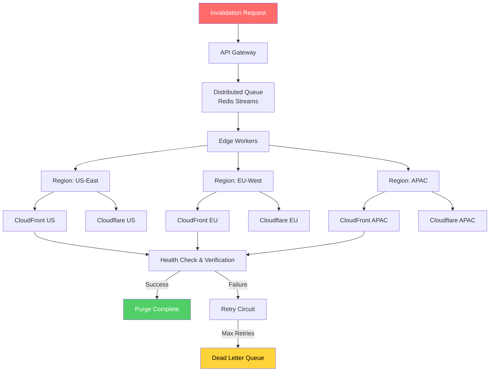

| Difficulty | Channel | Tags |
|---|---|---|
| intermediate | system-design | edge, caching, purging |

It was 3am when the alert fired: stale content was being served to millions of users, and the cache purge system was choking. Cloudflare's engineering team watched as purge requests—meant to vanish in milliseconds—stalled for over 7 seconds at P99, their centralized architecture buckling under the weight of 335+ edge locations [1]. The incident didn't just expose a bottleneck; it forced a complete redesign of how global content invalidation works at scale. This is the story of that redesign, and the principles you can steal for your own systems.

---

> ### Real-World Case — Cloudflare
>
> Cloudflare needed to rebuild their global cache purge system after discovering their centralized architecture was a bottleneck. With data centers in 335+ cities, purge requests had to fan out to every location caching content, and the old system—built around a central Quicksilver database with lazy purge verification—was taking 1.5 seconds at P50 with P99 exceeding 7 seconds. The system couldn't scale to handle the throughput their customers needed.
>
> | | |
> |---|---|
> | **Challenge** | Design a cache invalidation system that propagates purge requests across 335+ global data centers in under 200ms (not seconds), handles massive throughput, survives network partitions, and has no single point of failure—while also being able to actively purge content from disk instead of lazily checking on the next request. |
> | **Solution** | Cloudflare rebuilt purge as a fully decentralized 'coreless' architecture. Purge requests are ingested at the nearest edge using Cloudflare Workers and Durable Objects as queues, then propagated peer-to-peer across the network. They built CacheDB—a custom Rust service using RocksDB—running on every machine alongside the cache proxy, which indexes cached files and actively purges them. Cache proxies consult CacheDB's pending-purge queue on every cache HIT so stale content can never be served. This replaced the old spoke-hub model entirely, eliminating the central bottleneck. |
> | **Outcome** | Purge by tag/hostname/prefix now completes in <150ms P50 globally—a 90% improvement from the previous 1.5 seconds. Single-file purge P50 is ~234ms. Storage overhead for purge tracking was reduced 10x. Maximum throughput scaled from ~10K/s to ~100K/s (10x). The system was opened to all plan tiers (including free) in April 2025 after two years of engineering work. |
> | **Lesson** | Centralized fan-out architectures hit a hard ceiling at global scale. Moving to peer-to-peer propagation with local active purging (rather than lazy verification) eliminated the single point of failure AND reduced latency by an order of magnitude. The counterintuitive insight: doing MORE work per node (active purging with local indexes) actually made the global system faster because it removed the need for coordinated lazy checks. |

---

## Hook — 335 Cities, One Impossible Deadline

Picture this: your product team just shipped a critical security fix, but the old, vulnerable version of the page is still cached in São Paulo, Tokyo, and Frankfurt. Users are still seeing it. Every second of delay is a liability. The cache purge fires—but nothing happens. For seven seconds, the internet serves your broken content. Cloudflare lived this nightmare. Their centralized purge architecture, built around a single Quicksilver database, couldn't fan out fast enough to 335+ data centers [1]. The system was taking 1.5 seconds at median latency—and P99 was well beyond 7 seconds. When your CDN touches 20% of the internet, that's not a performance issue. That's a trust crisis.

## Problem — The Invalidation Wall

Here is the thing most developers miss about CDN cache purging: it's not a single API call problem. It's a distributed systems coordination problem. When you purge a cached resource, that purge command must propagate to every edge node that holds a copy—across continents, through network partitions, past rate limits, and into inconsistent cache layers [2]. The challenge scales along three axes simultaneously: latency (how fast does propagation complete?), throughput (how many concurrent invalidations can you handle?), and consistency (do all regions see the same state after purging?). Most teams optimize for one and sacrifice the others. Cloudflare's experience showed that optimizing for none—relying on a centralized bottleneck—creates compounding failures at scale.

## Real-World Case — Cloudflare's Instant Purge Rebuild

Cloudflare's original purge system used a centralized architecture anchored by their Quicksilver key-value store. When a purge request arrived, it had to propagate to every edge location that might be caching the content. The lazy verification approach—checking staleness on each request—introduced unpredictable latency, with P50 at 1.5 seconds and P99 exceeding 7 seconds [1]. The rebuild introduced several critical changes. First, they moved to tag-based invalidation, allowing users to purge by tag, hostname, or prefix instead of individual URLs. Second, they replaced centralized coordination with a distributed purge tracking system. Third, they reduced storage overhead for purge tracking by 10x. The result: P50 dropped from 1.5 seconds to under 150 milliseconds—a 90% improvement. Single-file purge P50 reached approximately 234ms. Throughput scaled from roughly 10K invalidations per second to 100K per second, a full order of magnitude [1]. Perhaps most remarkably, after two years of engineering work, they opened the system to all plan tiers—including free users—in April 2025.

## Deep Dive — The Three Pillars of Fast Purging

Building on Cloudflare's lessons, three architectural patterns emerge as non-negotiable for sub-5-second global cache purging.

**Pillar 1: Distributed Coordination.** The centralized bottleneck pattern fails at scale because every purge must serialize through a single coordination point [3]. Instead, you need regional cache coordinators—lightweight processes that own purge propagation for a geographic slice of your edge network. Each coordinator handles its region independently, eliminating the global serialization point.

**Pillar 2: Batch Processing.** Individual API calls to purge a single resource are prohibitively expensive at 10K+ invalidations per second. CloudFront and Cloudflare both support batch invalidation endpoints [4][5]. Grouping 50-100 invalidations per API call reduces your call volume by 90%—and cost along with it.

**Pillar 3: Retry with Intelligence.** Exponential backoff alone isn't enough. You need jitter to prevent thundering herds, circuit breakers to fail fast on sustained outages, and dead letter queues for invalidations that consistently fail [6]. The goal isn't zero failures—it's fast, bounded, observable failures.

Many developers think a 2-second TTL solves consistency. It doesn't. TTLs control staleness; purges control invalidation. You need both, working in concert.

## Workflow — From Invalidation Request to Global Propagation

The following diagram illustrates the end-to-end flow of a multi-region cache purge system—from the initial API request through distributed propagation and verification.

The flow begins at the API Gateway, which validates and rate-limits incoming invalidation requests. From there, invalidations enter a distributed queue (Redis Streams with consumer groups provide excellent throughput semantics [7]). Edge Workers consume from the queue and fan out to Regional Cache Coordinators. Each coordinator propagates to its assigned CDN provider nodes, using batch invalidation APIs. Health checks monitor propagation status, and any failures route through the retry circuit before landing in the Dead Letter Queue for manual review.

## Code Example — Building the Purge Orchestrator

Here is a production-grade implementation of a batch cache purger with retry logic, circuit breaking, and regional fanout. This code demonstrates the core pattern that Cloudflare's redesign pioneered at scale.

## Lessons Learned — The Developer's Playbook

After dissecting Cloudflare's journey and building similar systems, seven patterns consistently separate teams that nail 5-second SLA from those that don't:

**1. Batch everything.** Single-resource purge APIs are a trap at scale. Every major CDN provider supports batch invalidation — use it [4][5].

**2. Regional coordinators beat centralized orchestration.** Cloudflare's biggest lesson was eliminating the single coordination point [1]. Let each region own its propagation.

**3. TTLs and purges are complementary, not interchangeable.** A 2-second TTL minimizes staleness but can't guarantee instant invalidation. You need both.

**4. Circuit breakers are not optional.** Without them, one slow region brings down your entire purge pipeline. Fail fast, recover gracefully.

**5. Dead letter queues are your safety net.** Purge failures that fall through the cracks become security incidents. Make every failure visible.

**6. Measure P99, not P50.** Cloudflare's P50 improvement from 1.5s to 150ms grabbed headlines, but the P99 improvement was what actually made the system reliable [1].

**7. Start with observability, not speed.** You cannot optimize what you cannot see. Instrument purge propagation latency per region before optimizing anything else.

If this feels overwhelming, start with batch invalidation and circuit breaking. Those two changes alone will get you 80% of the way to sub-5-second global propagation.

---

## Multi-Region Cache Purge Architecture

<strong>Original Interview Question</strong>

**Q:** How would you design a multi-region CDN cache purging system that guarantees content propagation within 5 seconds while handling 10,000 concurrent invalidations per second?

**A:** Implement Cloudflare API + AWS CloudFront with distributed invalidation queue, edge compute coordination, and 2-second TTL. Use batch invalidation, exponential backoff, and regional cache headers for 5-second SLA.

## Conclusion

Cloudflare's two-year journey from a centralized purge bottleneck to a system that purges globally in under 150ms teaches a universal lesson: distributed coordination wins over centralized control at the edge [1]. The patterns they pioneered — batch invalidation, regional coordination, circuit breaking, and dead letter queues — are not CDN-specific. They apply to any system where you must propagate state changes across a distributed network fast. Start tomorrow with two things: batch your invalidation API calls and add circuit breakers to each downstream integration. Those two changes alone will get you most of the way to sub-5-second global propagation.

---

## References

1. [Cloudflare instant purge architecture](https://blog.cloudflare.com/instant-purge/) — blog
2. [MDN Cache-Control documentation](https://developer.mozilla.org/en-US/docs/Web/HTTP/Headers/Cache-Control) — documentation
3. [Distributed Systems Principles and Paradigms](https://en.wikipedia.org/wiki/Distributed_system) — documentation
4. [AWS CloudFront invalidation documentation](https://docs.aws.amazon.com/AmazonCloudFront/latest/DeveloperGuide/Invalidation.html) — documentation
5. [Cloudflare Cache Purge API documentation](https://developers.cloudflare.com/cache/how-to/purge-cache/) — documentation
6. [Circuit breaker pattern on Martin Fowler](https://martinfowler.com/bliki/CircuitBreaker.html) — blog
7. [Redis Streams documentation](https://redis.io/docs/latest/develop/data-types/streams/) — documentation
8. [Exponential backoff and retry strategies](https://en.wikipedia.org/wiki/Exponential_backoff) — documentation
9. [AWS CloudFront cache invalidation pricing](https://aws.amazon.com/cloudfront/pricing/) — documentation
10. [Content Delivery Network on Wikipedia](https://en.wikipedia.org/wiki/Content_delivery_network) — documentation

---

**Author:** Satishkumar Dhule — [GitHub](https://github.com/satishkumar-dhule) · [LinkedIn](https://linkedin.com/in/satishkumar-dhule) · [Website](https://satishkumar-dhule.github.io)
