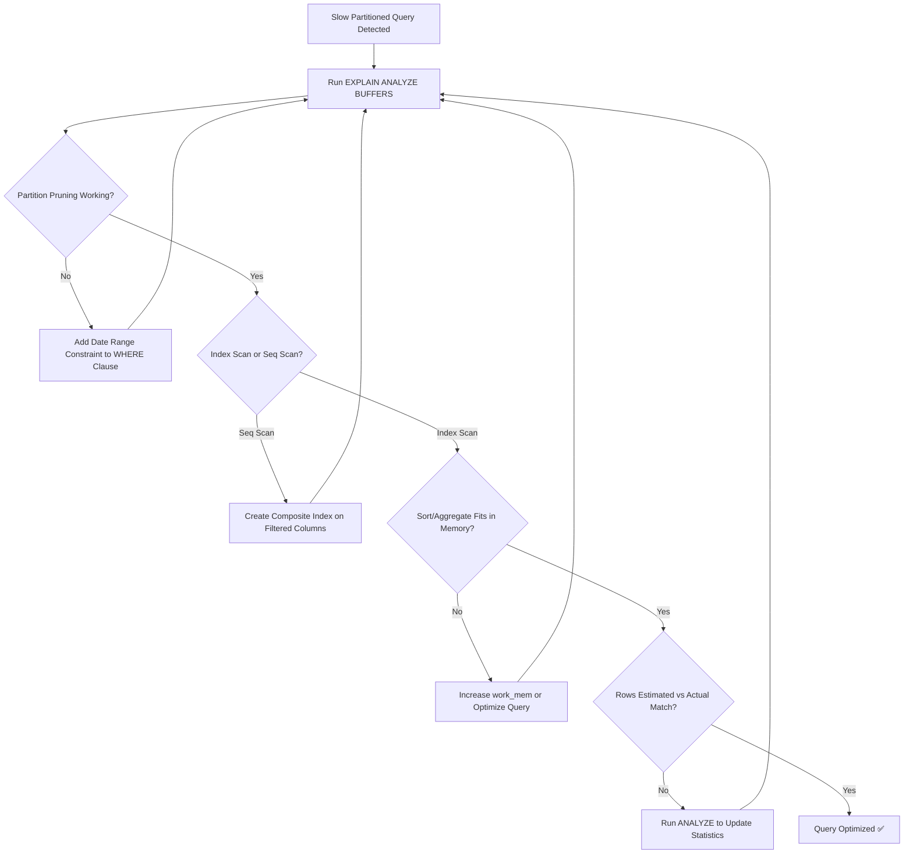

| Difficulty | Channel | Tags |
|---|---|---|
| intermediate | database | explain, query-plan, partitioning |

It was a normal Tuesday until CoinGecko's monitoring dashboard lit up like a Christmas tree. Their PostgreSQL 'prices' table — storing hourly crypto price data — had ballooned past 1TB after 8+ years. Queries were crawling at 30+ seconds, IOPS were pegged at 24K, and the Apdex score was plummeting as request queues piled up [1]. The team had partitioned the table expecting relief, but one stubborn query was actually getting slower. What went wrong?

---

> ### Real-World Case — CoinGecko
>
> CoinGecko's PostgreSQL 'prices' table storing hourly crypto price data had grown to over 1TB after 8+ years. Queries on this table were taking 30+ seconds on average, IOPS were maxed out at 24K causing daily alerts, and their Apdex score was dropping as request queues built up.
>
> | | |
> |---|---|
> | **Challenge** | A 1TB+ table with a JSONB column made traditional indexing impractical — each index would only benefit a single application. Queries filtering by timestamp ranges were scanning the entire table. The team needed to dramatically reduce query latency and IOPS without rebuilding their application layer. |
> | **Solution** | Implemented range partitioning by month on the timestamp column, so queries with a WHERE clause on the date range would only scan relevant partitions (typically 1-4 months of data instead of 8 years). They also developed a Go-based data migration tool using Foreign Data Wrappers to copy data without warming up the production database, avoiding IOPS spikes during the migration. |
> | **Outcome** | p99 response time dropped from 4.13s to 578ms (86% reduction). IOPS reduced by 20%. However, one query actually got WORSE after partitioning — it lacked a lower date limit and scanned all partitions, performing worse than the original unpartitioned table. Fixing that query's date range resolved the issue. |
> | **Lesson** | Partition pruning only works when your queries include the partition key with proper bounds. A query without an upper or lower date limit can scan every partition, making partitioning detrimental compared to a single unpartitioned table with a good index. Always audit ALL query patterns before and after partitioning. |

---

## Hook — When Partitioning Backfires

Here is the thing about table partitioning: it is celebrated as the silver bullet for large-table performance. You split one massive table into smaller, date-based chunks, and suddenly queries zip through only the partitions they need — a technique called partition pruning [2]. But what if a query doesn't have a lower date limit? What if it scans every single partition? Suddenly, partitioning isn't your savior — it's your bottleneck. Many developers discover this the hard way, staring at a query plan that now touches 40 partitions instead of one table. The irony? The 'optimization' made things worse.

## Problem — The Silent Killer Inside Your EXPLAIN Plan

You have a PostgreSQL table with 100M rows partitioned by date. You add a filter on a specific date range, expecting a fast, targeted scan. Instead, the query grinds to a halt. Sound familiar? The root causes are almost always hiding in plain sight inside your EXPLAIN plan. Specifically, there are five culprits that trip up even experienced engineers:

- **Partition pruning isn't working.** The planner is scanning all partitions instead of skipping irrelevant ones [3].
- **Sequential scans replacing index scans.** Your fancy index exists, but the planner decided a seq scan was 'cheaper' [4].
- **Expensive sorts and hash aggregates.** Sorting 100M rows in memory is no joke — and your work_mem might be begging for mercy [5].
- **Missing composite indexes.** A single-column index on `event_date` is good, but `WHERE event_date = X AND status = 'completed'` needs both columns indexed together [6].
- **Suboptimal partition key.** If your query patterns don't align with how you partitioned, pruning is useless.

The real danger? Each of these issues can exist silently, stealing seconds from every query without throwing an error. You don't get a warning — you get a slow API response and an angry Slack thread.

## Real-World Case — CoinGecko's 1TB Partitioning Wake-Up Call

CoinGecko faced exactly this scenario. Their PostgreSQL `prices` table had accumulated 8+ years of hourly cryptocurrency price data, growing past 1TB [1]. IOPS were maxed at 24K, triggering daily alerts. P99 response times were sitting at 4.13 seconds — an eternity for a real-time price API.

The team implemented table partitioning by date, which is the textbook approach for time-series data [2]. The results were dramatic: p99 dropped from 4.13s to 578ms — an 86% reduction. IOPS fell by 20%. But here is the plot twist that makes this story worth reading: one query actually got *worse* after partitioning [1].

Why? It lacked a lower date limit and scanned every partition, performing worse than the original unpartitioned table. The fix was simple — adding a date range constraint — but the lesson was profound. Partitioning is not magic. It only works when queries cooperate with the partition strategy. This is the kind of battle scar that separates a good DBA from a great one.

## Deep Dive — Decoding the EXPLAIN Plan Like a Detective

When a partitioned query is slow, your EXPLAIN plan is the crime scene. Here is how to read it like a detective, not a bystander.

**Step 1: Check partition pruning.** Look for `Append` nodes with only relevant partitions listed. If you see every partition being scanned, pruning failed — often because the query's WHERE clause doesn't directly reference the partition key, or the data types don't match exactly [3].

**Step 2: Identify scan types.** `Index Scan` is your friend. `Seq Scan` on a partition is sometimes fine (small partition), but `Seq Scan` on a large partition means your index isn't being used. Check if `EXPLAIN (ANALYZE, BUFFERS)` reveals high `shared read` counts — that's disk I/O screaming for help [4].

**Step 3: Spot expensive operations.** Look for `Sort` nodes with high `sort method: external merge Disk` — your work_mem is too small, and PostgreSQL is spilling to disk [5]. Hash aggregates with large memory estimates are another red flag.

**Step 4: Evaluate join strategies.** If your query joins across tables, check whether hash joins or nested loops are being used appropriately. On partitioned tables, join order matters more because you're potentially multiplying the number of partitions involved.

**Step 5: Check actual vs. estimated rows.** Large discrepancies between `rows=1` and `actual rows=50000` mean your statistics are stale. Run `ANALYZE` on the table to give the planner fresh information.

This process follows PostgreSQL's query execution flow: the planner first prunes partitions, then selects scan methods, then chooses join strategies, and finally applies sorts and aggregations [2]. Each stage is a potential failure point — and EXPLAIN ANALYZE reveals all of them.

## Workflow — Your Partitioned Query Optimization Playbook

After debugging enough of these, a pattern emerges. Here is the step-by-step workflow that consistently works:

**Phase 1: Diagnose** — Run `EXPLAIN (ANALYZE, BUFFERS, FORMAT TEXT)` on the slow query. Capture actual execution time, buffer hits vs. reads, and rows processed at each node [4].

**Phase 2: Identify the bottleneck** — Is it pruning failure? Seq scan on a large partition? Disk-spilling sort? Each has a different fix.

**Phase 3: Target the index** — Create composite indexes that cover your WHERE clause. The order of columns matters: put the most selective column first, or follow the partition key for consistency [6].

**Phase 4: Validate the fix** — Re-run EXPLAIN ANALYZE and confirm that partition pruning works, index scans replace seq scans, and sort operations fit in memory.

**Phase 5: Monitor for drift** — Partition statistics decay over time. Schedule regular `ANALYZE` runs, especially after bulk inserts [7].

The following diagram maps this workflow visually:

## Code Example — From Slow Query to Optimized Beast

Here is the exact diagnostic and optimization workflow applied to a real scenario:

```sql
-- Step 1: Diagnose — Run EXPLAIN ANALYZE with buffer stats
-- This shows actual execution time, disk I/O, and row counts
EXPLAIN (ANALYZE, BUFFERS, FORMAT TEXT)
SELECT * FROM events
WHERE event_date BETWEEN '2024-01-01' AND '2024-01-31'
AND status = 'completed';

-- Step 2: Check if partition pruning is working
-- You should see only the January 2024 partition, NOT all partitions
-- If you see 'Append' with 80 partitions, pruning failed

-- Step 3: Create composite index covering the WHERE clause
-- CONCURRENTLY avoids locking the table during index creation
CREATE INDEX CONCURRENTLY idx_events_date_status
ON events (event_date, status);

-- Step 4: Verify index usage — planner should now choose Index Scan
EXPLAIN (ANALYZE, BUFFERS)
SELECT * FROM events
WHERE event_date BETWEEN '2024-01-01' AND '2024-01-31'
AND status = 'completed';

-- Step 5: Consider clustering for physical data ordering
-- This reorders rows on disk to match the index
-- Best done during maintenance windows — it acquires an ACCESS EXCLUSIVE lock
CLUSTER events USING idx_events_date_status;

-- Step 6: Monitor partition statistics after bulk operations
ANALYZE events;

-- Bonus: Use pg_stat_user_indexes to check index usage over time
SELECT
  schemaname, tablename, indexname,
  idx_scan AS times_used,
  idx_tup_read AS rows_read,
  pg_size_pretty(pg_relation_size(indexrelid)) AS index_size
FROM pg_stat_user_indexes
WHERE tablename = 'events'
ORDER BY idx_scan DESC;
```

**What each step does:**
- **Step 1** gives you the full picture: actual execution time, buffer activity (shared hit vs. read tells you memory vs. disk), and row counts at every plan node [4].
- **Step 2** is your partition pruning sanity check. The output should list only the partitions matching your date range [3].
- **Step 3** creates a composite index that covers both columns in your WHERE clause. The `CONCURRENTLY` keyword prevents table locks during creation — critical for production tables [6].
- **Step 4** confirms the planner now uses the index instead of sequential scans.
- **Step 5** physically reorders data on disk to match the index, eliminating random I/O [7]. Only do this during low-traffic windows.
- **Step 6** keeps statistics fresh so the planner makes good decisions going forward.

## Lessons Learned — The Partitioning Playbook You Actually Need

After walking through CoinGecko's journey and the diagnostic workflow, here are the hard-won takeaways:

**1. Partitioning is a strategy, not a fix.** It only helps when queries align with the partition key. A query without date bounds on a date-partitioned table will scan everything — and be slower than the original [1].

**2. EXPLAIN ANALYZE is non-negotiable.** Every performance investigation starts here. The `BUFFERS` option reveals whether you're hitting memory or disk — a distinction that can mean 100x difference in latency [4].

**3. Composite indexes beat single-column indexes.** A composite index on `(date, status)` covers more query patterns than separate indexes on each column. Index column order matters — it should match your most common WHERE clause pattern [6].

**4. Stale statistics lie to the planner.** After bulk loads or significant data changes, run `ANALYZE`. Without it, the planner guesses — and guesses wrong [7].

**5. Clustering is powerful but costly.** `CLUSTER` rewrites the entire table and locks it. Consider `pg_repack` for online clustering without downtime [8].

**6. Monitor query patterns, not just table size.** CoinGecko's partitioning helped most queries, but the one without a date limit became a regression. Track slow queries continuously, not just during incidents.

The biggest lesson? PostgreSQL gives you all the tools to diagnose and fix partitioned query performance. The hard part isn't the tools — it's knowing which lever to pull first. Start with EXPLAIN ANALYZE, verify pruning, check your indexes, and the rest follows.

**Tomorrow, do this:** Open your slowest query's EXPLAIN plan. Check three things: (1) Is partition pruning working? (2) Are indexes being used? (3) Are sorts hitting disk? Fix whichever one is broken, and you'll likely see a 2-10x improvement immediately.

---

## Partitioned Query Optimization Workflow



<details>
<summary><strong>Original Interview Question</strong></summary>

**Q:** You have a PostgreSQL table with 100M rows partitioned by date. A query filtering on a specific date range is still slow. What would you check in the EXPLAIN plan and how would you optimize it?

**A:** Check partition pruning effectiveness, index utilization patterns, and expensive sort operations. Create composite indexes on (date, filtered_columns) and evaluate clustering strategies for optimal data access.

</details>

## Conclusion

CoinGecko's story proves a universal truth: partitioning is a scalpel, not a sledgehammer. It delivers dramatic improvements when queries cooperate with the partition key — 86% p99 reduction in their case — but creates regressions when queries don't. The difference between a 30-second query and a sub-second one often comes down to three EXPLAIN plan checks: partition pruning, index utilization, and memory-bound sorts. Tomorrow, open your slowest partitioned query's EXPLAIN plan and audit those three things. The fix is almost always simpler than the diagnosis.

---

## References

1. [CoinGecko: Scaling PostgreSQL Performance with Table Partitioning](https://amree.dev/2025/06/13/scaling-postgresql-performance-with-table-partitioning/) — blog
2. [PostgreSQL Documentation: Partitioning](https://www.postgresql.org/docs/current/ddl-partitioning.html) — documentation
3. [PostgreSQL Documentation: Partition Pruning](https://www.postgresql.org/docs/current/runtime-config-query.html#RUNTIME-QUERY-ENABLE-FEATURES) — documentation
4. [PostgreSQL Documentation: Using EXPLAIN](https://www.postgresql.org/docs/current/using-explain.html) — documentation
5. [PostgreSQL Documentation: Work Memory Configuration](https://www.postgresql.org/docs/current/runtime-config-resource.html#RUNTIME-CONFIG-RESOURCE-MEMORY) — documentation
6. [PostgreSQL Documentation: Indexes](https://www.postgresql.org/docs/current/indexes.html) — documentation
7. [PostgreSQL Documentation: Routine Vacuuming and Statistics](https://www.postgresql.org/docs/current/routine-vacuuming.html) — documentation
8. [pg_repack: Online Table Rewriting](https://github.com/reorg/pg_repack) — blog
9. [DigitalOcean: PostgreSQL Performance Optimization](https://www.digitalocean.com/community/tutorials/how-to-optimize-postgresql-performance-on-ubuntu) — blog

---

**Author:** Satishkumar Dhule — [GitHub](https://github.com/satishkumar-dhule) · [LinkedIn](https://linkedin.com/in/satishkumar-dhule) · [Website](https://satishkumar-dhule.github.io)
