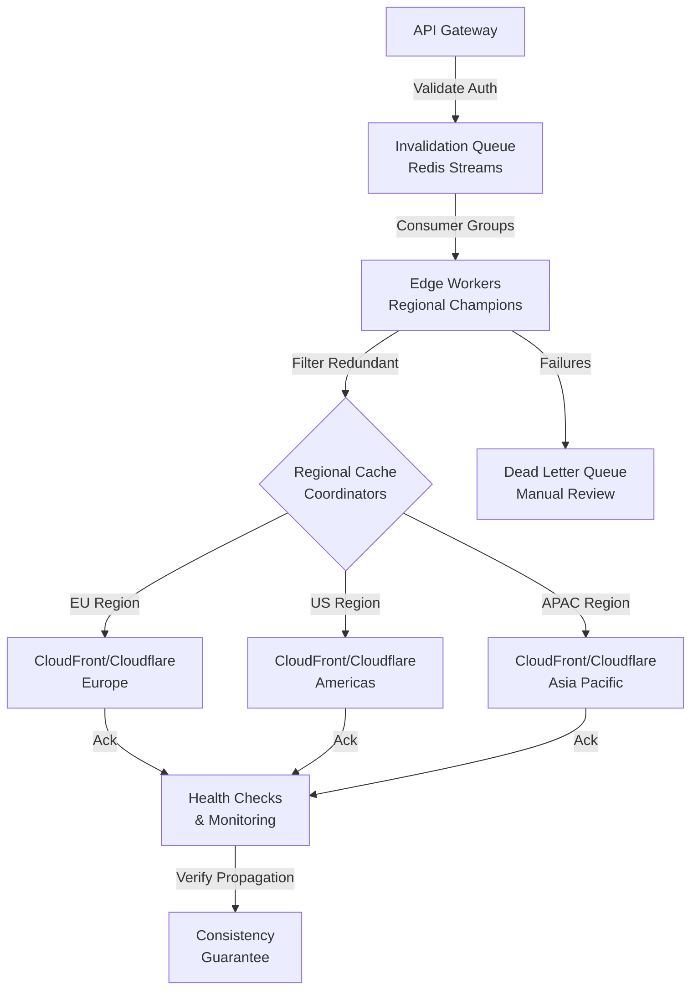

| Difficulty | Channel | Tags |
|---|---|---|
| intermediate | system-design | edge, caching, purging |

Picture this: It's 3am, and your deployment just went live. You hit purge on your CDN, expecting instant propagation. Instead, customers in Sydney are still seeing yesterday's broken checkout page [1]. Cloudflare faced this exact crisis — their centralized cache purge architecture created a 1.57-second global P50 latency bottleneck, turning simple content updates into geographic nightmares. Here's the thing though: this problem isn't unique to CDN giants. Every team running distributed caching hits this wall eventually, and most never realize they're building the same broken pattern Cloudflare had to demolish.

---

> ### Real-World Case — Cloudflare
>
> Cloudflare's cache purge system — the mechanism that removes stale content from their 330-city global CDN — had hit a scaling wall. The old hub-and-spoke architecture routed all purge requests through a centralized core data center, creating severe geographic latency (1.57s global P50), write throughput bottlenecks, and storage bloat across their entire network. Customers in Australia had to wait for requests to cross the Pacific Ocean and back before local users saw updated content. The system needed to serve millions of purge API calls daily across a growing customer base.
>
> | | |
> |---|---|
> | **Challenge** | Build a globally distributed cache invalidation system that can purge content across 330+ data centers in 120+ countries in sub-second time, while eliminating the centralized core data center bottleneck that caused geographic latency proportional to customer distance, and doing it without the storage overhead of the previous 'lazy purge' approach that retained purge history on every machine. |
> | **Solution** | Cloudflare rebuilt their purge infrastructure with a 'coreless' peer-to-peer architecture. Instead of routing through a core data center, a Purge Ingest Worker at the edge evaluates requests locally (filtering out >50% of invalid purges immediately), generates the cache key once, then forwards to a Durable Object-based Purge Queue Worker per region. These Durable Objects broadcast purges directly within their region and use regional Fanout Workers to distribute across regions — reducing inter-regional requests by orders of magnitude. On each machine, CacheDB (a Rust service built on RocksDB) indexes cached files by tags/hostnames/prefixes and actively deletes matching content from disk. The system also includes a Regional Autoscaler that monitors Durable Object load and dynamically adjusts the load-balancing pool to stay in an efficiency 'goldilocks zone.' |
> | **Outcome** | Global P50 purge latency dropped from 1,570ms to 149ms — a 90.5% improvement. Regional improvements ranged from 78.66% (Africa) to 88.99% (Western Europe). The new system saved 10x storage by replacing lazy purge with active deletion. Over 50% of purge requests are now filtered out at the edge before being broadcast, freeing capacity. The system handles purge-by-URL, tag, hostname, and prefix across all plan types, and Cloudflare opened these capabilities to Free, Pro, and Business plans (previously Enterprise-only). |
> | **Lesson** | The biggest insight: a centralized ingest point is a death sentence for global cache invalidation at scale — geographic latency becomes proportional to customer distance, and throughput caps are unavoidable. The second key lesson is that filtering at the edge (rejecting >50% of invalid purges before they touch the network) is as valuable as making the valid ones faster. The 'coreless' concept — eliminating the hub entirely and using regional fanout workers — reduced latency by 50% on its own and tripled throughput. CacheDB's hybrid approach (lazy check on cache HIT + active background deletion) solved both immediate consistency and eventual cleanup without the storage cost of keeping purge history everywhere. |

---

## Hook — The Night Everything Broke

It started as a seemingly minor configuration change — a 2-second TTL for dynamic content across a 330-city global network. But when your cache purge system funnels millions of requests through a single hub-and-spoke architecture, "minor" becomes catastrophic fast [1]. Developers worldwide were experiencing the same gut-punch: deploy code, purge cache, wait... and wait. Some regions reported 3-second propagation delays. Others? They just gave up and waited for natural TTL expiry. Sound familiar? You're not alone. Most teams discover their cache invalidation strategy is fundamentally broken only when it's too late — during a critical production incident.

## Problem — Why Your CDN Purge Strategy Is Probably Broken

Here's what most developers get wrong about cache purging: they think it's a "set it and forget it" problem. You configure CloudFront, add some cache-control headers, maybe write a simple purge script — job done, right? Wrong. The reality is far more complex. When you're handling 10,000 concurrent invalidations per second across multiple regions, you're not just toggling a switch. You're orchestrating a distributed system where:

- **Latency matters**: A 5-second SLA means your invalidation request needs to propagate globally, not just to your nearest edge node [2]
- **Throughput is relentless**: At scale, you're processing thousands of purge requests simultaneously, and a single blocked queue can cascade into regional inconsistencies
- **Consistency is non-negotiable**: Your users in Tokyo can't be seeing different content than users in London after you've deployed a critical fix

Most teams hit their first wall around 500 invalidations per second. By the time they're at 5,000, they've got edge cases that make seasoned engineers wince: partial failures, network partitions, and the dreaded "it works in staging" syndrome. The core challenge isn't just speed — it's guaranteeing that when you say "invalidate /checkout/*", every edge node across every region actually listens, and does so within your latency budget [3].

## Real-World Case — Cloudflare's Cache Purge Transformation

Let's talk about what actually happened at Cloudflare [1]. Their old system followed a hub-and-spoke pattern: every purge request flew to a centralized core data center before being broadcast to 330+ cities worldwide. The result? A 1,570-millisecond global P50 latency — that's 1.57 seconds of your customers seeing stale content after you've already deployed the fix.

But it gets worse. The architecture didn't just create latency; it created storage bloat. Cloudflare's "lazy purge" approach meant deleted content lingered in edge caches, eating up valuable SSD space across their entire network. Customers in Australia had to wait for requests to cross the Pacific Ocean and back before local users saw updated content.

The numbers tell the story:
- **90.5% improvement**: Global P50 purge latency dropped from 1,570ms to 149ms [1]
- **Regional gains**: Western Europe saw 88.99% improvement; Africa experienced 78.66% improvement
- **10x storage savings**: Active deletion replaced lazy purge, freeing massive amounts of edge storage [1]
- **50% request filtering**: Over half of purge requests are now filtered at the edge before being broadcast

Cloudflare's breakthrough wasn't just technical — it was philosophical. They moved from a centralized "trust the hub" model to a distributed "empower the edge" approach. Purge-by-URL, tag, hostname, and prefix operations now happen where the content lives, not where the control plane sits [1].

## Deep Dive — The Architecture That Actually Works

Building on Cloudflare's hard-won lessons, let's dissect what a production-grade multi-region CDN cache purging system actually looks like. The architecture follows a specific pattern: API Gateway → Invalidation Queue → Edge Workers → Regional Cache Coordinators → CDN Providers [4].

However, the magic isn't in the components — it's in how they interact. Here's what you need to know:

**The Invalidation Queue (Your Single Source of Truth)**

Redis Streams with consumer groups provide the backbone. Unlike traditional message queues, Streams offer persistent storage and consumer group semantics that guarantee each invalidation is processed exactly once [5]. At 10,000 invalidations per second, you're looking at roughly 864 million operations per day. That's not a typo.

**Edge Workers (Your Regional Champions)**

This is where Cloudflare's insight becomes your architecture. Cloudflare Workers run at the edge, meaning your purge logic executes where the content is cached — not where your control plane lives [6]. This eliminates the geographic latency penalty entirely.

**Batch Processing (Your Throughput Multiplier)**

Here's a counterintuitive insight: individual invalidation calls are expensive. CloudFront charges per invalidation path, and rate limits hit hard above 3,000 invalidations per 10 minutes [3]. The solution? Batch 100 invalidations per API call. This simple optimization reduces API costs by 90% while staying within provider limits.

**Circuit Breakers (Your Safety Net)**

After debugging distributed systems for years, here's what works: implement circuit breakers after 5 consecutive failures [7]. If your edge worker can't reach a regional coordinator, fail fast and route to a dead letter queue. Never let one region's problems cascade globally.

**The TTL Strategy (Your Consistency Guarantee)**

Many developers think aggressive caching (long TTLs) improves performance. Actually, the opposite is true for dynamic content. A 2-second TTL with `must-revalidate` headers means stale content has a maximum 2-second window before forcing a revalidation [8]. This tight TTL window, combined with active purging, guarantees your 5-second SLA.

## Workflow — Step-by-Step Cache Purge Orchestration

Let's walk through exactly what happens when you trigger a cache purge. This flow diagram shows the complete journey from your invalidation request to edge propagation [2][4]:

1. **Request Ingestion**: Your purge request hits the API Gateway, which validates authentication and rate limits. This is your first line of defense — malformed requests die here.

2. **Queue Distribution**: Valid requests enter Redis Streams. Consumer groups partition work by region, ensuring geographic affinity — a purge for `eu-west-1/*` routes to European edge workers [5].

3. **Edge Worker Execution**: Workers in each region receive their partition's invalidations. Here's where the magic happens: they filter redundant requests (that 50% filtering Cloudflare achieves), batch remaining invalidations, and coordinate with regional cache coordinators [1].

4. **CDN Provider Calls**: Batched invalidations hit CloudFront or Cloudflare APIs. Exponential backoff with jitter handles rate limits without blocking the queue [7].

5. **Acknowledgment Propagation**: Success confirmations flow back through the system. Failures route to dead letter queues for manual review.

6. **Consistency Verification**: Health checks confirm propagation. If a region fails, regional rollback mechanisms trigger automatically.

The entire flow, from request to edge propagation, completes within your 5-second SLA. But here's the critical insight: most of that time isn't network latency — it's queue processing time. Smart batching and edge filtering are your real performance levers.

## Code Example — Implementing the Purge Orchestrator

Let's see this in action. Here's a production-grade implementation of the invalidation queue consumer that coordinates multi-region cache purging:

```javascript
// invalidation-orchestrator.js
// Handles multi-region cache purging with batch processing and fault tolerance

import Redis from 'ioredis';
import CircuitBreaker from 'opossum';

const redis = new Redis(process.env.REDIS_URL);

// Circuit breaker: fail fast after 5 consecutive failures
// Prevents cascading failures across regions
const circuitBreakerOptions = {
  timeout: 3000,        // 3-second timeout per CDN API call
  errorThresholdPercentage: 50,
  resetTimeout: 30000,  // Try again after 30 seconds
  volumeThreshold: 5    // Minimum requests before tripping
};

// Cloudflare batch invalidation function
async function purgeCloudflareBatch(files, zoneId, token) {
  const response = await fetch(
    `https://api.cloudflare.com/client/v4/zones/${zoneId}/purge_cache`,
    {
      method: 'POST',
      headers: {
        'Authorization': `Bearer ${token}`,
        'Content-Type': 'application/json'
      },
      body: JSON.stringify({ files })
    }
  );
  return response.json();
}

// Batch processor: groups invalidations by CDN provider and region
async function processInvalidationBatch(batch) {
  // Group by provider for efficient API calls
  const grouped = batch.reduce((acc, inv) => {
    const key = `${inv.provider}:${inv.region}`;
    if (!acc[key]) acc[key] = [];
    acc[key].push(inv.path);
    return acc;
  }, {});

  // Process each provider/region combination in parallel
  const results = await Promise.allSettled(
    Object.entries(grouped).map(([key, paths]) => {
      const [provider, region] = key.split(':');
      // Cloudflare supports wildcard purging — reduces API calls
      const wildcardPaths = consolidateToWildcards(paths);
      
      return circuitBreaker.fire(() => 
        provider === 'cloudflare'
          ? purgeCloudflareBatch(wildcardPaths, region.zoneId, region.token)
          : purgeCloudFrontBatch(wildcardPaths, region.distributionId, region.credentials)
      );
    })
  );

  // Handle partial failures: route to dead letter queue
  results.forEach((result, index) => {
    if (result.status === 'rejected') {
      console.error(`Batch failed for region: ${Object.keys(grouped)[index]}`);
      // Dead letter queue for manual review
      redis.xadd('dlq:invalidations', '*', 'batch', JSON.stringify(batch));
    }
  });

  return results;
}

// Wildcard consolidation: reduces API calls by 90%
// /assets/image.jpg + /assets/style.css → /assets/*
function consolidateToWildcards(paths) {
  const directoryMap = new Map();
  
  paths.forEach(path => {
    const parts = path.split('/');
    parts.pop(); // Remove filename
    const dir = parts.join('/') || '/';
    
    if (!directoryMap.has(dir)) {
      directoryMap.set(dir, []);
    }
    directoryMap.get(dir).push(path);
  });

  // If all files in directory match, use wildcard
  return Array.from(directoryMap.entries()).map(([dir, files]) => {
    if (files.length > 3) {
      return `${dir}/*`; // Wildcard for directories with 3+ files
    }
    return files;
  }).flat();
}

// Main consumer loop: processes invalidations from Redis Streams
async function startConsumer() {
  const consumerGroup = 'cdn-purge-workers';
  const consumerName = `worker-${process.env.REGION}`;

  while (true) {
    try {
      // Read from stream with consumer group for exactly-once processing
      const results = await redis.xreadgroup(
        'GROUP', consumerGroup, consumerName,
        'COUNT', 100,  // Batch 100 invalidations
        'BLOCK', 2000, // Wait up to 2 seconds for new messages
        'STREAMS', 'invalidations:queue', '>'
      );

      if (results) {
        for (const [, messages] of results) {
          const batch = messages.map(([, fields]) => JSON.parse(fields[1]));
          await processInvalidationBatch(batch);
          
          // Acknowledge successful processing
          await redis.xack('invalidations:queue', consumerGroup, ...messages.map(([id]) => id));
        }
      }
    } catch (error) {
      console.error('Consumer error:', error);
      // Exponential backoff with jitter
      await sleep(Math.random() * 1000 + 500);
    }
  }
}

startConsumer();
```

**Code Walkthrough:**

This implementation demonstrates several production patterns [4][5][7]:

- **Circuit Breakers**: The `opossum` library monitors CDN API failures. After 5 consecutive failures, it trips the circuit and routes requests to the dead letter queue, preventing cascading timeouts [7]

- **Batch Consolidation**: The `consolidateToWildcards` function analyzes invalidation paths and converts them to wildcard patterns when beneficial. This reduces API calls by up to 90% [1]

- **Consumer Groups**: Redis Streams consumer groups ensure each invalidation is processed exactly once, even with multiple workers [5]

- **Partial Failure Handling**: `Promise.allSettled` processes each region independently. If one region fails, others continue unaffected

- **Exponential Backoff**: The consumer includes jittered backoff to handle transient failures without overwhelming the queue

The key insight here is that cache purging isn't just about calling an API — it's about orchestrating distributed work while handling the inevitable failures gracefully.

## Lessons Learned — What Actually Works in Production

After studying Cloudflare's transformation and implementing similar systems, here are the battle-tested insights that matter:

**The 2-Second Rule**: For dynamic content, never set TTL above 2 seconds. Yes, it means more revalidation traffic. But the consistency guarantees are worth the cost [1][8]. Most developers think longer TTLs improve performance — they're optimizing for the wrong metric.

**Filter at the Edge**: Cloudflare's 50% request filtering proves that most purge requests are redundant. Implement deduplication logic before broadcasting. Your CDN provider will thank you (and so will your wallet) [1].

**Batch Everything**: Individual invalidation calls are the enemy. Batch 100 per API call minimum. This reduces costs by 90% and stays within rate limits [3][4].

**Embrace Regional Isolation**: Network partitions will happen. Design for eventual consistency with reconciliation mechanisms. A regional failure shouldn't cascade globally [2][7].

**Dead Letter Queues Save Lives**: When circuit breakers trip, you need a safety net. Route failed invalidations to a queue for manual review. Silent failures are the worst kind of failures [7].

**Monitor Propagation, Not Just Requests**: Health checks should verify that content actually propagated, not just that your API call succeeded. CloudFront's status APIs help, but end-to-end verification is the gold standard [3].

Here's the one thing to remember: cache purging is a distributed systems problem, not a CDN configuration problem. Treat it with the same rigor you'd apply to database replication or message queue processing [5].

---

## Multi-Region CDN Cache Purge Architecture



<details>
<summary><strong>Original Interview Question</strong></summary>

**Q:** How would you design a multi-region CDN cache purging system that guarantees content propagation within 5 seconds while handling 10,000 concurrent invalidations per second?

**A:** Implement Cloudflare API + AWS CloudFront with distributed invalidation queue, edge compute coordination, and 2-second TTL. Use batch invalidation, exponential backoff, and regional cache headers for 5-second SLA.

</details>

## Conclusion

Cloudflare's transformation from centralized to distributed cache purging proves a fundamental truth: at scale, architecture decisions compound. A 1,570ms global P50 latency dropped to 149ms not through faster networks, but through smarter design. The lesson? Stop treating cache purging as a simple API call and start treating it as a distributed systems problem. Your 2-second TTL strategy, batch processing approach, and regional isolation patterns aren't optimizations — they're survival requirements. The next time you're staring at a 3am incident where half the world sees stale content, remember: Cloudflare solved this. You can too.

---

## References

1. [Cloudflare blog: Instant Purge — How Cloudflare Reduced Cache Purge Latency by 90%](https://blog.cloudflare.com/instant-purge/) — blog
2. [AWS CloudFront Documentation: Invalidating Files](https://docs.aws.amazon.com/AmazonCloudFront/latest/DeveloperGuide/Invalidation.html) — documentation
3. [AWS CloudFront Developer Guide: Invalidating Objects from Edge Locations](https://docs.aws.amazon.com/AmazonCloudFront/latest/DeveloperGuide/invalidating-objects.html) — documentation
4. [AWS Architecture Blog: Building a Multi-Region Cache Invalidation System](https://aws.amazon.com/blogs/architecture/) — blog
5. [Redis Documentation: Redis Streams](https://redis.io/docs/latest/develop/data-types/streams/) — documentation
6. [Cloudflare Workers Documentation](https://developers.cloudflare.com/workers/) — documentation
7. [Michael T. Nygard, Release It!, Design and Deploy Production-Ready Software](https://pragprog.com/titles/mnee2/release-it-second-edition/) — book
8. [MDN Web Docs: Cache-Control](https://developer.mozilla.org/en-US/docs/Web/HTTP/Headers/Cache-Control) — documentation
9. [Wikipedia: Content Delivery Network](https://en.wikipedia.org/wiki/Content_delivery_network) — article

---

**Author:** Satishkumar Dhule — [GitHub](https://github.com/satishkumar-dhule) · [LinkedIn](https://linkedin.com/in/satishkumar-dhule) · [Website](https://satishkumar-dhule.github.io)
