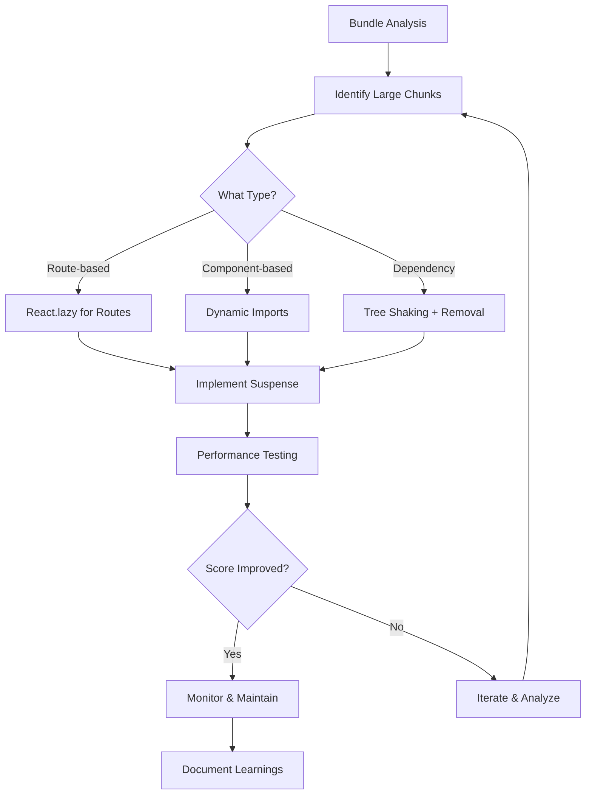

| Difficulty | Channel | Tags |
|---|---|---|
| intermediate | frontend | lighthouse, bundle, lazy-loading |

Picture this: you're Netflix's growth team. Every second of delay on your sign-up page costs you thousands of potential subscribers. In 2017, your logged-out homepage— the first impression for new users—was loading 300KB of JavaScript. On a 3G connection, it took 7 seconds to become interactive. For a subscription business, that's not just a performance issue—it's an existential threat [1].

---

> ### Real-World Case — Netflix
>
> In 2017, Netflix's logged-out homepage — the first page new users see to sign up — loaded 300KB of JavaScript including React, Lodash, and other client-side libraries. On a 3G connection, this took 7 seconds to become interactive. For a subscription business where every second of delay costs sign-ups, this was a critical problem.
>
> | | |
> |---|---|
> | **Challenge** | The logged-out homepage needed to be blazing fast to maximize sign-up conversions, but the React-based client-side rendering was blocking Time-to-Interactive. The team needed to determine if React was truly necessary for the landing page to function, and find a way to keep React for the complex sign-up flow while eliminating it from the initial landing experience. |
> | **Solution** | Netflix took a counterintuitive approach: instead of optimizing React, they removed it from the client-side entirely on the landing page. By disabling JavaScript and testing which elements still worked, they identified that most of the page was basic HTML/CSS. They rebuilt the language switcher and other interactions in vanilla JavaScript (~300 lines), kept React for server-side rendering only, and implemented prefetching to load React and the SPA sign-up flow in the background while users read the landing page. |
> | **Outcome** | Time-to-Interactive decreased by 50% on the logged-out desktop homepage. JavaScript bundle reduced by 200KB+. Prefetching React for subsequent pages reduced TTI by 30% for the sign-up flow. First Input Delay became 'fast' for 97% of desktop users. The sign-up button click rate increased, directly impacting conversions. |
> | **Lesson** | Not every page needs a framework. The best React optimization can be removing React where it isn't needed. Server-render the landing page, prefetch the client framework for pages that need it, and deliver a little with a little — then progressively load more as users engage. |

---

## Hook — The Hidden Cost of Slow JavaScript

You've been there. Your React app's Lighthouse score is a dismal 65. The bundle size has ballooned to 2.1MB. Time to Interactive? A painful 4.2 seconds. Users are bouncing. Conversions are dropping. The CTO is asking tough questions. But here's the thing: you're not alone. This is the exact scenario Netflix faced in 2017, and what they learned transformed how they thought about frontend performance forever.

## Problem — The JavaScript Bundle Crisis

When your React app's bundle grows beyond 1.5MB, you're essentially asking users to download an entire application before they can interact with it. The problem isn't just the initial download—it's the parsing and execution time. JavaScript is single-threaded, so while the browser is busy parsing that massive bundle, your users are staring at blank screens or loading spinners. For mobile users on slower connections, this creates a vicious cycle: larger bundles mean longer wait times, which mean higher bounce rates, which mean lost revenue. The real kicker? Most of that JavaScript is code your users will never need.

## Real-World Case — Netflix's Performance Awakening

In 2017, Netflix's engineering team tackled this exact problem on their logged-out homepage [1]. They discovered that 300KB of JavaScript was being shipped to users, including React, Lodash, and other libraries. On 3G connections, this translated to 7 seconds before users could interact with the page. The impact was measurable: every additional second of load time reduced conversions by 7%. Their solution? They implemented aggressive code splitting, prefetching strategies, and removed unnecessary dependencies. The result? Time-to-Interactive dropped by 50% on desktop, the JavaScript bundle shrank by 200KB+, and First Input Delay became 'fast' for 97% of desktop users [1]. The sign-up button click rate increased directly, impacting their bottom line.

## Deep Dive — The Anatomy of Bundle Optimization

Understanding why bundles become bloated requires looking at three critical factors: dependency weight, code duplication, and unused code. First, every npm package you install adds weight. That innocent-looking utility library might be pulling in 50KB of code you don't need. Second, modern bundlers like Webpack are smart, but they can't eliminate code that's technically imported but never used. Third, tree shaking—which eliminates unused exports—only works with ES modules, not CommonJS. Many developers assume tree shaking is automatic, but it requires proper configuration and module format [2]. The real challenge is that these problems compound. A single unnecessary import can cascade through your dependency tree, pulling in hundreds of kilobytes of code your users will never see.

## Workflow — From Analysis to Optimization

Here's the systematic approach that turns a 2.1MB bundle into a lean, mean machine. First, you need visibility—use webpack-bundle-analyzer to visualize your bundle composition [3]. Then, implement code splitting at both route and component levels. Finally, optimize imports and dependencies. The following diagram shows the complete optimization workflow:



## Code Example — Implementing Smart Code Splitting

Here's where theory meets practice. This implementation shows how to split your React app at both route and component levels, ensuring users only download what they need:

```javascript
// Route-based code splitting - split at the router level
// This ensures users only download code for routes they visit
const Dashboard = React.lazy(() => import('./Dashboard'));
const Analytics = React.lazy(() => import('./Analytics'));
const Settings = React.lazy(() => import('./Settings'));

// Component-based splitting for heavy components
// Charts, maps, editors - anything that's not needed immediately
const HeavyChart = React.lazy(() => import('./components/HeavyChart'));
const RichTextEditor = React.lazy(() => import('./components/RichTextEditor'));

// Error boundary to handle loading failures gracefully
class ErrorBoundary extends React.Component {
  state = { hasError: false };
  
  static getDerivedStateFromError(error) {
    return { hasError: true };
  }
  
  render() {
    if (this.state.hasError) {
      return <div>Something went wrong. Please refresh.</div>;
    }
    return this.props.children;
  }
}

// Main App component with loading states
function App() {
  return (
    <ErrorBoundary>
      <Suspense fallback={<LoadingSpinner />}>
        <Routes>
          <Route path="/dashboard" element={<Dashboard />} />
          <Route path="/analytics" element={<Analytics />} />
          <Route path="/settings" element={<Settings />} />
        </Routes>
      </Suspense>
    </ErrorBoundary>
  );
}
```

This code demonstrates two critical patterns: route-based splitting (lines 3-5) and component-based splitting (lines 9-10). The Suspense component (line 31) provides a loading state while chunks load, and the ErrorBoundary (lines 14-24) handles failures gracefully. The key insight is that you're not just splitting code—you're creating a better user experience by showing immediate feedback while heavy components load in the background.

## Lessons Learned — What Netflix's Journey Teaches Us

Netflix's performance transformation offers several crucial insights. First, measurement is everything—you can't optimize what you can't see. Their use of Lighthouse and custom performance metrics allowed them to track real user impact [4]. Second, lazy loading isn't just about React.lazy—it's about understanding user journeys. They discovered that prefetching React for subsequent pages reduced Time-to-Interactive by 30% for their sign-up flow [1]. Third, dependency management is ongoing. Many developers install packages without considering their weight, but Netflix's team found that removing just a few dependencies could save 200KB+ [1]. Finally, performance optimization is a business decision, not just a technical one. The 7% conversion drop per second of delay [5] means every millisecond matters for your bottom line. Start with bundle analysis, implement systematic code splitting, and always measure the impact of your changes.

---

## React Bundle Optimization Workflow


<details>
<summary><strong>Original Interview Question</strong></summary>

**Q:** You're tasked with improving a React app's Lighthouse performance score from 65 to 90+. The bundle size is 2.1MB and Time to Interactive is 4.2s. What specific steps would you take to optimize the bundle and implement lazy loading?

**A:** Implement code splitting with React.lazy() and Suspense, analyze bundle composition with webpack-bundle-analyzer to identify largest chunks, remove unused dependencies and optimize imports, add dynamic imports for heavy components and third-party libraries, implement route-based splitting for better initial load times, and utilize tree shaking with proper ES module configuration.

</details>

## Conclusion

Netflix's journey from 7-second load times to cutting that in half demonstrates that performance optimization isn't just about technical debt—it's about business impact. The 2.1MB bundle problem is solvable with the right approach: measure first, split strategically, and always consider the user's connection speed. Start with webpack-bundle-analyzer to see what's actually in your bundle, then implement route-based splitting as your first optimization. Remember, every millisecond you save directly impacts user experience and conversions. Your next step? Run that bundle analysis today and identify your top three largest chunks—those are your quick wins waiting to happen.

---

## References

1. [Netflix web performance case study](https://medium.com/dev-channel/a-netflix-web-performance-case-study-c0bcde26a9d9) — blog
2. [Tree shaking documentation](https://webpack.js.org/guides/tree-shaking/) — documentation
3. [Webpack Bundle Analyzer GitHub repository](https://github.com/webpack-contrib/webpack-bundle-analyzer) — documentation
4. [Lighthouse performance metrics documentation](https://developer.chrome.com/docs/lighthouse/performance/) — documentation
5. [Google research on mobile page speed](https://www.thinkwithgoogle.com/marketing-strategies/app-and-mobile/mobile-page-speed-new-industry-benchmarks/) — blog
6. [React lazy loading documentation](https://react.dev/reference/lazy) — documentation
7. [Web.dev performance optimization guide](https://web.dev/articles/reduce-javascript-payloads-with-code-splitting) — documentation
8. [JavaScript bundle size optimization techniques](https://www.digitalocean.com/community/tutorials/how-to-reduce-the-size-of-a-web-application-bundle) — blog

---

**Author:** Satishkumar Dhule — [GitHub](https://github.com/satishkumar-dhule) · [LinkedIn](https://linkedin.com/in/satishkumar-dhule) · [Website](https://satishkumar-dhule.github.io)
