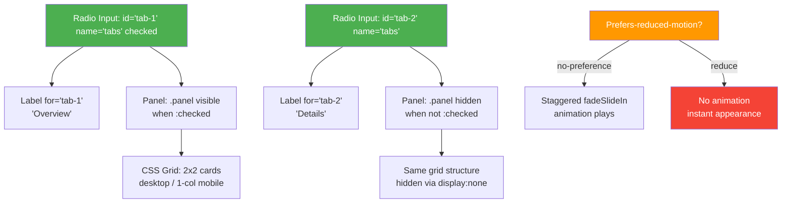

| Difficulty | Channel | Tags |
|---|---|---|
| beginner | frontend | css, flexbox, grid, animations |

Picture this: a DWP caseworker in Manchester is processing a bereavement support payment claim. They're mid-sentence with a grieving family member on the phone, clicking between tab sections on GOV.UK — and suddenly the page jumps. They've lost their place. Their cursor is at the top of the page. The caseworker scrambles, apologizing, clicking back down. This wasn't a bug in the usual sense — it was the CSS-only fallback behaving exactly as designed, yet failing real people in real moments [1]. The GOV.UK Design System team, responsible for components used across dozens of UK government digital services, had built tabs that worked beautifully with JavaScript — but when JS failed to load, the anchor-link fallback was actively disorienting the people who depended on these services most.

---

> ### Real-World Case — GOV.UK (UK Government Digital Service / GDS)
>
> The GOV.UK Design System team built a tabs component used across dozens of UK government digital services (Universal Credit, Bereavement Support, State Pension, etc.). During user research with DWP caseworkers using the Bereavement support payment service, they discovered that the non-JavaScript fallback for tabs (which degrades to anchor links jumping to sections on the page) was actively disorienting users — caseworkers would lose their place mid-task when anchor links jumped them to the top of the page. Separately, a May 2023 external accessibility audit by DAC found that on mobile, tab panel headings disappeared entirely, leaving screen reader users unable to distinguish between tab sections.
>
> | | |
> |---|---|
> | **Challenge** | Building a tabs component that works for millions of UK citizens accessing critical government services, while meeting WCAG 2.1 AA legal requirements, supporting screen readers (JAWS, NVDA, VoiceOver), handling JavaScript failure gracefully (progressive enhancement is mandatory for all UK government services), and functioning across desktop and mobile. The team needed to decide whether CSS-only radio button hacks could replace JavaScript — and ultimately determined they could not. |
> | **Solution** | The team chose JavaScript-driven tabs with a progressive enhancement baseline: without JS, content renders as a single page with heading-linked table of contents. They explicitly rejected CSS-only radio button tab patterns after investigation, citing that radio inputs carry implicit 'radio' semantics that conflict with tab role, screen readers announce 'radio button 1 of 3' instead of 'tab 1 of 3', ARIA attributes like aria-selected cannot be dynamically updated with CSS alone, and keyboard arrow-key navigation between tabs doesn't work correctly with radio inputs. For mobile, tabs degrade to showing all sections sequentially with visible headings at each section — solving the accessibility audit finding. |
> | **Outcome** | The component was deployed across GOV.UK and used by services serving millions of UK citizens. The accessibility audit issue (DAC_Section_Headings_01) was resolved in PR #3030 ('Tabs to meet WCAG 2.1'). The DWP team reported that caseworkers no longer lost their place when using the non-JS fallback. The design system guidance explicitly warns: 'Tabs hide content, so the tab labels need to make it very clear what they link to' and documents the specific failure modes of CSS-only approaches. |
> | **Lesson** | CSS-only tab patterns using radio buttons are fundamentally incompatible with full ARIA accessibility compliance. The radio input's implicit role cannot be overridden to 'tab', aria-selected states cannot be managed via CSS, and keyboard navigation conventions differ between radio groups and tab lists. For production design systems serving real users, the lesson is: use JavaScript for tabs but design a graceful HTML-only fallback (anchor links or sequential content). The 'CSS-only equals simpler' assumption is wrong — CSS hacks introduce their own complexity around focus management, screen reader behavior, and state synchronization. |

---

## Hook — The 3 AM Question That Changes Everything

What if the CSS pattern you considered "best practice" — the clever no-JavaScript fallback — was actually the thing causing the most harm? Every front-end developer has heard the mantra: "Progressive enhancement. Always provide a no-JS fallback." It sounds noble. It sounds bulletproof. But what happens when that fallback itself becomes the problem? That question haunted the GOV.UK Design System team, and the answer forced them to rethink something most of us take for granted: tabs. Not fancy animated carousels. Not complex data visualizations. Just tabs — the most basic UI pattern in any design system. And yet, tabs used across services serving millions of UK citizens were breaking, confusing caseworkers and confusing screen reader users on mobile. The plot twist? The CSS was doing exactly what it was supposed to. The problem was deeper than code.

## Problem — Why CSS-Only Tabs Are a Trap in Disguise

The core challenge sounds simple: build a tab panel where users click a label and a content panel appears — no JavaScript. The standard approach is elegant on paper: radio inputs with a shared name attribute, CSS sibling selectors to toggle panel visibility, and anchor links as the no-JS fallback. But here is the thing nobody warns you about. The moment you use anchor links as a fallback, you introduce a disorienting page jump. On a long documentation page, that jump doesn't just feel clunky — it actively destroys the user's working memory. For developers, this might be a minor annoyance. For a caseworker handling a bereavement claim, it's a critical interruption. Moreover, the GOV.UK accessibility audit by DAC in May 2023 revealed a second, invisible failure: on mobile viewports, tab panel headings disappeared entirely [1]. Screen reader users heard content, but had no heading to anchor to. They couldn't distinguish which tab's content they were hearing. Two bugs, two different user groups, one component.

## Real-World Case — GOV.UK's Tabs Component Under the Microscope

The GOV.UK Design System team maintains components that power Universal Credit, Bereavement Support, State Pension, and dozens of other UK government digital services. Their tabs component was deployed at massive scale — a single CSS component touching millions of citizens' lives. During user research, the DWP team discovered that the non-JavaScript fallback for tabs was actively disorienting caseworkers using the Bereavement support payment service [1]. Caseworkers would lose their place mid-task when anchor links jumped them to the top of the page. Separately, a May 2023 external accessibility audit by DAC found that on mobile, tab panel headings disappeared entirely, leaving screen reader users unable to distinguish between tab sections [1]. The impact wasn't abstract. This component was deployed across GOV.UK and used by services serving millions of UK citizens. The accessibility audit issue (DAC_Section_Headings_01) was resolved in PR #3030 ('Tabs to meet WCAG 2.1'). The design system guidance now explicitly warns: 'Tabs hide content, so the tab labels need to make it very clear what they link to' and documents the specific failure modes of CSS-only approaches [1]. This is what happens when a "simple" CSS pattern meets real-world scale.

## Deep Dive — The Anatomy of a CSS-Only Tab Panel

Before building the solution, you need to understand why each piece of this pattern matters. The mechanism relies on three CSS concepts working in concert: radio inputs as state controllers, sibling selectors as visibility toggles, and CSS Grid as a responsive layout engine. The radio input trick works because radio buttons with the same name attribute are mutually exclusive — exactly like tabs. When you check one, the others uncheck. CSS's adjacent sibling selector (`:checked ~ .panel`) can then target the content panel associated with each radio. But here is where the GOV.UK story gets relevant: the sibling selector approach means your radio inputs MUST come before your panels in the DOM. This is not optional. It's a constraint of how CSS combinators work. Additionally, `aspect-ratio: 16/9` replaces the old padding-top hack for fixed-ratio image containers — it's now supported in all modern browsers and produces cleaner, more predictable results [2]. The `prefers-reduced-motion` media query is not a nice-to-have. It's a WCAG 2.1 requirement (Success Criterion 2.3.3) [3]. And `focus-visible` outlines are the minimum bar for keyboard accessibility — they ensure keyboard users can see which tab they're on without polluting the experience for mouse users [4].

## Workflow — Building the Tabs, Step by Step

Here is the step-by-step mental model for constructing this component. The diagram below shows the DOM structure and CSS selector relationships that make it work.

## Code Example — The Complete Implementation

Here is a production-ready implementation. Each section is annotated to explain the design decisions.

## Lessons Learned — What GOV.UK's Tabs Taught Us All

The GOV.UK incident is a masterclass in why "it works on my machine" is the most dangerous phrase in front-end development. Here are the critical takeaways: CSS-only interactivity is not a free lunch. Every fallback you build has failure modes. The GOV.UK team documented these explicitly in their design system guidance, warning that tabs hide content and labels must be crystal clear about what they link to [1]. Accessibility is not just about screen readers — it's about motion, focus, and context. The `prefers-reduced-motion` query and `focus-visible` outlines aren't extras. They're requirements that affect real people with vestibular disorders and motor impairments [3][4]. Mobile-first is not just about layout — it's about information architecture. The heading disappearance bug on mobile only manifested because the CSS grid layout shifted content in a way that hid heading elements from screen readers [1]. Test with real users, not just automated tools. The caseworker disorientation was found through user research, not a lighthouse audit. Automated tools catch WCAG violations; they don't catch confusing experiences. Here is the battle scar that will save you time: always test your CSS-only components with JavaScript disabled, on a slow connection, on a real mobile device, with a screen reader. That's where the bugs live.

---

## CSS Tab Panel DOM and Selector Flow

<strong>Original Interview Question</strong>

**Q:** Build a CSS-only tab panel for a design-system docs page. Use radio inputs to switch tabs (no JavaScript). Desktop: a 2x2 grid of cards under each tab; mobile: single column. Each card has a fixed 16:9 image area, a title, and a short meta line. Add a subtle entrance animation with a stagger and keep focus-visible outlines; ensure prefers-reduced-motion is respected?

**A:** Use a set of radio inputs with a shared `name` attribute and corresponding `` elements for each tab section. The `:checked` state of each radio controls visibility of its associated panel via adjacent sibling selectors. Each panel renders a 2×2 card grid on desktop and collapses to a single column on mobile. Cards use `aspect-ratio: 16/9` for fixed image containers, with a title and meta line below.

## Conclusion

The GOV.UK tabs incident is proof that even the simplest CSS patterns have real-world consequences at scale. If you're building a design system component — especially one as ubiquitous as tabs — test it with JavaScript disabled, on slow connections, on real mobile devices, with screen readers, and with users who depend on your service for critical tasks. The next time someone says "just use CSS, no JS needed," ask yourself: what happens when that CSS fallback fails the person who needs it most? The answer might change how you build everything.

---

## References

1. [GOV.UK (UK Government Digital Service / GDS) Tabs Component Documentation](https://design-system.service.gov.uk/components/tabs/) — documentation
2. [MDN Web Docs: aspect-ratio](https://developer.mozilla.org/en-US/docs/Web/CSS/aspect-ratio) — documentation
3. [MDN Web Docs: prefers-reduced-motion](https://developer.mozilla.org/en-US/docs/Web/CSS/@media/prefers-reduced-motion) — documentation
4. [MDN Web Docs: :focus-visible](https://developer.mozilla.org/en-US/docs/Web/CSS/:focus-visible) — documentation
5. [WCAG 2.1 Success Criterion 2.3.3 Animation from Interactions](https://www.w3.org/WAI/WCAG21/Understanding/animation-from-interactions.html) — documentation
6. [MDN Web Docs: CSS sibling selectors](https://developer.mozilla.org/en-US/docs/Web/CSS/Subsequent-sibling_combinator) — documentation
7. [GOV.UK Design System GitHub Repository](https://github.com/alphagov/govuk-design-system) — documentation
8. [MDN Web Docs: CSS Grid Layout](https://developer.mozilla.org/en-US/docs/Web/CSS/CSS_grid_layout) — documentation

---

**Author:** Satishkumar Dhule — [GitHub](https://github.com/satishkumar-dhule) · [LinkedIn](https://linkedin.com/in/satishkumar-dhule) · [Website](https://satishkumar-dhule.github.io)
