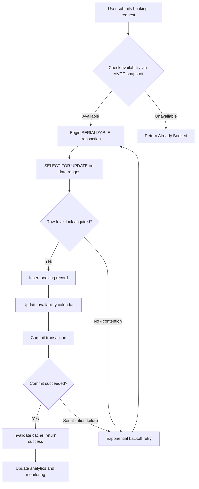

| Difficulty | Channel | Tags |
|---|---|---|
| intermediate | database | acid, isolation-levels, mvcc |

Picture this: a guest books a hotel room in Paris for New Year's Eve. Then another guest books the same room. And another. Three people, one room, zero happy customers. This isn't a hypothetical - it's exactly what threatened Booking.com's 'Connected Trip' initiative when their Cassandra-backed reservation system couldn't handle the transactional demands of multi-step booking operations [1]. The result? Fragile lightweight transactions, timeout errors, and an architecture that had 'caused havoc' with extra cross-check services and sync pipelines. What they learned next changed everything about how they thought about database consistency.

---

> ### Real-World Case — Booking.com
>
> Booking.com built a centralized Order Platform to power its 'Connected Trip' initiative, consolidating siloed reservation systems across hotels, flights, and car rentals. The platform was initially designed on Cassandra, which caused critical data consistency problems because reservation data requires transactional multi-step read-modify-write operations that Cassandra's row-level isolation cannot guarantee.
>
> | | |
> |---|---|
> | **Challenge** | Cassandra only provided row-level isolation, not suitable for multi-step read-modify-write across multiple rows and partitions in a single operation. The team implemented a custom locking system using lightweight transactions (Cassandra's compare-and-set), but these would sometimes time out — and it was impossible to distinguish a legitimate conflict timeout from an underlying infrastructure failure. Meanwhile, limited secondary index support forced them to use OpenSearch for queries, which massively increased operational costs and maintenance complexity replicating datasets across multiple databases to keep them in sync. |
> | **Solution** | Migrated the entire Order Platform from Cassandra to CockroachDB, a distributed SQL database providing serializable isolation by default. CockroachDB's ACID transaction support eliminated the need for the custom locking workarounds. Native CDC (Change Data Capture) replaced the fragile sync pipelines, and secondary indexes eliminated the OpenSearch dependency entirely. The migration was done gradually across 20TB of reservation data under SOX compliance controls to prevent accidental data tampering. Deployment runs across 3 regions (Frankfurt, London, Ireland) as a managed CockroachDB Cloud service. |
> | **Outcome** | Simplified the entire application architecture by removing extra cross-check services and sync pipelines that had 'caused havoc.' Achieved 99.99998% SLI for writes. Eliminated the fragile Cassandra lightweight transaction timeouts. Reduced operational complexity by consolidating from multiple databases (Cassandra + OpenSearch + sync services) down to a single CockroachDB cluster. The Order Platform now serves as the source of truth for all reservation data powering frontend experiences, accounting, and analytics. |
> | **Lesson** | Reservation data is fundamentally transactional — choosing a NoSQL database that lacks ACID guarantees forces you into fragile application-level workarounds that grow increasingly complex and brittle at scale. The correct move was to accept a tradeoff in write availability (CP over AP in CAP theorem terms) and use a strongly consistent distributed SQL database for booking operations. The 'plot twist': Cassandra was chosen initially because of past pain with sharded MySQL failovers, but the solution introduced worse problems that only became apparent when cross-partition transactional consistency was needed. |

---

## Hook — The $100M Gamble on the Wrong Database

Booking.com connects millions of travelers with accommodations worldwide. When they decided to unify their siloed reservation systems across hotels, flights, and car rentals into a single 'Connected Trip' platform, they chose Cassandra - a distributed database famous for its scalability. But scalability wasn't their problem. Their problem was this: reservation data requires transactional multi-step read-modify-write operations that Cassandra's row-level isolation simply cannot guarantee [1]. Imagine holding a hotel room for a customer while simultaneously checking flight availability, car rental options, and applying loyalty discounts - all in one atomic operation. Cassandra couldn't do it. The timeout errors started piling up, and suddenly, the entire booking pipeline was at risk.

## Problem — Why Double Bookings Are a $100M+ Nightmare

At first glance, preventing double bookings seems straightforward. Check if the room is available, book it, done. But here's the catch: what happens when two users click 'Book Now' at the exact same millisecond? In a world where Airbnb handles thousands of concurrent booking requests, the margin for error is razor-thin. Without proper transaction handling, you're vulnerable to race conditions where two guests successfully book the same property for the same dates. The technical term for this is a 'phantom read' or 'lost update' depending on your isolation level, but the business term is simpler: canceled reservations, angry customers, and potential revenue loss in the millions. According to PostgreSQL documentation, even SELECT statements can lock rows under certain conditions, which means naive approaches can cause deadlocks or, worse, allow double bookings to slip through the cracks [2].

## Real-World Case — Booking.com's Cassandra Crisis

Booking.com's experience with Cassandra proved catastrophic for their Connected Trip platform. The company had built a centralized Order Platform to consolidate reservation data, but Cassandra's architecture created critical data consistency problems. When they attempted transactional multi-step operations, they encountered Lightweight Transaction (LWT) timeouts that cascaded throughout the system [1]. The impact was severe: they had to maintain extra cross-check services and synchronization pipelines between Cassandra, OpenSearch, and other databases to ensure consistency. These components 'caused havoc' on the architecture, introducing fragility and operational complexity. After consolidating everything into a single CockroachDB cluster with serializable isolation, Booking.com achieved a remarkable 99.99998% SLI for writes - eliminating timeout errors entirely and simplifying their entire application architecture [1]. The lesson? When your business logic requires strong consistency, choosing the wrong database can cost you millions in engineering effort and lost revenue.

## Deep Dive — The Concurrency Control Toolkit

Now that you've seen the consequences of getting this wrong, let's explore the technical arsenal for preventing double bookings. PostgreSQL's MVCC (Multi-Version Concurrency Control) is the backbone of modern transaction handling, allowing readers to access consistent snapshots without blocking writers [3]. But here's where it gets interesting: SERIALIZABLE isolation level, often dismissed as 'too slow' by impatient developers, is actually the only way to guarantee truly serial execution of concurrent transactions [4].

Here's what you need to know:

- **Optimistic Locking**: Assumes conflicts are rare; checks for conflicts only at commit time using version columns
- **Pessimistic Locking**: Locks rows upfront with SELECT FOR UPDATE; safe but can cause contention
- **SERIALIZABLE**: Executes transactions as if they ran one after another; strongest guarantee but highest overhead

However, there's a plot twist many developers miss: PostgreSQL's SERIALIZABLE actually uses SSI (Serializable Snapshot Isolation), which is far more efficient than traditional two-phase locking [5]. It only blocks transactions when it detects actual conflicts, not when they theoretically could conflict. This means you get strong consistency without the performance penalty you'd expect from textbook definitions. The tradeoff? You need proper retry logic with exponential backoff for failed transactions, because serialization failures will occur under high concurrency [6].

## Workflow — The Battle-Tested Booking Pattern

Here's the step-by-step workflow that separates production-ready booking systems from prototypes:


The key insight is separating the read path from the write path. Availability checks use MVCC snapshots for high throughput, while booking operations use row-level locks to prevent conflicts. This dual approach gives you the best of both worlds: fast reads and consistent writes [7].

## Code Example — PostgreSQL Booking Implementation

```python
import psycopg2
from psycopg2 import sql
import time
import random
from typing import Optional

class BookingSystem:
    def __init__(self, dsn: str):
        self.dsn = dsn
        
    def _get_connection(self):
        """Create a new database connection."""
        return psycopg2.connect(self.dsn)
    
    def check_availability(self, property_id: int, check_in: str, check_out: str) -> bool:
        """
        Check availability using MVCC snapshot reads.
        This is a read-only operation that doesn't block other transactions.
        """
        with self._get_connection() as conn:
            with conn.cursor() as cur:
                # MVCC snapshot read - doesn't acquire locks
                cur.execute("""
                    SELECT COUNT(*) FROM bookings
                    WHERE property_id = %s
                      AND status = 'confirmed'
                      AND (check_in, check_out) OVERLAPS (%s, %s)
                """, (property_id, check_in, check_out))
                count = cur.fetchone()[0]
                return count == 0
    
    def create_booking(
        self,
        property_id: int,
        user_id: int,
        check_in: str,
        check_out: str,
        max_retries: int = 3
    ) -> Optional[dict]:
        """
        Create a booking with optimistic concurrency control.
        Uses SELECT FOR UPDATE to lock date ranges during booking.
        """
        for attempt in range(max_retries):
            try:
                with self._get_connection() as conn:
                    # Set SERIALIZABLE isolation for strong consistency
                    conn.set_isolation_level(
                        psycopg2.extensions.ISOLATION_LEVEL_SERIALIZABLE
                    )
                    with conn.cursor() as cur:
                        # Step 1: Lock specific date ranges with row-level lock
                        cur.execute("""
                            SELECT id FROM availability_calendar
                            WHERE property_id = %s
                              AND date >= %s AND date < %s
                            FOR UPDATE  -- This acquires row-level locks
                        """, (property_id, check_in, check_out))
                        
                        locked_dates = cur.fetchall()
                        if len(locked_dates) < (pd.Timestamp(check_out) - pd.Timestamp(check_in)).days:
                            raise ValueError("Partial date range not available")
                        
                        # Step 2: Insert booking record atomically
                        cur.execute("""
                            INSERT INTO bookings
                                (property_id, user_id, check_in, check_out, status, version)
                            VALUES
                                (%s, %s, %s, %s, 'confirmed', 1)
                            RETURNING id, created_at
                        """, (property_id, user_id, check_in, check_out))
                        
                        booking = cur.fetchone()
                        
                        # Step 3: Update availability calendar
                        cur.execute("""
                            UPDATE availability_calendar
                            SET is_available = FALSE,
                                booking_id = %s,
                                version = version + 1
                            WHERE property_id = %s
                              AND date >= %s AND date < %s
                        """, (booking[0], property_id, check_in, check_out))
                        
                        conn.commit()  # Atomic commit
                        
                        return {
                            "booking_id": booking[0],
                            "created_at": booking[1],
                            "status": "confirmed"
                        }
                        
            except psycopg2.errors.SerializationFailure:
                # Transaction failed due to serialization conflict
                # Wait with exponential backoff before retry
                wait_time = (2 ** attempt) + random.uniform(0, 1)
                time.sleep(wait_time)
                continue
                
            except Exception as e:
                conn.rollback()
                raise e
        
        # All retries exhausted
        raise Exception(f"Failed to create booking after {max_retries} attempts")
```

This implementation demonstrates several critical patterns:

1. **MVCC Snapshot Reads**: The `check_availability` method uses standard SELECT without locks, allowing high concurrency for read operations [7]
2. **SERIALIZABLE Isolation**: The booking transaction explicitly sets SERIALIZABLE to prevent all forms of anomalies [4]
3. **SELECT FOR UPDATE**: Acquires row-level locks on date ranges, preventing other transactions from modifying those dates during the booking process [8]
4. **Retry Logic**: Handles serialization failures gracefully with exponential backoff [6]
5. **Atomic Commit**: All changes (booking insertion and availability updates) commit together or fail together

## Lessons Learned — What Booking.com's Struggle Teaches You

Booking.com's journey from Cassandra to CockroachDB offers several battle scars worth learning from:

- **Consistency isn't optional for reservations**: When you're selling the same inventory twice, your database MUST guarantee strong consistency [1]
- **MVCC alone isn't enough**: While PostgreSQL's MVCC provides excellent read performance, you need SERIALIZABLE isolation for write operations that modify shared state [5]
- **Cache invalidation remains hard**: Even with proper locking, you must invalidate caches immediately after successful bookings to prevent stale availability data [3]
- **Retry logic is non-negotiable**: Under high concurrency, serialization failures WILL happen. Plan for them with exponential backoff from day one [6]
- **Circuit breakers save hot properties**: For high-demand properties (like beachfront villas in summer), implement circuit breakers to gracefully handle lock contention [7]

The transformation Booking.com achieved - from fragmented, timeout-prone Cassandra clusters to a single CockroachDB cluster with 99.99998% write SLI [1] - proves that the right database choice, combined with proper concurrency control, isn't just a technical decision. It's a business survival strategy.

What will you choose for your next booking system?

---

## Booking System Transaction Flow



<details>
<summary><strong>Original Interview Question</strong></summary>

**Q:** You're building a booking system for Airbnb where multiple users can reserve the same property simultaneously. How would you design the transaction handling to prevent double bookings while maintaining high availability?

**A:** Use SERIALIZABLE isolation with optimistic concurrency control. Implement row-level locks on property availability tables, use MVCC snapshot reads for checking availability, and apply application-level validation to ensure atomic booking operations.

</details>

## Conclusion

Booking.com's journey from Cassandra's fragile lightweight transactions to CockroachDB's serializable isolation proves that consistency isn't just a technical requirement - it's a business imperative [1]. By implementing SERIALIZABLE isolation with optimistic concurrency control, row-level locks, and proper retry logic, you can build booking systems that handle millions of concurrent requests without risking double bookings. The next time you're designing a reservation system, remember: speed means nothing if you're selling the same inventory twice. Start with consistency, optimize for performance, and always plan for the failures that will inevitably occur under real-world load.

---

## References

1. [Booking.com customer case study](https://www.cockroachlabs.com/customers/booking-com/) — article
2. [PostgreSQL documentation on explicit locking](https://www.postgresql.org/docs/current/explicit-locking.html) — documentation
3. [Wikipedia - Multi-Version Concurrency Control](https://en.wikipedia.org/wiki/Multiversion_concurrency_control) — documentation
4. [PostgreSQL documentation on transaction isolation](https://www.postgresql.org/docs/current/transaction-iso.html) — documentation
5. [Serializable Snapshot Isolation in PostgreSQL](https://www.postgresql.org/docs/current/transaction-iso.html#XACT-SERIALIZABLE) — documentation
6. [Wikipedia - ACID properties](https://en.wikipedia.org/wiki/ACID) — documentation
7. [PostgreSQL SELECT FOR UPDATE documentation](https://www.postgresql.org/docs/current/sql-select.html#SQL-FOR-UPDATE-SHARE) — documentation
8. [MDN Web Docs - Database transaction concepts](https://developer.mozilla.org/en-US/docs/Glossary/Transaction) — documentation

---

**Author:** Satishkumar Dhule — [GitHub](https://github.com/satishkumar-dhule) · [LinkedIn](https://linkedin.com/in/satishkumar-dhule) · [Website](https://satishkumar-dhule.github.io)
