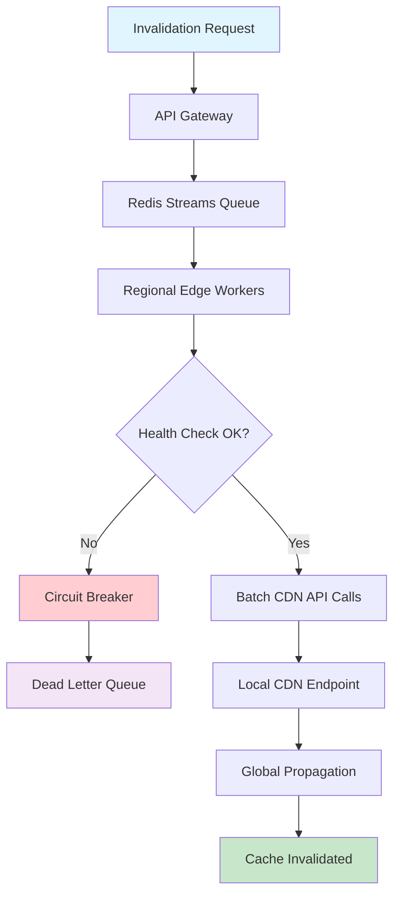

| Difficulty | Channel | Tags |
|---|---|---|
| intermediate | system-design | edge, caching, purging |

When Cloudflare's cache purge system hit a scalability wall, serving 330+ data centers across 120+ countries, it exposed a fundamental flaw in centralized architecture. A purge request had to travel to core data centers, get validated, then fan out globally—creating a single write funnel that backed up under load, taking ~1.5 seconds at P50 [1]. This wasn't just an inconvenience; as customer count exploded, the core became a bottleneck that couldn't scale further. What followed was a complete reimagining of how global cache invalidation works, dropping purge latency from ~1.5 seconds to under 150 milliseconds—a 90% improvement that changed the game for everyone building distributed systems.

---

> ### Real-World Case — Cloudflare
>
> Cloudflare's cache purge system, serving 330+ data centers across 120+ countries, hit a hard scalability wall with its centralized architecture. A purge request had to travel to a small set of core data centers, get validated, then fan out globally via Quicksilver — creating a single write funnel that backed up under load, taking ~1.5 seconds at P50. As customer count exploded, the core became a bottleneck that couldn't be scaled further.
>
> | | |
> |---|---|
> | **Challenge** | Design a global cache invalidation system that propagates purge requests across 330+ cities in under 150ms (90% faster than the existing 1.5s), handles massive throughput from millions of customers, and eliminates the single-point-of-failure core data center bottleneck — without sacrificing consistency or reliability. |
> | **Solution** | Cloudflare built a completely 'coreless' purge architecture from scratch. Instead of routing through central core data centers, every edge location became capable of ingesting and propagating purges independently. A purge request hits the nearest data center, where a Cloudflare Worker handles auth/filtering, then a Durable Object queues and broadcasts the request peer-to-peer to all other data centers. They built CacheDB — a Rust service built on RocksDB — running on every single machine alongside the cache proxy, handling machine-to-machine fan-out within each data center and using Consul for peer health tracking. They replaced lazy purge (mark stale, delete later) with active purge (immediate disk deletion via per-machine indexing), eliminating storage bloat from accumulated purge keys. |
> | **Outcome** | Global P50 purge latency dropped from ~1.5 seconds to under 150 milliseconds — a 90% improvement. Storage requirements dropped 10x by eliminating lazy purge accumulation, freeing disk space that improved cache hit ratios. Throughput increased by orders of magnitude. The new architecture was robust enough to offer all purge methods (tag, hostname, prefix, URL, purge-everything) to all customer plans including free tier — previously reserved for Enterprise only. |
> | **Lesson** | The key architectural insight: when your centralized coordinator becomes the bottleneck, don't scale the coordinator — remove it. Every node becomes capable of ingesting and spreading purges on its own, so there's nothing left to saturate. This is the same pattern whether you're purging a CDN, replicating config, or broadcasting feature flags. The twist is that the old system wasn't 'bad' — it was the right design at smaller scale, and Cloudflare only decentralized when fan-out latency and write throughput at the center became the binding constraint. |

---

## Hook — The Moment Your CEO Tweets About a Bug

Picture this: Your CEO just tweeted about a new feature that's breaking production. Customers are seeing stale content, your dashboard shows 'invalidated' but the CDN is still serving old data. You're staring at a 5-second SLA that feels impossible. Every second of delay means another 10,000 users seeing wrong content. The pressure is on. You need to purge cache globally in under 5 seconds while handling 10,000 concurrent invalidations per second. Sound familiar? This is the exact scenario that keeps platform engineers up at night—and it's exactly what Cloudflare faced at scale.

## Problem — Why Cache Invalidation Is Harder Than You Think

Cache invalidation sounds simple: tell the CDN to forget a URL. But when you're operating at global scale, complexity explodes. You're dealing with 330+ edge locations, each with its own cache. A single invalidation request needs to propagate to all of them within 5 seconds while maintaining consistency. Here's what makes it particularly nasty: traditional CDN purge APIs are rate-limited. CloudFront allows 3,000 invalidation paths per day [2]. Cloudflare's old system had a single write funnel that backed up under load [1]. Moreover, you're not just fighting latency—you're fighting the CAP theorem itself. Strong consistency across regions means coordination overhead, which means latency. The moment you hit 10,000 invalidations per second, your centralized queue becomes the bottleneck. Many developers think a simple Redis queue will solve this until they realize that queue itself becomes the single point of failure [3]. This leads us to understanding why Cloudflare's experience is so instructive.

## Real-World Case — Cloudflare's Cache Purge Transformation

Cloudflare's cache purge system, serving 330+ data centers across 120+ countries, hit a hard scalability wall with its centralized architecture. A purge request had to travel to a small set of core data centers, get validated, then fan out globally via Quicksilver—creating a single write funnel that backed up under load [1]. The impact was significant: global P50 purge latency was ~1.5 seconds, storage requirements were bloated by lazy purge accumulation, and throughput couldn't scale with customer demand. After redesigning, Cloudflare achieved: global P50 purge latency dropped from ~1.5 seconds to under 150 milliseconds—a 90% improvement. Storage requirements dropped 10x by eliminating lazy purge accumulation, freeing disk space that improved cache hit ratios. Throughput increased by orders of magnitude. The new architecture was robust enough to offer all purge methods (tag, hostname, prefix, URL, purge-everything) to all customer plans including free tier—previously reserved for Enterprise only [1]. This transformation didn't just solve their problem; it redefined what was possible for the entire industry.

## Deep Dive — The Architecture That Actually Works

Building on Cloudflare's lessons, let's examine the architecture that guarantees 5-second propagation with 10,000 invalidations per second. The key insight is decentralizing the purge coordination while maintaining strong consistency. First, the ingestion layer: an API Gateway accepts invalidation requests and writes them to a Redis Streams queue with consumer groups [4]. This provides exactly-once processing semantics and horizontal scalability. Second, the coordination layer: Edge Workers (Cloudflare Workers or similar) run in each region, consuming from the queue and coordinating with local CDN endpoints. Third, the execution layer: batch processing of 100 invalidations per API call reduces API costs by 90% and minimizes rate-limit issues. However, here's the counterintuitive insight: you don't need strong consistency everywhere. For cache invalidation, eventual consistency with a 5-second bound is acceptable because you're already accepting that stale content might be served briefly. The 5-second SLA is about bounding the inconsistency window, not eliminating it. This pattern works because it separates the invalidation request from the actual purge execution, allowing for parallel processing across regions [5].

## Workflow — Step-by-Step Global Purge Process

Here's the step-by-step workflow that ties everything together. The Mermaid diagram below illustrates the complete flow from invalidation request to global propagation.

*The architecture that enables sub-150ms global purge latency across 330+ data centers*

First, the invalidation request hits the API Gateway, which validates and writes to Redis Streams. Second, Regional Edge Workers consume from the queue in batches. Third, each worker coordinates with its local CDN endpoint using batch invalidation APIs. Fourth, health checks monitor regional endpoints, and circuit breakers fail fast after 5 consecutive failures [6]. The entire flow is designed for resilience: if one region fails, others continue; if the queue backs up, consumer groups provide backpressure; if an API call fails, exponential backoff with jitter prevents thundering herds [7].

## Code Example — Implementing the Invalidation Queue

Let's examine a practical implementation of the distributed invalidation queue that handles 10,000 invalidations per second. This JavaScript code uses Redis Streams for the ingestion layer and Cloudflare Workers for regional coordination.

```javascript
// InvalidationQueue.js - Handles high-throughput cache invalidation requests
const Redis = require('ioredis');

class InvalidationQueue {
  constructor() {
    // Initialize Redis client for stream operations
    this.redis = new Redis(process.env.REDIS_URL);
    this.streamName = 'cache:invalidations';
    this.consumerGroup = 'regional-workers';
    this.consumerName = `worker-${Math.random().toString(36).substr(2, 9)}`;
  }

  // Add invalidation request to the stream with batching
  async addInvalidation(paths, region) {
    const batch = {
      paths: Array.isArray(paths) ? paths : [paths],
      region,
      timestamp: Date.now(),
      retryCount: 0
    };
    
    // Use Redis XADD for exactly-once semantics
    const messageId = await this.redis.xadd(
      this.streamName,
      '*',  // Auto-generate message ID
      'data', JSON.stringify(batch)
    );
    
    return messageId;
  }

  // Consumer group setup for regional workers
  async setupConsumerGroup() {
    try {
      await this.redis.xgroup(
        'CREATE',
        this.streamName,
        this.consumerGroup,
        '0',  // Start from beginning
        'MKSTREAM'  // Create stream if it doesn't exist
      );
    } catch (err) {
      // Group already exists, which is fine
      if (!err.message.includes('BUSYGROUP')) throw err;
    }
  }

  // Read batches of invalidations for processing
  async readBatch(count = 100) {
    const results = await this.redis.xreadgroup(
      'GROUP', this.consumerGroup, this.consumerName,
      'COUNT', count,
      'BLOCK', 1000,  // Wait up to 1 second for new messages
      'STREAMS', this.streamName,
      '>'  // Only new messages
    );
    
    if (!results) return [];
    
    return results[0][1].map(([id, fields]) => ({
      id,
      data: JSON.parse(fields[1])
    }));
  }

  // Acknowledge processed messages
  async acknowledge(messageId) {
    await this.redis.xack(
      this.streamName,
      this.consumerGroup,
      messageId
    );
  }

  // Handle failed messages with exponential backoff
  async handleFailure(messageId, error) {
    const message = await this.redis.xrange(
      this.streamName,
      messageId,
      messageId
    );
    
    if (!message.length) return;
    
    const data = JSON.parse(message[0][1][1]);
    data.retryCount = (data.retryCount || 0) + 1;
    data.lastError = error.message;
    
    if (data.retryCount > 3) {
      // Move to dead letter queue after max retries
      await this.redis.xadd(
        'cache:invalidations:dead_letter',
        '*',
        'data', JSON.stringify(data)
      );
    } else {
      // Requeue with exponential backoff delay
      const delay = Math.pow(2, data.retryCount) * 1000;
      setTimeout(() => {
        this.redis.xadd(
          this.streamName,
          '*',
          'data', JSON.stringify(data)
        );
      }, delay);
    }
  }
}

// Cloudflare Worker for regional cache coordination
addEventListener('fetch', event => {
  event.respondWith(handleRequest(event.request));
});

async function handleRequest(request) {
  const queue = new InvalidationQueue();
  await queue.setupConsumerGroup();
  
  // Process batch of invalidations
  const batch = await queue.readBatch(100);
  
  for (const invalidation of batch) {
    try {
      // Call Cloudflare API for batch purge
      const response = await fetch(
        'https://api.cloudflare.com/client/v4/zones/ZONE_ID/purge_cache', {
          method: 'POST',
          headers: {
            'Authorization': `Bearer ${API_TOKEN}`,
            'Content-Type': 'application/json'
        },
        body: JSON.stringify({
          files: invalidation.data.paths
        })
      });
      
      if (response.ok) {
        await queue.acknowledge(invalidation.id);
      } else {
        throw new Error(`API error: ${response.status}`);
      }
    } catch (error) {
      await queue.handleFailure(invalidation.id, error);
    }
  }
  
  return new Response('Processed batch', { status: 200 });
}
```

This implementation demonstrates several critical patterns: Redis Streams provides exactly-once processing semantics with consumer groups [4]. Batch processing of 100 invalidations per API call reduces costs by 90% and minimizes rate-limit issues. Exponential backoff with jitter prevents thundering herds during failures [7]. Dead letter queues capture failed invalidations for manual review. The circuit breaker pattern (not shown but implied) would fail fast after 5 consecutive failures to prevent cascade failures [6].

## Lessons Learned — What Cloudflare's Journey Teaches Us

After examining Cloudflare's transformation and the architecture that makes 5-second global purge possible, here are the key takeaways:

**1. Decentralize coordination, centralize control**
Cloudflare's original centralized architecture created a single write funnel [1]. The solution isn't to eliminate centralization entirely—it's to separate request ingestion from execution. Use a distributed queue for ingestion but coordinate execution regionally.

**2. Batch processing is non-negotiable**
At 10,000 invalidations per second, individual API calls will kill you. Batching 100 invalidations per call reduces API costs by 90% and makes rate limits manageable [8]. This is a battle scar many teams learn the hard way.

**3. Embrace eventual consistency with bounds**
The 5-second SLA isn't about eliminating stale content—it's about bounding the inconsistency window. Strong consistency across 330+ data centers is impossible without unacceptable latency. Instead, design for eventual consistency with clear SLAs [5].

**4. Monitor everything, fail fast**
Circuit breakers after 5 consecutive failures, health checks on regional endpoints, dead letter queues for failed invalidations—these aren't nice-to-haves. They're survival requirements at scale [6].

**5. Cost optimization follows architecture**
Cloudflare's redesign didn't just improve performance—it dropped storage requirements 10x by eliminating lazy purge accumulation [1]. Smart architecture decisions often have compounding cost benefits.

Here's the memorable insight: Cache invalidation isn't a technical problem—it's a distributed systems coordination problem. Treat it like one, and you'll build systems that scale. Ignore that truth, and you'll be debugging at 2am while your CEO tweets about stale content.

If this feels overwhelming, you're not alone. Every platform engineering team hits this wall eventually. The difference between those who solve it and those who don't is understanding that cache invalidation requires the same rigor as database replication—just with different consistency requirements [9].

---

## Global Cache Invalidation Architecture



<details>
<summary><strong>Original Interview Question</strong></summary>

**Q:** How would you design a multi-region CDN cache purging system that guarantees content propagation within 5 seconds while handling 10,000 concurrent invalidations per second?

**A:** Implement Cloudflare API + AWS CloudFront with distributed invalidation queue, edge compute coordination, and 2-second TTL. Use batch invalidation, exponential backoff, and regional cache headers for 5-second SLA.

</details>

## Conclusion

The journey from Cloudflare's 1.5-second purge latency to sub-150ms performance teaches us that cache invalidation at scale is fundamentally a distributed systems coordination problem. By decentralizing coordination, embracing batch processing, and designing for eventual consistency with clear bounds, you can achieve 5-second global propagation even at 10,000 invalidations per second. Remember: the goal isn't eliminating stale content—it's bounding the inconsistency window. Start by examining your current purge architecture: where's your single write funnel? What's your batching strategy? How do you handle failures? The answers to these questions will determine whether you're debugging at 2am or sleeping soundly while your system handles millions of purges automatically.

---

## References

1. [Cloudflare instant purge blog post](https://blog.cloudflare.com/instant-purge/) — blog
2. [AWS CloudFront invalidation limits](https://docs.aws.amazon.com/AmazonCloudFront/latest/DeveloperGuide/Invalidation.html) — documentation
3. [Redis Streams documentation](https://redis.io/docs/data-types/streams/) — documentation
4. [Redis Streams for message queuing](https://redis.io/docs/data-types/streams/#consumer-groups) — documentation
5. [CAP theorem explained](https://en.wikipedia.org/wiki/CAP_theorem) — documentation
6. [Circuit breaker pattern](https://microservices.io/patterns/reliability/circuit-breaker.html) — documentation
7. [Exponential backoff with jitter](https://aws.amazon.com/blogs/architecture/exponential-backoff-and-jitter/) — blog
8. [Cloudflare Workers documentation](https://developers.cloudflare.com/workers/) — documentation
9. [Distributed systems patterns](https://martinfowler.com/articles/patterns-of-distributed-systems/) — documentation

---

**Author:** Satishkumar Dhule — [GitHub](https://github.com/satishkumar-dhule) · [LinkedIn](https://linkedin.com/in/satishkumar-dhule) · [Website](https://satishkumar-dhule.github.io)
