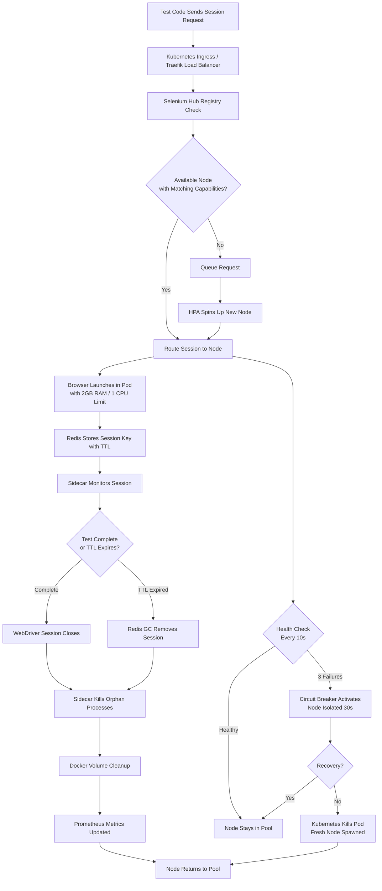

| Difficulty | Channel | Tags |
|---|---|---|
| advanced | system-design | selenium, webdriver, grid |

Expedia Group was drowning. With 2,000 developers pushing 250+ daily check-ins and 150,000+ UI tests to execute, their Selenium Grid infrastructure was buckling under its own weight [1]. What started as a few Jenkins executors running 9,000 tests evolved into a sprawling network of 100+ hubs, 4,500+ EC2 nodes spinning up and down daily, and a CI feedback loop that could stretch for hours. The shocking part? They eventually discovered that scaling Selenium Grid to handle 10,000 concurrent sessions with 99.9% uptime isn’t about throwing more servers at the problem — it’s about fundamentally rethinking how you manage session lifecycle, node health, and failure recovery across data centers.

---

> ### Real-World Case — Expedia Group
>
> With 2,000+ developers and 250+ daily check-ins, Expedia needed to scale their Selenium test infrastructure from running 9,000 UI tests on Jenkins executors to handling 150,000+ tests daily across 100+ Selenium Grid hubs — eventually evolving from EC2-based autoscaling to a full Kubernetes (EKS) deployment with Docker, Helm, and Traefik (called 'DA-Kube').
>
> | | |
> |---|---|
> | **Challenge** | Running thousands of UI tests sequentially took hours, killing developer productivity and blocking CI/CD. The original EC2-based SeleniumGridScaler had 2-4 minute node spin-up times, static hubs requiring manual start/stop, and couldn't support shift-left testing or multi-AWS-account scenarios with overlapping private IPs. |
> | **Solution** | Built SeleniumGridScaler — a custom Selenium Grid plugin using the EC2 API to auto-scale browser nodes on demand. Each c5.xlarge instance ran 15 parallel Chrome/Firefox sessions (not 1 per instance). Nodes were terminated at billing cycle boundaries to minimize waste. Later migrated to DA-Kube: Kubernetes (EKS) + Docker + Helm + Traefik, enabling dynamic hub creation, per-branch grid isolation, and cross-account routing via domain-based ingress. |
> | **Outcome** | 150,000+ tests/day across 100+ hubs. 4,500+ EC2 nodes created, used, and terminated on demand daily. UI test suite execution reduced from hours to under 5 minutes. Self-hosted infrastructure cost ~$80,000/year versus $2.41M estimated for equivalent cloud cross-browser vendor (1,000 parallel connections). CI feedback loop went from 350+ Jenkins jobs to a handful of unified pipelines. |
> | **Lesson** | The key insight: running 15 browser sessions per c5.xlarge instance instead of 1 per t2.small cuts costs in half AND saves 14 IP addresses per batch. At scale, IP address exhaustion became a critical bottleneck — a c5.2xlarge only supports 19 browser pods due to Kubernetes IP reservation policies, not the theoretical 30. The 'pay only for what you use' model with per-second billing awareness and automatic node termination at billing cycle boundaries was essential for cost control at this scale. |

---

## Lessons Learned — Battle Scars From the Trenches

After analyzing architectures like Expedia’s DA-Kube [1] and many scaled Selenium deployments, here are the hard-won lessons that separate teams who succeed from those who keep restarting their grids at 2am:

**Lesson 1: Memory leaks are a lifecycle problem, not a resource problem.** Simply adding more RAM won’t fix zombie sessions. You need automatic TTL-based cleanup (Redis), sidecar monitors, and preStop lifecycle hooks working together [6]. The day you stop manually killing orphaned Chrome processes is the day your grid becomes reliable.

**Lesson 2: Circuit breakers save more than just nodes.** When a Selenium node starts returning garbage results due to memory pressure, it can corrupt test outcomes and waste CI minutes. Isolating failing nodes within 30 seconds (3 health check failures × 10s interval) prevents cascading failures [7]. Many developers overlook this until they find 50 tests reporting false negatives from a degraded node.

**Lesson 3: Pod Disruption Budgets are non-negotiable.** A Kubernetes rolling update without a PDB is a grenade in your test infrastructure. Set minAvailable to 85% [5]. Yes, this means upgrades take longer. But it also means your 250+ daily check-ins don’t suddenly have nowhere to run.

**Lesson 4: The sidecar pattern is your secret weapon.** The cleanup sidecar container (lines 74-90 in the code example) is arguably more important than the browser container itself. It hunts orphaned processes, cleans Docker volumes, and feeds Prometheus the metrics you need to spot trends before they become outages [6].

**Lesson 5: Calculate for leakage, not just baseline.** Your 200 nodes × 2GB = 400GB math is wrong. Add 30% buffer minimum for overhead, and expect 40-60% above baseline during peak hours when session leakage accumulates [3]. Budget for 520GB+ and you’ll sleep better.

**Lesson 6: Start with the Hub, not the nodes.** The Selenium Hub is the single most critical component. Deploy it as a Kubernetes Deployment with anti-affinity rules to spread across AZs, configure session queuing with sensible timeouts, and monitor its JVM heap like a hawk [4]. A Hub crash takes down the entire grid.

If this feels overwhelming, remember: Expedia started with 9,000 tests on Jenkins executors and scaled to 150,000+ daily tests across 100+ hubs [1]. You don’t have to build everything at once. Start with the Hub-Node pattern on Kubernetes, add Redis session tracking, implement health checks, and grow from there. The infrastructure will meet you where you are — as long as you respect the lifecycle.

---

## Selenium Grid Session Lifecycle Flow

<strong>Original Interview Question</strong>

**Q:** Design a scalable Selenium Grid architecture to handle 10,000 concurrent test sessions with 99.9% uptime, ensuring zero memory leaks through automatic session lifecycle management, real-time monitoring, and graceful node failure recovery across multiple data centers?

**A:** Deploy Kubernetes cluster with auto-scaling node pools, Redis session store with TTL policies, Prometheus metrics for memory monitoring, circuit breakers for node isolation, and sidecar containers for session cleanup. Implement health checks, resource quotas, and rolling updates.

## Conclusion

The journey from a handful of Jenkins executors to a 10,000-session Selenium Grid isn’t about bigger servers or more RAM — it’s about respecting the lifecycle of every browser session. Expedia proved it by cutting costs by 97% and slashing test execution from hours to minutes [1]. The five pillars — Hub-Node on Kubernetes, Redis TTL tracking, circuit breakers, resource quotas, and sidecar cleanup — work together as a system, not isolated solutions. Start with health checks and session TTLs. Add the sidecar. Layer in circuit breakers. And always, always budget for memory leakage. Your future on-call self will thank you.

---

## References

1. [Expedia Group: DA-Kube Selenium Grid Using Kubernetes, Docker, Helm, and Traefik](https://medium.com/expedia-group-tech/da-kube-selenium-grid-using-kubernetes-docker-helm-and-traefik-856b802d1d08) — blog
2. [Selenium WebDriver: Grid Configuration](https://www.selenium.dev/documentation/grid/configuration/) — documentation
3. [Kubernetes Resource Management for Pods and Containers](https://kubernetes.io/docs/concepts/configuration/manage-resources-containers/) — documentation
4. [Selenium Grid Architecture Overview](https://www.selenium.dev/documentation/grid/) — documentation
5. [Kubernetes Horizontal Pod Autoscaler](https://kubernetes.io/docs/tasks/run-application/horizontal-pod-autoscale/) — documentation
6. [Kubernetes Assign Pods to Nodes Using Node Affinity](https://kubernetes.io/docs/concepts/scheduling-eviction/assign-pod-node/) — documentation
7. [Netflix Hystrix: Latency and Fault Tolerance Library](https://github.com/Netflix/Hystrix) — documentation
8. [Selenium Grid Docker Deployment](https://github.com/SeleniumHQ/docker-selenium) — documentation
9. [Prometheus Monitoring: Getting Started](https://prometheus.io/docs/prometheus/latest/getting_started/) — documentation

---

**Author:** Satishkumar Dhule — [GitHub](https://github.com/satishkumar-dhule) · [LinkedIn](https://linkedin.com/in/satishkumar-dhule) · [Website](https://satishkumar-dhule.github.io)
