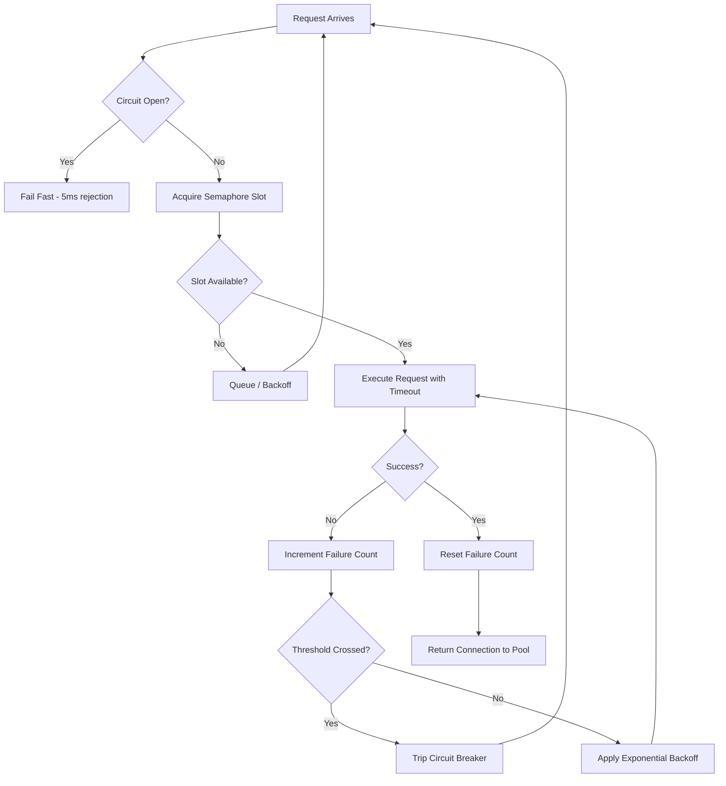

| Difficulty | Channel | Tags |
|---|---|---|
| advanced | backend | asyncio, aiohttp, concurrency |

It starts with one slow endpoint. Just one. But in a system where thousands of services lean on each other, a single latent dependency can turn into a domino effect that takes down everything. Netflix knows this story intimately — they engineered an entire resilience framework around it, running 100+ circuit breaker command types and over 210 billion command executions per day to keep their platform alive [1]. This is the story of how you can borrow those same battle-tested lessons for your own aiohttp connection pools, and build something that fails gracefully instead of failing catastrophically.

---

> ### Real-World Case — Netflix
>
> Netflix operated a microservices architecture with thousands of dependencies, running 100+ circuit breaker command types, 40+ thread pools, and executing over 210 billion command executions per day across their API cluster. When a single downstream dependency became latent, connection pools saturated and cascading failures threatened the entire platform.
>
> | | |
> |---|---|
> | **Challenge** | A slow or failing downstream service would cause connection pools to exhaust across the cluster. Engineers' instinctive reaction was to increase pool sizes and timeouts to 'give it breathing room' — but this made things catastrophically worse, turning a partial failure into a self-inflicted DDoS against their own backend. |
> | **Solution** | Netflix built and deployed Hystrix, implementing circuit breakers, thread/semaphore isolation, fallbacks, and graceful degradation at massive scale. The critical insight was counterintuitive: instead of increasing resources during degradation, they intentionally shed load through short-circuiting, timeouts, and rejections. Their approach was to deploy circuits with liberal defaults, run them in production for 24 hours, then tune down to strict settings based on real 99.5th percentile latency data. They also used Latency Monkey (a Simian Army tool) to simulate failures in production and validate resilience. |
> | **Outcome** | The system handled 10+ billion thread-isolated and 200+ billion semaphore-isolated command executions per day. When a single dependency had latency issues, Hystrix tripped the circuit breaker on ~1/3 of the 243-server cluster while keeping all other circuits healthy — users received a degraded but functional experience via fallbacks instead of an outage. The cascade failure diagrams show that without Hystrix, a single latent system would bring down 6+ dependent circuits across 3 systems; with Hystrix adoption spreading across teams, cascade impact was progressively contained. |
> | **Lesson** | Increasing connection pool limits and timeouts during a service degradation is a trap — it amplifies the problem by DDOS-ing yourself. With 100 servers × 10 connections = 1,000 total, normally using 200-300; if latency saturates all 1,000 and you double limits to 20 per server, you now hold 2,000 connections open against a struggling backend, making recovery impossible. The correct response is to let circuit breakers shed load, short-circuit, and fail fast so the downstream system can recover. |

---

## Hook — One slow endpoint is all it takes

Picture this: your API is humming along, handling ten thousand requests a minute. Then one downstream microservice — the one that fetches user profiles, say — starts responding in 45 seconds instead of 40 milliseconds. Sounds manageable, right? Wrong. Those slow responses don't just sit in a queue. They hold connections hostage. Every in-flight request is a thread or semaphore slot that nothing else can use. Your pool saturates. New requests pile up. Timeouts cascade. And suddenly, the service that was fine an hour ago is returning 500s for every single caller. This is the hidden cost of connection pools without guardrails — and it's a story every backend developer eventually lives through. Sound familiar?

## Problem — When your connection pool becomes a bottleneck instead of a buffer

Here's the uncomfortable truth: a connection pool is only as good as its weakest failure mode. Most developers treat pools as a simple optimization — reuse connections, avoid TCP handshake overhead, done. But a pool is really a *pressure valve* for a system under load, and pressure valves need regulation. Without limiting, backoff, and circuit breaking, your pool doesn't protect you — it just concentrates the damage. When one downstream service gets slow, every connection in your pool gets stuck on that slow service. Then every new request waits on the semaphore. Then the semaphore queue grows unbounded. Then memory balloons. Then the whole process dies. The core problem: *latency is contagious*, and without isolation, one sick dependency infects the entire system. So the real question isn't "how do I pool connections?" — it's "how do I make sure a pool degrades gracefully when the world around it falls apart?"

## Real-World Case — Netflix's war against cascading failure

The definitive lesson comes from Netflix, which built its microservices architecture on a mind-bending scale: thousands of dependencies, over 100 circuit breaker command types, 40+ thread pools, and more than 210 billion command executions per day across its API cluster [1]. The threshold for disaster was alarmingly low. When a single downstream dependency became latent, connection pools saturated — the exact scenario playing out in your codebase right now. Here's what happened: on a 243-server cluster, one sluggish dependency tripped the circuit breaker on roughly a third of the servers. But here's the plot twist — *that was the success story*. Because Hystrix tripped those breakers early, every other circuit stayed healthy. Users got a degraded but functional experience through fallbacks instead of a total outage [1]. The internal cascade diagrams told an even scarier tale: without a circuit breaker, one latent system would have dragged down 6+ dependent circuits across 3 systems. With Hystrix spreading across teams, the cascade impact got progressively contained [1]. The lesson is brutally simple: isolation isn't a luxury, it's survival.

## Deep Dive — The anatomy of a resilient connection pool

Building on Netflix's experience, let's dissect what actually makes a connection pool resilient. It's not one trick — it's a stack of defensive layers, each handling a different failure mode.

**Layer 1: Semaphores limit concurrency.** A semaphore caps how many requests can be in flight at once. This is your first line of defense — it prevents the pool from being overwhelmed by a burst. But a semaphore alone just moves the problem; it queues up excess work instead of executing it.

**Layer 2: Exponential backoff tames retries.** When a request fails, naive retry logic is a disaster — it piles retries on top of an already-failing service, amplifying the load. Exponential backoff inserts growing delays between attempts, giving the downstream service time to recover. The math matters more than the intuition: 1s, 2s, 4s, 8s — each doubling is a cool-down period, not a waste of time.

**Layer 3: The circuit breaker is the keystone.** This is where Netflix's magic lives. The circuit breaker watches failure rates. Too many failures in a short window? It trips, and *instantly* fails fast on all subsequent requests without even trying the connection. This is the "plot twist" most developers miss: **the fastest request is the one you never send.** A tripped circuit breaker converts a 30-second timeout into a 5-millisecond rejection. That's the entire game.

**The tradeoff table** — here's what you're really choosing between:

| Approach | Failure response | Risk | When to use |
|---|---|---|---|
| No pool | New TCP per request | Handshake overhead, no reuse | Prototypes only |
| Pool + semaphore only | Queues up, starves on slow deps | Cascade on latency | Low-traffic services |
| Pool + semaphore + backoff | Retries with delays | Retry storms overwhelm | Modest dependencies |
| Pool + semaphore + backoff + circuit breaker | Fails fast, isolates faults | Slightly more complexity | **Production microservices** |

The counterintuitive insight: a circuit breaker that rejects requests is a *feature*, not a bug. It converts a slow catastrophic collapse into a fast, contained degradation.

## Workflow — From request to resilient response

So how does all of this fit together at runtime? Here's the decision journey a single request follows through a properly guarded pool. This process — depicted in the diagram below — is the difference between a system that survives and one that melts down.

1. **Request arrives** and checks the circuit breaker state first.
2. **If the circuit is open** (too many recent failures), the request fails fast immediately — no connection attempt, no timeout wait.
3. **If the circuit is closed**, the request acquires a semaphore slot, bounding concurrent connections.
4. **The request executes** against the downstream service with a strict timeout.
5. **On success**, the circuit breaker resets its failure count. The connection returns to the pool for reuse (keepalive).
6. **On timeout or connection error**, the failure count increments. If it crosses the threshold within the window, the circuit trips — shutting off traffic to that service.
7. **Backoff logic** decides whether and when to retry, spreading attempts apart so a failing service isn't hammered.
8. **On shutdown**, the pool drains gracefully — releasing connections and closing the session cleanly.

Follow the [[diagram]] below to see this exact flow — every arrow is a decision point that could save your system from a cascade.

## Code Example — Building the guardrails in aiohttp

Now for the part you can actually run. This is a production-oriented `ConnectionPoolManager` that combines every layer we've discussed — semaphore limiting, exponential backoff, health checks, and a circuit breaker — into one cohesive unit. Walk through it line by line, and you'll see each defensive concept materialize.

## Lessons Learned — What survives, what fails, and what to do Monday morning

Let's recap the whole journey, because the surprises are in the details.

**Battle scar #1: Connection leaks are silent killers.** Every `session.get()` without a clean close eventually drains the pool and leaks file descriptors. The `async with` pattern isn't decor — it's your release valve. Asyncio itself warns about unclosed sessions, but only if you're listening [2].

**Battle scar #2: Timeouts are not optional.** Want the single highest-impact fix? Set explicit `ClientTimeout` values. Far too many systems rely on Python's connection-level defaults and then wonder why requests hang forever. A 30-second total timeout is 30 seconds your users shouldn't have to wait [3].

**Battle scar #3: Shutdown cleanup matters.** If your app closes without draining the pool, you get half-open sockets and zombie connections that poison the next deployment. Graceful shutdown isn't polish — it's correctness [4].

**What to do differently tomorrow:**
- Implement the circuit breaker first — it's the highest-leverage piece of the entire design. Netflix's own numbers show it collapsing a one-third-of-cluster failure down to a contained, degraded-but-functional state [1].
- Set real timeouts and handle them explicitly rather than letting them crash into generic exceptions.
- Monitor your pool metrics (in-flight count, failure rates, queue depth) before you need them for debugging — because you *will* need them.
- Add graceful shutdown handling so restarts don't leak connections.

The memorable insight to share with your team: **a connection pool isn't about speed — it's about not taking the whole system down when one thing goes wrong.** The fastest request is the one you never have to send. Netflix proved that at 210 billion executions a day, and now you have the same playbook.

---

## Request Flow Through a Resilient Connection Pool

<strong>Original Interview Question</strong>

**Q:** How would you implement a connection pool manager for aiohttp that handles graceful degradation under high load and connection timeouts?

**A:** Implement a connection pool manager for aiohttp using a semaphore to limit concurrent connections, exponential backoff for retrying failed requests, and circuit breaker pattern to gracefully degrade under high load and connection timeouts.

## Conclusion

The moral of this story is deceptively simple: a connection pool is a system-design decision, not a code snippet. The semaphore bounds the damage, the backoff spreads the recovery, and the circuit breaker — the true hero — turns prolonged failure into fast, clean rejection. Schlupfen your eyes on Netflix's numbers one more time: 210 billion command executions, a third of a cluster going down, and users never noticed because the failure was contained and graceful [1]. You don't need Netflix's scale to deserve that kind of resilience. So tomorrow, pick up your slowest dependency, add a circuit breaker, set real timeouts, and watch what happens when it fails. Spoiler: nothing dramatic happens — and that, paradoxically, is the biggest win of all. The fastest request is the one you never have to send.

---

## References

1. [Netflix incident report](https://github.com/Netflix/Hystrix/wiki/Operations) — article
2. [Asyncio - PEP 3156](https://www.python.org/dev/peps/pep-3156/) — paper
3. [aiohttp Client Timeouts](https://docs.aiohttp.org/en/stable/client_quickstart.html#timeouts) — documentation
4. [Asyncio Event Loop and Coroutines](https://docs.python.org/3/library/asyncio.html) — documentation
5. [Circuit Breaker Pattern](https://en.wikipedia.org/wiki/Circuit_breaker_design_pattern) — article
6. [Bulkhead Pattern](https://en.wikipedia.org/wiki/Bulkhead_pattern) — article
7. [Retry Pattern](https://learn.microsoft.com/en-us/azure/architecture/patterns/retry) — documentation
8. [Semaphore — Python docs](https://docs.python.org/3/library/asyncio-sync.html#asyncio.Semaphore) — documentation
9. [Python Thread Safety and Queue Management](https://docs.python.org/3/library/queue.html) — documentation

---

**Author:** Satishkumar Dhule — [GitHub](https://github.com/satishkumar-dhule) · [LinkedIn](https://linkedin.com/in/satishkumar-dhule) · [Website](https://satishkumar-dhule.github.io)
