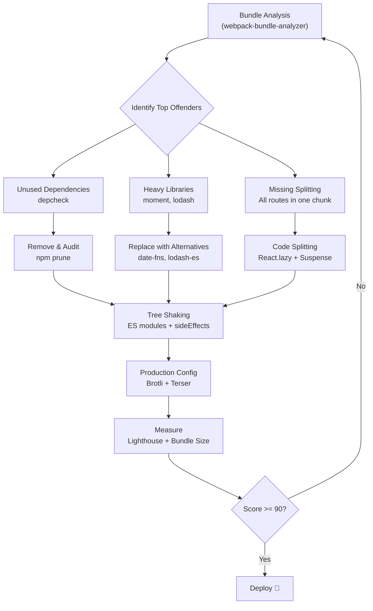

| Difficulty | Channel | Tags |
|---|---|---|
| intermediate | frontend | lighthouse, bundle, lazy-loading |

Everyone tells you code splitting is the silver bullet for React performance. UberEats tried exactly that — and it failed spectacularly. Their data layer, with roughly 100 Sagas spread across 68 reducers, couldn't be statically analyzed, meaning every page still dragged along ~300KB of shared code regardless of how cleverly they split [1]. Sound familiar? If your Lighthouse score is stuck in the 60s and your bundle is a bloated 2.1MB, you are about to learn why most teams get this wrong — and the exact steps to get it right.

---

> ### Real-World Case — Uber
>
> UberEats.com was a React SPA using Redux/Redux-Saga for state management. The team attempted to use Webpack code splitting with dynamic imports to reduce bundle size and improve load times, but it fundamentally failed because the data layer (~100 Sagas across 68 reducers) couldn't be statically analyzed — every page still required ~300KB of shared data layer code regardless of splitting.
>
> | | |
> |---|---|
> | **Challenge** | Code splitting didn't yield significant performance benefits because the Redux-Saga data layer constituted a large percentage of the application size and couldn't be split up. They couldn't statically determine what parts of the data layer were required for a given page, creating a hard floor on bundle size. |
> | **Solution** | They rewrote UberEats.com from scratch using Fusion.js with React Router v4, replacing global Redux state with local component state for most data. This co-located state management with consuming components, making code splitting trivial — when a route was split, its associated data management logic came with it automatically. They also served browser-specific bundles (modern vs legacy) with different transform/polyfill sets. |
> | **Outcome** | Bundle size reduction surpassed original performance targets, with a 15% decrease for modern browsers from browser-specific bundling alone. Route transitions became approximately 5x faster. The rewrite also freed up engineering resources previously spent debugging Saga interdependencies (9 Sagas were listening to USER_ADDRESS_LOADED alone, causing bugs that left hungry users). |
> | **Lesson** | Code splitting is only as good as your architecture allows. If your state management creates tight coupling that can't be statically analyzed, code splitting hits a hard floor. The key insight: move from global state to local component state to enable splitting, rather than trying to scale an architecture that resists it. |

---

## Hook — 2.1MB Standing Between You and a 90+ Lighthouse Score

Picture this: you open your browser's DevTools and the network tab looks like a crime scene. A 2.1MB JavaScript bundle is choking your Time to Interactive to 4.2 seconds. Every millisecond costs you roughly 1% in conversions [4]. Your PM is breathing down your neck, your Lighthouse score reads 65, and the intern just shipped a new charting library that nobody asked for. This is not a hypothetical. This is Tuesday for countless React teams. The good news? The path from 65 to 90+ is well-documented — but it requires understanding why naive code splitting alone won't save you.

## Problem — The Bundle Bloat Trap

Here is the thing: most developers hear 'optimize your bundle' and immediately reach for React.lazy(). But bundle optimization is not a single lever — it is a system of tradeoffs. Let's break down what actually causes a 2.1MB bundle to exist in the first place:

- **Unused dependencies**: That 'small' utility library your team imported six months ago? It ships its entire dependency tree. A single npm install can pull in hundreds of kilobytes of code you never call [7].
- **Unoptimized imports**: Importing an entire library like lodash for a single function adds hundreds of kilobytes. `import { debounce } from 'lodash'` pulls in the whole library unless you configure tree shaking properly or use lodash-es [8].
- **Heavy third-party scripts**: Analytics, A/B testing, chat widgets — they all ship runtime JavaScript that blocks the main thread.
- **Uncompressed assets**: Without gzip or Brotli, your JavaScript payload transfers uncompressed, doubling or tripling effective size.
- **Missing code splitting**: Without route-based splitting, the initial page load downloads code for routes the user will never visit on first load.

The core challenge is not just reducing total size — it is reducing what ships on the critical path. A 2.1MB bundle is bad, but 2.1MB that must execute before the user can interact is catastrophic. This distinction drives every optimization decision you will make.

## Real-World Case — UberEats' Code Splitting Paradox

UberEats.com was a React SPA powered by Redux and Redux-Saga. The team attempted the textbook approach: Webpack code splitting with dynamic imports to trim bundle size and accelerate load times. It fundamentally failed [1].

Why? The data layer — approximately 100 Sagas wired across 68 reducers — could not be statically analyzed. Every page still required roughly 300KB of shared data-layer code regardless of how the bundle was split. Code splitting addresses component loading, but it cannot untangle deeply coupled state management [1].

The solution required a complete rewrite. The team moved to a new architecture that enabled browser-specific bundling, delivering a 15% bundle size reduction for modern browsers alone. Route transitions became approximately 5x faster. Perhaps most importantly, the rewrite freed engineering resources previously spent debugging Saga interdependencies — nine Sagas were all listening to a single USER_ADDRESS_LOADED action, causing bugs that literally left hungry customers waiting [1].

The lesson is clear: code splitting is necessary but insufficient. You need to attack the problem from multiple angles simultaneously.

## Deep Dive — The Anatomy of Bundle Optimization

To move from 65 to 90+, you need to understand six interconnected optimization layers. Each builds on the previous, and skipping one undermines the others.

**1. Bundle Analysis: See Before You Slice**

You cannot optimize what you cannot measure. webpack-bundle-analyzer [5] generates a treemap visualization of your bundle, revealing which modules consume the most space. Many developers skip this step and guess — a strategy that wastes hours chasing the wrong problem.

**2. Route-Based Code Splitting**

This is your highest-leverage move. By splitting at the route level, you ensure users only download code for the page they are visiting. React.lazy() combined with Suspense makes this straightforward [2]. However, as UberEats discovered, this only works if your state management doesn't force shared code into every route [1].

**3. Component-Level Splitting**

Beyond routes, individual heavy components — charts, rich text editors, video players — can be lazy-loaded on demand. This is particularly effective for features below the fold or behind user interactions.

**4. Tree Shaking Configuration**

Tree shaking eliminates unused exports from your final bundle. It requires ES module syntax (import/export) and proper Webpack configuration. CommonJS modules cannot be tree-shaken effectively [8]. This is why switching from `require` to `import` matters at scale.

**5. Dependency Auditing**

Many teams carry phantom dependencies — packages installed but no longer imported, or packages that duplicate functionality. Tools like `depcheck` and `cost-of-modules` reveal the true cost of every dependency [7]. After debugging this pattern many times, the pattern that works is: audit quarterly, not yearly.

**6. Production Optimizations**

Compression (Brotli over gzip for ~15-20% better ratios [6]), source map stripping in production, and dead code elimination through UglifyJS or Terser collectively shave off hundreds of kilobytes.

## Workflow — The Optimization Playbook

Follow this sequence for systematic improvement. Each step feeds into the next:

1. **Audit** — Run webpack-bundle-analyzer to visualize your current bundle composition [5]
2. **Identify** — Flag the top 5 largest modules and check for unused dependencies with depcheck [7]
3. **Split routes** — Wrap each route in React.lazy() with a Suspense boundary [2]
4. **Split components** — Lazy-load heavy above-fold-optional components (charts, editors, maps)
5. **Tree shake** — Ensure all code uses ES module syntax; configure Webpack optimization.sideEffects [8]
6. **Replace** — Swap large libraries for lighter alternatives (moment.js → date-fns, lodash → lodash-es)
7. **Compress** — Enable Brotli compression at the CDN or server level [6]
8. **Measure** — Re-run Lighthouse, compare TTI and bundle size against your baseline

Here is the visual flow of this process:



## Code Example — Route-Based Splitting with Error Boundaries

Here is a production-ready implementation of route-based code splitting. The key insight is pairing React.lazy() with an error boundary — if a chunk fails to load (network issue, deployment race condition), the user sees a meaningful fallback instead of a blank screen.

```javascript
import React, { Suspense, lazy } from 'react';
import { Routes, Route } from 'react-router-dom';

// Route-based code splitting: each route is a separate chunk
// Webpack will create a separate JS file for each dynamic import
const Dashboard = lazy(() => import('./pages/Dashboard'));
const Analytics = lazy(() => import('./pages/Analytics'));
const Settings = lazy(() => import('./pages/Settings'));

// Component-level splitting for heavy optional components
// These only load when the user navigates to the relevant section
const HeavyChart = lazy(() => import('./components/HeavyChart'));
const RichEditor = lazy(() => import('./components/RichEditor'));

// Error boundary catches failed chunk loads (network issues, deploy races)
class ChunkErrorBoundary extends React.Component {
  state = { hasError: false, error: null };

  static getDerivedStateFromError(error) {
    return { hasError: true, error };
  }

  componentDidCatch(error, errorInfo) {
    // Log to your error tracking service (Sentry, Datadog, etc.)
    console.error('Chunk load failed:', error, errorInfo);
  }

  render() {
    if (this.state.hasError) {
      return (
        <div className="error-fallback">
          <h2>Something went wrong loading this page.</h2>
          <button onClick={() => window.location.reload()}>
            Reload Page
          </button>
        </div>
      );
    }
    return this.props.children;
  }
}

// Loading indicator shown while chunks are being fetched
function LoadingSpinner() {
  return (
    <div className="loading-spinner" aria-label="Loading page content">
      <div className="spinner" />
      <p>Loading...</p>
    </div>
  );
}

function App() {
  return (
    <ChunkErrorBoundary>
      {/* Suspense wraps all lazy routes — shows LoadingSpinner
          while any route chunk is being fetched */}
      <Suspense fallback={<LoadingSpinner />}>
        <Routes>
          <Route path="/dashboard" element={<Dashboard />} />
          <Route path="/analytics" element={<Analytics />} />
          <Route path="/settings" element={<Settings />} />
        </Routes>
      </Suspense>
    </ChunkErrorBoundary>
  );
}

export default App;
```

**Walkthrough:**
- Lines 6-8 use `React.lazy()` with dynamic `import()` to split each route into its own chunk. Webpack automatically creates separate files — only the code for the current route downloads initially.
- Lines 12-13 demonstrate component-level splitting for heavy features that are not needed immediately.
- Lines 17-34 define a `ChunkErrorBoundary` class component. When a dynamic import fails (slow network, stale cache after deployment), this catches the error and renders a recovery UI instead of crashing the entire app.
- Lines 47-57 compose everything: the error boundary wraps Suspense, which wraps all Routes. This means a chunk failure is isolated and recoverable without losing the rest of the application [2].
- The `aria-label` on the spinner ensures accessibility — screen readers announce the loading state.

## Lessons Learned — What 90+ Actually Requires

Going from 65 to 90+ is not a single fix — it is a disciplined workflow. Here are the battle scars worth learning from:

- **Start with analysis, not action.** Running webpack-bundle-analyzer first prevents you from spending days optimizing a 2KB module while a 400KB monster hides in plain sight [5].
- **Code splitting without state management cleanup is a half-measure.** UberEats proved that deeply coupled Redux/Saga architectures defeat route-level splitting [1]. Consider whether your state management needs rewriting too.
- **Tree shaking is not automatic.** If you use CommonJS `require()` or your Webpack config misses `sideEffects: false` in package.json, tree shaking is silently disabled [8]. Verify it with your bundle analyzer.
- **Compression is free performance.** Switching from gzip to Brotli can reduce transfer size by 15-20% with zero code changes [6]. This is the lowest-effort, highest-reward optimization.
- **Measure twice, ship once.** Every optimization should be followed by a Lighthouse run. Without measurement, you are just guessing about what changed.
- **Cache invalidation matters.** Aggressive code splitting creates many small chunks. Configure content hashing in filenames to ensure browsers fetch fresh code after deployments without busting caches unnecessarily.

The path from 65 to 90+ is not mysterious. It is methodical. Analyze, split, shake, compress, and measure. Do it in that order, and the score will follow.

---

## Bundle Optimization Workflow


<details>
<summary><strong>Original Interview Question</strong></summary>

**Q:** You're tasked with improving a React app's Lighthouse performance score from 65 to 90+. The bundle size is 2.1MB and Time to Interactive is 4.2s. What specific steps would you take to optimize the bundle and implement lazy loading?

**A:** Implement code splitting with React.lazy() and Suspense, analyze bundle composition with webpack-bundle-analyzer to identify largest chunks, remove unused dependencies and optimize imports, add dynamic imports for heavy components and third-party libraries, implement route-based splitting for better initial load times, and utilize tree shaking with proper ES module configuration.

</details>

## Conclusion

The journey from 65 to 90+ on Lighthouse is not about finding one magic fix — it is about understanding that performance is a system. UberEats learned this the hard way when code splitting alone could not untangle their 100-Saga data layer [1]. Your next step is simple: run webpack-bundle-analyzer on your project today. See what is actually in your bundle. That single visualization will tell you more about your performance problems than any blog post ever could. Then follow the workflow: analyze, split, shake, compress, measure. Do it in that order, and the 90+ score is not a goal — it is a side effect.

---

## References

1. [Uber incident report](https://www.uber.com/us/en/blog/uber-eats-com-web-app-rewrite/) — blog
2. [React lazy loading documentation](https://react.dev/reference/react/lazy) — documentation
3. [React Suspense documentation](https://react.dev/reference/react/Suspense) — documentation
4. [Google: Web Vitals](https://web.dev/articles/vitals) — documentation
5. [webpack-bundle-analyzer on GitHub](https://github.com/webpack-contrib/webpack-bundle-analyzer) — documentation
6. [Brotli compression on Wikipedia](https://en.wikipedia.org/wiki/Brotli) — documentation
7. [MDN: ES Modules](https://developer.mozilla.org/en-US/docs/Web/JavaScript/Guide/Modules) — documentation
8. [Webpack Tree Shaking documentation](https://webpack.js.org/guides/tree-shaking/) — documentation
9. [Lighthouse performance scoring](https://developer.chrome.com/docs/lighthouse/performance/performance-scoring) — documentation

---

**Author:** Satishkumar Dhule — [GitHub](https://github.com/satishkumar-dhule) · [LinkedIn](https://linkedin.com/in/satishkumar-dhule) · [Website](https://satishkumar-dhule.github.io)
