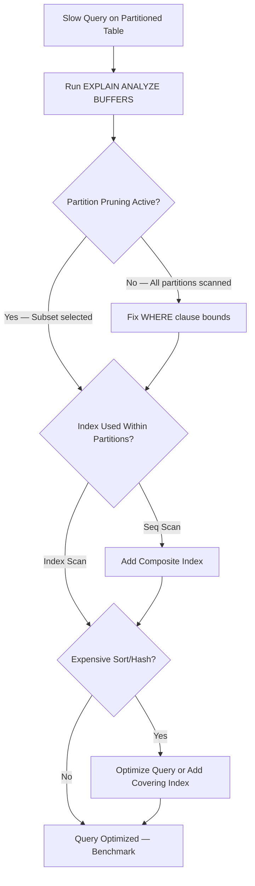
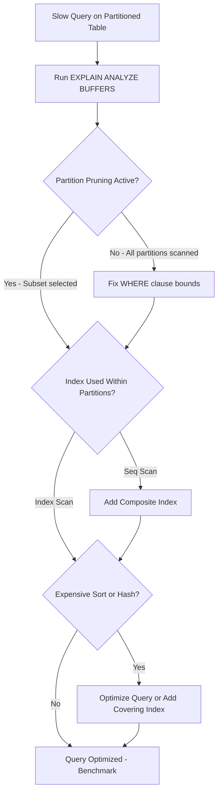

| Difficulty | Channel | Tags |
|---|---|---|
| intermediate | database | explain, query-plan, partitioning |

Your query plan says "Partition Pruning" is enabled. The index exists. The table is partitioned by date. And yet — every query still crawls. That is exactly the nightmare CoinGecko faced when their hourly crypto price data table ballooned to over 1TB, sending p99 response times past 4 seconds and IOPS breaching 24K limits across every replica [1]. The root cause? A partition-pruning failure hiding in plain sight. This is the story of how one missing WHERE clause bound turned a 30-second query into a sub-second result — and the diagnostic playbook you need to catch the same trap before it catches you.

---

> ### Real-World Case — CoinGecko
>
> CoinGecko's hourly crypto price data table had grown to 1TB+ over 8 years, causing queries to take 30+ seconds on average, IOPS constantly breaching 24K limits, and replica lag from write pressure.
>
> | | |
> |---|---|
> | **Challenge** | Queries filtering on specific date ranges were scanning the entire 1TB+ table. Standard indexing approaches failed because the table used a JSONB column with dynamic currency keys — adding per-key indexes was deemed impractical since each index would only benefit one application. |
> | **Solution** | Implemented range partitioning by month on the timestamp column. The key insight: since almost all queries use a timestamp range in the WHERE clause and typically need only a few months of data, monthly partitions guaranteed queries would touch at most 4 partitions. They used Foreign Data Wrappers to read from a warm staging replica while writing to the production partitioned table, avoiding the cold-cache penalty. Post-migration, they discovered a critical failure mode: a query using `created_at > ?` without an upper limit was scanning ALL partitions — making that specific query slower than on the unpartitioned table. |
> | **Outcome** | p99 response time reduced 86% (4.13s → 578ms), IOPS reduced 20% across all replicas, 6-8x improvement on partitioned queries. The partition-pruning failure on the open-ended date query was caught and fixed by adding the upper bound to the WHERE clause. |
> | **Lesson** | Partition pruning only works when the query includes clean predicates on the partition key. Wrapping the key in a function (date_trunc), omitting it entirely, or using open-ended ranges (no upper bound) defeats pruning entirely — turning one table scan into N smaller scans with planning overhead on top. Always verify with EXPLAIN that only the expected partitions appear under the Append node. |

---

## Hook — The 30-Second Query That Shouldn't Exist

Picture this: your PostgreSQL table has 100 million rows, neatly partitioned by date. A developer writes a straightforward query — filter by a date range, grab the results. It should take milliseconds. Instead, it takes 30 seconds. Every. Single. Time. You double-check the partitioning. It is there. You verify the index. It exists. You run EXPLAIN and see "Partition Pruning" in the output, and you think everything is fine. But here is the dirty secret many developers discover only after production starts screaming: partition pruning does not always work the way you think it does [2]. A subtle oversight in your WHERE clause — one missing upper bound, one implicit cast, one function wrapping your column — can silently disable pruning and force PostgreSQL to scan every single partition anyway. The database is lying to you, and the EXPLAIN plan is not going to scream about it.

## Problem — When Partitioning Becomes a False Sense of Security

Table partitioning is supposed to be the silver bullet for large datasets. Split a 100M-row table into monthly or daily chunks, and queries touching a narrow date range should only read a handful of partitions [3]. That is the theory. In practice, several failure modes lurk beneath the surface.

First, partition pruning depends entirely on PostgreSQL being able to statically determine which partitions to include. If your query uses a function on the partition key — say, DATE(event_date) instead of bare event_date — the planner gives up and scans all partitions [4]. Second, even when pruning works, the planner might still choose a sequential scan within each partition if no suitable index exists or if the planner estimates the scan as cheaper. Third, composite queries that filter on the partition key plus additional columns often lack the right composite index, forcing an index scan followed by heap fetches for every matching row — a pattern that degrades catastrophically at scale.

The real danger is that these failures are silent. PostgreSQL does not throw an error when pruning is disabled. It does not warn you when your index is being ignored. It just runs the query — across every partition, every row — and returns results slowly. Meanwhile, IOPS spike, replicas fall behind, and your p99 latency dashboard turns red.

## Real-World Case — CoinGecko's 1TB Partition Trap

CoinGecko, the cryptocurrency data aggregator, learned this lesson the hard way. Their hourly crypto price data table had accumulated over 1TB of data spanning roughly 8 years. Queries on this table routinely took more than 30 seconds. IOPS metrics were constantly breaching the 24,000 limit, and write pressure was causing replica lag that threatened data consistency [1].

The team identified that table partitioning was the right architectural choice — but the implementation had a critical gap. An open-ended date query was missing an upper bound in its WHERE clause. Without that upper bound, PostgreSQL could not statically determine the partition range to scan, so it defaulted to scanning every partition. The partition-pruning optimization, the entire reason the table was partitioned in the first place, was completely bypassed [1].

The fix was surgically simple: add the upper bound to the WHERE clause. The results were dramatic. P99 response time dropped 86%, from 4.13 seconds to 578 milliseconds. IOPS fell by 20% across all replicas. Partitioned queries saw a 6-to-8x performance improvement. One missing clause had been silently destroying performance for months [1].

## Deep Dive — Anatomy of a Partition Pruning Failure

To understand why this happens, you need to know how PostgreSQL's partition pruning actually works under the hood. When you define a partitioned table with a RANGE partition on a date column, PostgreSQL creates a partition descriptor — essentially a map of which partition holds which range of values [3]. During query planning, the planner examines the WHERE clause and attempts to match the filter conditions against this map. This is called "runtime pruning" or "plan-time pruning" depending on whether the bounds are known at plan time or require parameter evaluation [2].

Here is where things go wrong. Pruning only works when the planner can extract a scalar comparison directly on the partition key. The moment you wrap the key in a function, cast it implicitly, or use an expression that PostgreSQL cannot reduce to a simple range comparison, pruning fails silently [4]. Consider these scenarios:

- **Missing upper bound**: WHERE event_date >= '2024-01-01' — PostgreSQL prunes to partitions from January onward but keeps scanning all future partitions indefinitely. Add AND event_date = '2024-01-15' AND event_date < '2024-01-16'.
- **Implicit type casting**: WHERE event_date = '2024-01-15' where event_date is a TIMESTAMP — if the string literal does not match the type, PostgreSQL may cast the column, disabling pruning.

Furthermore, even when pruning works correctly, index utilization is a separate concern. A composite index on (event_date, status) allows PostgreSQL to efficiently scan within the pruned partitions. Without it, each partition defaults to a sequential scan — and scanning 100 sequential scans is still 100 sequential scans [5]. The interaction between pruning and indexing is where most performance gains live, and understanding both simultaneously is what separates a fast partitioned table from a slow one dressed in partitioning clothes.

## Workflow — The Diagnostic Playbook for Slow Partitioned Queries

When you suspect partition pruning is failing or underperforming, follow this systematic diagnostic workflow:

**Step 1: Capture the full EXPLAIN output.** Always use EXPLAIN (ANALYZE, BUFFERS) to see not just the plan but actual execution statistics — rows scanned, buffers hit, and time spent per node [6].

**Step 2: Check partition pruning in the plan output.** Look for lines like "Partitions selected: 3" or, critically, "Partitions scanned: all." If all partitions appear in the scan, pruning is not working [2].

**Step 3: Verify index usage.** Within each partition scan, check whether the plan shows "Index Scan" or "Bitmap Index Scan" versus "Seq Scan." If you see sequential scans, your indexes may not cover the query pattern [5].

**Step 4: Identify expensive operations.** Look for Sort nodes, Hash Aggregates, or nested loops that process far more rows than expected. These often indicate missing indexes or suboptimal query structure [6].

**Step 5: Apply fixes and re-measure.** Add composite indexes, rewrite the WHERE clause to enable pruning, or adjust configuration — then re-run EXPLAIN to confirm the improvement.

The following diagram illustrates this diagnostic flow:



## Code Example — From Slow to Fast in Three Moves

Here is a practical example showing the before-and-after optimization for a typical partitioned events table:

```sql
-- Step 1: Diagnose the problem
-- Run EXPLAIN with ANALYZE and BUFFERS to see actual execution stats
EXPLAIN (ANALYZE, BUFFERS)
SELECT * FROM events
WHERE event_date BETWEEN '2024-01-01' AND '2024-01-31'
  AND status = 'completed';

-- Step 2: Add a composite index covering the WHERE clause
-- CONCURRENTLY avoids locking the table during index creation
CREATE INDEX CONCURRENTLY idx_events_date_status
ON events (event_date, status);

-- Step 3: Cluster the table to physically order rows on disk
-- This reduces I/O for range scans by co-locating matching rows
CLUSTER events USING idx_events_date_status;

-- Step 4: Verify improvement with a focused diagnostic query
-- Check partition pruning by querying the partition metadata
SELECT
  schemaname,
  relname AS partition_name,
  seq_scan,
  idx_scan,
  n_live_tup AS row_count
FROM pg_stat_user_tables
WHERE relname LIKE 'events_%'
ORDER BY relname;
```

The first EXPLAIN command reveals whether partitions are being pruned and which scan method PostgreSQL chooses within each partition. The composite index on (event_date, status) directly covers the two filter columns, enabling an index scan instead of a sequential scan [5]. The CLUSTER command physically reorders the table data on disk to match the index — this is a one-time operation and must be re-run after significant writes [7]. Finally, the pg_stat query lets you monitor per-partition scan patterns to confirm that pruning and indexing are both working as expected.

## Lessons Learned — What to Check Before Your Table Hits 100M Rows

The CoinGecko incident and the patterns described above point to a clear set of lessons:

- **Always provide both bounds on range-partitioned queries.** An open-ended date filter silently disables upper-bound pruning. This is the single most common partition-pruning failure [1].
- **Composite indexes must match your WHERE clause.** An index on just (event_date) leaves the status filter to be evaluated row-by-row. A composite index on (event_date, status) eliminates that overhead entirely [5].
- **EXPLAIN (ANALYZE, BUFFERS) is your ground truth.** Do not trust the planner's estimated costs alone — actual buffer and row counts reveal what really happened during execution [6].
- **Watch for implicit type casts and function wrapping.** PostgreSQL will not warn you when these disable pruning. The EXPLAIN output will simply show all partitions being scanned [4].
- **Partition pruning and index utilization are independent optimizations.** You need both working together for optimal performance. Pruning reduces the number of partitions scanned; indexing reduces the work done within each partition [3].
- **CLUSTER is not automatic.** After CLUSTER, new rows are appended to the end. For heavily written tables, consider pg_repack or schedule periodic re-clustering [7].

If your partitioned table is already large and slow, start with EXPLAIN ANALYZE, fix the pruning, add the composite index, and re-measure. These three steps — which is exactly the sequence CoinGecko followed — typically deliver the highest ROI for the least effort [1]. The key insight is that partitioning is not a set-and-forget feature. It is an ongoing partnership between your schema design, your query patterns, and the planner's ability to optimize both.

---

## Partitioned Query Diagnostic Workflow



<details>
<summary><strong>Original Interview Question</strong></summary>

**Q:** You have a PostgreSQL table with 100M rows partitioned by date. A query filtering on a specific date range is still slow. What would you check in the EXPLAIN plan and how would you optimize it?

**A:** Check partition pruning effectiveness, index utilization patterns, and expensive sort operations. Create composite indexes on (date, filtered_columns) and evaluate clustering strategies for optimal data access.

</details>

## Conclusion

The CoinGecko story is a masterclass in a single truth: partitioning is not a set-and-forget feature. It is a living contract between your schema, your queries, and the planner's ability to optimize both. A missing upper bound silently turned their carefully designed partitioned table into a sequential scan machine, wasting IOPS and degrading performance for months before anyone noticed. The fix — adding one WHERE clause bound, one composite index, and one CLUSTER operation — cut p99 latency by 86%. Tomorrow, open your slow-query log, grab the top offender running against a partitioned table, and run EXPLAIN (ANALYZE, BUFFERS). Check the pruning. Check the index. You might find your own missing clause hiding in plain sight.

---

## References

1. [Scaling PostgreSQL Performance with Table Partitioning — CoinGecko Case Study](https://amree.dev/2025/06/13/scaling-postgresql-performance-with-table-partitioning/) — blog
2. [PostgreSQL Documentation — Partition Pruning](https://www.postgresql.org/docs/current/ddl-partitioning.html) — documentation
3. [PostgreSQL Documentation — Table Partitioning](https://www.postgresql.org/docs/current/tutorial-partitioning.html) — documentation
4. [PostgreSQL Documentation — Using EXPLAIN](https://www.postgresql.org/docs/current/using-explain.html) — documentation
5. [PostgreSQL Documentation — Indexes](https://www.postgresql.org/docs/current/indexes.html) — documentation
6. [DigitalOcean — PostgreSQL Performance Optimization](https://www.digitalocean.com/community/tutorials/how-to-optimize-postgresql-performance-on-ubuntu-20-04) — blog
7. [PostgreSQL Documentation — CLUSTER Command](https://www.postgresql.org/docs/current/sql-cluster.html) — documentation
8. [Wikipedia — Database Indexing](https://en.wikipedia.org/wiki/Database_index) — documentation

---

**Author:** Satishkumar Dhule — [GitHub](https://github.com/satishkumar-dhule) · [LinkedIn](https://linkedin.com/in/satishkumar-dhule) · [Website](https://satishkumar-dhule.github.io)
