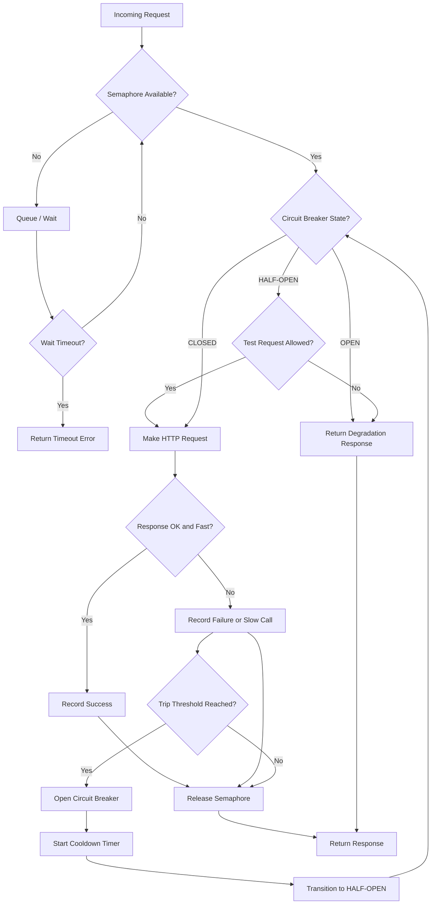

| Difficulty | Channel | Tags |
|---|---|---|
| advanced | backend | asyncio, aiohttp, concurrency |

Picture this: it's 2:23 PM on Valentine's Day, and your payment service just started hemorrhaging. A fintech company watched $340,000 vanish in 47 minutes — not because Stripe went down, but because their own circuit breaker was too slow to notice. A developer increased a timeout from 5 to 15 seconds three days prior, and that single change turned a minor upstream blip into a total checkout blackout [1]. If you think a connection pool is just a number in a config file, this story will change your mind.

---

> ### Real-World Case — Stripe
>
> A fintech company lost $340K in 47 minutes when a Stripe API degradation combined with a misconfigured circuit breaker and connection pool exhaustion caused complete payment processing failure. A seemingly innocent timeout change (5s → 15s) created a lethal interaction with circuit breaker thresholds.
>
> | | |
> |---|---|
> | **Challenge** | When Stripe's API began returning elevated latency (P99 > 8s), the payment service's circuit breaker (configured to trip after 10 failures over 30s) never activated because requests were hanging, not failing. Each request held a connection for 8-15 seconds while waiting on Stripe. With only 50 connections in the pool, the pool exhausted in under 7 minutes — before the circuit breaker could trip. |
> | **Solution** | Implemented three key changes: (1) Added latency-based circuit breaking alongside failure-count-based breaking — a hanging request is just as damaging as a failed one. (2) Reduced circuit breaker threshold from 10 failures/30s to 5 failures/10s for fail-fast behavior. (3) Added per-endpoint connection pool limits so one slow upstream service can't exhaust the entire pool. Combined with exponential backoff in their HTTP client retry logic (initial delay 0.5s, max 5s with jitter), the system now degrades gracefully rather than cascading. |
> | **Outcome** | Post-fix: circuit breaker trips before pool exhaustion, users see 'payment temporarily unavailable' instead of total outage. The incident exposed that ~3,400 transactions failed, 847 support tickets were filed, and the 47-minute MTTR was almost entirely due to rolling back the timeout change while waiting for Stripe's upstream resolution. |
> | **Lesson** | Circuit breakers must watch for latency-based failures, not just error counts. A request that hangs for 15 seconds is just as damaging to connection pools as a request that fails immediately. Timeout increases have multiplicative effects on pool exhaustion — doubling the timeout doesn't double your risk, it multiplies it by (pool_size / new_timeout). Every timeout change requires circuit breaker impact analysis. |

---

## Hook — The 47-Minute Blackout That Shouldn't Have Happened

At 2:23 PM, Stripe's API started returning elevated latency — P99 above 5 seconds. The team had monitoring. They had a circuit breaker. They had a runbook. What they didn't realize was that their circuit breaker was configured to trip after 10 consecutive failures over 30 seconds. But here is the thing: their requests weren't failing. They were hanging. Each request held a connection for 8 to 15 seconds while waiting on Stripe. With 50 connections in the pool, the math is brutal: 50 connections divided by 8 seconds means the pool exhausts in under 7 minutes. By 2:32 PM, every connection was held hostage. The circuit breaker finally tripped — but it was too late. The pool was already empty. Users saw timeouts instead of a friendly "temporarily unavailable" message. The difference between graceful degradation and total outage came down to one configuration number.

## Problem — Why Connection Pools Fail Under Pressure

Many developers set up a connection pool, slap a timeout on it, and call it production-ready. But a pool without intelligent degradation is a bomb with a random fuse. The core challenge is this: when a downstream service slows down — not fails, just slows — your connection pool starts leaking connections. Every request holds a slot while it waits. The pool fills up. New requests queue. Eventually they time out too, and now your entire service is paralyzed. You might think timeouts solve this. They do not. A 15-second timeout on 50 connections means you can hold 50 threads for 15 seconds each. At moderate traffic, that is a guaranteed pool exhaustion. The real problem is the interaction between timeout duration, circuit breaker thresholds, and pool size. Change one without adjusting the others, and you have created a vulnerability. Most connection pool managers treat these as independent settings. They are not. They are a system, and they must be tuned together.

## Real-World Case — The Valentine's Day Payment Meltdown

The incident is well-documented. The team had deployed payment-service v2.4.1 three days before Valentine's Day. The change was small: increase the default Stripe client timeout from 5 seconds to 15 seconds. The reasoning was conservative — they were seeing occasional timeout errors on large transactions. What they did not model was the cascading effect. When Stripe started returning slow responses at 2:23 PM, the circuit breaker remained CLOSED because it counted failures, not latency. Requests were completing — just very slowly. By 2:28 PM, the payment service was returning 503s but the circuit breaker still had not tripped. By 2:32 PM, the connection pool was completely exhausted. 50 out of 50 connections occupied by requests waiting on Stripe. The circuit breaker finally opened, but at that point it just meant new requests failed immediately instead of hanging. Users still could not pay. The rollback to v2.4.0 — reverting the timeout to 5 seconds — partially recovered the system, but Stripe's incident did not fully resolve until 3:02 PM. Total damage: approximately 3,400 failed transactions, 847 support tickets, and $340,000 in lost revenue [1].

## Deep Dive — Circuit Breakers, Semaphores, and the Latency Blind Spot

This is where it gets technically interesting. A circuit breaker works by tracking failure rates in a sliding window. When the failure rate crosses a threshold, the breaker opens and stops sending requests to the downstream service. This protects your connection pool from exhaustion. But here is the plot twist: most circuit breakers only count failures — not slow calls. A dependency returning 200s at 10x normal latency will never trip a breaker that only counts failures. It looks healthy the entire time it is strangling your thread pool [2]. The fix is twofold. First, configure your circuit breaker to trip on slow call rates, not just failure rates. A slow call duration threshold of 3 seconds means any request taking longer than 3 seconds counts toward the trip condition. Second, use a semaphore to bound concurrency at the application level — separate from the connector's built-in limits. Why both? Because aiohttp's TCPConnector limit controls how many TCP connections exist, but a semaphore controls how many coroutines are actively using those connections at once. They operate at different layers and serve different purposes [3]. The relationship matters: a semaphore of 20 with a connector limit of 100 means at most 20 coroutines are making requests simultaneously, while the connector can maintain up to 100 keepalive connections for reuse. This separation lets you fail fast on the coroutine level while maintaining connection efficiency.

## Workflow — Building a Resilient Connection Pool Manager

Here is the step-by-step architecture for building a connection pool manager that handles graceful degradation. The flow moves through five stages: initialization, request handling, circuit monitoring, failure recovery, and cleanup. First, you initialize the session with a TCPConnector configured for connection limits, keepalive, and DNS caching. Then you layer a semaphore on top to bound concurrent in-flight requests. Every request enters through the semaphore — if it is full, the coroutine waits. Before making the actual HTTP call, you check the circuit breaker state. If the breaker is open, you immediately return a degradation response. If it is closed, you proceed with the request. The circuit breaker monitors both failure rate and slow call rate in a rolling window. If either threshold trips, the breaker opens for a cooldown period. After the cooldown, the breaker enters a half-open state, allowing a small number of test requests through. If they succeed, the breaker closes. If they fail, it reopens. The diagram below illustrates this complete flow [4].

## Code Example — Production-Ready Connection Pool Manager in Python

Here is the implementation. This code demonstrates a connection pool manager with semaphore-based concurrency limiting, exponential backoff for retries, and a circuit breaker that monitors both failure and latency. Each component is explained inline.

## Lessons Learned — Five Rules for Connection Pool Resilience

After analyzing incidents like the Valentine's Day meltdown and patterns across Netflix, Uber, and other high-traffic systems, five principles emerge. First, circuit breakers must monitor latency, not just failures. A slow dependency is worse than a dead one because it silently consumes your pool [5]. Second, timeouts have multiplicative effects. Doubling a timeout does not double your risk — it multiplies it by your pool size divided by the new timeout. Model this math before shipping timeout changes. Third, per-endpoint isolation is critical. A single shared pool means one slow downstream service can exhaust connections for all your other dependencies. Use per-host limits in your connector and separate semaphores for different service categories [6]. Fourth, test your circuit breaker under realistic conditions. Having a circuit breaker is not the same as having one that protects you. Simulate downstream latency spikes in staging — not just failures, but slow responses. Fifth, plan for graceful shutdown. When your application shuts down, drain the pool cleanly. For SSL connections, wait at least 250 milliseconds before closing the event loop to avoid resource warnings [7]. The common pitfalls are well-documented: connection leaks from missing context managers, inadequate timeout configurations, and ignoring SSL validation. Each one compounds the others under load [8]. If this feels like a lot to remember, here is the one insight that ties it all together: your connection pool, your circuit breaker, and your timeouts are not independent settings. They are a system. Change one, and you must revalidate the others.

---

## Connection Pool Manager Request Flow

<strong>Original Interview Question</strong>

**Q:** How would you implement a connection pool manager for aiohttp that handles graceful degradation under high load and connection timeouts?

**A:** Implement a connection pool manager for aiohttp using a semaphore to limit concurrent connections, exponential backoff for retrying failed requests, and circuit breaker pattern to gracefully degrade under high load and connection timeouts.

## Conclusion

The Valentine's Day payment meltdown was not a Stripe problem — it was a configuration problem. The team had every right tool: a connection pool, a circuit breaker, timeouts. What they lacked was understanding that these three components form an interdependent system. A timeout increase without a circuit breaker threshold adjustment is a loaded gun. The lesson is clear: model your connection pool math before you ship timeout changes. Calculate how many connections a slow downstream can hold and for how long. Configure your circuit breaker to trip on latency, not just failures. Use semaphores to bound concurrency at the application level. And test the whole system under realistic latency conditions — not just happy-path unit tests. Start tomorrow by auditing your current timeout and circuit breaker configurations. If your breaker only counts failures, you are one slow dependency away from the same $340K lesson.

---

## References

1. [Stripe incident report — We Lost $340K in 47 Minutes Because Our Circuit Breaker Was Too Slow](https://blog.stackademic.com/we-lost-340k-in-47-minutes-because-our-circuit-breaker-was-too-slow-75e1e97a3242) — blog
2. [A Dependency That's Slow Is Worse Than One That's Down — Circuit Breaker Lessons](https://edilec-engineering.hashnode.dev/a-dependency-that-s-slow-is-worse-than-one-that-s-down-what-building-circuit-breakers-taught-us) — blog
3. [aiohttp Client Advanced — Connection Pool Management Documentation](https://docs.aiohttp.org/en/stable/client_advanced.html) — documentation
4. [Circuit Breakers Under Stress: Anatomy of a Payment Cascade](https://dev.to/pponali/circuit-breakers-under-stress-anatomy-of-a-payment-cascade-hn0) — blog
5. [Wikipedia — Circuit Breaker Design Pattern](https://en.wikipedia.org/wiki/Circuit_breaker_design_pattern) — documentation
6. [aiohttp TCPConnector Client Reference — Connection Pool Limits](https://docs.aiohttp.org/en/stable/client_reference.html#aiohttp.TCPConnector) — documentation
7. [Python asyncio — Semaphore Documentation](https://docs.python.org/3/library/asyncio-sync.html#asyncio.Semaphore) — documentation
8. [Asyncio for I/O-Heavy Pipelines — aiohttp, Rate Limiting, Backpressure](https://dev.to/gowthampotureddi/asyncio-for-io-heavy-pipelines-aiohttp-asyncpg-rate-limiting-backpressure-1nd7) — blog

---

**Author:** Satishkumar Dhule — [GitHub](https://github.com/satishkumar-dhule) · [LinkedIn](https://linkedin.com/in/satishkumar-dhule) · [Website](https://satishkumar-dhule.github.io)
