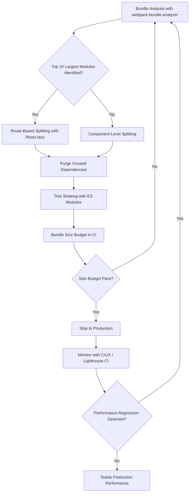

| Difficulty | Channel | Tags |
|---|---|---|
| intermediate | frontend | lighthouse, bundle, lazy-loading |

Your React app's Lighthouse score reads 65. Your Time to Interactive is 4.2 seconds. Your bundle is a bloated 2.1MB, and every millisecond of delay is hemorrhaging users. In 2017, Twitter faced this exact crisis at scale: Twitter Lite, their Progressive Web App serving over 150 million monthly users, shipped just three JavaScript asset files totaling more than 1MB — and it was choking load times on simulated 3G networks to over five seconds [1]. The decisions they made to fix it didn't just solve a performance problem; they created an architectural playbook that held strong for years. Here's how you can follow the same playbook to rescue your own bundle.

---

> ### Real-World Case — Twitter
>
> Twitter Lite, one of the world's largest React PWAs serving 150M+ monthly users, faced a critical performance problem: the entire application shipped as just 3 JavaScript asset files totaling over 1MB (420KB gzipped), causing extremely slow load times on mobile devices and simulated 3G networks. Users on low-end devices in emerging markets were experiencing 5+ second bundle load times before the page could even begin rendering.
>
> | | |
> |---|---|
> | **Challenge** | The monolithic JavaScript bundle was blocking initial render and making Time to Interactive (TTI) unacceptably slow. With millions of mobile users on slow networks, Twitter needed to fundamentally rethink how JavaScript was delivered to the browser without rebuilding the entire application architecture. |
> | **Solution** | Paul Armstrong's team implemented route-based code splitting using Webpack's SplitChunksPlugin, breaking the monolithic bundle into ~40 on-demand chunks following the PRPL (Push, Render, Pre-cache, Lazy-load) pattern. They created structured chunk categories: runtime (inlined in HTML to avoid extra round trips), vendor (third-party code used across 4+ bundles), shared (internal code used across 4+ bundles), main (entry point with React render/hydration/router), i18n (translations), and page-specific chunks. Each bundle was also created in legacy and modern versions based on browserslist. They then built build-tracker, an open-source tool to monitor bundle size budgets in CI/CD, preventing regressions by flagging PRs that would increase metrics like TTI by over 100%. |
> | **Outcome** | TTI was reduced to almost half its previous value as measured by Google Lighthouse. Main bundle load time on simulated 3G dropped from over 5 seconds to barely 3 seconds. The performance gains were maintained over subsequent years — CrUX data showed TTFB, FCP, and FID on desktop were good for 90%+ of users, and FCP/FID on phones were good for 80%+ of users. The build-tracker tool alone prevented multiple regressions that would have doubled TTI. The architectural decisions from 2017 largely withstood years of subsequent changes. |
> | **Lesson** | Making performance a top-down organizational goal is the most crucial first step. But the real insight is that splitting a monolithic bundle into ~40 strategically organized chunks (not just random splitting) combined with automated bundle size budgeting in CI creates a self-sustaining performance culture. The team proved that you don't need to rewrite your app — you need to rethink how code reaches the browser. |

---

## Hook — The 4.2-Second Gap That's Silently Killing Your App

Picture this: you just shipped a major feature. The product manager is thrilled, the designers are celebrating, and the stakeholders are already asking for the next thing. Then the performance report lands in your inbox. Lighthouse score: 65. Bundle size: 2.1MB. Time to Interactive: 4.2 seconds. Your users on a mobile device in a subway — or worse, on a low-end phone in an emerging market — are staring at a blank screen for over four seconds before they can do anything. Many developers assume that a few optimization tricks will fix it. They add a code split here, remove a dependency there, and call it a day. But here's the uncomfortable truth: without a systematic approach, you're just moving debt around, not eliminating it. The difference between a 65 and a 90+ Lighthouse score isn't one magic bullet — it's a disciplined workflow.

## Problem — Why Bundle Bloat Is a Systemic Problem, Not Just an Annoyance

A 2.1MB JavaScript bundle doesn't just mean a slow first load. It cascades. Parse time increases. Main thread blocking extends. Interaction delays compound. Users tap buttons that don't respond, scroll through janky lists, and ultimately close the tab. The technical reality is this: JavaScript is the most expensive resource a browser can download. Unlike images, CSS, or fonts, the browser must download, parse, compile, and execute every byte of JavaScript before users can interact with your page [2]. On a simulated 3G connection — still the reality for billions of users worldwide — that 2.1MB uncompressed bundle translates to roughly 3-5 seconds of raw download time before any execution even begins [3]. But the real insidious part is that teams often don't realize how much of what they ship is actually unused. Studies have consistently found that the median page ships around 40-60% unused JavaScript [4]. That's not dead code hiding in a forgotten file — it's imported, bundled, and parsed but never executed. It's invisible weight that your users pay for with their time.

## Real-World Case — Twitter Lite and the Million-Dollar Rethink

In 2017, Twitter's engineering team confronted this problem head-on with Twitter Lite [1]. The PWA was designed to serve users on low-end devices and unreliable networks, but the initial architecture was working against them. The entire application shipped as three JavaScript asset files totaling over 1MB (420KB gzipped). On simulated 3G, users were waiting over five seconds for the main bundle to load — before the page could even begin rendering.

The team took a systematic approach. They analyzed bundle composition ruthlessly, identified the largest chunks, and implemented aggressive code splitting. The result: Time to Interactive was nearly halved as measured by Google Lighthouse. Main bundle load time on simulated 3G dropped from over 5 seconds to barely 3 seconds. But what makes this story remarkable isn't just the immediate fix — it's the durability. CrUX data showed that TTFB, FCP, and FID on desktop remained good for over 90% of users, and FCP/FID on phones stayed good for over 80% of users for years afterward [1].

Moreover, the team built a build-tracker tool that prevented multiple regressions that would have doubled TTI over time. The architectural decisions from 2017 largely withstood years of subsequent changes to the codebase. This wasn't a quick patch — it was a foundational transformation.

## Deep Dive — The Three Pillars of Bundle Optimization

Building on Twitter's experience, you can break bundle optimization into three interconnected pillars, each addressing a different layer of the problem.

### Pillar 1: Analysis — You Can't Fix What You Can't See

Before changing a single line of code, you need to understand what's in your bundle and why. Tools like webpack-bundle-analyzer generate an interactive treemap visualization of your bundle's contents [5]. Every rectangle represents a module, sized proportionally to its contribution. This is where the 'aha moment' often hits — developers discover that a single date formatting library accounts for 120KB, or that an icon library ships every single icon despite the app using only thirty.

### Pillar 2: Splitting — Breaking the Monolith

Once you know what's bloating your bundle, the next question is: can any of it be deferred? Code splitting — implemented via dynamic imports or frameworks like React.lazy() — allows you to break your application into smaller chunks that load on demand [6]. There are two primary strategies:

- **Route-based splitting**: Each page or route becomes its own chunk. Users only download the code for the page they visit. This is the highest-impact optimization for most apps.
- **Component-based splitting**: Individual heavy components (charts, editors, modals) load only when needed. This is especially effective for features that not every user accesses.

### Pillar 3: Elimination — Remove What You Don't Need

Tree shaking is the process of eliminating unused exports from your dependencies [7]. If you import an entire utility library but use only two functions, a properly configured build tool will strip the rest. However, tree shaking only works with ES modules — CommonJS imports defeat it entirely. This is a common pitfall: developers enable tree shaking in their config but then import libraries that ship CommonJS, rendering the optimization inert.

## Workflow — The Five-Step Systematic Approach

Here's the concrete workflow that transforms a 65 Lighthouse score into a 90+. Think of it as a repeatable playbook — not a one-time fix.

1. **Analyze the bundle**: Run webpack-bundle-analyzer and identify the top 10 largest modules. Look for duplicate dependencies, unused imports, and oversized libraries [5].
2. **Implement route-based code splitting**: Wrap each route in React.lazy() so the initial load only fetches the code for the current page [6]. This alone can cut your initial bundle by 40-60%.
3. **Add component-level splitting**: Identify heavy components that aren't visible above the fold — charts, data tables, rich editors — and split them into lazy-loaded chunks.
4. **Purge unused code**: Audit your dependencies. Remove what you don't use. Enable tree shaking and ensure your imports use ES module syntax [7].
5. **Monitor and prevent regression**: Set up bundle size budgets in CI. A single commit that doubles your bundle size should fail the build, not slip into production.

The following diagram illustrates this workflow from analysis through verification:

flowchart TD
    A[Bundle Analysis] --> B{Top 10 Largest Modules?}
    B -->|Yes| C[Route-Based Splitting with React.lazy]
    B -->|No| D[Component-Level Splitting]
    C --> E[Purge Unused Dependencies]
    D --> E
    E --> F[Tree Shaking Configuration]
    F --> G[Bundle Size Budget in CI]
    G --> H{Budget Pass?}
    H -->|Yes| I[Ship to Production]
    H -->|No| A

Each step feeds into the next. The loop back from budget check to analysis ensures that regressions are caught early — just like Twitter's build-tracker prevented regressions that would have doubled their TTI [1].

## Code Example — Route-Based Lazy Loading in Practice

Here's how you implement route-based code splitting in a real React application. This pattern is directly inspired by the approach Twitter Lite and other large-scale React apps use in production:

```javascript
import React, { Suspense, lazy } from 'react';
import { BrowserRouter, Routes, Route } from 'react-router-dom';

// Route-based code splitting: each route becomes a separate chunk
// The browser only downloads this code when the user navigates to the route
const Dashboard = lazy(() => import('./pages/Dashboard'));
const Analytics = lazy(() => import('./pages/Analytics'));
const Settings = lazy(() => import('./pages/Settings'));

// Component-based splitting for heavy features
// These are only fetched when a user opens the corresponding feature
const HeavyChart = lazy(() => import('./components/HeavyChart'));
const RichTextEditor = lazy(() => import('./components/RichTextEditor'));

// Loading fallback shown while the chunk is being fetched
function LoadingSpinner() {
  return (
    <div className="flex items-center justify-center min-h-screen">
      <div className="animate-spin rounded-full h-12 w-12 border-b-2 border-blue-600" />
    </div>
  );
}

// Error boundary to gracefully handle chunk loading failures
// This is critical for production — network issues will happen
function ErrorFallback({ error, resetErrorBoundary }) {
  return (
    <div className="p-8 text-center">
      <h2>Something went wrong loading this page.</h2>
      <button onClick={resetErrorBoundary} className="mt-4 px-4 py-2 bg-blue-600 text-white rounded">
        Try again
      </button>
    </div>
  );
}

function App() {
  return (
    <BrowserRouter>
      {/* Suspense wraps the entire route tree and shows the spinner
          while any lazy-loaded route is being fetched */}
      <Suspense fallback={<LoadingSpinner />}>
        <Routes>
          <Route path="/dashboard" element={<Dashboard />} />
          <Route path="/analytics" element={<Analytics />} />
          <Route path="/settings" element={<Settings />} />
        </Routes>
      </Suspense>
    </BrowserRouter>
  );
}

export default App;
```

**What this does and why it matters:**

- **`React.lazy(() => import('./pages/Dashboard'))`**: This is the magic line. Instead of bundling Dashboard into the main JavaScript file, webpack creates a separate chunk. The browser only downloads it when a user navigates to `/dashboard`. On a 2.1MB bundle, this single technique can remove hundreds of kilobytes from the initial load [6].
- **`Suspense` with a fallback**: While a lazy chunk is being downloaded, the user sees the LoadingSpinner instead of a blank screen. This transforms perceived performance — users tolerate a brief spinner far better than a frozen page.
- **Component-level lazy loading**: The HeavyChart and RichTextEditor examples show how to split even within a page. If a user never opens the analytics dashboard, the chart code never loads.
- **Error boundary**: Network conditions vary. If a chunk fails to load — say the user goes offline briefly — the error boundary prevents a white screen of death and gives users a recovery path [8].

## Lessons Learned — What Twitter's Success Teaches Every Developer

Twitter Lite's transformation from a 1MB+ bundle choking on 3G to a performant PWA serving 150M users offers several hard-won lessons that apply directly to your 2.1MB bundle today:

**1. Analysis before action saves weeks.** Running webpack-bundle-analyzer before touching any code prevents wasted effort on optimizations that don't move the needle. Many developers start by lazy-loading everything and end up with a fragmented app that's slower due to excessive network round-trips. Identify your biggest offenders first [5].

**2. Route-based splitting is your highest-leverage move.** For most React apps, splitting by route reduces initial bundle size by 40-60%. Component-based splitting is valuable but delivers incremental gains on top of the route-based foundation [6].

**3. Tree shaking requires discipline.** Enabling tree shaking in your webpack or Vite config is necessary but not sufficient. Every import must use ES module syntax. A single CommonJS import in your dependency tree can break the optimization for the entire bundle. Many developers discover this the hard way after wondering why their bundle didn't shrink [7].

**4. Regression prevention is non-negotiable.** Twitter's build-tracker tool prevented multiple regressions that would have doubled TTI. Without automated bundle size budgets in CI, your careful optimization will erode within months as new features get added without size consciousness [1].

**5. The user experience of a loading state matters more than you think.** A 3-second load with a visible spinner and progress feedback feels faster than a 2-second load with a blank screen. Suspense boundaries aren't just technical infrastructure — they're UX decisions.

> ⚠️ **Watch Out**: The most common mistake teams make is lazy-loading everything indiscriminately. This creates a waterfall of network requests — each lazy load triggers another fetch, which triggers another. The result can actually be slower than a larger initial bundle. Be strategic: split at route boundaries first, then at component boundaries for genuinely heavy, on-demand features.

The journey from a 65 to a 90+ Lighthouse score isn't about finding a single clever trick. It's about adopting a systematic, repeatable workflow — analyze, split, eliminate, monitor — and treating bundle performance as a first-class engineering concern, not an afterthought.

---

## Bundle Optimization Workflow



<details>
<summary><strong>Original Interview Question</strong></summary>

**Q:** You're tasked with improving a React app's Lighthouse performance score from 65 to 90+. The bundle size is 2.1MB and Time to Interactive is 4.2s. What specific steps would you take to optimize the bundle and implement lazy loading?

**A:** Implement code splitting with React.lazy() and Suspense, analyze bundle composition with webpack-bundle-analyzer to identify largest chunks, remove unused dependencies and optimize imports, add dynamic imports for heavy components and third-party libraries, implement route-based splitting for better initial load times, and utilize tree shaking with proper ES module configuration.

</details>

## Conclusion

Your 2.1MB bundle isn't a death sentence — it's a starting line. Twitter Lite proved that systematic bundle optimization can halve Time to Interactive and maintain those gains for years [1]. The playbook is straightforward: analyze your bundle to find the biggest offenders, split by route first and component second, eliminate dead code, and set up CI budgets to prevent regressions. Start tomorrow by running webpack-bundle-analyzer on your project. You might be shocked at what you find — a single unused import could be costing your users hundreds of milliseconds they'll never get back. The gap between a 65 and a 90+ Lighthouse score isn't magic. It's discipline.

---

## References

1. [Twitter Lite and High Performance React Progressive Web Apps at Scale](https://medium.com/@paularmstrong/twitter-lite-and-high-performance-react-progressive-web-apps-at-scale-d28a00e780a3) — blog
2. [MDN: JavaScript performance — Reduce JavaScript activity](https://developer.mozilla.org/en-US/docs/Web/Performance/JavaScript_scheduling) — documentation
3. [web.dev: Concept of Speed Index](https://web.dev/articles/speed-index) — blog
4. [HTTP Archive: JavaScript State Report](https://httparchive.org/reports/state-of-the-web) — blog
5. [webpack-bundle-analyzer on GitHub](https://github.com/webpack-contrib/webpack-bundle-analyzer) — documentation
6. [React: lazy — Lazy Loading Components and Code](https://react.dev/reference/lazy) — documentation
7. [MDN: Tree Shaking](https://developer.mozilla.org/en-US/docs/Glossary/Tree_shaking) — documentation
8. [React: Error Boundaries](https://react.dev/reference/lazy#suspense-and-error-boundaries) — documentation

---

**Author:** Satishkumar Dhule — [GitHub](https://github.com/satishkumar-dhule) · [LinkedIn](https://linkedin.com/in/satishkumar-dhule) · [Website](https://satishkumar-dhule.github.io)
