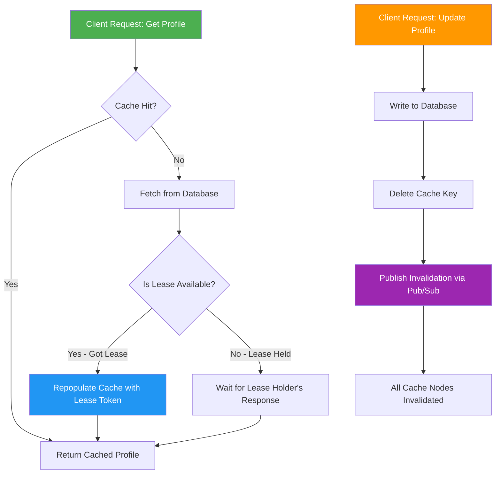
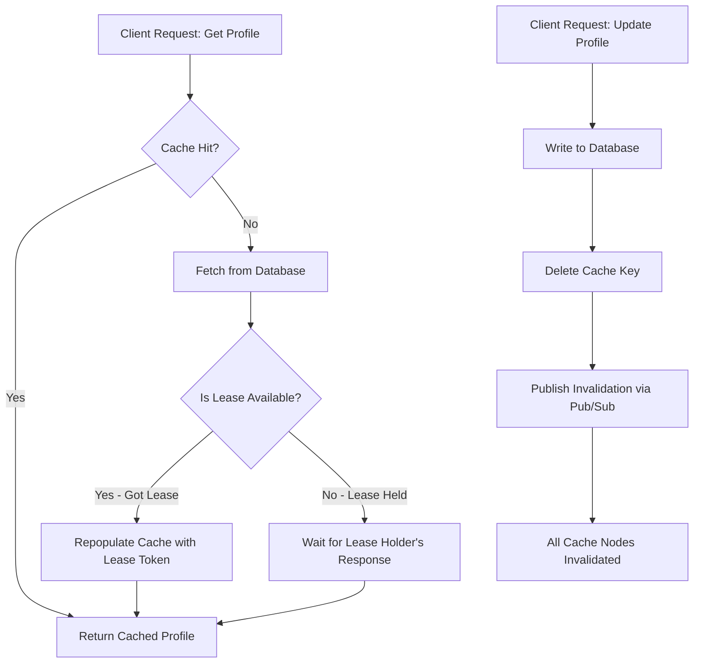

| Difficulty | Channel | Tags |
|---|---|---|
| beginner | backend | redis, memcached, cache-invalidation |

It was the kind of problem that keeps platform engineers awake at night. By 2013, Facebook's social network had exploded to over a billion users — each one hammering the system with billions of memcached requests per second across trillions of cached items [1]. Then the failures started. Stale values were silently written back to the cache after invalidation. Cache misses cascaded into thundering herds that overwhelmed databases. The very system designed to keep the site fast was making it fragile. If you've ever watched a cache invalidation bug take down a production service at 2am, you know the dread. But here's what makes this story remarkable: the fix Facebook engineered didn't just save their system — it became the textbook solution that every distributed systems team references today.

---

> ### Real-World Case — Facebook (Meta)
>
> By 2013 Facebook's social network had grown to over a billion users generating billions of memcached requests per second across trillions of cached items. The social graph's most popular objects (including user profile data) were being hammered by heavy concurrent read and write traffic, and naive cache invalidation broke down: stale values were written back to the cache after invalidation, and cache misses triggered thundering herds that overshot the database.
>
> | | |
> |---|---|
> | **Challenge** | Keep the Memcached caching layer consistent with the source of truth exactly when a rarely-updated but heavily-read key (like a user's profile) changes, while preventing stale sets (outdated data re-populating the cache after a delete) and thundering herds (hundreds of web servers all missing the same key and flooding the DB simultaneously). Cross-cluster and cross-region replication also created invalidation race conditions. |
> | **Solution** | Instead of write-through updates, Facebook chose delete-based invalidation: on any write, the key is deleted from cache so the next read repopulates it from the DB — while mcsqueal, an invalidation daemon, tails MySQL's replication stream and broadcasts deletes across every frontend cluster in a region. To fix stale sets and thundering herds they invented 'leases': memcached hands a 64-bit token to one client on a cache miss, only that token-holder may write the key back, and tokens are invalidated by any intervening delete. Servers rate-limit lease issuance (one per ~10s per key) so all other concurrent misses wait and retry instead of hitting the database. |
> | **Outcome** | The lease mechanism cut peak database query rates for thundering-herd-prone keys from 17,000 queries/second to just 1,300 queries/second — a ~13x reduction — while the overall system serves billions of requests per second and holds trillions of items for over a billion users. The paper was awarded Best Paper at NSDI 2013, has been cited 1,200+ times, and its lease approach remains the canonical fix for cache stampedes. |
> | **Lesson** | Deleting a cached key on write is safer than write-through updates — it's idempotent, order-insensitive, and guarantees read-after-write consistency (the same reason modern Redis advice says 'invalidate, don't overwrite'). But naive invalidation is not enough: you must also defend the 'delete → repopulate' window with a lease/token mechanism or a thundering herd will erase your caching gains. Also notable: this scale was achieved on Memcached — the 'simpler' tool — proving simple key-value caching with manual, well-engineered coordination can outscale feature-rich alternatives. |

---

## Hook — The Silent Killer Hiding in Your Cache Layer

Picture this: your user profile service is humming along beautifully. Reads are blazing fast, databases are calm, and your latency charts look like a cardiogram of a perfectly healthy system. Then someone updates a profile. Within seconds, a cascade begins — stale data creeps back into the cache, other users see outdated information, and your database starts screaming as thundering herds of cache misses all hit it simultaneously [2]. This isn't a hypothetical. It's the exact scenario that played out at Facebook, Stripe, and countless startups that scaled past the "it works on my machine" phase. Cache invalidation — famously one of the two hardest problems in computer science — isn't just an academic puzzle. It's the moment where your caching strategy either saves you or destroys you. And the difference often comes down to choices you make in the first week of implementation.

## Problem — Why Cache Invalidation Breaks at Scale

When you first add caching to a user profile service, everything feels simple. You store the profile in Redis, set a TTL, and move on. But here's the thing: TTL-based expiration is a ticking time bomb. During those precious minutes between cache creation and expiry, users see stale data. For a social network where profile updates are frequent — someone changes their profile picture, updates their bio, edits their location — a 5-to-30-minute TTL window creates a terrible user experience. The naive fix? Just delete the cache key on every write. But now you've unlocked a different beast: the thundering herd. When the cache is empty and a thousand requests hit simultaneously, every single one tries to rebuild that cache entry, creating a stampede that can crater your database [3]. Here's what makes this especially painful: the problem gets worse as your system grows. With a handful of servers, a simple write-through pattern works fine. But the moment you add load balancers, horizontal scaling, and distributed cache nodes, you're fighting a fundamentally different beast. Stale data doesn't just come from TTL anymore — it comes from race conditions between reads and writes across different cache nodes. You might think deleting a cache key is atomic and safe, but in a distributed system, the order of operations is never guaranteed.

## Real-World Case — Facebook's Lease Mechanism That Changed Everything

By 2013, Facebook's memcached infrastructure was one of the largest in the world. The company was serving billions of requests per second and storing trillions of cached items, with user profile data sitting at the center of the hottest access patterns [1]. Two critical failures emerged. First, stale values were being written back to the cache after invalidation. When a cache miss occurred, multiple threads would simultaneously read from the database and attempt to populate the cache — and the last writer would win, potentially storing outdated data. Second, thundering herds were overwhelming the database. A single cache miss for a popular key could trigger hundreds of simultaneous database queries, each trying to repopulate the same cache entry. Facebook's solution was elegantly simple: a lease mechanism. When a client encounters a cache miss, it obtains a unique lease token before fetching from the database. Only the client holding the lease is allowed to write the value back to the cache. If other clients request the same key while the lease is active, they wait for the first client's response rather than all hitting the database independently [1]. The results were dramatic. Peak database query rates for thundering-herd-prone keys dropped from 17,000 queries per second to just 1,300 — a 13x reduction. The paper describing this mechanism won Best Paper at NSDI 2013 and has been cited over 1,200 times [1]. This wasn't just a fix — it became the canonical approach to cache stampede prevention.

## Deep Dive — Redis vs Memcached and the Cache Invalidation Toolkit

With Facebook's story in your back pocket, you can see that choosing a cache invalidation strategy is really about choosing which trade-offs you can live with. Let's break down the two most common options.

**Redis: The Swiss Army Knife**
Redis gives you pub/sub messaging, which means you can broadcast cache invalidation events across your entire cluster automatically [4]. When one service updates a profile, it publishes an invalidation message, and every cache node receives it in near-real-time. Redis also offers persistence options (RDB snapshots and AOF logging) that mean your cache doesn't vanish on restart, and its support for complex data structures — hashes, sorted sets, lists — means you can model user profile data in ways that make invalidation granular. For example, you can invalidate just the "profile picture" field without blowing away the entire profile cache.

**Memcached: The Speed Demon**
Memcached takes a fundamentally simpler approach. It's a flat key-value store designed to do one thing extremely well: serve cached data fast [5]. Its simpler architecture means less memory overhead per key, and its multi-threaded design can leverage multiple CPU cores without the single-threaded bottlenecks Redis can hit. For pure caching with simple TTL patterns, Memcached can be marginally faster. But — and this is a big but — Memcached has no built-in pub/sub, no persistence, and no native support for distributed invalidation. You have to build that coordination layer yourself.

Here's the real trade-off, laid bare:

| Feature | Redis | Memcached |
|---------|-------|-----------|
| Distributed Invalidation | Built-in pub/sub [4] | Manual coordination |
| Data Structures | Rich (hash, list, set, sorted set) | Flat key-value only |
| Persistence | RDB + AOF [6] | None |
| Memory Efficiency | Higher overhead | Lower overhead [5] |
| Thread Model | Single-threaded (with I/O threads in 6.0+) | Multi-threaded |
| Cluster Support | Redis Cluster with hash slots | Client-side consistent hashing |
| Use Case | Complex invalidation patterns | Simple high-speed caching |

> ⚠️ **Watch Out:** The "Memcached is always faster" myth deserves scrutiny. Redis 6.0+ introduced multi-threaded I/O, narrowing the gap significantly. Benchmark your actual workload before choosing based on benchmarks from five years ago.

The plot twist many developers discover too late: it's not really about which tool is "better." It's about which failure mode you're willing to accept. Redis gives you richer invalidation but more operational complexity. Memcached gives you simplicity but forces you to solve distributed invalidation yourself.

## Workflow — The Write-Through Invalidation Pipeline

Now that you understand the landscape, here's the step-by-step workflow for implementing a robust write-through cache invalidation strategy. Think of it as the battle-tested path between Facebook's hard-won lessons and your production system.

**Step 1: Read with Cache-Aside Pattern**
When a request comes in for a user profile, check the cache first. If it's there, return it immediately. If not, fetch from the database, populate the cache, and return. This is the cache-aside pattern — the most common read strategy [3].

**Step 2: Write-Through with Invalidation**
On a profile update, you don't just write to the database and hope the cache expires gracefully. You write to the database, then explicitly delete the cache key. This ensures the next read triggers a fresh cache population from the source of truth [2].

**Step 3: Prevent Thundering Herds**
If you're using Redis, leverage its pub/sub channel to broadcast invalidation across all cache nodes. For Memcached, you can use a thin coordination layer or accept the slight delay of TTL expiration. For the advanced approach, implement lease tokens like Facebook did — only allow one client per cache miss to repopulate the key [1].

**Step 4: Monitor and Tune**
Track cache hit rates, TTL distributions, and database query spikes. A sudden drop in hit rate is your early warning signal that something in the invalidation pipeline is broken [3].

## Code Example — Production-Ready Write-Through Cache with Lease Mechanism

Here's a Python implementation that brings these concepts to life. This code demonstrates a write-through cache invalidation pattern with lease-based thundering herd protection — the same approach Facebook pioneered at scale, adapted for your service.

---

## Write-Through Cache Invalidation with Lease Mechanism

<strong>Original Interview Question</strong>

**Q:** You're building a user profile service that caches frequently accessed profiles. How would you implement cache invalidation when a user updates their profile, and what trade-offs would you consider between Redis and Memcached?

**A:** Implement write-through caching with TTL-based expiration. On profile update, invalidate the cache by deleting the key and writing new data to both the database and cache. Redis offers pub/sub for automatic distributed invalidation, while Memcached requires manual coordination across nodes.

## Conclusion

The cache invalidation problem isn't going away — it's going to get worse as your system scales. Facebook's journey from thundering herds hammering their database to a 13x reduction in query spikes through lease mechanisms proves that the fix isn't more infrastructure, it's smarter coordination [1]. The write-through pattern with lease-based protection is your starting point. As you grow, layer in pub/sub-based distributed invalidation, monitor your cache hit rates religiously, and remember that the "right" cache strategy depends on which failure mode you're most afraid of. The teams that win aren't the ones with the fastest cache — they're the ones who've already thought through what happens when it fails. Start with the lease mechanism today, and your future on-call self will thank you.

---

## References

1. [Facebook (Meta) incident report — Scaling Memcache at Facebook (NSDI 2013 Best Paper)](https://www.usenix.org/conference/nsdi13/technical-sessions/presentation/nishtala) — paper
2. [MDN — HTTP Cache Invalidation strategies](https://developer.mozilla.org/en-US/docs/Web/HTTP/Caching) — documentation
3. [Wikipedia — Cache invalidation](https://en.wikipedia.org/wiki/Cache_invalidation) — documentation
4. [Redis Documentation — Pub/Sub](https://redis.io/docs/latest/develop/interact/pubsub/) — documentation
5. [Wikipedia — Memcached](https://en.wikipedia.org/wiki/Memcached) — documentation
6. [AWS ElastiCache for Redis — Data Persistence](https://docs.aws.amazon.com/AmazonElastiCache/latest/red-ug/WhatIsElastiCache.html) — documentation
7. [DigitalOcean — How To Use Redis as a Cache in Python with Redis-Py](https://www.digitalocean.com/community/tutorials/how-to-use-redis-as-a-cache-in-python-with-redis-py) — blog
8. [Wikipedia — Thundering herd problem](https://en.wikipedia.org/wiki/Thundering_herd_problem) — documentation
9. [Redis Documentation — Redis Cluster Specification](https://redis.io/docs/latest/operate/rc/clustering/) — documentation

---

**Author:** Satishkumar Dhule — [GitHub](https://github.com/satishkumar-dhule) · [LinkedIn](https://linkedin.com/in/satishkumar-dhule) · [Website](https://satishkumar-dhule.github.io)
