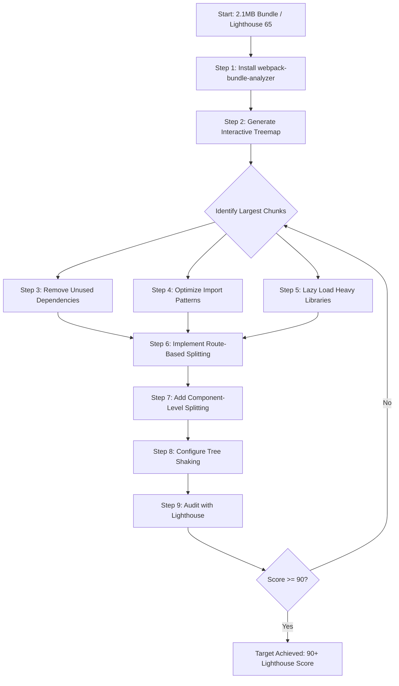

| Difficulty | Channel | Tags |
|---|---|---|
| intermediate | frontend | lighthouse, bundle, lazy-loading |

Your React app just hit a Lighthouse score of 65. The bundle sits at a bloated 2.1MB, Time to Interactive stretches to 4.2 seconds, and every new feature feels like throwing a sack of bricks onto a already-straining camel's back. But here's the thing — you're not alone. Wix's engineering team watched the exact same spiral unfold when a single Lottie animation library ballooned their bundle by 87KB, shipped to every user on initial load whether they ever saw that 'happy moment' animation or not [1]. The good news? They cut that bundle by 80%. And the playbook they used is one you can steal today.

---

> ### Real-World Case — Wix
>
> Wix's engineering team released a new feature and immediately got complaints from their analytics team that page load time had increased. The bundle had ballooned to 190KB, driven by a Lottie library (61.45KB) plus its 26KB JSON animation file being shipped to every user on initial load, even though the 'happy moment' animation might never be shown during a user's session.
>
> | | |
> |---|---|
> | **Challenge** | The app was shipping a large, rarely-used After Effects animation library and its data as part of the initial bundle, forcing all users—including admins who would never see the animation—to download ~94KB of unnecessary JavaScript and JSON. The bundle needed to be split so heavy features only loaded when actually triggered, without breaking the animation's tooltip positioning. |
> | **Solution** | The team used webpack-bundle-analyzer to identify Lottie-web as the culprit, then applied React.lazy() and Suspense to split the 'happy moment' component into a separate code chunk fetched only when the user completed all recommended steps. They later discovered that React.lazy rendered content too late, breaking tooltip positioning, so they switched to plain webpack dynamic imports (import().then()) to fetch the component first and only then set the state that opened the tooltip. They further optimized by conditionally excluding admin users entirely. |
> | **Outcome** | The bundle was trimmed from 190KB to 96KB (50% reduction) after the first split, then down to just 38KB — an 80% total reduction — after also excluding the progress bar for admin and non-completing users. |
> | **Lesson** | Bundle analysis tools like webpack-bundle-analyzer reveal exactly which dependencies are overpriced, and even heavy, well-loved libraries (like Lottie) can be deferred. But React.lazy has a real gotcha: it delivers content after layout, so side effects like tooltip positioning break — meaning you sometimes need a manual dynamic-import flow to control the sequencing between 'code arrived' and 'render it'. |

---

## Hook — The Deploy That Broke the Analytics Team's Heart

Picture this: the deploy goes green. The feature ships. The team celebrates. Then the Slack messages start rolling in — not from users, but from your own analytics team, telling you page load times just jumped off a cliff. Sound familiar? That is exactly what happened at Wix when a new feature introduced a Lottie animation library — a 61.45KB bundle chunk plus a 26KB JSON animation file — into the initial payload. Every single user, on every single page load, was forced to download animation code for a celebration effect most of them would never trigger [1]. It is the kind of silent performance tax that does not set off fire alarms but absolutely destroys user experience metrics, one frustrated visitor at a time.

## Problem — Why Your Bundle Keeps Growing and Nobody Notices Until It Is Too Late

Here is the uncomfortable truth about JavaScript bundle bloat: it rarely happens in one catastrophic commit. Instead, it creeps in — one new charting library here, a utility package there, an animation library someone added for a single modal that now loads on every route. Before long, your 600KB app has quietly inflated to 2.1MB, and your Lighthouse score has cratered from a comfortable 90 to a humbling 65. The consequences are measurable and brutal. Google's research shows that 53% of mobile users abandon sites that take longer than 3 seconds to load [2]. Every additional 100ms of latency costs you roughly 1% in conversion rates. When your Time to Interactive hits 4.2 seconds, you are not just losing patience — you are losing revenue, search ranking, and user trust. The root cause? Most teams add dependencies without auditing their weight, bundle everything into a single payload, and treat lazy loading as an afterthought rather than a first-class architectural decision.

## Real-World Case — Wix: How a 'Happy Moment' Animation Became Everyone's Problem

Wix's story is a masterclass in how quickly bundle debt compounds. The team added a Lottie animation — a delightful 'happy moment' celebration effect — to enhance user experience. But the implementation shipped the entire Lottie library (61.45KB) and its JSON animation file (26KB) to every visitor on initial page load [1]. No code splitting. No lazy loading. No conditional loading based on whether the user would even see the animation. The total damage? A 190KB bundle that ballooned initial load times and triggered immediate complaints from the analytics team. The first fix was straightforward: apply code splitting with React.lazy() and dynamic imports to defer the animation library until it was actually needed. That alone cut the bundle from 190KB down to 96KB — a 50% reduction. But the team did not stop there. They asked a harder question: does every user actually need this animation? Administrators and users who never completed the flow would never see it. By conditionally loading the animation only for users who would actually trigger it, they trimmed the bundle all the way down to 38KB. An 80% total reduction [1]. The lesson is not just about compression or minification — it is about fundamentally questioning whether code belongs in the initial payload at all.

## Deep Dive — The Three Pillars of Bundle Optimization

To systematically attack bundle bloat, you need to understand three interconnected strategies: bundle analysis, code splitting, and tree shaking. Each addresses a different layer of the problem, and together they form a complete optimization pipeline.

**Bundle Analysis: You Cannot Optimize What You Cannot See**
Before touching a single line of code, you need visibility into what your bundle actually contains. The webpack-bundle-analyzer plugin generates an interactive treemap visualization of your bundle composition [3]. Suddenly, that cryptic 200KB chunk reveals itself as a full copy of Moment.js with every locale included. Or you discover that a 'small' utility library pulled in half of Lodash. Without this visibility, you are guessing. With it, you have a surgical roadmap.

**Code Splitting: The Right Code at the Right Time**
Code splitting is the practice of breaking your single monolithic bundle into smaller chunks that load on demand [4]. React.lazy() and Suspense enable component-level splitting, while route-based splitting defers entire pages until the user navigates to them. The key insight? Not every component needs to be in the initial JavaScript payload. A settings page a user visits once a quarter does not deserve the same priority as the dashboard they see every morning.

**Tree Shaking: Eliminating Dead Weight**
Tree shaking is the process of removing unused exports from your dependencies during the build step [5]. It works with ES modules because their static structure allows the bundler to trace which exports are actually imported. However, many developers sabotage tree shaking without realizing it — importing the entire Lodash library instead of individual functions, or using CommonJS modules that static analysis cannot optimize. The difference between `import { debounce } from 'lodash-es'` and `import _ from 'lodash'` can be hundreds of kilobytes.

## Workflow — A Step-by-Step Battle Plan for Slashing Your Bundle

Here is the systematic workflow for taking a 2.1MB bundle down to size. Each step builds on the previous one, creating a compounding effect that makes the final result dramatically better than any single optimization alone.

## Code Example — From Monolith to Micro-Bundles in 30 Lines

The following implementation demonstrates route-based and component-level code splitting — the same pattern that powered Wix's 80% bundle reduction. Each React.lazy() call creates a separate chunk that only loads when the user actually navigates to that route or renders that component.

## Lessons Learned — What Wix's 80% Cut Teaches Every React Developer

The Wix story and the broader discipline of bundle optimization distill into a handful of principles that separate fast apps from sluggish ones.

**Always measure before you optimize.** The webpack-bundle-analyzer reveals truths that gut feeling cannot. Many developers discover they are shipping entire utility libraries when they use one function [3]. Run the analysis first; it takes 5 minutes and saves hours of guesswork.

**Question every dependency's right to be in the initial bundle.** Wix's breakthrough came not from minifying the Lottie library but from asking whether it belonged in the initial payload at all [1]. Apply this question ruthlessly: does this charting library need to load before the user sees the first meaningful paint? Does this animation library need to be available on every route?

**Route-based splitting is table stakes, not an optimization.** If you are not using React.lazy() at the route level, you are shipping a monolithic bundle in 2026. This is not advanced optimization — it is basic hygiene [6].

**Tree shaking is only as good as your import patterns.** A single `import _ from 'lodash'` can undo weeks of careful splitting. Use tree-shakeable packages and import individual functions [5].

**Error boundaries are not optional.** When you split code into chunks, chunk loading can fail. Network timeouts, CDN issues, and stale caches all become potential failure points. Every Suspense boundary should have a corresponding ErrorBoundary.

**Measure the full lifecycle.** A bundle size reduction means nothing if your largest contentful paint does not improve. After every optimization pass, re-run Lighthouse and Real User Monitoring to confirm the metric actually moved [7].

Here is the single most important takeaway: bundle optimization is not a one-time sprint. It is a discipline. Every dependency you add is a bet that its value exceeds its weight. Make that bet deliberately, measure its impact, and be prepared to call it off.

---

## Bundle Optimization Workflow

<strong>Original Interview Question</strong>

**Q:** You're tasked with improving a React app's Lighthouse performance score from 65 to 90+. The bundle size is 2.1MB and Time to Interactive is 4.2s. What specific steps would you take to optimize the bundle and implement lazy loading?

**A:** Implement code splitting with React.lazy() and Suspense, analyze bundle composition with webpack-bundle-analyzer to identify largest chunks, remove unused dependencies and optimize imports, add dynamic imports for heavy components and third-party libraries, implement route-based splitting for better initial load times, and utilize tree shaking with proper ES module configuration.

## Conclusion

Wix's 80% bundle reduction was not the result of some exotic optimization — it was the product of asking one simple question before every dependency: does this code deserve to be in the initial payload? The tools to answer that question are already in your toolbox: webpack-bundle-analyzer for visibility, React.lazy() and Suspense for splitting, and tree shaking for eliminating dead code. The only thing standing between your 65 Lighthouse score and a 90+ is the discipline to use them systematically. Start by running the analyzer on your bundle today. The treemap will show you exactly where the fat is. Then slice it away, one lazy-loaded chunk at a time.

---

## References

1. [Wix — Trim the Fat from Your Bundles Using Webpack Analyzer, React.lazy & Suspense](https://www.wix.engineering/post/trim-the-fat-from-your-bundles-using-webpack-analyzer-react-lazy-suspense) — blog
2. [MDN — Web Performance: What is Performance?](https://developer.mozilla.org/en-US/docs/Web/Performance) — documentation
3. [GitHub — webpack-contrib/webpack-bundle-analyzer](https://github.com/webpack-contrib/webpack-bundle-analyzer) — documentation
4. [MDN — Dynamic import()](https://developer.mozilla.org/en-US/docs/Web/JavaScript/Reference/Operators/import) — documentation
5. [MDN — Tree Shaking](https://developer.mozilla.org/en-US/docs/Glossary/Tree_shaking) — documentation
6. [React Official Docs — React.lazy](https://react.dev/reference/react/lazy) — documentation
7. [web.dev — Lighthouse Performance Scoring](https://web.dev/articles/performance-scoring) — blog
8. [MDN — ES Modules: JavaScript Modules — Using ES Modules](https://developer.mozilla.org/en-US/docs/Web/JavaScript/Guide/Modules) — documentation
9. [Wikipedia — Code Splitting](https://en.wikipedia.org/wiki/Code_splitting) — documentation
10. [MDN — Using Promises](https://developer.mozilla.org/en-US/docs/Web/JavaScript/Guide/Using_promises) — documentation

---

**Author:** Satishkumar Dhule — [GitHub](https://github.com/satishkumar-dhule) · [LinkedIn](https://linkedin.com/in/satishkumar-dhule) · [Website](https://satishkumar-dhule.github.io)
