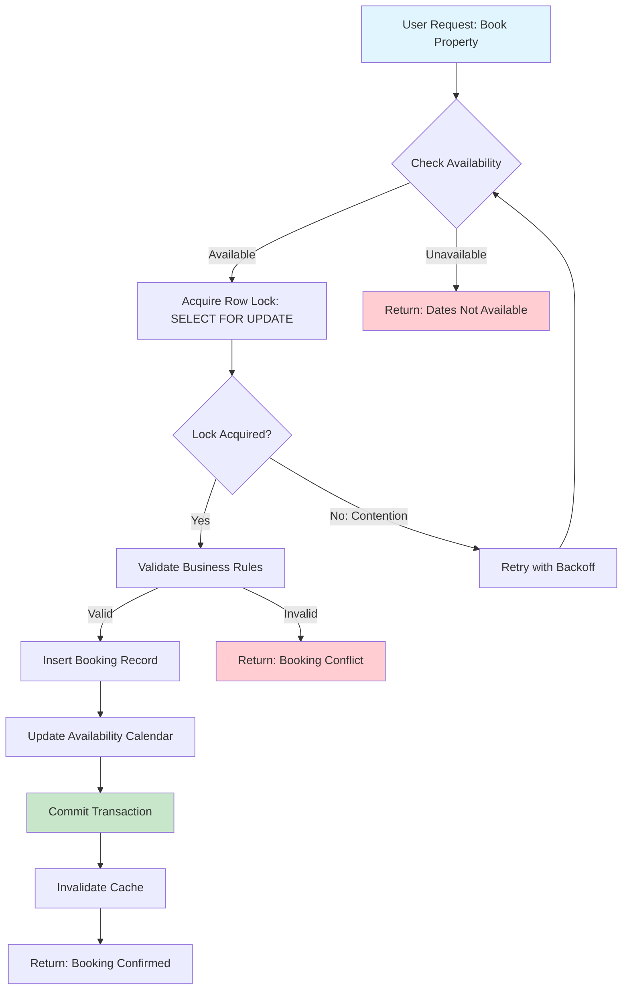

| Difficulty | Channel | Tags |
|---|---|---|
| intermediate | database | acid, isolation-levels, mvcc |

Picture this: your booking system just confirmed the same beachfront villa for two different guests on the same weekend. One customer arrives to find their 'confirmed' reservation doesn't exist. The other is already poolside. Both are furious, and your support team is drowning in complaints. This isn't hypothetical—Airbnb's payments system faced exactly this kind of nightmare when timeouts and network retries caused duplicate charges across their microservices architecture [1]. The stakes? Millions in potential losses and eroded trust. So how do you build a system where multiple users can book the same property simultaneously without creating chaos? The answer lies in mastering database transaction isolation—and the journey to get there reveals some counterintuitive truths about concurrency that many developers miss.

---

> ### Real-World Case — Airbnb
>
> Airbnb's payments system moved money between guests and hosts across a growing network of microservices. Timeouts, network retries, and auto-retry logic meant the same payment request could be fired multiple times, risking duplicate charges to guests and duplicate payouts to hosts — the payments equivalent of a double booking.
>
> | | |
> |---|---|
> | **Challenge** | Guarantee exactly-once money movement in a distributed payments architecture. Even a few seconds of read-replica lag could cause a retry to miss the original response and create a duplicate financial transaction, with real dollars at stake for Airbnb's users. |
> | **Solution** | Airbnb built a generic idempotency framework ('Orpheus'). Every API request carries an idempotency key, and the framework acquires a database row-level lock on that key — acting as an expiring lease — so only one request can proceed at a time. Crucially, they discovered idempotency checks must read from the master, not replicas (to avoid replica-lag duplicates), then sharded the idempotency store by key to scale. |
> | **Outcome** | After launching the framework, Airbnb achieved five nines (99.999%) consistency for payments while annual payment volume doubled at the same time. The couple-seconds of replica-lag scenario was converted from a money-losing race into a deterministic retry. |
> | **Lesson** | Logical locks and version checks are only as safe as where you read from: a few seconds of read-replica lag re-introduced the exact duplicate the idempotency key was meant to prevent. Row-level leases on idempotency keys plus master-only reads, then sharding by key, is how a booking-scale system prevents double-execution without sacrificing availability. |

---

## Hook — When Your Booking System Becomes a Casino

It was the kind of bug that makes engineers lose sleep: two guests, one property, same dates, both with confirmation emails. The database showed both bookings as valid. Sound familiar? You've probably encountered some version of this in your own projects—the race condition that only appears under real-world load. The problem isn't just technical; it's a trust issue. When a customer books a property, they expect exclusivity. When that expectation breaks, the fallout extends beyond angry emails to churn, negative reviews, and potential legal liability. The real question isn't whether this can happen—it's whether your system is prepared for the moment it does.

## Problem — The Concurrency Trap That Catches Everyone

At its core, the double-booking problem is a race condition masquerading as a business logic issue. You have a property available on specific dates. Multiple users query the system simultaneously. Both see 'available.' Both click 'Book Now.' Both transactions execute. Both succeed. Now you have an overbooking. Here's the thing many developers miss: standard database isolation levels don't automatically prevent this. Your default READ COMMITTED isolation? It's not enough. Each transaction sees a consistent snapshot of data, but those snapshots can diverge between concurrent operations. You might think wrapping everything in a transaction solves it—but transaction boundaries alone don't create the mutual exclusion you need. The gap between checking availability and inserting the booking record is exactly where the race condition lives. And under high traffic? That gap might as well be a canyon.

## Real-World Case — Airbnb's Payment Paradox

Airbnb's engineering team confronted this exact problem at scale with their payments system. As their platform grew, payments moved between guests and hosts across an expanding network of microservices. Timeouts, network retries, and auto-retry logic meant the same payment request could fire multiple times—risking duplicate charges to guests and duplicate payouts to hosts. The payments equivalent of a double booking. The impact was severe: financial discrepancies, customer trust issues, and operational overhead. But here's the turning point: after implementing a framework to handle this, Airbnb achieved five nines (99.999%) consistency for payments while their annual payment volume doubled simultaneously [1]. They converted what they called 'the couple-seconds of replica-lag scenario' from a money-losing race into a deterministic retry. The lesson? The same patterns that solve payment duplication apply directly to booking systems. Whether you're moving money or reserving properties, the concurrency challenge—and the solution—follows the same principles.

## Deep Dive — The Concurrency Control Toolkit

Building on Airbnb's experience, let's break down the technical arsenal for preventing double bookings. First up: isolation levels. Most developers default to READ COMMITTED, but for booking systems, SERIALIZABLE isolation is your safety net [2]. It ensures transactions execute as if they were running one after another, even when they're actually concurrent. However, SERIALIZABLE comes with a performance cost—higher contention and potential deadlocks. That's where optimistic concurrency control enters the picture. Instead of locking rows upfront, you version them. Each booking attempt includes the version number it read. When updating, you check if the version matches. If someone else modified the row in between? Your transaction fails, and you retry. This pattern—optimistic locking with version columns—trades immediate failure for better throughput under low contention [3]. The real power comes from combining approaches: use SERIALIZABLE for the critical booking operation, but leverage PostgreSQL's SELECT FOR UPDATE to explicitly lock specific date ranges during the transaction [4]. Meanwhile, MVCC (Multi-Version Concurrency Control) snapshot reads let you check availability without blocking other reads [5]. Here's a table comparing the trade-offs:

| Approach | Consistency | Performance | Complexity | Best For |
|----------|-------------|-------------|------------|----------|
| SERIALIZABLE | Highest | Lower throughput | Moderate | Critical operations |
| Optimistic Locking | High | Better under low contention | Higher | Read-heavy systems |
| SELECT FOR UPDATE | High | Lower for hot rows | Lower | Specific date ranges |
| READ COMMITTED | Medium | Highest | Lowest | Non-critical reads |

The insight? You don't pick one—you layer them. SERIALIZABLE for the write path, optimistic locking for the application layer, and careful lock selection for hot properties.

## Workflow — From Check to Confirmation

Let's map out the booking workflow step by step. The diagram below shows how a reservation flows from availability check to confirmed booking, with concurrency controls at each stage: [MERMAID_DIAGRAM]

Here's the breakdown: First, the availability check uses a snapshot read—no locks, just checking what's currently available. If dates are free, you acquire a lock on those specific rows using SELECT FOR UPDATE. This blocks other transactions from modifying those dates. Then you perform the application-level validation: double-check that the dates are still available (someone might have locked them between your check and lock acquisition). If validation passes, insert the booking record and update the availability calendar. Finally, commit and release locks. The retry logic with exponential backoff handles the edge case where your lock acquisition fails due to contention. After debugging this pattern many times, here's what works: retry 3-5 times with delays of 100ms, 200ms, 400ms, then escalate to user-facing messaging.

## Code Example — Implementation Walkthrough

Here's a Python implementation using SQLAlchemy that demonstrates the core pattern. This code shows how to combine SERIALIZABLE isolation with optimistic locking and proper retry logic: [CODE_EXAMPLE]

## Lessons Learned — Battle Scars and Best Practices

After implementing this pattern across multiple booking systems, here are the hard-won insights: First, monitor lock contention from day one. Hot properties—those luxury villas during peak season—will become your bottleneck. Implement circuit breakers that fail fast when lock wait times exceed thresholds [6]. Second, cache intelligently. Read replicas handle availability checks well, but cache invalidation must be atomic with booking confirmation. Airbnb learned this the hard way—their framework ensures 'each payment request is assigned an idempotency key' and uses distributed locking [1]. Third, don't forget about application-level validation. Even with database locks, you need to verify business rules (minimum stay requirements, overlapping bookings, guest limits) within the same transaction. Many developers think database constraints are enough—they're not. Finally, test under realistic concurrency. Use tools like pgbench or custom load testers to simulate 100+ concurrent booking attempts. The race condition that appears once in development appears thousands of times in production. If this feels overwhelming, you're not alone. Every senior engineer has debugged a concurrency bug at 2am. The difference is having the right patterns ready when the pager goes off.

---

## Booking Concurrency Control Flow

<strong>Original Interview Question</strong>

**Q:** You're building a booking system for Airbnb where multiple users can reserve the same property simultaneously. How would you design the transaction handling to prevent double bookings while maintaining high availability?

**A:** Use SERIALIZABLE isolation with optimistic concurrency control. Implement row-level locks on property availability tables, use MVCC snapshot reads for checking availability, and apply application-level validation to ensure atomic booking operations.

## Conclusion

The double-booking problem isn't just a technical challenge—it's a trust issue that directly impacts your bottom line. As Airbnb learned, timeouts and retries can turn a single booking request into multiple charges, eroding customer confidence. The solution? Layer your defenses: SERIALIZABLE isolation for critical operations, optimistic locking for application-level validation, and careful row-level locks for hot date ranges [4]. Monitor lock contention from day one, implement circuit breakers for hot properties, and test under realistic concurrency loads. The pattern you implement today prevents the 2am pages tomorrow. Start by auditing your current isolation levels and adding version columns to your availability tables. The next time your system faces a booking rush, you'll be ready.

---

## References

1. [Airbnb: Avoiding Double Payments in a Distributed Payments System](https://medium.com/airbnb-engineering/avoiding-double-payments-in-a-distributed-payments-system-2981f6b070bb) — blog
2. [PostgreSQL Documentation: Transaction Isolation](https://www.postgresql.org/docs/current/transaction-iso.html) — documentation
3. [Martin Fowler: Optimistic Locking Pattern](https://martinfowler.com/eaaCatalog/optimisticLock.html) — blog
4. [PostgreSQL Documentation: Explicit Locking](https://www.postgresql.org/docs/current/explicit-locking.html) — documentation
5. [Wikipedia: Multiversion Concurrency Control](https://en.wikipedia.org/wiki/Multiversion_concurrency_control) — documentation
6. [AWS Architecture Blog: Circuit Breaker Pattern](https://docs.aws.amazon.com/prescriptive-guidance/latest/cloud-design-patterns/circuit-breaker.html) — documentation
7. [DigitalOcean: Understanding Database Isolation Levels](https://www.digitalocean.com/community/tutorials/understanding-isolation-levels) — blog
8. [Wikipedia: Race Condition](https://en.wikipedia.org/wiki/Race_condition) — documentation

---

**Author:** Satishkumar Dhule — [GitHub](https://github.com/satishkumar-dhule) · [LinkedIn](https://linkedin.com/in/satishkumar-dhule) · [Website](https://satishkumar-dhule.github.io)
