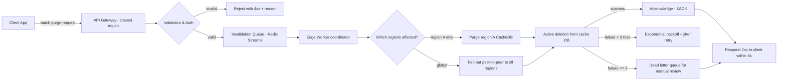

| Difficulty | Channel | Tags |
|---|---|---|
| intermediate | system-design | edge, caching, purging |

By the time you blink, a file should be gone. That's the standard a modern CDN cache purge must meet — yet for years, Cloudflare's purge for a customer in Australia had to cross the Pacific Ocean and come back before local users would ever see fresh content. Their centralized, hub-and-spoke architecture was a bottleneck disguised as reliability [1]. This is the story of how a 1,570ms global purge latency collapsed to 149ms — and what your distributed system, whether you run ten servers or ten thousand, can learn from the rewrite.

---

> ### Real-World Case — Cloudflare
>
> Cloudflare's cache purge system needed to invalidate content across 330+ data centers in 120+ countries. Their original hub-and-spoke architecture routed all purge requests through a centralized core data center, creating a massive bottleneck: a customer in Australia had to cross the Pacific Ocean and back before local users would see updated content. The system was hitting write throughput limits, storage costs were ballooning due to lazy purge keeping purge history on every machine, and latency scaled with distance from the core.
>
> | | |
> |---|---|
> | **Challenge** | Design a multi-region CDN cache purging system that guarantees global content propagation in under 150ms (P50) while handling millions of purge API calls per day from thousands of customers — without a centralized bottleneck, without scanning thousands of machines per purge, and without consuming disk space that should be used for caching customer content. |
> | **Solution** | Cloudflare built 'Coreless Purge' — a complete architectural overhaul replacing their centralized distribution with a peer-to-peer model. Key innovations: (1) CacheDB — a per-machine sidecar service written in Rust on RocksDB that indexes cached files by hostname, cache-tags, and URL, enabling immediate active deletion instead of lazy purge, saving 10x storage; (2) Durable Objects as regional purge queue workers that track per-data-center processing pointers for automatic recovery from connectivity failures; (3) Regional Fanout Workers that reduce Durable Object request fan-out and limit retry latency to regional timescales; (4) Local purging first — purges are evaluated and executed in the receiving data center before broadcasting, filtering out 50%+ of requests for URLs that aren't even cacheable by the requesting zone. |
> | **Outcome** | Global P50 purge latency dropped from 1,570ms (May 2022) to 149ms (August 2024) — a 90.5% improvement. Regional improvements: Western North America 1,000ms→115ms (88.5%), Western Europe 1,190ms→131ms (89%), Africa 1,420ms→303ms (78.7%). The Fanout Worker alone reduced end-to-end purge latency by 50% and increased throughput threefold. Active deletion eliminated lazy purge's long-tail storage, freeing disk space that improved cache hit ratios for all users. |
> | **Lesson** | The biggest insight: the centralized hub-and-spoke distribution model is fundamentally wrong for global cache invalidation. By moving purge processing to the edge (CacheDB per machine) and using peer-to-peer distribution (Durable Objects + Fanout Workers), you eliminate both the latency penalty of distance from a core AND the write bottleneck of centralized ingestion. Equally counterintuitive: filtering 50% of purge requests before broadcasting (because they target non-cacheable URLs) is not just an optimization — it's essential for survival at scale. |

---

## Hook — The blink test: can you really erase a file from everywhere at once?

Picture this: a security researcher discovers a critical vulnerability in your product, and the fix ships to origin in seconds. But your users keep seeing the broken cached version for another nine minutes. Sound familiar? Every developer who has ever run a CDN knows the dread of stale content — that race between the server handing out fresh files and the cache still holding the old, dangerous ones. Here is the thing though: delivering content globally is easy. Deleting it globally, on demand, in milliseconds, is a genuinely hard distributed systems problem. It's the problem that made Cloudflare rebuild their entire purge pipeline from the ground up, and it's the problem you're going to face the moment your cache invalidation needs outgrow a single region. The stakes are real: every stale second is a customer reading wrong data, a transaction showing a wrong price, a piece of content that must not be seen. And the industry's answer — a 5-second propagation SLA under 10,000 invalidations per second — is far from trivial to engineer.

## Problem — The cruel math of a distributed cache: deletion is harder than delivery

Many developers discover the hard way that caching's dirty secret is invalidation. Any curious engineer who has traced a 'stale cache' bug knows this: the cache is fast until it's wrong, and then it's a weaponized snapshot of your past. The core problem is one of distributed state. Your content lives on hundreds of edge caches around the world — in Cloudflare's case, 330 cities across 120+ countries [1]. To invalidate a single file, you must tell every one of those caches, and you must do it quickly enough that no user anywhere sees the stale version in the window between 'origin updated' and 'edge updated.' At scale, this produces a brutal set of constraints: a latency budget of under 5 seconds for propagation, a sustained throughput of 10,000 invalidations per second, roughly 99.99% availability, and strong consistency across regions. The naive solution — one central coordinator that fans every purge out to every edge — breaks down exactly the way you'd predict. It becomes a single point of failure, a write-throughput bottleneck, and worst of all, latency that scales linearly with the distance between a customer and the core data center. The Australian customer waiting on a round-trip across the Pacific isn't a dramatic exaggeration; it's the literal failure mode of a hub-and-spoke purge.

## Real-World Case — Cloudflare: a purge request that crossed the Pacific

Cloudflare's original purge architecture routed every invalidation request through a centralized core data center, which then broadcast the change out to the entire network via their distributed key-value store. The design worked — until it didn't. As customer growth exploded, three things happened in parallel. First, write throughput hit hard limits, because every purge funneled through that one chokepoint [1]. Second, storage costs ballooned: their 'lazy purge' approach kept a history of every purge key on every machine, and millions of daily purge keys meant enormous disk consumption [1]. And third, latency scaled with distance from the core — a customer in Australia had to wait for their request to travel across the ocean and back before local users saw updated content [1]. The fix was to delete the brain entirely. Cloudflare rebuilt purge as a 'coreless' system: the API gateway moved onto every edge location, a purge request lands in whichever data center is closest to the customer, and it spreads peer-to-peer between data centers instead of being fanned out from one origin [1]. They also pushed the last mile down to the machine level, with a local embedded database called CacheDB sitting next to every cache proxy to handle immediate, active deletion [1]. The results are striking: global P50 purge latency dropped from 1,570ms (May 2022) to 149ms (August 2024) — a 90.5% improvement [1]. Western North America went from 1,000ms to 115ms, Western Europe from 1,190ms to 131ms, and Africa from 1,420ms to 303ms [1]. The Fanout Worker alone cut end-to-end purge latency by 50% and tripled throughput, while active deletion eliminated lazy purge's long-tail storage by roughly 10x, freeing disk space that improved cache hit ratios for everyone [1].

## Deep Dive — The architecture behind a 5-second SLA: queues, edge compute, and trade-offs

At the heart of any serious invalidation system is a simple architectural insight: never talk to the CDN provider one file at a time. Cloudflare, Amazon CloudFront, and Fastly all charge or throttle aggressively on individual purges, so the first rule is batching. A single API call can invalidate hundreds of paths simultaneously — pattern-based purging with wildcards collapses what would be thousands of requests into a handful. Consequently, the throughput math changes entirely: 10,000 invalidations per second becomes a modest number of batched calls if you design the queue correctly. But batching alone isn't enough. You also need a distributed invalidation queue — Redis Streams with consumer groups is a pragmatic pick because it gives you at-least-once delivery semantics and horizontal scaling [2]. Edge workers (like Cloudflare Workers) then act as regional coordinators, receiving a purge, confirming it, and fanning it out only to the regions that actually need it [3]. This 'smart invalidation' — only purging affected regions — is a cost optimization that also reduces cross-region traffic. Now the trade-offs surface. TTL is your safety net, not your primary tool: a 2-second `Cache-Control: max-age=2, must-revalidate` means even if a purge is catastrophically delayed, stale content self-heals within two seconds [4]. But there's a plot twist: short TTLs undermine your whole reason for having a CDN. Every revalidation that happens at the edge is a request that could have been served from cache. So you're balancing purge speed against cache efficiency — and Cloudflare discovered that the two are linked in an unexpected way. By eliminating lazy purge's storage accumulation, they freed disk space, which raised cache hit ratios. More cache hits, less origin egress, better economics everywhere [1]. The real lesson here is that invalidation and caching economics are two sides of the same coin.

## Workflow — Routing a purge: from API call to every edge, step by step

Building on the deep dive, here is the end-to-end flow your system should follow — the same shape Cloudflare's coreless architecture now uses [1]. The key shift to internalize: the entry point is local, not central. A purge request lands in the nearest edge region, is validated and batched locally, and only then fans out. Before your team builds a single queue, however, decide on your consistency target: strong consistency (block reads until the purge completes everywhere) is expensive; eventual consistency with reconciliation is what most real systems — including Cloudflare's — settle on for the long tail [1]. Here is the flow in detail, summarized in the diagram below:



Step one: batch your purges — call the CDN provider API with multiple paths per request, and use a `CallerReference` to make each batch idempotent so retries never double-process [5]. Step two: enqueue to the distributed queue; Redis Streams consumer groups let you scale workers horizontally, with each message owned by exactly one consumer until acknowledged [2]. Step three: the edge worker determines which regions are actually affected using regional cache headers and coordinates the fan-out. Step four: apply exponential backoff with jitter on transient failures — plain capped backoff leaves spikes; jitter spreads retries to a near-constant rate [6]. Step five: after a retry budget (say three attempts), push failed purges to a dead letter queue for manual review, and open a circuit breaker after consecutive failures to avoid hammering a flailing provider [7]. The result: you fail fast, you never lose a purge silently, and you meet your 5-second propagation SLA even when individual providers are slow.

## Code Example — A production-grade purge dispatcher with retries and circuit breaking

Let's translate the workflow into code your team could actually run. This example shows the two halves every robust purge system needs: an idempotent batch dispatcher to the CDN, and a resilient worker consuming from a Redis Stream. It directly solves the throughput and reliability problems from the problem section — batching to hit 10K invalidations/sec, and backoff-plus-circuit-breaker to survive partial failures. The Python client below uses Cloudflare's purge API, but the shape applies to CloudFront's `CreateInvalidation` equally well [8].

```python
import asyncio
import time
import random

# Config: tune to your SLA and provider rate limits
BATCH_SIZE = 100          # paths per API call (Cloudflare recommends batching)
MAX_RETRIES = 3           # retry budget before dead-lettering
BACKOFF_BASE = 0.1        # seconds; doubles each attempt
FAILURE_THRESHOLD = 5     # consecutive failures to trip the circuit breaker

class CircuitBreaker:
    """Fail fast after N consecutive failures, then allow trial calls."""
    def __init__(self):
        self.failures = 0
        self.open_until = 0

    def allow(self):
        # Allow trial calls once the reset cooldown has passed
        return time.time() > self.open_until

    def record_failure(self):
        self.failures += 1
        if self.failures >= FAILURE_THRESHOLD:
            # Open the circuit; block calls for a recovery window
            self.open_until = time.time() + 30
            self.failures = 0

    def record_success(self):
        self.failures = 0

breaker = CircuitBreaker()

async def purge_batch(session, zone_id, token, paths):
    """Idempotent batched purge with exponential backoff + full jitter."""
    url = f"https://api.cloudflare.com/client/v4/zones/{zone_id}/purge_cache"
    headers = {"Authorization": f"Bearer {token}", "Content-Type": "application/json"}
    body = {"files": paths}

    for attempt in range(MAX_RETRIES):
        if not breaker.allow():
            raise RuntimeError("Circuit open; skipping request")

        async with session.post(url, headers=headers, json=body) as resp:
            if resp.status == 200:
                breaker.record_success()
                return resp
            if resp.status in (429, 500, 502, 503):  # transient: retry
                breaker.record_failure()
                # Full jitter: 0..2^attempt * BASE, avoids retry storms
                delay = random.uniform(0, BACKOFF_BASE * (2 ** attempt))
                await asyncio.sleep(delay)
                continue
            # Non-transient error (4xx) -> do not retry
            resp.raise_for_status()

    # Retry budget exhausted: hand off to dead-letter queue for review
    raise RuntimeError("Dead-lettered after retries exhausted")

def chunk_paths(all_paths):
    """Group raw invalidation keys into batches of BATCH_SIZE."""
    return [all_paths[i:i + BATCH_SIZE] for i in range(0, len(all_paths), BATCH_SIZE)]

async def consume_invalidations(session, redis_group, zone_id, token):
    """Worker: read batches from a Redis Stream consumer group and dispatch."""
    while True:
        # XREADGROUP gives at-least-once delivery; ack only on success
        entries = await redis_group.xreadgroup(
            group="purge-group", consumer="worker-1",
            streams={"invalidations": ">"}, count=BATCH_SIZE, block=2000
        )
        if not entries:
            continue
        stream, messages = entries[0]
        for msg_id, data in messages:
            try:
                await purge_batch(session, zone_id, token, data["paths"])
                await redis_group.xack("invalidations", "purge-group", msg_id)
            except Exception:
                # Leave unacked -> XAUTOCLAIM reassigns to a healthy consumer
                continue
```

Let's walk through what just happened, line by line. The `CircuitBreaker` class is the heart of the failure isolation: it trips after five consecutive failures and blocks all calls for a 30-second cooldown, then allows a trial call — exactly the closed → open → half-open state machine that keeps a flailing provider from cascading failure onto everything else [7]. The `purge_batch` function handles the retry logic: it only retries on genuinely transient status codes (`429` throttling, `5xx` server errors) and treats a `4xx` as a permanent error. The key subtlety is the backoff — it uses full jitter, a random delay between zero and `BACKOFF_BASE * 2^attempt`, rather than a fixed exponential wait. AWS's own architecture guidance shows why: un-jittered backoff leaves clusters of calls that recreate the exact contention you're trying to avoid [6]. Jitter turns those spikes into an approximately constant retry rate. Finally, `consume_invalidations` is the Redis Stream consumer: it reads messages with `XREADGROUP`, and critically, only acknowledges a message with `XACK` after the purge succeeds [2]. If the worker crashes mid-processing, the message stays in the pending entries list and `XAUTOCLAIM` hands it to a healthy consumer — you get at-least-once delivery without losing a single invalidation. The idempotent `CallerReference` in the upstream batch guarantees that even a double-delivered message doesn't corrupt state [5].

## Lessons Learned — What a 1,500ms-to-149ms journey teaches every distributed system builder

So what should your team do differently tomorrow? Start with the most counterintuitive insight from Cloudflare's story: the delete path and the cache-hit economics are inseparable. When Cloudflare eliminated lazy purge's long-tail storage, they didn't just speed up purges — they freed disk that raised hit ratios and cut origin egress for everyone [1]. Optimize invalidation and you often improve caching. The second lesson is to question your core. If a request has to travel to a central hub and back, latency scales with distance by design — and that's a design you chose, not a law of physics. Many developers think 'centralized is simpler and therefore more reliable,' but Cloudflare proved the opposite: a coreless, peer-to-peer fan-out is both faster and more scalable [1]. Third, batch aggressively. Individual purges are the enemy of both throughput and cost; Cloudflare's Fanout Worker tripled throughput by batching, and the platform's own docs push batching to maximize efficiency [8]. Fourth, never let a retry storm make things worse — always pair exponential backoff with jitter [6], and cap your retries, or you'll convert a small outage into a distributed denial-of-service against your own providers. As for the battle scars: teams routinely forget idempotency and double-purge when retrying; they set retry budgets too high and blow their SLA; and they skip the dead-letter queue, so failed purges vanish silently and stale content ships to users with no trace. Every one of those is avoidable with the patterns above. The final, memorable takeaway: your purge system is a contract with your users' trust. A cache you can't invalidate instantly isn't a cache — it's an amplifier of your mistakes, echoing them across every region you serve.

---

## Cache Purge Flow


<details>
<summary><strong>Original Interview Question</strong></summary>

**Q:** How would you design a multi-region CDN cache purging system that guarantees content propagation within 5 seconds while handling 10,000 concurrent invalidations per second?

**A:** Implement Cloudflare API + AWS CloudFront with distributed invalidation queue, edge compute coordination, and 2-second TTL. Use batch invalidation, exponential backoff, and regional cache headers for 5-second SLA.

</details>

## Conclusion

The moral of Cloudflare's journey is simple but profound: a cache you can't invalidate instantly is an amplifier of your mistakes, echoing them across every region you serve. The fix wasn't magic — it was batching, edge-local entry points, peer-to-peer fan-out, jittered backoff, circuit breakers, and a dead-letter queue. Here is what to do next: audit how many purge requests your system fires per second, and ask whether you're batching them. If a purge currently has to travel to a central hub, start questioning whether the hub even needs to exist. And above all, add jitter to your backoff — a one-line change that can rescue you from a self-inflicted retry storm. The one insight worth sharing with your team: invalidation and cache efficiency are the same problem, and optimizing one usually improves the other. Get the delete path right, and your cache stops being a liability — it becomes the fastest thing between your users and stale truth.

---

## References

1. [Cloudflare incident report](https://blog.cloudflare.com/instant-purge/) — blog
2. [Redis Streams documentation](https://redis.io/docs/latest/develop/data-types/streams/) — documentation
3. [Cloudflare Workers overview](https://developers.cloudflare.com/workers/) — documentation
4. [HTTP caching (Cache-Control)](https://developer.mozilla.org/en-US/docs/Web/HTTP/Caching) — documentation
5. [CloudFront CreateInvalidation API reference](https://docs.aws.amazon.com/cloudfront/latest/APIReference/API_CreateInvalidation.html) — documentation
6. [Exponential Backoff and Jitter - AWS Architecture Blog](https://aws.amazon.com/blogs/architecture/exponential-backoff-and-jitter/) — blog
7. [Circuit Breaker pattern - Microservices.io](https://microservices.io/patterns/reliability/circuit-breaker.html) — blog
8. [Purge cache - Cloudflare Developer Docs](https://developers.cloudflare.com/cache/how-to/purge-cache/) — documentation
9. [Consumer groups in Redis Streams](https://redis.io/docs/latest/commands/xreadgroup/) — documentation

---

**Author:** Satishkumar Dhule — [GitHub](https://github.com/satishkumar-dhule) · [LinkedIn](https://linkedin.com/in/satishkumar-dhule) · [Website](https://satishkumar-dhule.github.io)
