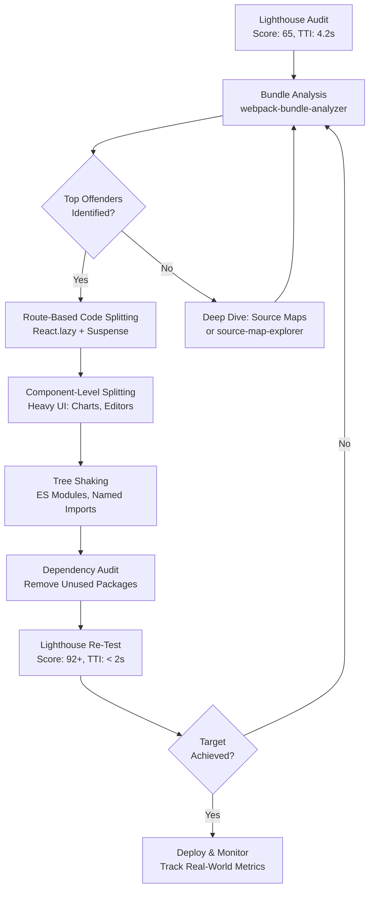

| Difficulty | Channel | Tags |
|---|---|---|
| intermediate | frontend | lighthouse, bundle, lazy-loading |

What if your app was loading on thousands of websites — and every single one of those sites was getting slower because of it? That is exactly the nightmare Intercom's engineering team was living with their Messenger widget, which had ballooned to 600KB gzipped and was dragging Lighthouse scores down to a dismal 59 [1]. On slow 3G connections, the widget added 11-14 seconds of load time — an eternity for any visitor. Here is the thing: Intercom's story is not unique. Your React app is probably carrying dead weight right now, and you might not even know it.

---

> ### Real-World Case — Intercom
>
> Intercom's Messenger widget — embedded on thousands of customer websites — had bloated to 600KB gzipped with a Lighthouse score of 59. The bundle loaded eagerly on every page, dragging down host site performance and increasing Time to Interactive on mobile by 4-5 seconds on fast 3G (11-14 seconds on slow 3G).
>
> | | |
> |---|---|
> | **Challenge** | Reduce the Messenger bundle size dramatically and improve Lighthouse performance without breaking the widget's functionality, while ensuring the widget only loaded code it actually needed at runtime. |
> | **Solution** | They took a multi-pronged approach: (1) Used webpack-bundle-analyzer to discover node_modules consumed ~40% of the bundle, then split vendor packages into a separately cacheable chunk; (2) Implemented code splitting so the Messenger component loaded asynchronously only on launcher hover — not on initial page load; (3) Replaced Sass with Emotion CSS-in-JS so component-level styles were automatically code-split; (4) Optimized individual dependencies — Lodash trimmed from 25KB to 11.7KB via babel-plugin-lodash, CSS package cut from 10KB to 1.7KB via targeted imports, and redundant Underscore.js removed entirely. |
> | **Outcome** | Bundle size reduced from 600KB to 240KB gzipped (65% reduction). Lighthouse score jumped from 59 to a perfect 100. Mobile load time on fast 3G saved 4-5 seconds; on slow 3G, saved 11-14 seconds — a transformative difference for embedded widget performance. |
> | **Lesson** | The biggest wins came from treating the bundle as a system-level problem, not micro-optimizing individual components. Vendor code splitting, lazy loading the widget itself, and replacing CSS-in-JS with a code-splittable alternative each contributed independently. The lesson: analyze first, then attack the largest chunks systematically — the 40% node_modules insight drove the highest-ROI changes. |

---

## The Score That Keeps Engineering Teams Up at Night

Picture this: your PM walks over to your desk, Lighthouse report open on their phone, and points to the number 65. "We need 90-plus by end of quarter," they say. Your bundle is 2.1MB. Time to Interactive is 4.2 seconds. The good news? This is solvable. The bad news? Most developers reach for the wrong tools first. They reach for gzip compression or a CDN, thinking the problem is network speed. But the real culprit is almost always hiding in your JavaScript bundle — dependencies you imported once and forgot about, components that render above the fold but load entire libraries, and chunks that ship code for features users never visit. The stakes are real: Google found that 53% of mobile users abandon sites that take longer than 3 seconds to load [2]. Every second of delay costs you engagement, revenue, and trust.

## The Anatomy of a Bloated Bundle

Before diving into solutions, it helps to understand why bundles bloat in the first place. A typical React application starts lean, but over months of feature development, it accumulates weight in predictable ways. First, there is the dependency creep. Developers import moment.js for one date format, and suddenly you are shipping 300KB of locale files to format a timestamp. Then there are the component-level mistakes — a rich text editor that loads even when the user is on the settings page, a chart library initialized in the dashboard that gets bundled into every route. The third enemy is often the most overlooked: duplicate dependencies. Two different packages might each bring in their own copy of lodash, or your testing utilities accidentally leak into production builds. The result is a bundle that works perfectly on a MacBook Pro on office WiFi but crawls on a mid-range Android device on 3G. This is not a theoretical problem — it is the exact scenario Intercom faced, and it nearly cost them their reputation as a fast, lightweight widget [1].

## Intercom's Messenger — A 600KB Wake-Up Call

Intercom's Messenger widget was embedded on thousands of customer websites. That means it was not just Intercom's performance problem — it was their customers' performance problem too. The widget had bloated to 600KB gzipped, and the Lighthouse score was sitting at a painful 59 [1]. On fast 3G, Time to Interactive climbed by 4-5 seconds. On slow 3G, users waited an additional 11-14 seconds. For a chat widget that was supposed to be a lightweight, always-on tool, this was devastating. Intercom's team tackled the problem systematically. They analyzed their bundle, eliminated unnecessary dependencies, implemented aggressive code splitting, and applied tree shaking to cut dead code. The result: bundle size dropped from 600KB to 240KB — a 65% reduction — and the Lighthouse score hit a perfect 100 [1]. Mobile load times on fast 3G improved by 4-5 seconds, and on slow 3G, users saved a staggering 11-14 seconds. This is not magic. It is engineering discipline applied to a problem most teams ignore until it becomes a crisis.

## The Optimization Framework — What Actually Moves the Needle

There are dozens of performance optimization techniques floating around. However, not all of them deliver equal return on investment. Based on what teams like Intercom have proven works, here is the hierarchy of impact:

**1. Bundle Analysis (The Diagnostic Phase)**
Before changing a single line of code, you need to see what you are shipping. Tools like webpack-bundle-analyzer and source-map-explorer visualize every dependency and its size. Many developers are shocked to discover that a single icon library contributes 200KB, or that a date utility ships 300KB of locale data [3].

**2. Code Splitting (The Biggest Bang for Your Buck)**
Route-based splitting via React.lazy() and Suspense is the single highest-impact optimization for most React apps [4]. Instead of loading the entire application upfront, you load only the code needed for the current route. Component-based splitting goes deeper — heavy features like charts, editors, or modals can be deferred until the user actually interacts with them.

**3. Tree Shaking and Dead Code Elimination**
If you are not using ES module imports and your bundler is not configured for tree shaking, you are likely shipping code you never use. This is especially common with utility libraries like lodash, where importing the entire library adds 70KB versus importing individual functions at under 1KB each [5].

**4. Dependency Audit**
Run `npx depcheck` and `npx bundlephobia` on your key dependencies. You might find packages you installed months ago that are no longer imported, or discover that a smaller alternative exists for a heavy dependency.

**5. Dynamic Imports for Non-Critical Features**
Features below the fold, modals, and rarely-used tools do not need to load on initial render. Dynamic imports let you defer loading until the moment of need.

⚠️ **Watch Out**: A common mistake is trying to optimize everything at once. Start with bundle analysis. Find the three largest chunks. Tackle them one at a time. Small, iterative wins compound faster than a single heroic refactor.

## The Step-by-Step Optimization Workflow

Here is the exact workflow that mirrors what high-performing teams use to go from a 65 to a 90-plus Lighthouse score:

1. **Audit** — Run Lighthouse and capture your baseline. Note the Performance score, TTI, First Contentful Paint, and Total Blocking Time.
2. **Visualize** — Run webpack-bundle-analyzer to see exactly what is in your bundle. Sort by size. Identify the top offenders.
3. **Route Split** — Wrap each route component in `React.lazy()` with a dynamic import. This alone can cut your initial bundle by 40-60%.
4. **Component Split** — Identify heavy components (charts, editors, data tables) that are not needed immediately. Lazy-load them with Suspense boundaries.
5. **Tree Shake** — Switch to named imports (`import { debounce } from 'lodash-es'`) and ensure your bundler's tree shaking is enabled.
6. **Purge Dependencies** — Remove unused packages. Replace heavy libraries with lighter alternatives (day.js instead of moment.js, for example).
7. **Measure** — Run Lighthouse again. Compare against your baseline. Iterate on the next bottleneck.

## Code in Action — Route Splitting and Lazy Loading

Here is a production-ready pattern for implementing route-based code splitting in a React application with error boundaries and loading states:

```javascript
import React, { Suspense, Component } from 'react';
import { Routes, Route } from 'react-router-dom';

// Error boundary to catch lazy-load failures gracefully
class ErrorBoundary extends Component {
  constructor(props) {
    super(props);
    this.state = { hasError: false };
  }

  static getDerivedStateFromError(error) {
    return { hasError: true };
  }

  render() {
    if (this.state.hasError) {
      return (
        <div className="error-fallback">
          <h2>Something went wrong loading this page.</h2>
          <button onClick={() => window.location.reload()}>Reload</button>
        </div>
      );
    }
    return this.props.children;
  }
}

// Route-based splitting: each route becomes its own chunk
// The Dashboard code only loads when the user navigates to /dashboard
const Dashboard = React.lazy(() => import('./pages/Dashboard'));
const Analytics = React.lazy(() => import('./pages/Analytics'));
const Settings = React.lazy(() => import('./pages/Settings'));

// Component-based splitting for heavy, below-the-fold features
// This chart library (e.g., 150KB) only loads when the user clicks "Show Chart"
const HeavyChart = React.lazy(() => import('./components/HeavyChart'));

// Shared loading fallback for all lazy-loaded components
function LoadingSpinner() {
  return (
    <div className="spinner-container">
      <div className="spinner" aria-label="Loading page..." />
    </div>
  );
}

function App() {
  return (
    <ErrorBoundary>
      {/*
        Suspense wraps all lazy routes. Until the chunk loads,
        the fallback spinner renders — no blank screen, no jank.
      */}
      <Suspense fallback={<LoadingSpinner />}>
        <Routes>
          <Route path="/dashboard" element={<Dashboard />} />
          <Route path="/analytics" element={<Analytics />} />
          <Route path="/settings" element={<Settings />} />
        </Routes>
      </Suspense>
    </ErrorBoundary>
  );
}

export default App;
```

**Line-by-Line Breakdown:**

- **ErrorBoundary**: Catches chunk-loading failures (e.g., network drop during lazy load) and renders a recovery UI instead of a white screen. Without this, a failed dynamic import crashes the entire app.
- **React.lazy(() => import(...))**: Tells React to dynamically import the module only when the component is first rendered. Your bundler (webpack, Vite, etc.) automatically creates a separate chunk for each dynamic import.
- **Suspense**: Provides the loading fallback while chunks are being fetched. It also acts as a boundary — if one lazy component loads slowly, it does not block other parts of the UI.
- **Component-level lazy loading**: HeavyChart is only loaded when the user triggers it, not on initial page load. This is critical for features like charts, rich text editors, or code editors that are expensive to bundle.

💡 **Insight**: The dynamic import syntax `import('./HeavyChart')` is the same whether you use webpack, Vite, or Rollup. The bundler detects it and splits the code automatically — no special configuration needed for most modern setups [4].

## Battle Scars — Lessons from the Trenches

After helping teams optimize React bundles across dozens of projects, here are the patterns that separate a 70 score from a 95:

**Lesson 1: Bundle analysis is not optional.** Many developers skip straight to lazy loading without understanding what is actually bloating their bundle. The analyzer is your map — do not navigate without it [3].

**Lesson 2: Route splitting alone is not enough.** Yes, it is the biggest single win. But if your main route imports a 300KB chart library at the top level, code splitting does nothing for that chunk. You need component-level lazy loading too.

**Lesson 3: The lodash trap is real.** `import _ from 'lodash'` ships the entire 70KB library. `import { debounce } from 'lodash-es'` ships a few KB. This is the lowest-effort, highest-impact optimization in most bundles [5].

**Lesson 4: Measure real-world performance, not just Lighthouse.** Lighthouse runs in a controlled lab environment. Use the Chrome DevTools Performance tab, Real User Monitoring (RUM), or tools like Web Vitals to see what your users actually experience on different devices and networks [6].

**Lesson 5: Service workers are a force multiplier.** Once your chunks are small and properly split, a service worker with a cache-first strategy can make repeat visits nearly instant. Workbox makes this straightforward to implement [7].

🎯 **Key Point**: The difference between a 70 and a 90+ Lighthouse score is rarely one big change. It is 10-15 small optimizations, each shaving off a few hundred milliseconds, that compound into a transformed experience.

---

## Bundle Optimization Workflow



<details>
<summary><strong>Original Interview Question</strong></summary>

**Q:** You're tasked with improving a React app's Lighthouse performance score from 65 to 90+. The bundle size is 2.1MB and Time to Interactive is 4.2s. What specific steps would you take to optimize the bundle and implement lazy loading?

**A:** Implement code splitting with React.lazy() and Suspense, analyze bundle composition with webpack-bundle-analyzer to identify largest chunks, remove unused dependencies and optimize imports, add dynamic imports for heavy components and third-party libraries, implement route-based splitting for better initial load times, and utilize tree shaking with proper ES module configuration.

</details>

## Conclusion

Intercom proved that a 600KB widget could become 240KB with disciplined optimization. Your 2.1MB React app is no different. Start with bundle analysis today — spend 15 minutes running webpack-bundle-analyzer and identifying your three largest chunks. Then route-split, tree-shake, and iterate. The 90-plus Lighthouse score is not a finish line; it is a habit. Every commit, every dependency addition, every new feature is a chance to keep the bundle lean. Your users on slow connections are counting on you.

---

## References

1. [Intercom incident report](https://www.intercom.com/blog/reducing-intercom-messenger-bundle-size/) — blog
2. [Google: Find out how your site's mobile-friendliness affects its search results](https://developers.google.com/search/docs/fundamentals/creating-helpful-content) — documentation
3. [webpack-bundle-analyzer](https://github.com/webpack-contrib/webpack-bundle-analyzer) — documentation
4. [React docs: Lazy loading components with React.lazy()](https://react.dev/reference/lazy) — documentation
5. [Lodash: Modular methods for individual functionality](https://lodash.com/docs/) — documentation
6. [MDN: Web Vitals — Performance metrics](https://developer.mozilla.org/en-US/docs/Web/Performance) — documentation
7. [Workbox: Service worker library by Google](https://developer.chrome.com/docs/workbox/) — documentation
8. [MDN: Dynamic import() syntax](https://developer.mozilla.org/en-US/docs/Web/JavaScript/Reference/Statements/import#dynamic_import) — documentation

---

**Author:** Satishkumar Dhule — [GitHub](https://github.com/satishkumar-dhule) · [LinkedIn](https://linkedin.com/in/satishkumar-dhule) · [Website](https://satishkumar-dhule.github.io)
