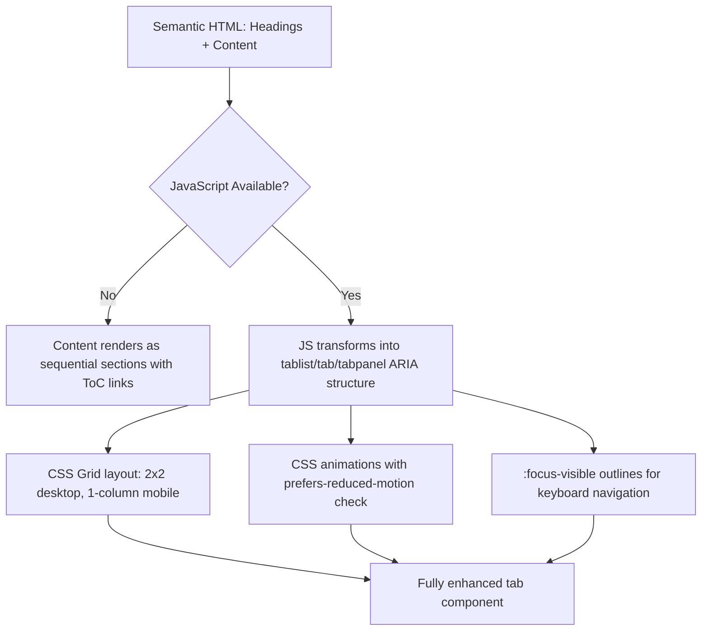
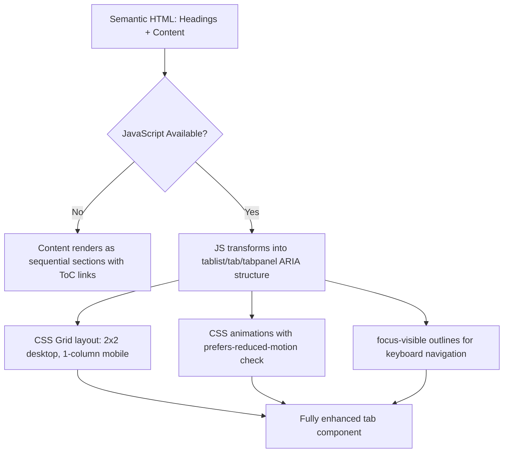

| Difficulty | Channel | Tags |
|---|---|---|
| beginner | frontend | css, flexbox, grid, animations |

Every developer has been tempted by the CSS-only tab pattern. It is elegant, requires zero JavaScript, and feels like a clever hack that proves you truly understand the cascade. But the UK Government Digital Service (GDS) — the team behind GOV.UK, which serves millions of citizens monthly — deliberately chose not to use it for their design system's tabs component [1]. They documented exactly why CSS-only radio tabs are inaccessible, and their reasoning should fundamentally change how you think about "pure CSS" solutions.

---

> ### Real-World Case — UK Government Digital Service (GDS) / GOV.UK
>
> The UK Government Digital Service builds and maintains the GOV.UK Design System, which powers hundreds of UK government services visited by millions of people monthly. When designing their tabs component, they deliberately chose NOT to use CSS-only radio input patterns, instead implementing JavaScript-enhanced tabs with a progressive enhancement fallback — and documented exactly why CSS-only tabs are inaccessible.
>
> | | |
> |---|---|
> | **Challenge** | Creating a tab component for a design system that must work for every UK citizen, including the 0.9% of visitors (~hundreds of thousands monthly) who arrive without JavaScript — not by choice, but because corporate proxies, telecoms injecting scripts, malware, ad blockers, or network failures stripped it. CSS-only radio input tabs were considered but rejected because they cannot convey ARIA tab roles/states to screen readers and fail WCAG 3.2.2 On Input. |
> | **Solution** | GOV.UK built tabs with JavaScript that enhances semantic HTML. When JS is unavailable, users see all tab content rendered as a single scrollable page with a table of contents linking to each section. The component also stores the active tab in the URL fragment so the browser back button works. Accessibility expert Adrian Roselli documented that CSS-only radio tabs fail WCAG 2.2 SC 4.1.2 (Name, Role, Value) because they never convey tab/tablist/tabpanel roles to assistive technologies, and fail SC 3.2.2 (On Input) because selecting a radio silently changes context. |
> | **Outcome** | The design system serves hundreds of government services with millions of monthly views. Their progressive enhancement approach means even users with no JavaScript, corporate firewalls stripping scripts, or telecoms injecting code can still navigate between tabbed content. The tabs component achieved WCAG 2.2 Level AA compliance — something CSS-only radio tabs fundamentally cannot reach. |
> | **Lesson** | CSS-only radio input tabs are a clever CSS trick but a production accessibility liability. No amount of ARIA attributes added via HTML can compensate for the fact that CSS cannot update aria-hidden, aria-selected, or role states dynamically. The plot twist: the most "accessible" version of tabs is one that uses JavaScript but degrades gracefully to plain HTML — not one that avoids JavaScript entirely. |

---

## Hook — The Allure of Zero JavaScript

Picture this: you are building a documentation page for your design system. You need tabs — Overview, Components, Tokens — and every instinct screams "CSS-only radio buttons." No JavaScript. No framework overhead. Just `input[type=radio]`, sibling selectors, and a little `:checked` magic. Many developers discover this pattern early in their careers and feel a rush of validation: CSS is all you need.

But here is the tension. What happens when a screen reader encounters a radio button that has nothing to do with a form? What happens when arrow-key navigation — the behavior every screen reader user expects from a tablist — simply does not exist? The CSS-only tab pattern produces something that looks like tabs and even switches content, but it is semantically a set of form inputs playing dress-up as a navigation component. The stakes are not theoretical: for millions of people relying on assistive technology, broken semantics mean a broken experience.

## Problem — Semantics, Accessibility, and the Hidden Cost of Cleverness

At the heart of this problem lies a mismatch between visual behavior and semantic meaning. CSS-only tabs use radio inputs and labels to toggle visibility of sibling elements. The visual result is tabs, but the accessibility tree tells a different story: a group of radio buttons inside a form, with no tablist, no tab, and no tabpanel roles [3].

This matters because screen readers and other assistive technologies rely on ARIA roles to communicate interface patterns to users. When a screen reader encounters a tablist, it announces "tab list, 3 tabs" and lets the user navigate with arrow keys between tabs, pressing Enter to activate [4]. None of that works with radio inputs styled as tabs. The user gets a radio group with no clear indication that it controls adjacent content.

Moreover, WCAG 2.2 — the current gold standard for web accessibility — requires that interactive components use appropriate ARIA roles and keyboard interaction patterns. CSS-only tabs fundamentally cannot meet these requirements because they lack `role="tablist"`, `role="tab"`, `role="tabpanel"`, `aria-selected`, `aria-controls`, and arrow-key navigation [5]. Many developers think they can bolt on ARIA attributes to fix this, but ARIA on radio buttons creates a confusing hybrid that assistive technologies handle inconsistently.

## Real-World Case — UK Government Digital Service (GDS) / GOV.UK

The UK Government Digital Service builds and maintains the GOV.UK Design System, which powers hundreds of UK government services visited by millions of people monthly. When designing their tabs component, the GDS team confronted the CSS-only radio pattern head-on — and explicitly rejected it [1].

In a detailed GitHub discussion on their design system backlog, GDS engineers explained that using radio inputs against their semantic intent introduces risk, especially for accessibility. They noted that while it might technically be possible now that browser support has improved, it would require significant maintenance to ensure a smooth screen reader experience — "which is already a known issue with our tabs currently" — and breaking semantic rules creates unpredictable behavior across assistive technologies [6].

Instead, GDS chose progressive enhancement: JavaScript-enhanced tabs that degrade gracefully. When JavaScript is unavailable, users see tabbed content rendered as headings and paragraphs on a single page, with a table of contents linking to each section. This approach achieved WCAG 2.2 Level AA compliance — something CSS-only radio tabs fundamentally cannot reach [1]. The impact is significant: hundreds of government services serving millions of monthly users all benefit from an accessible, resilient component.

## Deep Dive — The CSS-Only Pattern: How It Works and Where It Breaks

Let us dissect the CSS-only tab pattern to understand both its appeal and its limitations.

The mechanism is straightforward. You place a set of radio inputs with a shared `name` attribute at the top of a container. Each radio has a corresponding `` that serves as the tab trigger. Below the radios, you place `` or `` panels containing the content for each tab. Using the general sibling combinator (`~`), you hide all panels except the one associated with the checked radio [7].

```text
.tabs input:not(:checked) ~ .panel { display: none; }
```

This is elegant. It is also deeply flawed from an accessibility perspective. The `input[type=radio]` element has implicit ARIA semantics as a radio button inside a radiogroup — not as a tab inside a tablist [3]. Screen readers announce these as radio buttons, not tabs. There is no way to add `role="tablist"` to a radio group and have assistive technologies interpret it correctly.

Furthermore, the keyboard interaction is wrong. Radio groups support arrow-key navigation between options, which feels similar to tabs — but the semantics differ. Tabs require arrow keys to move between tabs and Tab to move into the panel. Radio groups use arrow keys to select and Tab to move to the next form control [4]. The user experience diverges significantly when you add more content inside each panel.

On the layout side, the pattern typically uses CSS Grid with `repeat(2, 1fr)` for the card grid inside each panel. This creates a responsive 2×2 grid on desktop that collapses to a single column on mobile via a media query. Cards use `aspect-ratio: 16/9` for consistent image containers — a property with baseline support since September 2021 [7]. The `prefers-reduced-motion` media query respects users who have enabled reduced motion settings, disabling entrance animations [8]. And `:focus-visible` outlines ensure keyboard users can see which element has focus [9].

All of these details are correct and useful. But they do not solve the fundamental semantic problem.

## Workflow — Building Tabs the Right Way (Progressive Enhancement)

The GDS approach follows a clear progressive enhancement strategy. Here is the mental model:

1. **Start with semantic HTML.** Render tab content as headings and paragraphs on a single page. Every user — regardless of JavaScript support — can read the content.
2. **Layer on JavaScript enhancement.** When JavaScript loads, transform the headings and content into a tabbed interface with proper ARIA roles: `tablist`, `tab`, and `tabpanel`.
3. **Apply CSS for layout and animation.** Style the grid, images, and transitions — but only after the ARIA structure is in place.
4. **Respect user preferences.** Use `prefers-reduced-motion` for animations and ensure `:focus-visible` outlines for keyboard navigation.

This is the exact workflow GDS follows for every interactive component in their design system [1][2]. The key insight is that JavaScript is not the enemy — it is the bridge between accessible HTML and enhanced interactivity.

The following diagram illustrates how this progressive enhancement pipeline works from initial HTML through to the fully enhanced tab component:



## Code Example — CSS-Only Tab Panel (Interview Pattern)

Despite its limitations for production accessibility, the CSS-only radio tab pattern is a common interview question and a useful demonstration of CSS sibling selectors. Here is the complete implementation:

```html
<!DOCTYPE html>
<html lang="en">
<head>
  <meta charset="UTF-8">
  <meta name="viewport" content="width=device-width, initial-scale=1.0">
  <title>Design System Docs — Tab Panel</title>
  <style>
    /* --- Tab switching via radio inputs --- */
    .tabs { max-width: 800px; margin: 2rem auto; font-family: system-ui, sans-serif; }

    /* Hide radio inputs visually but keep accessible */
    .tabs input[type="radio"] {
      position: absolute;
      width: 1px;
      height: 1px;
      overflow: hidden;
      clip: rect(0, 0, 0, 0);
    }

    /* Tab labels row */
    .tabs .tab-labels {
      display: flex;
      gap: 0;
      border-bottom: 2px solid #ddd;
      margin-bottom: 1.5rem;
    }

    .tabs label {
      padding: 0.75rem 1.5rem;
      cursor: pointer;
      font-weight: 600;
      color: #555;
      border-bottom: 2px solid transparent;
      margin-bottom: -2px;
      transition: color 0.2s, border-color 0.2s;
    }

    .tabs label:hover { color: #111; }

    /* Active tab style — only when its radio is checked */
    #tab-overview:checked ~ .tab-labels label[for="tab-overview"],
    #tab-components:checked ~ .tab-labels label[for="tab-components"],
    #tab-tokens:checked ~ .tab-labels label[for="tab-tokens"] {
      color: #111;
      border-bottom-color: #111;
    }

    /* Panel visibility — hide panels whose radio is NOT checked */
    .tabs .panel { display: none; }
    #tab-overview:checked ~ .panel-overview,
    #tab-components:checked ~ .panel-components,
    #tab-tokens:checked ~ .panel-tokens {
      display: grid;
      grid-template-columns: repeat(2, 1fr);
      gap: 1.5rem;
    }

    /* Mobile: single column */
    @media (max-width: 768px) {
      #tab-overview:checked ~ .panel-overview,
      #tab-components:checked ~ .panel-components,
      #tab-tokens:checked ~ .panel-tokens {
        grid-template-columns: 1fr;
      }
    }

    /* Card styling */
    .card {
      border: 1px solid #e0e0e0;
      border-radius: 8px;
      overflow: hidden;
      background: #fff;
    }

    .card__image {
      aspect-ratio: 16 / 9;
      background: #f0f0f0;
    }

    .card__title {
      margin: 0.75rem 0 0.25rem;
      padding: 0 1rem;
      font-size: 1rem;
    }

    .card__meta {
      margin: 0;
      padding: 0 1rem 1rem;
      font-size: 0.875rem;
      color: #666;
    }

    /* Staggered entrance animation (respects reduced motion) */
    @keyframes fadeSlideIn {
      from { opacity: 0; transform: translateY(10px); }
      to   { opacity: 1; transform: translateY(0); }
    }

    @media (prefers-reduced-motion: no-preference) {
      .card {
        animation: fadeSlideIn 0.3s ease-out backwards;
      }
      .card:nth-child(2) { animation-delay: 0.1s; }
      .card:nth-child(3) { animation-delay: 0.2s; }
      .card:nth-child(4) { animation-delay: 0.3s; }
    }

    /* Keyboard accessibility */
    :focus-visible {
      outline: 2px solid currentColor;
      outline-offset: 2px;
    }
  </style>
</head>
<body>
  <div class="tabs">
    <!-- Radio inputs (visually hidden) -->
    <input type="radio" id="tab-overview" name="tabs" checked>
    <input type="radio" id="tab-components" name="tabs">
    <input type="radio" id="tab-tokens" name="tabs">

    <!-- Tab labels -->
    <div class="tab-labels">
      <label for="tab-overview">Overview</label>
      <label for="tab-components">Components</label>
      <label for="tab-tokens">Tokens</label>
    </div>

    <!-- Panels -->
    <section class="panel panel-overview">
      <article class="card"><div class="card__image"></div><h3 class="card__title">Getting Started</h3><p class="card__meta">Setup guide — 5 min read</p></article>
      <article class="card"><div class="card__image"></div><h3 class="card__title">Design Principles</h3><p class="card__meta">Core values — 8 min read</p></article>
      <article class="card"><div class="card__image"></div><h3 class="card__title">Contributing</h3><p class="card__meta">How to help — 3 min read</p></article>
      <article class="card"><div class="card__image"></div><h3 class="card__title">Changelog</h3><p class="card__meta">v3.2.0 — Updated today</p></article>
    </section>
    <section class="panel panel-components">
      <article class="card"><div class="card__image"></div><h3 class="card__title">Button</h3><p class="card__meta">Interactive — 2 variants</p></article>
      <article class="card"><div class="card__image"></div><h3 class="card__title">Card</h3><p class="card__meta">Layout — 3 variants</p></article>
      <article class="card"><div class="card__image"></div><h3 class="card__title">Input</h3><p class="card__meta">Form control — 4 variants</p></article>
      <article class="card"><div class="card__image"></div><h3 class="card__title">Modal</h3><p class="card__meta">Overlay — 1 variant</p></article>
    </section>
    <section class="panel panel-tokens">
      <article class="card"><div class="card__image"></div><h3 class="card__title">Colors</h3><p class="card__meta">12 palette tokens</p></article>
      <article class="card"><div class="card__image"></div><h3 class="card__title">Typography</h3><p class="card__meta">8 scale tokens</p></article>
      <article class="card"><div class="card__image"></div><h3 class="card__title">Spacing</h3><p class="card__meta">6 scale tokens</p></article>
      <article class="card"><div class="card__image"></div><h3 class="card__title">Shadows</h3><p class="card__meta">4 elevation tokens</p></article>
    </section>
  </div>
</body>
</html>
```

**How it works:**

- **Radio inputs with shared `name`** ensure only one tab can be active at a time. They are visually hidden with the `clip` technique so they remain focusable for keyboard users.
- **Labels serve as tab triggers.** The `for` attribute links each label to its radio input. Clicking a label checks the corresponding radio.
- **Sibling selectors (`~`) control panel visibility.** `#tab-overview:checked ~ .panel-overview` shows only the panel whose radio is checked; all others get `display: none`.
- **CSS Grid creates the card layout.** `repeat(2, 1fr)` gives a 2×2 grid on desktop. A `@media (max-width: 768px)` breakpoint collapses to `1fr` for mobile.
- **`aspect-ratio: 16/9`** on `.card__image` maintains a consistent image container without JavaScript measurement.
- **Staggered animation** uses `animation-delay` on `nth-child` selectors, wrapped in `@media (prefers-reduced-motion: no-preference)` so users who prefer reduced motion see no animation [8].
- **`:focus-visible`** provides keyboard-accessible focus outlines only when navigating via keyboard, not on mouse click [9].

**Critical caveat:** While this code works and demonstrates CSS skill, it does not meet WCAG accessibility standards for a tab pattern. In production, use JavaScript-enhanced tabs with proper ARIA roles.

## Lessons Learned — What to Take Away

Here is the single most important insight from the GDS case: **cleverness is not the same as correctness.**

- **CSS-only tabs are an interview pattern, not a production pattern.** They demonstrate CSS knowledge but fail accessibility requirements. Use them to ace interviews, then reach for JavaScript-enhanced tabs in real projects.
- **Progressive enhancement is not anti-JavaScript — it is pro-resilience.** GDS proved that JavaScript and accessibility are not enemies. Starting with semantic HTML and enhancing with JS is the professional approach [1][2].
- **ARIA roles are not decoration.** You cannot paste `role="tablist"` onto a `` containing radio inputs and call it accessible. Screen readers parse the underlying HTML semantics, and radio buttons will always be announced as radio buttons [3][5].
- **`prefers-reduced-motion` is not optional.** Approximately 33% of users experience some form of motion sensitivity. Wrapping animations in this media query is a baseline accessibility requirement, not a nice-to-have [8].
- **`:focus-visible` beats `:focus` for outlines.** The `:focus` pseudo-class shows outlines on every element, including mouse clicks. `:focus-visible` respects the browser's heuristic and only shows outlines for keyboard navigation [9].
- **The card grid pattern (`repeat(2, 1fr)` with `aspect-ratio: 16/9`) is genuinely useful.** This is the production-quality part of the interview answer. It is responsive, predictable, and works without JavaScript [7].

If you take one thing from this article, let it be this: **always ask what the pattern looks like to a screen reader, not just to your eyes.** The CSS-only tab pattern looks perfect on a monitor. To a screen reader, it is a group of form inputs pretending to be navigation.

---

## Progressive Enhancement Pipeline for Tab Components



<details>
<summary><strong>Original Interview Question</strong></summary>

**Q:** Build a CSS-only tab panel for a design-system docs page. Use radio inputs to switch tabs (no JavaScript). Desktop: a 2x2 grid of cards under each tab; mobile: single column. Each card has a fixed 16:9 image area, a title, and a short meta line. Add a subtle entrance animation with a stagger and keep focus-visible outlines; ensure prefers-reduced-motion is respected?

**A:** Use a set of radio inputs with a shared `name` attribute and corresponding `` elements for each tab section. The `:checked` state of each radio controls visibility of its associated panel via adjacent sibling selectors. Each panel renders a 2×2 card grid on desktop and collapses to a single column on mobile. Cards use `aspect-ratio: 16/9` for fixed image containers, with a title and meta line below.

</details>

## Conclusion

The CSS-only radio tab pattern is a rite of passage for frontend developers. It teaches you about sibling selectors, the `:checked` pseudo-class, and responsive grid layouts — all valuable skills. But the GOV.UK Design System team showed the world that visual elegance without semantic correctness is a trap. Tomorrow, when you build a tab component, start with semantic HTML. Enhance it with JavaScript and ARIA. Respect `prefers-reduced-motion` and `:focus-visible`. And always, always test it with a screen reader. The pattern you ship to production should look like tabs to your users — and sound like tabs to their assistive technology.

---

## References

1. [UK Government Digital Service (GDS) / GOV.UK — Why we use progressive enhancement to build GOV.UK](https://gdstechnology.blog.gov.uk/2016/09/19/why-we-use-progressive-enhancement-to-build-gov-uk/) — blog
2. [GOV.UK — Building a robust frontend using progressive enhancement](https://www.gov.uk/service-manual/technology/using-progressive-enhancement) — documentation
3. [MDN Web Docs — ARIA: tabpanel role](https://developer.mozilla.org/en-US/docs/Web/Accessibility/ARIA/Reference/Roles/tabpanel_role) — documentation
4. [W3C WAI — Tabs Pattern (ARIA Authoring Practices Guide)](https://www.w3.org/WAI/ARIA/apg/patterns/tabs/) — documentation
5. [WebAIM — Tabbed Interfaces Accessibility Guide](https://webaim.org/techniques/tabs/) — documentation
6. [GOV.UK Design System Backlog — Tabs component discussion](https://github.com/alphagov/govuk-design-system-backlog/issues/100) — blog
7. [MDN Web Docs — CSS aspect-ratio property](https://developer.mozilla.org/en-US/docs/Web/CSS/Reference/Properties/aspect-ratio) — documentation
8. [MDN Web Docs — prefers-reduced-motion CSS media feature](https://developer.mozilla.org/en-US/docs/Web/CSS/Reference/At-rules/@media/prefers-reduced-motion) — documentation
9. [MDN Web Docs — :focus-visible CSS pseudo-class](https://developer.mozilla.org/en-US/docs/Web/CSS/Reference/Selectors/:focus-visible) — documentation
10. [GOV.UK Design System — Tabs component documentation](https://design-system.service.gov.uk/components/tabs/) — documentation

---

**Author:** Satishkumar Dhule — [GitHub](https://github.com/satishkumar-dhule) · [LinkedIn](https://linkedin.com/in/satishkumar-dhule) · [Website](https://satishkumar-dhule.github.io)
