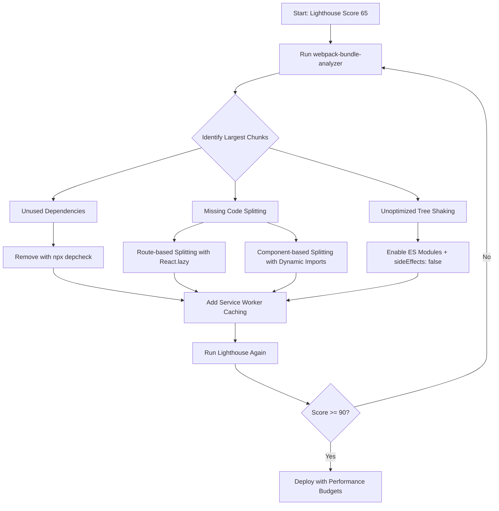

| Difficulty | Channel | Tags |
|---|---|---|
| intermediate | frontend | lighthouse, bundle, lazy-loading |

What if your entire JavaScript bundle was so bloated that it took longer to load than the user's patience to wait? That's exactly the nightmare Twitter faced when building Twitter Lite — their React-based Progressive Web App aimed at serving millions of users on slow mobile networks. Webpack's CommonsChunkPlugin, hampered by circular code dependencies, crammed everything into just 3 JavaScript files totaling over 1MB (420KB gzipped), causing the main bundle to take over 5 seconds to load on a simulated 3G connection [1]. But here is the thing: most developers staring at a Lighthouse score of 65 have the exact same problem. They just don't know it yet.

---

> ### Real-World Case — Twitter (Twitter Lite)
>
> In 2015, Twitter set out to build Twitter Lite, a React-based Progressive Web App designed to work well on slow mobile networks and low-end devices. The initial bundle was bloated because webpack's CommonsChunkPlugin configuration, hampered by circular code dependencies, forced everything into just 3 JavaScript files totaling over 1MB (420KB gzipped), causing the main bundle to take over 5 seconds to load on a simulated 3G connection.
>
> | | |
> |---|---|
> | **Challenge** | Ship a lightweight, high-performance React PWA to emerging markets while reducing the initial JavaScript payload that was crippling Time-to-Interactive (TTI) on mobile. They needed to break up a monolithic ~1MB bundle into on-demand chunks without breaking their build or caching strategy. |
> | **Solution** | They resolved the circular dependency issues and implemented granular, route-based code splitting using webpack's CommonsChunkPlugin (async, children, minChunks) and the PRPL pattern. This created ~40 on-demand chunks that lazy-loaded per route instead of loading everything upfront, plus dedicated runtime (inlined), vendor, shared, main, and i18n chunks via SplitChunksPlugin as they evolved. |
> | **Outcome** | Main bundle load time dropped from over 5 seconds to under 3 seconds on a simulated 3G network, and Time-to-Interactive was cut to nearly half its previous value as measured by Chrome's Lighthouse. Twitter Lite became the largest React.js PWA at scale, booting up in under 3 seconds even on slow devices, and drove significant engagement gains in emerging markets. |
> | **Lesson** | Large monolith bundles silently kill TTI, and the biggest single win came from measuring then granularly code-splitting at the route level. Fixing circular dependencies was the hidden prerequisite that finally unlocked webpack's ability to split code properly - analysis and measurement (Lighthouse, webpack) before optimizing was essential. |

---

## Hook — The 5-Second Countdown That Kills Your App

Picture this: your CEO just shared the new feature link on Twitter. Users click it. One second passes. Two seconds. Three seconds. Four seconds. Your app is still downloading JavaScript. By second five, half your visitors have already bounced. Every additional second of load time costs you roughly 7% in conversions [2]. Your Lighthouse score reads 65. Your bundle is 2.1MB. Your Time to Interactive is 4.2 seconds. These aren't just numbers on a dashboard — they are revenue walking out the door. The question isn't whether you should optimize. The question is whether you can afford not to.

## Problem — The Silent Killer of Frontend Performance

Here is what makes bundle bloat so insidious: it doesn't crash your app. There is no error message. No stack trace. Your app works perfectly fine — in development, on your MacBook Pro, on your office Wi-Fi. But for a user on a budget Android phone in Jakarta, your 2.1MB bundle is a death sentence for engagement. The problem compounds silently. Every new feature adds dependencies. Every dependency brings its own transitive dependencies. That innocent-looking date library? It pulls in 47KB of utilities you never use. That charting library you imported for one dashboard page? It ships its entire animation framework to every single route. Many developers discover too late that their bundle has grown 40% over six months without a single conscious decision to add bloat. The culprit is almost always one of three things: unused dependencies dragging dead code across the wire, missing code splitting that forces users to download everything upfront, or misconfigured tree shaking that leaves redundant modules untouched. Sound familiar?

## Real-World Case — Twitter Lite's 1MB Wake-Up Call

In 2015, Twitter set out to build Twitter Lite, a React-based Progressive Web App designed to work well on slow mobile networks and low-end devices. The initial webpack configuration, hampered by circular code dependencies, forced everything into just 3 JavaScript files totaling over 1MB (420KB gzipped). The main bundle took over 5 seconds to load on a simulated 3G connection [1]. This wasn't a theoretical problem — it was a real constraint for Twitter's core audience. Many of their most engaged users were in emerging markets where 3G was the standard and budget Android devices dominated. The team at Twitter, led by Paul Armstrong, undertook a systematic optimization effort. They analyzed bundle composition, eliminated circular dependencies, and implemented code splitting to break the monolithic bundle into smaller, loadable chunks. The result was dramatic: main bundle load time dropped from over 5 seconds to under 3 seconds on a simulated 3G network, and Time-to-Interactive was cut to nearly half its previous value as measured by Chrome's Lighthouse [1]. Twitter Lite became the largest React.js PWA at scale, booting up in under 3 seconds even on slow devices, and drove significant engagement gains in emerging markets. The lesson was clear — bundle optimization isn't a nice-to-have. It's a survival strategy.

## Deep Dive — Anatomy of a Bloated Bundle

Before you can fix your bundle, you need to understand what's actually inside it. This is where most developers go wrong — they start optimizing blindly instead of diagnosing first. Think of it like a doctor prescribing medication before running tests. The first step is always bundle analysis. Tools like webpack-bundle-analyzer [3] generate an interactive treemap visualization of your bundle contents. Suddenly, that "tiny" utility library reveals itself as a 200KB monster. Your "lightweight" date library? It brought moment.js along for the ride, and that's another 300KB you didn't account for. But analysis alone isn't enough. You need to understand the three core optimization strategies and their trade-offs. Code splitting lets you break your bundle into smaller chunks that load on demand. Route-based splitting is the most impactful — users only download the JavaScript for the page they're visiting [4]. Component-based splitting goes deeper, lazy-loading individual heavy components like charts, editors, or media players within a page. Tree shaking is webpack's mechanism for eliminating unused exports from your modules [5]. However — and this is a critical nuance — tree shaking only works with ES modules. If your dependencies are CommonJS, they ship entirely regardless of what you import. This catches many developers off guard. Dead code elimination via dynamic imports lets you defer non-critical features — a chat widget, an analytics dashboard, an admin panel — until the user actually needs them. Each strategy has a different effort-to-impact ratio, and the best results come from layering all three.

## Workflow — The Systematic Path from 65 to 90+

Here is a step-by-step workflow that mirrors what high-performing engineering teams actually do. Start with measurement, not optimization. Then work from the biggest wins to the smallest refinements. The following diagram illustrates the complete optimization workflow from analysis to deployment: [See diagram below]

**Step 1: Audit and Analyze** — Run Lighthouse to establish your baseline. Install webpack-bundle-analyzer [3] and generate a treemap. Identify the top 5 largest modules by size. Sort by gzipped size, not raw size — that's what users actually download.

**Step 2: Eliminate Dead Weight** — Remove unused dependencies. Run `npx depcheck` to find packages you've installed but never imported. Check for duplicate packages (e.g., two different lodash installations). Replace heavy libraries with lighter alternatives where possible — date-fns over moment.js, for example, can save you 200KB instantly.

**Step 3: Implement Route-Based Code Splitting** — Wrap each route in `React.lazy()` with a `Suspense` boundary [4]. This is the single highest-impact change you can make. Users only download the JavaScript for the route they visit, not every route in your application.

**Step 4: Add Component-Level Splitting** — Identify heavy components within each route — charts, rich text editors, video players — and split those too with dynamic imports.

**Step 5: Configure Tree Shaking Properly** — Ensure your build tool uses ES modules. Set `sideEffects: false` in package.json for packages that have no side effects [5]. Verify in your bundle analyzer that unused exports are actually being eliminated.

**Step 6: Optimize Images and Assets** — Implement lazy loading for images with `loading="lazy"`. Use modern formats like WebP. Compress and serve images via a CDN.

**Step 7: Add Service Worker Caching** — Implement a service worker with a caching strategy for your chunks. Subsequent visits should load nearly instantly from cache [6].

**Step 8: Measure Again** — Run Lighthouse. Compare against your baseline. The iterative loop is critical — optimization is not a one-time event.

## Code Example — Route-Based Splitting in Practice

Here is a production-ready implementation of route-based code splitting that mirrors the pattern used by Twitter Lite and other high-scale React applications. This code directly addresses the bundle optimization problem by ensuring users only download the JavaScript they need for the page they're visiting.

## Lessons Learned — The Art of Staying Lean

After watching teams optimize bundles from 2MB down to 300KB, several patterns emerge — both in what works and in the traps that catch even experienced developers.

**Battle Scar #1: Optimizing Before Measuring** — The number one mistake is diving into code splitting before running bundle analysis. You might spend days optimizing a 15KB module while a 500KB dependency sits untouched. Always analyze first [3].

**Battle Scar #2: Forgetting About Tree Shaking Configuration** — Many developers assume tree shaking "just works." It doesn't. You need ES module imports, `sideEffects: false` declarations, and production mode in your build. Without all three, unused code ships to production [5].

**Battle Scar #3: Ignoring the Network Waterfall** — Code splitting creates more HTTP requests. On fast networks, this is fine. On 3G, each additional request adds latency. The solution is strategic chunk splitting — split by route, not by every small component [8].

**Battle Scar #4: No Error Boundaries for Lazy Components** — If a chunk fails to load and you have no error boundary, your entire app white-screens. Always wrap lazy components in error boundaries with retry logic.

**Battle Scar #5: Not Caching Aggressively** — Split chunks have content hashes in their filenames. This means they're infinitely cacheable. If you're not setting long cache headers for these chunks, you're making users re-download code that hasn't changed.

Here is the memorable takeaway: bundle optimization is not a one-time project. It's a continuous practice. Set bundle size budgets in your CI pipeline. Alert when bundles grow beyond thresholds. Treat bundle size like you treat test coverage — something that regresses if you don't actively maintain it. The teams that maintain Lighthouse scores above 90 don't do it by accident. They do it by treating performance as a feature, not an afterthought [2].

---

## Bundle Optimization Workflow

<strong>Original Interview Question</strong>

**Q:** You're tasked with improving a React app's Lighthouse performance score from 65 to 90+. The bundle size is 2.1MB and Time to Interactive is 4.2s. What specific steps would you take to optimize the bundle and implement lazy loading?

**A:** Implement code splitting with React.lazy() and Suspense, analyze bundle composition with webpack-bundle-analyzer to identify largest chunks, remove unused dependencies and optimize imports, add dynamic imports for heavy components and third-party libraries, implement route-based splitting for better initial load times, and utilize tree shaking with proper ES module configuration.

## Conclusion

The journey from a 65 Lighthouse score to 90+ isn't about memorizing a checklist. It's about developing a diagnostic mindset. Twitter proved this when they turned a 5-second-loading PWA into a sub-3-second experience that reached millions on slow networks [1]. The tools are well-documented — webpack-bundle-analyzer [3], React.lazy [4], tree shaking [5], service workers [6]. The challenge is building the habit of measuring before optimizing, splitting strategically rather than naively, and treating bundle size as a first-class performance metric that regresses without vigilance. Start tomorrow by running bundle analysis on your own project. You might be surprised by what you find lurking in that 2.1MB bundle.

---

## References

1. [Twitter Lite and High Performance React Progressive Web Apps at Scale](https://medium.com/@paularmstrong/twitter-lite-and-high-performance-react-progressive-web-apps-at-scale-d28a00e780a3) — blog
2. [Web Performance - Google Developers](https://developer.mozilla.org/en-US/docs/Web/Performance) — documentation
3. [webpack-bundle-analyzer on GitHub](https://github.com/webpack-contrib/webpack-bundle-analyzer) — documentation
4. [React.lazy - React Documentation](https://react.dev/reference/react/lazy) — documentation
5. [Tree Shaking - Webpack Documentation](https://webpack.js.org/guides/tree-shaking/) — documentation
6. [Service Worker API - MDN Web Docs](https://developer.mozilla.org/en-US/docs/Web/API/Service_Worker_API) — documentation
7. [Code Splitting - Webpack Documentation](https://webpack.js.org/guides/code-splitting/) — documentation
8. [Performance - Web.dev by Google](https://web.dev/performance) — documentation

---

**Author:** Satishkumar Dhule — [GitHub](https://github.com/satishkumar-dhule) · [LinkedIn](https://linkedin.com/in/satishkumar-dhule) · [Website](https://satishkumar-dhule.github.io)
