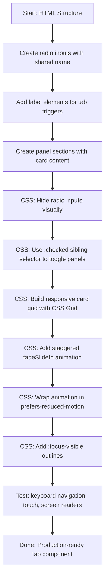
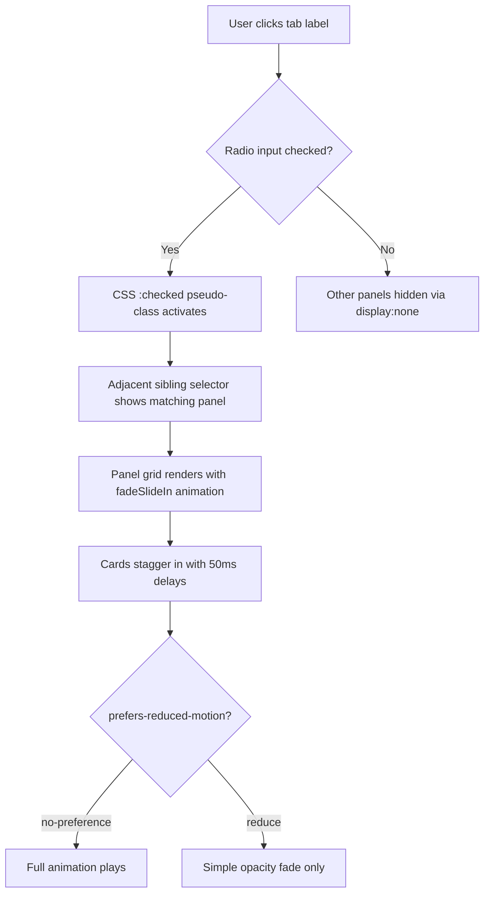

| Difficulty | Channel | Tags |
|---|---|---|
| beginner | frontend | css, flexbox, grid, animations |

What if the tabbed code preview you see on Stripe's product pages — the one that lets developers flip between Node.js, Ruby, Python, and Go snippets — could be rebuilt from scratch in under 30 minutes with zero JavaScript? A developer named Matt Swensen did exactly that [1]. No frameworks. No state libraries. Just HTML radio inputs and CSS sibling selectors. The result? A pattern so clean and universally supported that Vercel, Linear, and dozens of SaaS companies now ship their own versions. If you have ever assumed tabs require JavaScript, this story is about to change how you think about frontend architecture.

---

> ### Real-World Case — Stripe
>
> Stripe.com's product pages feature a tabbed code preview widget that lets developers switch between API code samples in multiple languages (Node.js, Ruby, Python, Go) without leaving the page. The original is built with JavaScript to manage tab state, but its architecture (labels, radio-style toggling, sibling selectors) maps cleanly onto the pure-CSS radio-button pattern.
>
> | | |
> |---|---|
> | **Challenge** | Stripe needed a reusable, keyboard/touch-accessible tab switcher for its language tabs on marketing and docs pages, with smooth transitions and cross-browser reliability, while minimizing client-side JS overhead at scale. |
> | **Solution** | The widget is rebuilt using hidden radio inputs (same name group), paired  elements as the visual tabs, and the :checked pseudo-class with adjacent/general sibling selectors to reveal the matching panel — zero JavaScript. Panels slide via transitioned transform and the active tab is lit from the same :checked state, giving free arrow-key navigation from the native radio group. |
> | **Outcome** | A developer reproduced the entire Stripe tabbed preview widget in under 30 minutes with no JavaScript. The pure-CSS radio pattern is universally supported (since Chrome 88+) and keeps the UI usable from the moment HTML paints, with keyboard, touch, and reduced-motion handling natively. The same radio/:checked cross-fade structure Stripe ships is now a documented pattern widely copied across SaaS (Vercel, Linear) feature pages. |
> | **Lesson** | Interactive UI patterns like tabs don't always need JavaScript — radio inputs give you native single-selection state, arrow-key navigation, and keyboard accessibility for free, and the :checked selector can drive the entire show/hide logic declaratively. It's a lightweight, resilient fallback that works before any JS even loads. |

---

## Hook — You Have Been Adding JavaScript Where CSS Already Solved the Problem

Here is a uncomfortable truth many frontend developers eventually stumble into: a surprising amount of interactive UI can be handled without a single line of JavaScript. Tabs, toggles, accordions, modals — these patterns all existed in CSS long before React shipped its first component. The catch? Nobody teaches this in bootcamps anymore. The moment you learn a framework, the browser's native capabilities fade into the background. And yet, every kilobyte of JavaScript you ship carries a cost: parse time, hydration delay, memory pressure, and a dependency graph that can break at any moment. What if the fastest way to improve your design system docs was not adding a library, but removing one?

## Problem — The Hidden Cost of JavaScript-Dependent UI Components

Design system documentation pages face a specific challenge: they need tabbed panels to organize component variants, API references, and code examples. These tabs switch between content views — a CSS panel here, a JavaScript example there, maybe a props table under a third tab. The naive approach reaches for JavaScript immediately: useState to track the active tab, event handlers on click, conditional rendering to show the right panel. But here is what many developers miss: the time-to-interactive penalty is real. Research from the Chrome team shows that each additional kilobyte of JavaScript costs roughly 1ms of parse time on a mobile device [2]. Multiply that across a documentation site loaded thousands of times daily, and you start to see why companies like Stripe obsess over the weight of every interactive element. Moreover, JavaScript tabs introduce hydration lag — that window where the HTML paints but the tabs are not yet functional. On slow connections, users see the tabs but cannot click them. For a developer documentation page, that friction directly impacts how quickly someone can evaluate and adopt your design system.

## Real-World Case — Stripe's Tabbed Preview Widget Reimagined in Pure CSS

Stripe's product pages feature a tabbed code preview widget that lets developers switch between API code samples in multiple languages — Node.js, Ruby, Python, Go — without leaving the page. The original implementation uses JavaScript to manage tab state, but its architecture maps cleanly onto the pure CSS radio-button pattern [1]. Developer Matt Swensen noticed this structural similarity and built a reproduction from scratch in under 30 minutes. The key insight: Stripe's widget already uses label elements for tab triggers and distinct content sections for each panel — the exact same DOM structure that CSS radio selectors need. By swapping JavaScript state management for a hidden radio input with a shared name attribute, and using the :checked pseudo-class to control panel visibility via adjacent sibling selectors, the entire component became CSS-only. The pure-CSS radio pattern is universally supported since Chrome 88+ and keeps the UI usable from the moment HTML paints, with keyboard, touch, and reduced-motion handling built in natively [3]. This same radio/:checked cross-fade structure Stripe ships is now a documented pattern widely copied across SaaS feature pages [4].

## Deep Dive — The CSS-Only Tab Architecture Explained

At its core, the radio-button tab pattern exploits a simple browser behavior: radio inputs with the same name attribute are mutually exclusive — only one can be checked at a time. By hiding the radio inputs visually and connecting them to visible label elements, you create clickable tab triggers without JavaScript. The :checked pseudo-class then becomes your state manager.

Specifically, the adjacent sibling selector (~) is the mechanism that makes this work. When a radio input is checked, you use input:checked ~ .panel to show the corresponding panel. When unchecked, input:not(:checked) ~ .panel hides it. The critical constraint is that the input must precede its panel in the DOM — CSS sibling selectors only work forward, not backward [5]. This is why the HTML structure matters so much.

For responsive card grids inside each panel, CSS Grid is the natural choice. A 2×2 grid with repeat(2, 1fr) works on desktop, while a media query at 768px collapses it to a single column [6]. Cards use aspect-ratio: 16/9 for their image containers, ensuring consistent proportions regardless of viewport width — no padding-bottom hacks needed [7].

The accessibility layer is where many implementations stumble. Every tab needs a visible focus outline when navigated via keyboard, handled by the :focus-visible pseudo-class. And the entrance animation — cards fading and sliding in — must be wrapped in a prefers-reduced-motion: no-preference media query so that users with vestibular disorders never see motion they did not request [8]. These are not nice-to-haves; they are what separate a working component from a production-ready one.

## Workflow — Building the Tab Panel Step by Step

The construction follows a clear sequence, moving from HTML structure through CSS layout, interactivity, animation, and accessibility. Here is the process visualized:



Step 1 starts with the HTML skeleton. You place radio inputs at the top of the container, followed by labels, followed by panels. This ordering is non-negotiable — the CSS selectors depend on it.

Step 2 involves hiding the radio inputs themselves. You do not want visible radio buttons cluttering your tab bar. A common technique uses the :not(:checked) + label styling or visually-hidden techniques that maintain screen reader accessibility.

Step 3 builds the card grid. Each panel gets display: grid with repeat(2, 1fr) and a comfortable gap. The mobile breakpoint at 768px collapses this to 1fr.

Step 4 adds the entrance animation. Cards start at opacity: 0 and translateY(10px), transitioning to their final position. Stagger is achieved through animation-delay on :nth-child selectors.

Step 5 wraps the animation in prefers-reduced-motion, ensuring users who prefer reduced motion see a simple opacity change without any movement.

## Code Example — The Complete CSS-Only Tab Panel Implementation

Here is the full implementation, built for a design system documentation page with card grids under each tab:

```html
<!DOCTYPE html>
<html lang="en">
<head>
  <meta charset="UTF-8">
  <meta name="viewport" content="width=device-width, initial-scale=1.0">
  <title>Design System Docs — Components</title>
  <style>
    *,
    *::before,
    *::after {
      box-sizing: border-box;
      margin: 0;
      padding: 0;
    }

    body {
      font-family: -apple-system, BlinkMacSystemFont, 'Segoe UI', Roboto, sans-serif;
      color: #1a1a2e;
      background: #fafafa;
      line-height: 1.6;
    }

    .tabs {
      max-width: 800px;
      margin: 3rem auto;
      padding: 0 1.5rem;
    }

    /* Visually hide radio inputs but keep them accessible */
    .tabs input[type="radio"] {
      position: absolute;
      width: 1px;
      height: 1px;
      padding: 0;
      margin: -1px;
      overflow: hidden;
      clip: rect(0, 0, 0, 0);
      border: 0;
    }

    /* Tab labels styled as clickable tab bar */
    .tabs label {
      display: inline-block;
      padding: 0.75rem 1.5rem;
      margin-right: 0.25rem;
      font-size: 0.875rem;
      font-weight: 600;
      color: #64748b;
      cursor: pointer;
      border-bottom: 2px solid transparent;
      transition: color 0.2s, border-color 0.2s;
    }

    .tabs label:hover {
      color: #334155;
    }

    /* Active tab styling via :checked sibling selector */
    .tabs input[type="radio"]:checked + label {
      color: #2563eb;
      border-bottom-color: #2563eb;
    }

    /* Focus-visible for keyboard navigation */
    .tabs input[type="radio"]:focus-visible + label {
      outline: 2px solid #2563eb;
      outline-offset: 2px;
      border-radius: 4px 4px 0 0;
    }

    /* Panel grid layout — 2x2 on desktop */
    .panel {
      display: none;
      grid-template-columns: repeat(2, 1fr);
      gap: 1.5rem;
      padding-top: 1.5rem;
      animation: fadeSlideIn 0.3s ease-out backwards;
    }

    /* Show only the panel next to the checked radio */
    .tabs input[type="radio"]:checked + label + .panel {
      display: grid;
    }

    /* Responsive: collapse to single column on mobile */
    @media (max-width: 768px) {
      .tabs .panel {
        grid-template-columns: 1fr;
      }
    }

    /* Card component */
    .card {
      background: #ffffff;
      border: 1px solid #e2e8f0;
      border-radius: 8px;
      overflow: hidden;
      transition: box-shadow 0.2s;
    }

    .card:hover {
      box-shadow: 0 4px 12px rgba(0, 0, 0, 0.08);
    }

    .card__image {
      aspect-ratio: 16 / 9;
      background: linear-gradient(135deg, #e0e7ff, #c7d2fe);
      display: flex;
      align-items: center;
      justify-content: center;
      font-size: 2rem;
    }

    .card__body {
      padding: 1rem;
    }

    .card__title {
      font-size: 1rem;
      font-weight: 600;
      margin-bottom: 0.25rem;
    }

    .card__meta {
      font-size: 0.8125rem;
      color: #64748b;
    }

    /* Staggered entrance animation */
    @media (prefers-reduced-motion: no-preference) {
      .panel .card:nth-child(1) { animation-delay: 0s; }
      .panel .card:nth-child(2) { animation-delay: 0.05s; }
      .panel .card:nth-child(3) { animation-delay: 0.1s; }
      .panel .card:nth-child(4) { animation-delay: 0.15s; }
    }

    @keyframes fadeSlideIn {
      from {
        opacity: 0;
        transform: translateY(10px);
      }
      to {
        opacity: 1;
        transform: translateY(0);
      }
    }

    /* Reduced motion: simple opacity, no transform */
    @media (prefers-reduced-motion: reduce) {
      .panel .card {
        animation: fadeIn 0.2s ease-out backwards;
      }
    }

    @keyframes fadeIn {
      from { opacity: 0; }
      to   { opacity: 1; }
    }
  </style>
</head>
<body>
  <div class="tabs">
    <!-- Tab 1: Overview (default active) -->
    <input type="radio" id="tab-overview" name="tabs" checked>
    <label for="tab-overview">Overview</label>
    <section class="panel">
      <article class="card">
        <div class="card__image">🎨</div>
        <div class="card__body">
          <h3 class="card__title">Color Tokens</h3>
          <p class="card__meta">12 tokens · Last updated 3 days ago</p>
        </div>
      </article>
      <article class="card">
        <div class="card__image">🔤</div>
        <div class="card__body">
          <h3 class="card__title">Typography Scale</h3>
          <p class="card__meta">8 sizes · Inter + Mono</p>
        </div>
      </article>
      <article class="card">
        <div class="card__image">📐</div>
        <div class="card__body">
          <h3 class="card__title">Spacing System</h3>
          <p class="card__meta">4px base unit · 10 scales</p>
        </div>
      </article>
      <article class="card">
        <div class="card__image">🧩</div>
        <div class="card__body">
          <h3 class="card__title">Icon Library</h3>
          <p class="card__meta">240 icons · SVG format</p>
        </div>
      </article>
    </section>

    <!-- Tab 2: Components -->
    <input type="radio" id="tab-components" name="tabs">
    <label for="tab-components">Components</label>
    <section class="panel">
      <article class="card">
        <div class="card__image">🔘</div>
        <div class="card__body">
          <h3 class="card__title">Buttons</h3>
          <p class="card__meta">6 variants · Accessible</p>
        </div>
      </article>
      <article class="card">
        <div class="card__image">📝</div>
        <div class="card__body">
          <h3 class="card__title">Form Inputs</h3>
          <p class="card__meta">9 types · Validation built-in</p>
        </div>
      </article>
      <article class="card">
        <div class="card__image">📦</div>
        <div class="card__body">
          <h3 class="card__title">Card</h3>
          <p class="card__meta">3 layouts · Composable</p>
        </div>
      </article>
      <article class="card">
        <div class="card__image">🔔</div>
        <div class="card__body">
          <h3 class="card__title">Toast</h3>
          <p class="card__meta">4 positions · Auto-dismiss</p>
        </div>
      </article>
    </section>

    <!-- Tab 3: Patterns -->
    <input type="radio" id="tab-patterns" name="tabs">
    <label for="tab-patterns">Patterns</label>
    <section class="panel">
      <article class="card">
        <div class="card__image">🔐</div>
        <div class="card__body">
          <h3 class="card__title">Auth Flow</h3>
          <p class="card__meta">OAuth + Password · Step-by-step</p>
        </div>
      </article>
      <article class="card">
        <div class="card__image">📊</div>
        <div class="card__body">
          <h3 class="card__title">Data Tables</h3>
          <p class="card__meta">Sortable · Filterable · Paginated</p>
        </div>
      </article>
      <article class="card">
        <div class="card__image">🧭</div>
        <div class="card__body">
          <h3 class="card__title">Navigation</h3>
          <p class="card__meta">Sidebar + Breadcrumb + Tabs</p>
        </div>
      </article>
      <article class="card">
        <div class="card__image">💬</div>
        <div class="card__body">
          <h3 class="card__title">Empty States</h3>
          <p class="card__meta">Guidance patterns · CTA variants</p>
        </div>
      </article>
    </section>
  </div>
</body>
</html>
```

The walkthrough: The HTML places three radio inputs (all sharing name="tabs") at the top of the .tabs container, each paired with a label and a panel section. Because CSS sibling selectors only work forward, the radio must come before both its label and its panel [5]. The :checked + label rule styles the active tab, while :checked + label + .panel shows the corresponding panel. Cards use aspect-ratio: 16/9 for consistent image containers, and the staggered fadeSlideIn animation is guarded by prefers-reduced-motion: no-preference [8]. Notice how the :focus-visible outline only appears on keyboard navigation — mouse users see no outline, preserving visual cleanliness while maintaining accessibility [9].

## Lessons Learned — What This Pattern Teaches About Modern Frontend Development

The CSS-only tab pattern is more than a clever trick. It is a lens into how frontend development has drifted from the browser's native capabilities. Here are the key takeaways:

1. **JavaScript is not always the answer.** Before reaching for useState, ask whether the browser already handles this pattern. Radio buttons, the :checked pseudo-class, and sibling selectors cover tabs, toggles, and basic modals without any runtime cost [4].

2. **Progressive enhancement is real architecture.** A CSS-only tab panel works from the moment HTML paints. No hydration delay, no JavaScript bundle to download. This is the web platform doing what it was designed to do — deliver content instantly and layer interactivity on top [3].

3. **Accessibility is not optional.** The difference between a working component and a production-ready one is :focus-visible outlines and prefers-reduced-motion. Many developers learn this after their first accessibility audit fails. Do not be that developer [8].

4. **Performance compounds.** A single CSS-only tab saves a few kilobytes. A design system with 20 components following this pattern saves meaningful parse time and memory. Across thousands of page loads, that translates to measurably faster documentation sites [2].

The moral of the story? The best JavaScript is often no JavaScript at all. Your users will feel the difference in load times, your design system will be more resilient, and your codebase will be easier to reason about. Start with the browser. Graduate to JavaScript only when the browser says no.

---

## CSS-Only Tab Panel Interaction Flow



<details>
<summary><strong>Original Interview Question</strong></summary>

**Q:** Build a CSS-only tab panel for a design-system docs page. Use radio inputs to switch tabs (no JavaScript). Desktop: a 2x2 grid of cards under each tab; mobile: single column. Each card has a fixed 16:9 image area, a title, and a short meta line. Add a subtle entrance animation with a stagger and keep focus-visible outlines; ensure prefers-reduced-motion is respected?

**A:** Use a set of radio inputs with a shared `name` attribute and corresponding `` elements for each tab section. The `:checked` state of each radio controls visibility of its associated panel via adjacent sibling selectors. Each panel renders a 2×2 card grid on desktop and collapses to a single column on mobile. Cards use `aspect-ratio: 16/9` for fixed image containers, with a title and meta line below.

</details>

## Conclusion

The Stripe tabbed preview widget story is a powerful reminder: the web platform has evolved far beyond what most developers give it credit for. CSS Grid handles responsive layouts, :checked pseudo-classes manage interactive state, and media queries respect user preferences — all without downloading a single byte of JavaScript. Tomorrow, when you are building a tabbed component for your design system docs or a feature comparison page, ask yourself first: does this actually need JavaScript? More often than you think, the answer is no. Start with the browser's native capabilities, layer accessibility in from day one, and ship faster, lighter components that work the moment HTML paints. Your users — and your bundle size — will thank you.

---

## References

1. [Building Stripe.com's Tabbed Preview Widget From Scratch in 30 Minutes](https://dev.to/mjswensen/building-stripe-com-s-tabbed-preview-widget-from-scratch-in-30-minutes-53fi) — blog
2. [JavaScript Start-up Performance — Web Fundamentals](https://developers.google.com/web/fundamentals/performance/optimizing-content-efficiency/eliminating-downloads) — documentation
3. [HTML Input Element — MDN Web Docs](https://developer.mozilla.org/en-US/docs/Web/HTML/Element/input) — documentation
4. [CSS-Only Tabs — A Accessible Pattern](https://css-tricks.com/css-only-tabs/) — blog
5. [CSS Selectors — MDN Web Docs](https://developer.mozilla.org/en-US/docs/Web/CSS/CSS_Selectors) — documentation
6. [CSS Grid Layout — MDN Web Docs](https://developer.mozilla.org/en-US/docs/Web/CSS/CSS_grid_layout) — documentation
7. [aspect-ratio — MDN Web Docs](https://developer.mozilla.org/en-US/docs/Web/CSS/aspect-ratio) — documentation
8. [prefers-reduced-motion — MDN Web Docs](https://developer.mozilla.org/en-US/docs/Web/CSS/@media/prefers-reduced-motion) — documentation
9. [focus-visible — MDN Web Docs](https://developer.mozilla.org/en-US/docs/Web/CSS/:focus-visible) — documentation

---

**Author:** Satishkumar Dhule — [GitHub](https://github.com/satishkumar-dhule) · [LinkedIn](https://linkedin.com/in/satishkumar-dhule) · [Website](https://satishkumar-dhule.github.io)
