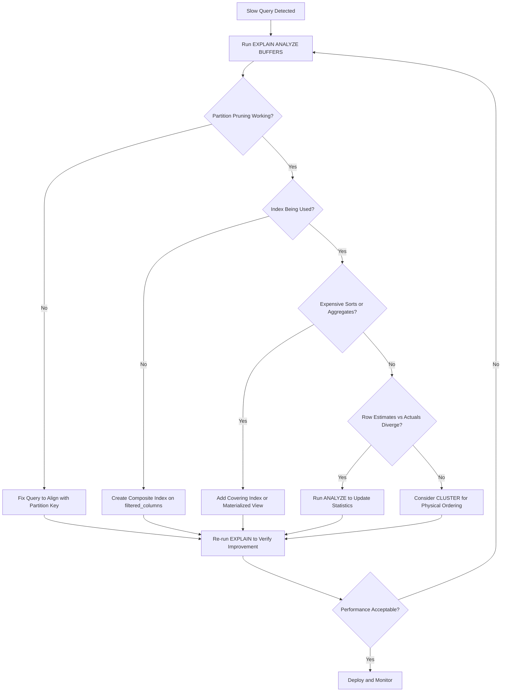

| Difficulty | Channel | Tags |
|---|---|---|
| intermediate | database | explain, query-plan, partitioning |

Picture this: it is 2pm on a Tuesday, your monitoring dashboard is frozen, and the query that powers your entire graph editor is taking 22 seconds to return. You have a 15-million-row table, a simple primary-key lookup, and absolutely no idea why PostgreSQL is choking. This is exactly what Datadog's engineering team faced — and the fix turned out to be a single keyword in their SQL [1]. But here is the thing: Datadog's story is just the opening act. When you are dealing with partitioned tables, date ranges, and queries that should be fast but are not, the diagnostic journey gets far more interesting.

---

> ### Real-World Case — Datadog
>
> Datadog's monitoring platform had a PostgreSQL query feeding their graph editor that took 22 seconds to execute on a 15 million row table (10 GB). The query was a simple primary-key lookup, but with 11,000 keys to check, the query optimizer fell back to a costly Bitmap Heap Scan strategy that fetched millions of rows unnecessarily.
>
> | | |
> |---|---|
> | **Challenge** | The query used ANY(ARRAY[...]) syntax to list primary keys for lookup. When the array grew large (11,000+ keys), PostgreSQL's query planner couldn't use the index efficiently and switched to a Bitmap Heap Scan with massive row rechecking — a CPU-bound operation that looked at millions of rows despite the table being a simple primary key lookup. |
> | **Solution** | Tom Lane, one of PostgreSQL's core maintainers, suggested changing ANY(ARRAY[...]) to ANY(VALUES(...)) — a semantically identical one-line change. The VALUES syntax gives the query planner better cardinality estimates, allowing it to use a Nested Loop with Index Scan instead of the expensive Bitmap Heap Scan. EXPLAIN (ANALYZE, BUFFERS) was critical for diagnosing the Bitmap Heap Scan problem and validating the fix. |
> | **Outcome** | Query execution dropped from 22,000ms to 200ms — a 100x speedup from a single keyword change. CPU utilization on the database server dropped dramatically. The fix was deployed as a hotfix and validated immediately via Datadog's own monitoring. |
> | **Lesson** | EXPLAIN ANALYZE is the single most important tool for PostgreSQL query optimization. The planner's choice of execution strategy can change dramatically based on seemingly minor syntax differences. The ARRAY vs VALUES distinction was a known PostgreSQL 9.0 bug (fixed in 9.3), but the lesson generalizes: always inspect the actual execution plan, especially when queries slow down as data volume grows. Understanding Bitmap Heap Scan vs Index Scan tradeoffs is essential for diagnosing partitioned table performance issues. |

---

## Hook — 22 Seconds for a Primary Key Lookup?

Stop and picture a table with 100 million rows, partitioned by date. Your application fires off a query filtering on a specific date range — something that should scan a handful of partitions and be done. Instead, you watch the clock tick past 5 seconds, then 10, then 20. You know the data is partitioned. You know there are indexes. You know the query is "simple." And yet, PostgreSQL is grinding through your CPU like a butter knife through concrete. Sound familiar? You are not alone. Developers working with large PostgreSQL tables hit this wall constantly, and the root cause is almost never where they expect [2]. The real question is not "why is my query slow?" — it is "what story is my EXPLAIN plan actually telling me?"

## Problem — When Partitioning Does Not Save You

Here is the painful paradox of database partitioning: it promises performance, but only if you play by its rules. You partition your 100-million-row table by date because your queries filter on date ranges. The idea is elegant — PostgreSQL should only scan the relevant partitions, ignore the rest, and return results in milliseconds [3]. But what happens when it does not? The most common culprit is ineffective partition pruning. If your query planner cannot prove that a partition is irrelevant, it will scan it anyway. This happens when you use functions on the partition key, when date boundaries do not line up cleanly, or when implicit type casting forces a full scan [4]. And that is just the beginning. Even when pruning works perfectly, you might discover that indexes are not being used at all. A partitioned table can have per-partition indexes, global indexes, or no indexes that matter for your specific query pattern. The planner picks what it thinks is cheapest — and sometimes what is cheapest for the planner is the slowest thing for you. Then there are the silent killers: expensive sort operations, hash aggregates on massive intermediate result sets, and nested loop joins that scale quadratically with row count. Each of these shows up in the EXPLAIN plan, but only if you know where to look.

## Real-World Case — Datadog's 100x Wake-Up Call

Datadog's monitoring platform depends on PostgreSQL for one of its most user-facing features: the graph editor. When engineers configure dashboards, they query a table to retrieve metric metadata. On a seemingly ordinary day, one of those queries — a straightforward primary-key lookup for 11,000 keys — ballooned to 22 seconds on a 15-million-row table spanning about 10 GB of data [1]. The table was partitioned. The indexes existed. The query looked innocent. But under the hood, PostgreSQL's optimizer made a fateful decision: instead of doing a simple index scan, it chose a Bitmap Heap Scan strategy. That strategy, while sometimes optimal, was fetching millions of rows unnecessarily. The planner had decided that checking 11,000 keys individually was too expensive, so it switched to a batch approach — and in doing so, threw away all the efficiency of the primary key index [1]. Datadog's fix? They added a single keyword to their query. The result: execution time dropped from 22,000ms to 200ms. That is not a typo — a 100x improvement from one line of SQL. CPU utilization on the database server dropped dramatically, and the fix was deployed as a hotfix, validated immediately through Datadog's own monitoring [1]. The lesson? The optimizer is not always right, and sometimes the most powerful thing you can do is tell it to stop being clever.

## Deep Dive — Reading the EXPLAIN Plan Like a Detective

When your partitioned table query is slow, the EXPLAIN plan is your crime scene. But most developers glance at it, see "Bitmap Heap Scan," and assume everything is fine. Here is how to read it like a detective. First, look for partition pruning. If you see your query touching all partitions instead of just the relevant ones, your partition pruning is broken. PostgreSQL only prunes partitions when the planner can statically determine which partitions to include — typically through direct comparisons on the partition key with literal values [3]. Second, check the actual row estimates versus actual rows. If the planner estimated 500 rows but the query returned 500,000, your statistics are stale. Run ANALYZE on the table or its partitions. A planner making decisions based on bad statistics is like a GPS navigating with last year's map. Third, look for sequential scans on large partitions. If PostgreSQL is doing a seq scan instead of an index scan, you need a composite index that covers your WHERE clause columns alongside the partition key [2]. Fourth, watch for sort nodes with high costs. If you see Sort Method: external merge Disk, your sort does not fit in memory. This is where covering indexes or materialized views earn their keep. Finally, consider clustering. Even with perfect indexes, physical data ordering matters. If related rows are scattered across a partition, each index lookup becomes a random I/O operation. CLUSTER reorganizes the physical storage to match your index order [5].

## Workflow — The 5-Step Diagnostic Path

Here is the systematic workflow you should follow when a partitioned table query is slow. Think of it as a funnel — start broad, narrow down, and fix the root cause.

**Step 1: Run EXPLAIN (ANALYZE, BUFFERS)**
This gives you actual execution times and buffer usage, not just estimates. Without ANALYZE, you are guessing.

**Step 2: Verify Partition Pruning**
Check the output for which partitions are actually being scanned. If the planner is scanning partitions that should be excluded, your query pattern may not align with the partition key.

**Step 3: Evaluate Index Usage**
Look for "Index Scan" vs "Seq Scan" on each partition. If indexes exist but are not used, examine whether the query predicates match the index columns.

**Step 4: Identify Expensive Operations**
Sort, Hash Aggregate, and Nested Loop nodes with high estimated costs are your optimization targets. Focus on operations where actual rows exceed estimates.

**Step 5: Apply Targeted Fixes**
Create composite indexes, run ANALYZE, adjust queries to enable partition pruning, or consider CLUSTER for access-pattern optimization.

## Code Example — From Slow to Fast in Three Moves

Below is a practical example demonstrating the diagnostic and optimization workflow for a slow partitioned-table query.

## Lessons Learned — The Five Rules of Partitioned Query Performance

Here is what you should take away from this journey. First, EXPLAIN (ANALYZE, BUFFERS) is non-negotiable. Without actual execution data, you are optimizing in the dark. Second, partition pruning is your first line of defense. If it is not working, nothing else matters — you are scanning the entire table regardless of indexes [4]. Third, composite indexes on (partition_key, filtered_columns) are almost always the right first optimization. They allow index-only scans and eliminate the need for predicate evaluation at the row level [2]. Fourth, stale statistics are a silent epidemic. Schedule ANALYZE regularly on high-volume tables, especially after bulk operations. Fifth, and most importantly: do not trust the optimizer blindly. As Datadog proved, a single query hint can unlock a 100x improvement [1]. The query planner makes local cost-based decisions — it does not know your latency requirements, your SLA targets, or your users' patience. After debugging this pattern many times, here is what works: start with EXPLAIN, trust the numbers over intuition, and remember that every slow query is telling you exactly what it needs — you just have to listen.

---

## Partitioned Table Query Optimization Workflow

<strong>Original Interview Question</strong>

**Q:** You have a PostgreSQL table with 100M rows partitioned by date. A query filtering on a specific date range is still slow. What would you check in the EXPLAIN plan and how would you optimize it?

**A:** Check partition pruning effectiveness, index utilization patterns, and expensive sort operations. Create composite indexes on (date, filtered_columns) and evaluate clustering strategies for optimal data access.

## Conclusion

The next time your partitioned PostgreSQL table throws a slow query, resist the urge to throw hardware at it or rewrite the entire data model. Instead, open the EXPLAIN plan and start reading. Partition pruning, index utilization, stale statistics, and expensive operations each leave clear fingerprints in the execution plan [6]. Datadog's 100x speedup proves that sometimes the answer is surgical, not structural [1]. Run EXPLAIN (ANALYZE, BUFFERS), check your pruning, build the right composite index, refresh your statistics, and consider clustering for access patterns that demand it. Your future self — and your on-call rotation — will thank you.

---

## References

1. [100x Faster Postgres Performance by Changing 1 Line](https://www.datadoghq.com/blog/100x-faster-postgres-performance-by-changing-1-line) — blog
2. [PostgreSQL Documentation: Indexes](https://www.postgresql.org/docs/current/indexes.html) — documentation
3. [PostgreSQL Documentation: Partitioning](https://www.postgresql.org/docs/current/ddl-partitioning.html) — documentation
4. [PostgreSQL Documentation: Partition Pruning](https://www.postgresql.org/docs/current/ddl-partitioning.html#DDL-PARTITION-PRUNING) — documentation
5. [PostgreSQL Documentation: CLUSTER Command](https://www.postgresql.org/docs/current/sql-cluster.html) — documentation
6. [Using EXPLAIN: PostgreSQL Tutorial](https://www.postgresql.org/docs/current/using-explain.html) — documentation
7. [Wikipedia: Database Index](https://en.wikipedia.org/wiki/Database_index) — documentation
8. [Wikipedia: Partition (Database)](https://en.wikipedia.org/wiki/Partition_(database)) — documentation

---

**Author:** Satishkumar Dhule — [GitHub](https://github.com/satishkumar-dhule) · [LinkedIn](https://linkedin.com/in/satishkumar-dhule) · [Website](https://satishkumar-dhule.github.io)
