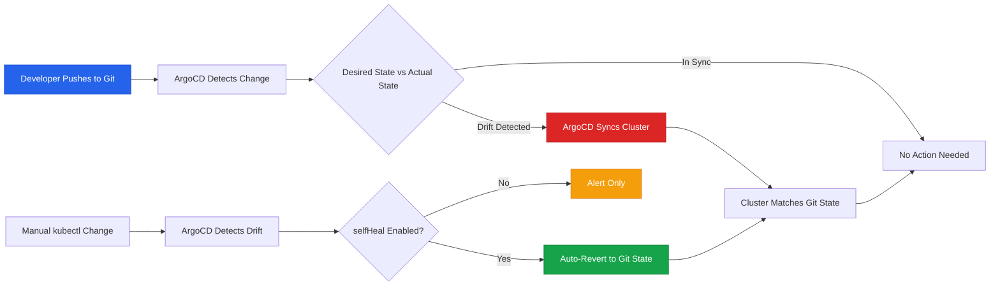

| Difficulty | Channel | Tags |
|---|---|---|
| beginner | devops | argocd, flux, declarative |

It was a production incident at SafetyCulture — engineers rushed in with emergency kubectl fixes, scaling up overloaded services and patching broken configs on the fly. The fixes worked. Services recovered. Everyone exhaled. But thirty minutes later, the same services crashed again, reverting to the exact broken state that triggered the incident in the first place [1]. The emergency changes had been silently overwritten by the next Helm deployment, and nobody realized it until users started reporting failures again. This is the story of how one company's battle with configuration drift across hundreds of microservices led them to a fundamental truth about infrastructure: if it is not in Git, it does not exist.

---

> ### Real-World Case — SafetyCulture
>
> SafetyCulture runs hundreds of microservices across multiple Kubernetes clusters. As they scaled, their Helm-based deployment pipelines started breaking down — during production incidents, engineers would make manual kubectl changes (scaling adjustments, hotfixes) as an emergency response. But without auto-reconciliation, these critical fixes got silently overwritten by the next deployment, causing services to revert to the broken state that triggered the incident in the first place.
>
> | | |
> |---|---|
> | **Challenge** | Configuration drift from imperative emergency changes was creating a dangerous feedback loop: incident → manual fix → next deployment overwrites fix → incident re-triggers. Additionally, having a separate deployment pipeline per cluster led teams to use one production cluster as an 'unofficial canary,' meaning some customers bore disproportionate risk. Helm templating was slow, untested chart changes reached production before staging, and manual redeployments were required for every configuration change. |
> | **Solution** | They migrated ~250-300 applications across ~20 teams to ArgoCD using a zero-downtime cutover strategy: adding services to ArgoCD with sync disabled first to observe drift, then aligning configurations, then using a clever `argoMigration: true` flag pattern that created temporary `-temp` suffixed deployments — ArgoCD would only remove the original Helm-managed deployment once the new one was verified healthy. They also switched from per-cluster pipelines to deploying across all clusters in an environment simultaneously, and enabled self-healing to automatically revert any manual drift. |
> | **Outcome** | Eliminated configuration drift entirely — every modification is now tracked with full auditability. The 'unofficial canary cluster' problem disappeared since all customers in an environment now get changes simultaneously. Recovery time from cluster failures dropped significantly since entire application state lives in Git. Deployment consistency improved dramatically with no more silent reversion of emergency fixes. |
> | **Lesson** | The counterintuitive insight: deploying to ALL clusters simultaneously is actually safer than gradual per-cluster rollout. SafetyCulture's per-cluster pipeline model accidentally created an unfair risk distribution. Moving to simultaneous deployment forced more thorough testing in earlier environments and ensured uniform customer experience. The second lesson: the biggest threat to reliability isn't scale — it's the gap between where changes are made (kubectl during incidents) and where truth lives (Git). |

---

## Hook — The 3 AM Fix That Vanished Into Thin Air

Picture this: it is 3 AM, your phone is buzzing, and production is on fire. A downstream dependency just timed out, cascading failures across your microservices, and your Kubernetes pods are thrashing. You SSH in, run a quick `kubectl scale` to bump replicas, maybe patch a resource limit — and the smoke clears. You head back to bed feeling like a hero. But here is the twist that many developers eventually learn the hard way: your fix was never real. The next time your CI pipeline runs, it deploys the Helm chart exactly as it was committed, and your emergency changes vanish without a trace. The service rolls back to the broken configuration, and now you are dealing with the same incident for the second time — except now everyone is exhausted and trust in the system is eroding. This is not a hypothetical. This is exactly what happened at SafetyCulture, and it reveals a problem that haunts teams running imperative deployment workflows at scale.

## Problem — Configuration Drift: The Invisible Fracture in Your Deployments

Configuration drift is what happens when your cluster state diverges from what your deployment tool thinks it deployed. It is the silent killer because nothing crashes immediately — the divergence just sits there, quietly accumulating until the next deployment wipes out your carefully crafted manual changes [2]. For teams running Helm-based pipelines, this problem is especially insidious. Helm excels at packaging and templating, but it was never designed to be a continuous reconciliation engine. When an engineer runs `kubectl edit deployment` during an incident, Helm has no idea the change happened. The next `helm upgrade` simply overwrites the live state with whatever is in the chart. Many developers discover this the painful way: they make a quick fix, the pipeline goes green, and they assume the problem is solved. Meanwhile, the actual cluster state has already drifted back to the pre-fix configuration. The consequences compound at scale. SafetyCulture ran hundreds of microservices across multiple Kubernetes clusters, and each manual intervention during incidents created another point of divergence [1]. Configuration drift meant that some customers in the same environment were running different versions of services — SafetyCulture called this the 'unofficial canary cluster' problem, where one cluster inadvertently became a test bed because its state had drifted from the others. Sound familiar? If your team has ever muttered 'but it works in staging,' you are likely feeling the effects of drift without knowing its root cause.

## Real-World Case — SafetyCulture's GitOps Migration

SafetyCulture's journey is a masterclass in what happens when configuration drift meets operational scale. Running hundreds of microservices across three production regions (Europe, America, and Australia), their Helm-based deployment pipeline was buckling under the weight of manual interventions [1]. During production incidents, engineers would make emergency changes directly via kubectl — scaling adjustments, hotfixes, resource limit tweaks — as a rapid response. But without auto-reconciliation, these critical fixes got silently overwritten by the next deployment, causing services to revert to the broken state that triggered the incident in the first place. The result was a vicious cycle: fix, revert, incident again. Beyond the immediate pain, SafetyCulture faced a deeper structural problem. Their Helm pipelines used per-cluster promotion, which meant some teams deployed to the European cluster first, then US, then Australia. This created an 'unofficial canary cluster' where customers in one region experienced issues that others did not, purely because of deployment ordering. The impact was significant: configuration drift eroded auditability (who changed what, when, and why became impossible to trace), deployment consistency broke down across environments, and recovery time from cluster failures was unacceptable since the entire application state was not captured in a single source of truth [1]. The migration to ArgoCD and GitOps eliminated these problems entirely. Every modification became tracked with full auditability, all customers in an environment now received changes simultaneously, and recovery from cluster failures dropped dramatically because the entire application state lived in Git.

## Deep Dive — Declarative vs Imperative: Two Worlds Collide

To understand why SafetyCulture's problem was so persistent, you need to grasp the fundamental philosophical divide in how infrastructure gets managed: declarative versus imperative approaches [3]. The imperative approach is what most developers reach for first because it feels natural. You SSH into a server, run `kubectl scale deployment my-service --replicas=5`, and the cluster obeys. It is direct, immediate, and satisfying. The problem is that imperative changes are ephemeral commands — they modify the live state but leave no record of intent. Nobody reading your deployment history knows why you scaled to five replicas or whether it should stay that way [4]. The declarative approach flips this entirely. Instead of telling the cluster what to do, you describe what the world should look like. You write a YAML manifest saying 'this deployment should have three replicas, use this image, and have these resource limits,' and a reconciliation engine like ArgoCD continuously compares the desired state in Git with the actual state in the cluster [3]. When they diverge, ArgoCD either alerts you or automatically corrects the drift. This is where GitOps enters the picture. GitOps is not just a tool choice — it is a practice where Git becomes the single source of truth for your entire infrastructure state. Every change goes through a Git commit, giving you a complete audit trail, rollback capability, and collaborative review process [5]. Here is the real tradeoff that many teams miss: declarative is not strictly better in every scenario. During a true emergency, imperative commands are faster. The trick is designing your system so that imperative fixes are the exception, and those changes get committed back to Git as the declarative source of truth. SafetyCulture's ArgoCD setup with self-healing accomplishes exactly this — if someone makes an imperative change, ArgoCD detects the drift and reverts to the Git-defined state within minutes [6].

## Workflow — Setting Up ArgoCD for GitOps

Configuring ArgoCD for automatic sync follows a clear, logical flow that connects your Git repository to your Kubernetes cluster as a continuous reconciliation loop. The workflow starts with defining your desired state in Git and ends with ArgoCD continuously ensuring reality matches that definition. Here is the step-by-step process:

**Step 1: Structure Your Git Repository.** Organize your Kubernetes manifests, Helm charts, or Kustomize overlays in a dedicated Git repository. This repo becomes your single source of truth — every deployment decision lives here as version-controlled YAML [7].

**Step 2: Create an ArgoCD Application CRD.** Define an Application custom resource that tells ArgoCD which Git repository to watch, which path contains your manifests, and which Kubernetes cluster to deploy to [6]. This is the bridge between your Git repo and your cluster.

**Step 3: Enable Auto-Sync.** Configure automatic synchronization so ArgoCD polls your Git repository (typically every 1-5 minutes), detects any drift between Git and the cluster, and automatically applies the desired state [6]. This eliminates the need for your CI pipeline to have cluster access.

**Step 4: Enable Self-Healing.** Turn on the selfHeal flag so that any manual changes made directly to the cluster (via kubectl or otherwise) are automatically reverted back to the Git-defined state [8]. This is the feature that would have prevented SafetyCulture's recurring incident problem.

**Step 5: Configure Pruning.** Enable resource pruning so that when you remove a resource from Git, ArgoCD automatically deletes it from the cluster, preventing orphaned resources from accumulating [6].

The following diagram illustrates this continuous reconciliation loop:

## Workflow — The ArgoCD Reconciliation Loop

The Mermaid diagram below shows how ArgoCD sits between Git and your Kubernetes cluster, continuously comparing desired state with actual state and reconciling any differences. This is the core architecture that eliminated SafetyCulture's configuration drift problem.

## Code Example — Production-Ready ArgoCD Application Manifest

The following ArgoCD Application manifest demonstrates a production-ready configuration with auto-sync, self-healing, pruning, and retry logic. This is the declarative equivalent of the 'set it and forget it' deployment — once applied, ArgoCD continuously ensures your cluster matches Git.

## Lessons Learned — What SafetyCulture's Migration Teaches Us

SafetyCulture's journey from Helm-based imperative deployments to ArgoCD GitOps reveals several battle-tested lessons that apply to any team managing Kubernetes at scale.

**Lesson 1: Configuration drift is not a minor inconvenience — it is a systemic risk.** Every manual kubectl change during an incident creates invisible divergence. SafetyCulture found that these divergences compounded until emergency fixes were silently overwritten, re-triggering the very incidents they were meant to solve [1]. The fix is architectural: use auto-reconciliation so the system corrects drift automatically, not periodically.

**Lesson 2: Auditability is not optional at scale.** When you have 250+ microservices across three production regions, knowing who changed what and when becomes critical for incident response and compliance. Git commit history provides this automatically — every change has an author, timestamp, and reason [1].

**Lesson 3: Migrate gradually, not all at once.** SafetyCulture did not rip and replace. They added services to ArgoCD with sync disabled first, observed drift without acting on it, aligned configurations, and then performed controlled cutovers with temporary suffixed deployments to ensure zero downtime [1]. This methodical approach is essential when you cannot afford to break production.

**Lesson 4: Self-healing requires careful tuning with HPA.** If you use Horizontal Pod Autoscaler, you must configure `ignoreDifferences` to prevent ArgoCD from fighting with the autoscaler over replica counts [8]. Without this, ArgoCD will revert the HPA-scaled replica count back to the Git-defined value, defeating the purpose of autoscaling.

**Lesson 5: Watch out for ArgoCD performance at scale.** SafetyCulture experienced performance degradation as they added more applications, particularly in their development cluster with the highest change rate [1]. Plan for controller resource sizing from the start, especially if you have fast-moving development environments.

Here is what you should do differently tomorrow: audit your current deployment workflow for imperative escape hatches. If engineers can make kubectl changes that persist without Git reconciliation, you have a drift problem waiting to happen. The most impactful single step you can take is enabling auto-sync with self-healing on your production ArgoCD applications — it is the difference between hoping your cluster state is correct and knowing it is.

---

## ArgoCD GitOps Reconciliation Loop

<strong>Original Interview Question</strong>

**Q:** You're setting up GitOps for a microservices deployment. How would you configure ArgoCD to automatically sync changes from your Git repository to Kubernetes, and what's the difference between declarative and imperative approaches in this context?

**A:** I'd configure ArgoCD by setting up a Git repository containing Kubernetes manifests or Helm charts, creating an Application CRD that points to the Git repository, enabling auto-sync with a health check interval of 3 minutes, and implementing self-healing to automatically revert any manual changes. The declarative approach involves defining the desired state in Git through YAML manifests, Helm charts, or Kustomize configurations, where ArgoCD continuously reconciles the actual state with the desired state. In contrast, the imperative approach uses kubectl commands to make direct changes to the cluster, bypassing the Git repository as the single source of truth.

## Conclusion

The core lesson from SafetyCulture's journey is deceptively simple: if a change is not in Git, it is a liability, not a fix. Configuration drift is not a bug in your tooling — it is a consequence of allowing imperative escape hatches in a system that demands declarative consistency. ArgoCD's self-healing feature is not just a nice-to-have; it is the safety net that turns manual emergency fixes from silent regressions into documented, traceable, and reversible changes. Start by auditing your current workflow: can an engineer make a kubectl change that persists without Git reconciliation? If yes, you have a drift problem. Enable auto-sync with selfHealing on your most critical production applications this week. The five minutes it takes to configure could save you from re-living the same 3 AM incident twice. As SafetyCulture proved, eliminating configuration drift is not about eliminating human intervention — it is about ensuring every intervention is captured, reconciled, and preserved in the one place your entire team trusts: Git.

---

## References

1. [Our Journey to GitOps: Migrating to ArgoCD with Zero Downtime](https://medium.com/safetycultureengineering/our-journey-to-gitops-migrating-to-argocd-with-zero-downtime-932d0eefbe0d) — blog
2. [Kubernetes Documentation — Concepts Overview](https://kubernetes.io/docs/concepts/overview/) — documentation
3. [OpenGitOps — GitOps Principles](https://opengitops.dev/) — documentation
4. [Kubernetes Documentation — Deployments](https://kubernetes.io/docs/concepts/workloads/controllers/deployment/) — documentation
5. [ArgoCD Documentation — Concepts](https://argo-cd.readthedocs.io/en/stable/concepts/) — documentation
6. [ArgoCD Documentation — Automated Sync Policy](https://argo-cd.readthedocs.io/en/stable/user-guide/auto_sync/) — documentation
7. [ArgoCD GitHub — Application CRD Example](https://github.com/argoproj/argo-cd/blob/master/docs/operator-manual/application.yaml) — documentation
8. [ArgoCD GitHub — Auto Sync and Self-Heal Documentation](https://github.com/argoproj/argo-cd/blob/master/docs/user-guide/auto_sync.md) — documentation
9. [Flux CD — GitOps for Kubernetes](https://fluxcd.io/) — documentation

---

**Author:** Satishkumar Dhule — [GitHub](https://github.com/satishkumar-dhule) · [LinkedIn](https://linkedin.com/in/satishkumar-dhule) · [Website](https://satishkumar-dhule.github.io)
