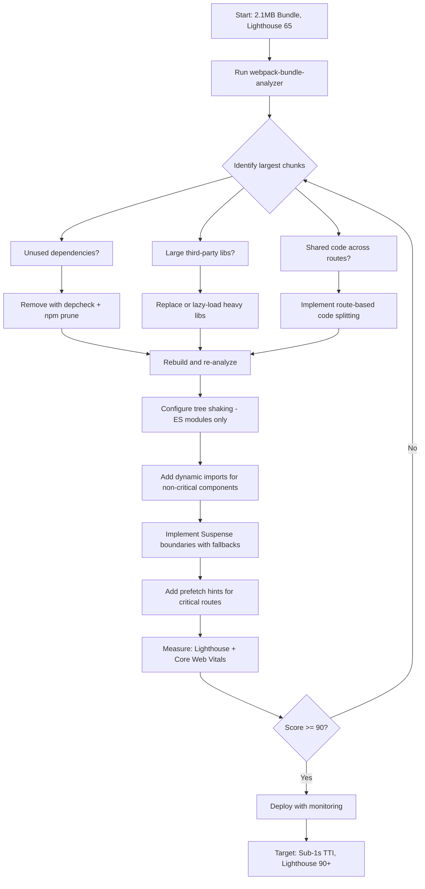

| Difficulty | Channel | Tags |
|---|---|---|
| intermediate | frontend | lighthouse, bundle, lazy-loading |

What if the biggest performance win for your React app had nothing to do with React at all? That's exactly what Netflix discovered when their logged-out landing page — the first thing every potential subscriber sees — was shipping 300KB of JavaScript including React, Lodash, and hydration data to users who never needed any of it [1]. On 3G connections, this simple page took up to 7 seconds to become interactive. The punchline? Most of that page was static content. The entire React runtime was dead weight. This is the story of how one of the world's largest streaming platforms learned that the fastest code is the code you never ship — and how you can apply the same thinking to drag your own Lighthouse score from 65 to 90+.

---

> ### Real-World Case — Netflix
>
> Netflix's logged-out landing page (the first thing every potential subscriber sees) was loading 300KB of client-side JavaScript including React, utility libraries like Lodash, and hydration data. On 3G connections, this page took up to 7 seconds to become interactive. The team realized that for a page this simple — mostly static content with a signup form — the entire React client-side framework was unnecessary overhead.
>
> | | |
> |---|---|
> | **Challenge** | The logged-out homepage had a bloated 300KB JavaScript bundle (React + dependencies + hydration data) causing slow Time-to-Interactive, especially on mobile devices in countries with slower connections. The page needed to be fast to convert potential subscribers, but client-side React was adding significant startup cost through download, parse, execute, and hydration steps. |
> | **Solution** | Netflix kept React for server-side rendering to generate the HTML, but completely removed client-side React from the landing page. They replaced it with vanilla JavaScript for the minimal interactivity needed (form submission, etc.) and added prefetching of the React bundle and signup flow code while users were on the landing page. This meant users downloaded HTML+CSS immediately and could interact instantly, while the heavier SPA code loaded in the background. |
> | **Outcome** | Time-to-Interactive decreased by 50% on the logged-out homepage. JavaScript bundle size reduced by 200KB. Subsequent navigations to the signup flow were 30% faster due to prefetching React while users were still on the landing page. The approach was so successful it became a widely-cited case study by Google's Addy Osmani. |
> | **Lesson** | Sometimes the biggest performance optimization isn't making your framework faster — it's recognizing when you don't need the framework at all. Netflix proved that the cost of a framework should be weighed against what you're actually using it for. For pages with minimal interactivity, vanilla JS can dramatically outperform any framework. The key insight is progressive enhancement: render HTML first, then activate JavaScript-powered features when and where they're needed. |

---

## Hook — The 2.1MB Elephant in the Room

Picture this: a Lighthouse report sitting at 65, a bundle size of 2.1MB, and a Time to Interactive of 4.2 seconds. For a modern React app, these numbers aren't catastrophic — they're ordinary. And that's precisely what makes them dangerous. Every extra kilobyte translates to real milliseconds of user waiting, and every millisecond above the 3-second threshold is a ticking conversion killer [2]. The uncomfortable truth? Most developers inherit these kinds of numbers and treat them as the cost of doing business. But what if the entire 2.1MB bundle didn't need to exist on the initial load? What if, like Netflix, the answer wasn't optimizing what you ship — but questioning what you ship at all?

## Problem — Why Your Bundle Is Smaller Than You Think, and Bigger Than It Should Be

Here is the thing about JavaScript bundles: they grow silently. A utility library here, a charting component there, and suddenly your dashboard's analytics page is dragging 400KB of D3 into your login screen's network request. The real problem isn't one big dependency — it's the accumulation of "it's only a few kilobytes" decisions that compound into megabytes. The first thing you need to understand is that a 2.1MB bundle isn't 2.1MB of useful code. webpack-bundle-analyzer will almost certainly reveal that a significant chunk — often 40-60% — comes from third-party libraries, polyfills, and dependencies you imported once but never actually used [3]. Moreover, many developers discover that their route-based navigation loads every component for every route upfront, meaning a user who only visits the dashboard is still downloading the code for analytics, settings, and admin panels. This leads to a critical realization: code splitting isn't just an optimization technique — it's an architectural decision about how your application distributes knowledge across time.

## Real-World Case — Netflix's 300KB Wake-Up Call

Netflix's engineering team faced exactly this problem at massive scale. Their logged-out homepage — a mostly static page with a signup form — was shipping 300KB of client-side JavaScript to every visitor, including the full React framework, Lodash utility libraries, and hydration data [1]. On 3G connections, users waited up to 7 seconds before the page became interactive. For a company where every second of delay impacts subscriber acquisition, this was a crisis hiding in plain sight. The team's approach was counterintuitive: instead of optimizing the JavaScript, they eliminated it entirely for the logged-out experience. They delivered the landing page as server-rendered HTML with zero client-side JavaScript, then lazily prefetched React only when users were about to navigate to the signup flow. The results were dramatic — Time-to-Interactive dropped by 50%, the JavaScript bundle shrank by 200KB, and subsequent navigations to the signup flow were 30% faster because React was already cached from the prefetch [1]. Google's Addy Osmani cited this as a case study in progressive hydration and resource prioritization [4]. The lesson was clear: before optimizing code you've already written, ask whether that code needs to exist on this page at all.

## Deep Dive — The Three Pillars of Bundle Optimization

Building on Netflix's insight, there are three interconnected strategies that form the backbone of serious bundle optimization: code splitting, tree shaking, and dependency auditing. Each addresses a different dimension of the problem, and together they can cut your initial bundle by 50-70%.

**Code splitting** is the practice of breaking your single monolithic bundle into smaller chunks that load on demand. React.lazy() and dynamic import() are your primary tools here [5]. But the nuance that trips up many developers is choosing the right splitting granularity. Route-based splitting — where each page becomes its own chunk — is the low-hanging fruit because it maps directly to user navigation patterns. Component-based splitting goes further, isolating heavy components like chart libraries or rich text editors that only appear in specific contexts.

**Tree shaking**, meanwhile, operates at the module level. It eliminates exported code that your application never imports, but it only works reliably with ES modules — CommonJS requires won't be shaken [3]. This is why configuring your build tool for ES module output matters more than most developers realize. A library like Lodash that ships 70KB unoptimized can shrink to 5KB when you import individual functions with `import debounce from 'lodash/debounce'` [6].

**Dependency auditing** is the most overlooked pillar. Tools like `npm ls` or `depcheck` reveal unused packages, while bundle analyzers visualize exactly where bytes are being consumed. Many teams discover entire libraries — moment.js at 300KB replaced by date-fns at 2KB per function — that they can eliminate entirely [7]. The combination of these three approaches transforms a 2.1MB bundle into something that loads in under 1 second, even on modest connections.

## Workflow — A Step-by-Step Battle Plan for Your 2.1MB Bundle

The following diagram maps the complete optimization journey from diagnosis to deployment. Each step builds on the previous, ensuring you measure before you optimize and validate after every change.



The workflow starts with analysis, not action. Running webpack-bundle-analyzer first prevents you from optimizing the wrong things — a common and expensive mistake. From there, you address the three categories in order of impact: removing dead weight, lazy-loading expensive dependencies, and restructuring your code boundaries. Notice the feedback loop: after each optimization pass, you re-analyze and re-measure. Optimization without measurement is just guessing.

## Code Example — From Monolith to Lazy-Loaded Architecture

Here is a practical implementation that demonstrates route-based code splitting, Suspense integration with error boundaries, and smart prefetching — the same patterns Netflix used to cut their landing page weight by two-thirds [1].

```javascript
import React, { Suspense, lazy, useState, useEffect } from 'react';
import { Routes, Route, useLocation } from 'react-router-dom';

// Route-based code splitting: each route becomes its own chunk
// Webpack will split these into separate bundles loaded on demand
const Dashboard = lazy(() => import('./pages/Dashboard'));
const Analytics = lazy(() => import('./pages/Analytics'));
const Settings = lazy(() => import('./pages/Settings'));
const UserProfile = lazy(() => import('./pages/UserProfile'));

// Component-based splitting for heavy third-party dependencies
// This chart library only loads when the Analytics page renders
const HeavyChart = lazy(() => import('./components/HeavyChart'));

// Custom error boundary to catch lazy-loaded component failures
class LazyErrorBoundary extends React.Component {
  constructor(props) {
    super(props);
    this.state = { hasError: false, error: null };
  }

  static getDerivedStateFromError(error) {
    return { hasError: true, error };
  }

  render() {
    if (this.state.hasError) {
      return (
        <div className="error-fallback">
          <p>Something went wrong loading this section.</p>
          <button onClick={() => this.setState({ hasError: false })}>
            Try again
          </button>
        </div>
      );
    }
    return this.props.children;
  }
}

// Prefetch helper: loads route chunks before user navigates
// Mirrors Netflix's prefetching strategy for critical navigation paths
function useRoutePrefetch(routePaths) {
  const location = useLocation();

  useEffect(() => {
    // After initial load, prefetch likely next routes
    const timer = setTimeout(() => {
      routePaths.forEach(path => {
        // Dynamic import triggers webpack to preload the chunk
        switch (path) {
          case '/analytics': import('./pages/Analytics'); break;
          case '/settings': import('./pages/Settings'); break;
          default: break;
        }
      });
    }, 2000); // Delay 2s to avoid competing with critical resources

    return () => clearTimeout(timer);
  }, [location.pathname, routePaths]);
}

function App() {
  // Prefetch routes users are most likely to visit next
  useRoutePrefetch(['/analytics', '/settings']);

  return (
    <LazyErrorBoundary>
      {/* Suspense provides a loading state while chunks download */}
      <Suspense fallback={<div className="route-spinner">Loading...</div>}>
        <Routes>
          <Route path="/dashboard" element={<Dashboard />} />
          <Route path="/analytics" element={
            <Suspense fallback={<div>Loading analytics...</div>}>
              <Analytics />
            </Suspense>
          } />
          <Route path="/settings" element={<Settings />} />
          <Route path="/profile" element={<UserProfile />} />
        </Routes>
      </Suspense>
    </LazyErrorBoundary>
  );
}

export default App;
```

The walkthrough reveals three critical design decisions. First, each `React.lazy()` call tells webpack to create a separate chunk — the dashboard code won't load until a user actually navigates to `/dashboard`. Second, the `LazyErrorBoundary` wraps the entire routing tree so a failed chunk import doesn't crash the entire application — it degrades gracefully with a retry option. Third, `useRoutePrefetch` mirrors Netflix's approach: after the initial critical load completes, the browser quietly fetches chunks for likely next destinations during idle time [1][4]. The 2-second delay ensures prefetching doesn't compete with the initial paint. Nested Suspense boundaries on the Analytics route provide a more granular loading state specifically for the heavy chart component, which might take longer to download than the page shell itself.

## Lessons Learned — What to Ship Tomorrow Morning

The journey from a 2.1MB bundle and a Lighthouse score of 65 to a lean, fast-loading application teaches several lessons that go beyond the specific techniques.

**Measure before you optimize.** Running webpack-bundle-analyzer first — not last — prevents the all-too-common trap of micro-optimizing a utility function while a 400KB library sits untouched. Data-driven decisions outperform intuition every time [3][8].

**Route-based splitting is table stakes, not the finish line.** Implementing `React.lazy()` on your routes is the first 60% of the win. The remaining 40% comes from component-level splitting, dependency replacement, and smart prefetching strategies [5].

**Replace, don't just remove.** Swapping moment.js (300KB) for date-fns (tree-shakeable, ~2KB per function) or Lodash (70KB) for lodash-es with individual imports (5KB) maintains functionality while slashing weight [6][7].

**Prefetch with intent.** Netflix didn't just lazy-load React — they prefetched it during idle time on the landing page so the signup flow felt instant [1]. Your prefetch strategy should follow user navigation patterns, not load everything speculatively.

**Monitor in production.** Bundle size in development ≠ bundle size in production. Use Real User Monitoring (RUM) tools and Core Web Vitals tracking to validate that your optimizations survive minification, compression, and real network conditions [2].

The moral? A fast application isn't one that's been optimized — it's one that was designed to only load what it needs, when it needs it. Start with the question Netflix asked: "Does this page need this code?" The answer will surprise you more often than you think.

---

## Bundle Optimization Battle Plan


<details>
<summary><strong>Original Interview Question</strong></summary>

**Q:** You're tasked with improving a React app's Lighthouse performance score from 65 to 90+. The bundle size is 2.1MB and Time to Interactive is 4.2s. What specific steps would you take to optimize the bundle and implement lazy loading?

**A:** Implement code splitting with React.lazy() and Suspense, analyze bundle composition with webpack-bundle-analyzer to identify largest chunks, remove unused dependencies and optimize imports, add dynamic imports for heavy components and third-party libraries, implement route-based splitting for better initial load times, and utilize tree shaking with proper ES module configuration.

</details>

## Conclusion

The most impactful performance optimization you can make isn't tuning a webpack config — it's questioning whether a piece of code needs to exist on the screen the user is looking at right now. Netflix proved that deleting 200KB of JavaScript from a page that didn't need it delivered better results than any micro-optimization ever could [1]. Your 2.1MB bundle almost certainly contains the same opportunity. Run webpack-bundle-analyzer today, split your routes with React.lazy(), and ask the Netflix question: does this page need this code? The path from 65 to 90+ isn't about writing faster code — it's about shipping less of it.

---

## References

1. [Netflix web performance case study](https://medium.com/dev-channel/a-netflix-web-performance-case-study-c0bcde26a9d9) — article
2. [Core Web Vitals - web.dev](https://web.dev/articles/vitals) — documentation
3. [webpack-bundle-analyzer documentation](https://github.com/webpack-contrib/webpack-bundle-analyzer) — documentation
4. [Addy Osmani - The Cost of JavaScript in 2019](https://medium.com/reloading/the-cost-of-javascript-in-2019-ca7934d2347f) — article
5. [React lazy loading and code splitting - React documentation](https://react.dev/reference/react/lazy) — documentation
6. [lodash-es on npm](https://github.com/lodash/lodash) — documentation
7. [date-fns documentation](https://date-fns.org/) — documentation
8. [MDN - Dynamic import()](https://developer.mozilla.org/en-US/docs/Web/JavaScript/Reference/Statements/import#dynamic_imports) — documentation

---

**Author:** Satishkumar Dhule — [GitHub](https://github.com/satishkumar-dhule) · [LinkedIn](https://linkedin.com/in/satishkumar-dhule) · [Website](https://satishkumar-dhule.github.io)
