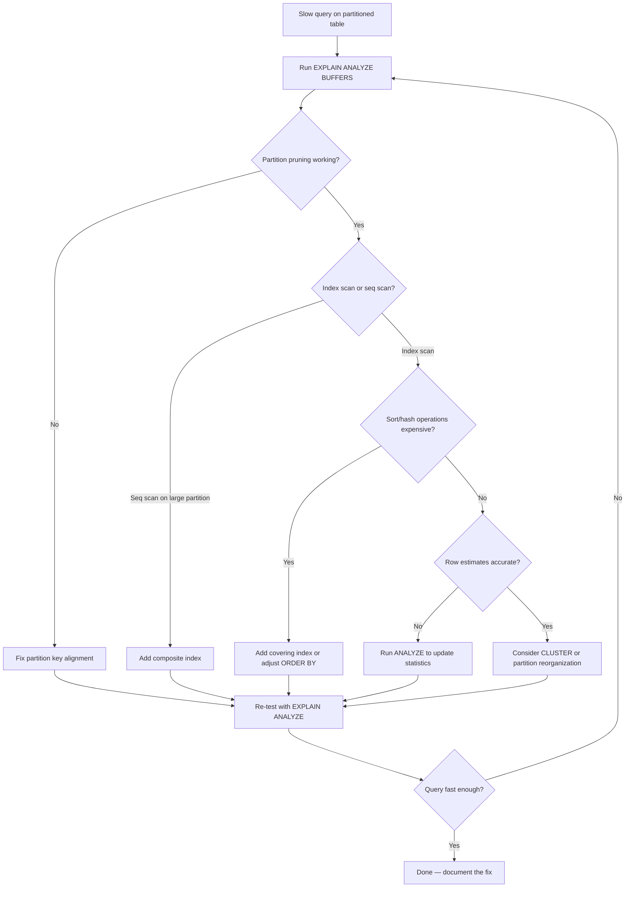

| Difficulty | Channel | Tags |
|---|---|---|
| intermediate | database | explain, query-plan, partitioning |

By early 2020, GitLab.com's PostgreSQL database had ballooned past 5 TB. Individual tables exceeded 100 GB, and the audit_events table became the first casualty: on a project with 560k audit events, viewing the last page timed out at 72,000ms. Date-filtered pagination returned HTTP 500 errors after 60 seconds so consistently that pagination with a date filter was effectively not possible on GitLab.com [1]. The table was partitioned, the date columns were indexed, and yet the queries crawled. Sound familiar? If you have ever partitioned a table expecting a performance miracle and instead gotten a slow, grinding crawl, this story is for you. Partitioning is not a silver bullet — it is a precision tool, and understanding what EXPLAIN is actually telling you is the difference between a 72-second timeout and a sub-second response.

---

> ### Real-World Case — GitLab
>
> By early 2020, GitLab.com's PostgreSQL database had grown past 5 TB, with individual tables exceeding 100 GB. The audit_events table was the first casualty: on a project with 560k audit events, viewing the last page timed out at 72,000ms, and date-filtered pagination returned HTTP 500 (>60s on cold cache) so consistently that 'pagination with date filter was effectively not possible on GitLab.com.'
>
> | | |
> |---|---|
> | **Challenge** | Ever-growing tables made even targeted queries slow: indexes no longer fit in memory, so lookup performance degraded, data was physically spread out causing excessive I/O, and date-range queries on the audit log forced the planner to chew through the entire monolithic table plus expensive ORDER BY created_at DESC sorts. Adding more indexes stopped helping. |
> | **Solution** | GitLab made audit_events the first application table to use declarative date-range partitioning on created_at (monthly partitions, with the partition key folded into the primary key as (id, created_at)). Partition pruning lets the planner eliminate every partition outside the queried week/month, and the much smaller per-partition indexes fit in memory. They also documented the critical caveat—pruning only works when the query filters on the partition key; otherwise every partition is scanned—and concluded that for tables like the 23M-row issues table whose hot queries don't lead with time, hash partitioning (128 partitions on top-level namespace) was the right way to shrink the search space. |
> | **Outcome** | Audit-log queries that previously took ~72 seconds or 500'd after 60s now scan only the relevant monthly partition (roughly 1/30 of the data) instead of the full table, making audit-event pagination usable at GitLab.com scale. audit_events shipped in GitLab 13.5 and became the reference pattern GitLab reused for partitioning other 100GB+ tables, alongside a formal 'determine when to partition' playbook that preaches matching the partition key to real query access patterns. |
> | **Lesson** | Partitioning is not a magic switch: look at the EXPLAIN (ANALYZE) plan to verify pruning actually happened (an Append node touching one child, not dozens), check for seq scans and heavy sorts that indicate every partition was scanned, and make sure hot queries filter on the partition key. Date-range partitioning fits time-filtered logs, but namespace-focused workloads need hash partitioning by entity—design the key around your real query patterns. |

---

## Hook — The Query That Took 72 Seconds

Picture this: it is 2am, and a pager fires. Your audit log page on a massive SaaS application is timing out. The database is 5 TB. The table in question has hundreds of millions of rows. You partitioned it by month. You added indexes. You did everything the blog posts told you to do. And yet, a simple date-range query — the exact pattern partitioning was supposed to solve — takes 72 seconds and returns a 500 error after 60 seconds [1]. GitLab engineers faced exactly this. The audit_events table, queried by project, filtered by date, was the first 100 GB+ table on GitLab.com to be partitioned. The fix shipped in GitLab 13.5 and reduced query scans to roughly 1/30th of the original data volume [1]. But here is the uncomfortable truth: many teams partition their tables and never see this improvement. Why? Because partitioning without understanding EXPLAIN output is like putting a turbocharger on a car with a clogged fuel filter.

## Problem — Partitioning Without Optimization Is Just Shuffling Deck Chairs

The core problem is deceptively simple: you created a PostgreSQL table partitioned by date, you are filtering on a specific date range, and the query is still slow. You run EXPLAIN and see something that does not make sense — sequential scans across multiple partitions, unexpected sort operations, or indexes that PostgreSQL chooses not to use. Many developers assume that partitioning automatically means PostgreSQL will only touch the relevant partitions. In practice, partition pruning — the mechanism where PostgreSQL eliminates partitions that cannot contain matching rows — depends on how your query is structured, how the partition bounds are defined, and whether the query planner can statically determine which partitions to scan [2]. If your WHERE clause does not align cleanly with your partition key, pruning fails silently. You end up scanning the entire table anyway, but now with the overhead of managing multiple partition relfiles. Additionally, even when pruning works, index utilization within each partition can be suboptimal. A single-column index on the date column might not help if your query also filters on status or user_id. PostgreSQL has to evaluate whether an index scan or a sequential scan is cheaper for each partition, and with small-to-medium partitions, sequential scans often win — which is actually fine, but only if the partition sizes are small enough [3].

## Real-World Case — GitLab's 72-Second Audit Log Nightmare

GitLab's experience with audit_events is a masterclass in what happens when partitioning meets real-world query patterns. By early 2020, GitLab.com's PostgreSQL database had grown past 5 TB. The audit_events table tracked every security-relevant action across GitLab — user logins, permission changes, project modifications. A project with 560,000 audit events was generating 72-second timeouts when users tried to paginate through results with a date filter [1]. The impact was not just performance degradation — it was a complete feature failure. Pagination with date filtering was effectively not possible on GitLab.com. The root cause was not a lack of partitioning; it was that the partition strategy needed to match the actual query access pattern. GitLab shipped partitioning for audit_events in GitLab 13.5, partitioning by month. The result: queries that previously scanned the full table now scanned only the relevant monthly partition — roughly 1/30th of the data. The 72-second timeout disappeared. More importantly, this became the reference pattern GitLab reused for partitioning other 100 GB+ tables, alongside a formal playbook that emphasizes matching the partition key to real query access patterns [1]. This is the critical insight: partitioning is not just about splitting data. It is about aligning your data layout with how your application actually reads that data. A partition key that does not match your most common query pattern will give you the overhead of partitioning without any of the benefits.

## Deep Dive — Reading EXPLAIN Like a Performance Detective

When you run EXPLAIN on a partitioned table query, there are five things you need to look for, in order of priority.

**1. Partition Pruning:** The first line of defense. In your EXPLAIN output, you should see evidence that PostgreSQL eliminated irrelevant partitions. Look for lines like "Subplans Removed" or check that only the relevant partition's relation appears in the scan nodes. If you see scans on partitions outside your date range, pruning has failed [2]. Common causes: using functions on the partition key (e.g., DATE(event_date) instead of comparing event_date directly), OR conditions that span partition boundaries, or default partitions that are absorbing queries they should not.

**2. Index Utilization:** Check whether PostgreSQL is using an Index Scan, Index Only Scan, or falling back to a Seq Scan. On small partitions (under ~50k rows), sequential scans are often faster because the overhead of index traversal exceeds the cost of reading the entire partition [3]. This is normal and desirable. But on larger partitions, an unexpected Seq Scan means your indexes are not being used effectively.

**3. Sort and Hash Operations:** Look for Sort nodes with high cost estimates. If your query includes ORDER BY on a column that is not indexed alongside the partition key, PostgreSQL may need to sort the entire result set in memory. For large result sets, this is a common bottleneck. Hash Aggregates can similarly consume significant memory when grouping by unindexed columns.

**4. Nested Loop vs Hash Join:** If your query joins against other tables, check the join strategy. Nested loops are efficient for small datasets but become expensive at scale. Hash joins and merge joins are generally preferred for larger result sets, but they require more memory.

**5. Actual vs Estimated Rows:** Compare the "rows" estimate with the "actual rows" (visible with ANALYZE). Large discrepancies mean the query planner is making decisions based on stale statistics. Run ANALYZE on the table to update planner statistics [4].

## Workflow — The EXPLAIN Diagnostic Pipeline

Here is the step-by-step workflow you should follow when a partitioned query is slow. This pipeline moves from diagnosis to optimization in a structured way:



## Code Example — Diagnosing and Fixing a Slow Partitioned Query

Here is a practical example showing how to diagnose and fix a slow query on a partitioned events table. The code walks through the full diagnostic pipeline — from running EXPLAIN to adding the right composite index.

```sql
-- Step 1: Run EXPLAIN with ANALYZE and BUFFERS to see actual execution
-- ANALYZE actually runs the query; BUFFERS shows I/O impact
EXPLAIN (ANALYZE, BUFFERS, FORMAT TEXT)
SELECT * FROM events
WHERE event_date BETWEEN '2024-01-01' AND '2024-01-31'
  AND status = 'completed';

-- Step 2: Check partition pruning — look for which partitions appear in the scan
-- If you see partitions outside January 2024, pruning is broken
-- Common fix: avoid wrapping event_date in functions like DATE()

-- Step 3: Add a composite index covering both filter columns
-- The order matters: event_date first for partition alignment,
-- status second for filtering within the partition
CREATE INDEX CONCURRENTLY idx_events_date_status
  ON events (event_date, status);

-- Step 4: Update planner statistics so PostgreSQL knows about new data distribution
ANALYZE events;

-- Step 5: If the table is heavily updated, consider clustering for physical ordering
-- This reorders rows on disk to match the index — expensive but effective
-- for range queries that scan contiguous rows
CLUSTER events USING idx_events_date_status;

-- Step 6: Re-run EXPLAIN to verify improvement
EXPLAIN (ANALYZE, BUFFERS, FORMAT TEXT)
SELECT * FROM events
WHERE event_date BETWEEN '2024-01-01' AND '2024-01-31'
  AND status = 'completed';
```

## Lessons Learned — The Partition Playbook

After debugging partitioned table performance across large-scale systems, here are the patterns that consistently work:

**Match your partition key to your query access pattern.** GitLab's playbook says it best: partition by the column your queries filter on most frequently [1]. If your top queries filter on event_date, partition by event_date — not by user_id, not by created_at. A mismatched partition key gives you the complexity of partitioning with zero performance benefit.

**Composite indexes are not optional.** A single-column index on the date column is rarely sufficient. Most real-world queries filter on multiple columns. Create composite indexes that cover your WHERE clause, with the partition key as the leading column [5].

**Small partitions are your friend — up to a point.** PostgreSQL performs sequential scans on partitions smaller than roughly 50k rows [3]. This is fine. Do not add unnecessary indexes to tiny partitions; the overhead is not worth it. Focus your indexing effort on partitions that are large enough to benefit from index scans.

**Run ANALYZE after major data changes.** Stale statistics cause the query planner to make bad decisions. If you have inserted or deleted a significant volume of rows, update your statistics before debugging query plans [4].

**Monitor with pg_stat_user_tables.** Track seq_scan vs idx_scan counts, n_tup_ins, n_tup_del, and last_vacuum/last_autovacuum. This gives you visibility into which partitions are hot and which need maintenance [6].

**Beware the default partition.** A default partition catches all rows that do not match other partition bounds. If it is absorbing more data than expected, your partition bounds may not cover your data distribution properly [2].

**Consider partitioning as a journey, not a destination.** GitLab did not partition all their tables at once. They started with the worst offender (audit_events), validated the pattern, built a playbook, and then applied it to other 100 GB+ tables [1]. This incremental approach reduces risk and lets you refine your strategy based on real results.

---

## EXPLAIN Diagnostic Pipeline for Partitioned Tables


<details>
<summary><strong>Original Interview Question</strong></summary>

**Q:** You have a PostgreSQL table with 100M rows partitioned by date. A query filtering on a specific date range is still slow. What would you check in the EXPLAIN plan and how would you optimize it?

**A:** Check partition pruning effectiveness, index utilization patterns, and expensive sort operations. Create composite indexes on (date, filtered_columns) and evaluate clustering strategies for optimal data access.

</details>

## Conclusion

GitLab's 72-second audit log timeout was not a failure of partitioning — it was a failure of aligning the partition strategy with actual query patterns. The fix was not more hardware or a different database. It was understanding what EXPLAIN was saying and building a composite index that matched how the data was actually accessed. If your partitioned queries are still slow, start with EXPLAIN ANALYZE BUFFERS. Check pruning. Check index usage. Check sort operations. Then build the composite index that covers your WHERE clause. Run ANALYZE. And remember: partitioning is not magic. It is a tool that works brilliantly when the partition key matches the query access pattern, and fails silently when it does not [1]. The next time a partitioned query is slow, do not reach for more RAM. Reach for EXPLAIN.

---

## References

1. [GitLab database partitioning documentation](https://handbook.gitlab.com/handbook/engineering/data-engineering/database-excellence/database-frameworks/doc/partitioning) — documentation
2. [PostgreSQL documentation — Partitioning](https://www.postgresql.org/docs/current/ddl-partitioning.html) — documentation
3. [PostgreSQL documentation — Routine Vacuuming](https://www.postgresql.org/docs/current/routine-vacuuming.html) — documentation
4. [PostgreSQL documentation — The autovacuum daemon](https://www.postgresql.org/docs/current/routine-vacuuming.html#ROUTINE-VACUUM-AUTOVACUUM) — documentation
5. [PostgreSQL documentation — Indexes](https://www.postgresql.org/docs/current/indexes.html) — documentation
6. [PostgreSQL documentation — pg_stat_user_tables](https://www.postgresql.org/docs/current/monitoring-stats.html#MONITORING-PG-STAT-USER-TABLES-VIEW) — documentation
7. [PostgreSQL EXPLAIN documentation](https://www.postgresql.org/docs/current/using-explain.html) — documentation
8. [PostgreSQL documentation — CLUSTER](https://www.postgresql.org/docs/current/sql-cluster.html) — documentation

---

**Author:** Satishkumar Dhule — [GitHub](https://github.com/satishkumar-dhule) · [LinkedIn](https://linkedin.com/in/satishkumar-dhule) · [Website](https://satishkumar-dhule.github.io)
