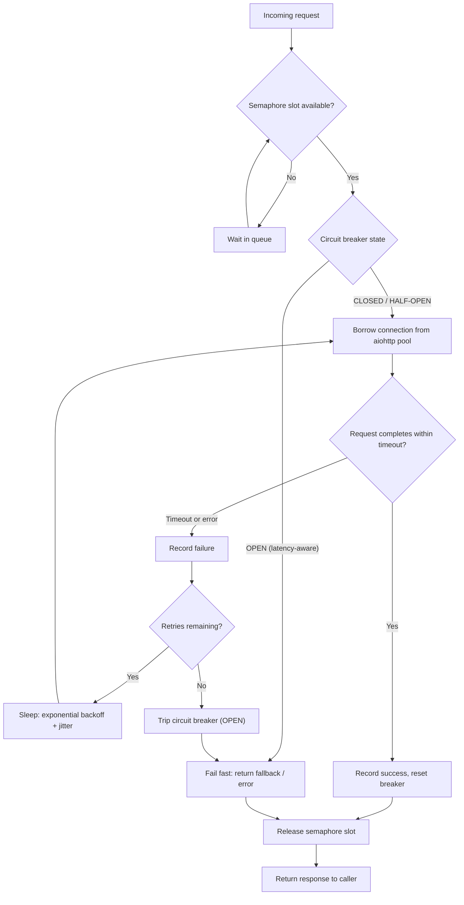

| Difficulty | Channel | Tags |
|---|---|---|
| advanced | backend | asyncio, aiohttp, concurrency |

On Valentine's Day 2025, a payment processing company lost $340,000 in 47 minutes — not because a major payments API was down, but because a connection pool kept handing out connections to a service that had quietly slowed to a crawl [1]. Their circuit breaker tripped too late, their timeouts were too generous, and by the time the breaker finally opened, the pool was already exhausted and the damage was done. This is the story of why connection pools fail under real load, and the defensive stack you can build so your service degrades gracefully instead of collapsing. If your code talks to any HTTP API, this is your story too.

---

> ### Real-World Case — Stripe
>
> A payment processing company lost $340K in 47 minutes on Valentine's Day 2025 when Stripe's API began returning elevated latency (P99 > 8s) during an upstream incident. Their circuit breaker was configured to trip after 10 consecutive failures over 30 seconds, but each request held a connection for 8-15 seconds while waiting on Stripe. With only 50 connections in the pool, the entire pool was exhausted before the circuit breaker ever tripped. The root cause was a recent deployment (v2.4.1) that increased the Stripe client timeout from 5s to 15s, combined with a circuit breaker that only monitored failure count—not latency.
>
> | | |
> |---|---|
> | **Challenge** | The circuit breaker was watching for request failures (errors), but the real problem was latency. Requests weren't failing—they were hanging for 8-15 seconds each. With 50 connections and 8-second hold times, the pool drained in under 7 minutes. The circuit breaker, requiring 10 failures over 30 seconds, never tripped because requests were timing out slowly rather than erroring quickly. Meanwhile, new payment requests had nowhere to go, causing a complete checkout outage. |
> | **Solution** | Three-phase remediation: (1) Reconfigured circuit breaker threshold from 10 failures/30s to 5 failures/10s for faster fail-fast behavior. (2) Added latency-based circuit breaking (`slowCallRateThreshold`) so slow calls—not just errors—count toward the trip threshold. (3) Implemented per-endpoint connection pool limits so a single slow upstream (Stripe) could not exhaust the entire connection pool. The team also added a Stripe status webhook for proactive upstream monitoring and a payment fallback using cached card tokens during Stripe degradation. |
> | **Outcome** | After rollback to v2.4.0 (restoring 5s timeout) and fixing circuit breaker configuration, recovery was nearly immediate once Stripe resolved their incident. The post-incident improvements reduced MTTR from 47 minutes to near-zero for future upstream degradations. The key lesson: timeout increases have multiplicative effects—doubling a timeout doesn't double risk, it multiplies it by (connection pool size / new timeout). The team modeled this mathematically before shipping timeout changes thereafter. |
> | **Lesson** | Circuit breakers must account for latency, not just failure count. A request that hangs for 15 seconds is just as damaging to a connection pool as one that fails immediately. Configure circuit breakers with both `failureRateThreshold` and `slowCallRateThreshold`/`slowCallDurationThreshold`. Additionally, every timeout configuration change must be analyzed for its interaction with circuit breaker thresholds and connection pool sizes—reviewing changes in isolation is what creates these cascading failure windows. |

---

## Hook — It looked like a Valentine's Day card. It scaled like a horror story.

Picture this: it is 11 a.m. on February 14, and your monitoring dashboard just turned the exact shade of red your manager swears they have never seen. P50 latency is crawling, P99 is off the chart, checkout pages are spinning, and every outgoing request to your payment provider is taking 8+ seconds. The punchline that keeps engineers up at night: your system is not technically down — it is just one slow response away from falling over completely [1]. What kills services in production is rarely a loud crash. It is the quiet failure mode where a handful of stalled connections starve thousands of fast ones, and nobody notices until the revenue numbers come in.

## Problem — The pool that protects you becomes the pool that drowns you

Here is the core tension every backend developer discovers the hard way: a connection pool is a safety valve, but under the wrong conditions it becomes a bottleneck. When your app makes an HTTP call through aiohttp, a socket is opened and held for the entire lifetime of the request — measured in seconds, not milliseconds, when the upstream is slow [5]. A pool of 50 connections sounds generous, until 50 concurrent callers each occupy a slot waiting 8–15 seconds on a degraded dependency. At that point every new request parks behind a wall of stalled calls, and your healthy endpoints starve while queuing for a semaphore lease that never comes free [6]. Sound familiar? Many developers configure a timeout, slap on a circuit breaker, and call it resilience. The uncomfortable truth is that the three defenses — pool limits, timeouts, and breakers — do not compose automatically. They fight each other. 🔥 Hot Take: unless you reason about how they interact, your breaker will trip exactly when it no longer matters — or never trip at all. ⚠️ Watch Out: a retry without backoff is not recovery, it is a self-inflicted denial-of-service attack queued behind the same broken wall.

## Real-World Case — A Valentine's Day catastrophe worth $340K

There is no better case study than the payment processing company that lost $340,000 in 47 minutes on February 14, 2025, when a payments API dependency began returning elevated latency (P99 > 8s) during an upstream incident [1]. Their circuit breaker was configured to trip after 10 consecutive failures over a 30-second window — bulletproof on paper. However, each request held a connection for 8–15 seconds while waiting on the API, and with only 50 connections in the pool, every single slot was occupied long before 10 consecutive failures could accumulate. Consequently, the breaker never tripped. The pool was the real breaker, and it was a slow one. The root cause was brutally simple: a recent deployment (v2.4.1) had increased the client timeout from 5s to 15s, while the circuit breaker only monitored failure count — never latency [1]. After rolling back to v2.4.0, restoring the 5s timeout, and fixing the breaker configuration, recovery was nearly immediate once the upstream resolved their incident. The post-incident improvements reduced MTTR from 47 minutes to near-zero for future upstream degradations [1]. 🎯 Key Point: the team's defining insight was mathematical — timeout increases have multiplicative effects. Doubling a timeout does not double risk; it multiplies it by (connection pool size / new timeout). They modeled this interaction before shipping any timeout change thereafter [1].

## Deep Dive — The three musketeers of graceful degradation

Building on that story, the fix is not one pattern — it is a stack of cooperating mechanisms, each tuned to its neighbors rather than perfected in isolation. The semaphore is your concurrency governor: a counter that guarantees at most N tasks hold it at once, so concurrency can never exceed its ceiling [6]. Exponential backoff disciplines retries: instead of hammering a struggling service at 10ms intervals, you wait 100ms, then 200ms, then 400ms — capped and jittered — giving the upstream room to breathe [9][10]. The circuit breaker is the fail-fast sentry, a state machine with three states — CLOSED, OPEN, HALF-OPEN — that rejects calls instantly once a service is demonstrably unhealthy, rather than letting them queue pointlessly [2][3]. Finally, health checks plus queue management prune dead connections and buffer overflow traffic so your application degrades gradually instead of returning a wall of 500s [5]. Moreover, and this is the trade-off most engineers miss, not all circuit breakers are equal:

## Workflow — From request to response under fire

This leads to a clear request lifecycle that is far easier to reason about than a tangle of configuration. The diagram below walks through every stop a request makes — and the exact points where it fails fast, retries, or accepts defeat gracefully [7]. 1. An incoming call requests a semaphore lease; if the pool is saturated, it waits in the queue instead of piling onto the network. 2. Once leased, it consults the circuit breaker — if OPEN, it fails fast with zero network I/O [2]. 3. If CLOSED or HALF-OPEN, it borrows a keepalive connection from the aiohttp pool instead of opening a fresh socket [5]. 4. The request fires under a strict timeout, split between connect and total. 5. On success, the breaker records success and resets its counters. 6. On timeout or error, it records a failure; if retries remain, it sleeps with exponential backoff plus jitter and loops back — otherwise it trips the breaker open and releases the slot [9][10]. Combined with asyncio.gather() to run hundreds of these concurrently [7], this pipeline transforms a fragile 50-slot wall into a managed, self-healing flow.

## Code Example — An aiohttp connection pool with grace under pressure

Here is the moment everything clicks together. The implementation below combines all four mechanisms into a single, production-shaped pool manager: a semaphore for the concurrency ceiling, exponential backoff with jitter for retries, a latency-and-failure-aware circuit breaker for fail-fast behavior, and a single reusable aiohttp ClientSession whose internal connector prunes dead sockets [5][6]. Read it alongside the workflow above and you will see the same six steps in code form. 💡 Insight: aiohttp's TCPConnector already maintains a pooled, keepalive-friendly connector by default — the semaphore adds a higher-level lease so the circuit-breaker check and the queueing behavior stay explicit and testable.

## Lessons Learned — What $340K buys you

By now the pattern is unmistakable, and the takeaways deserve a spot on your team's wall. Timeouts and pool size are one coupled equation, not independent knobs — changing one without modeling the other is a production incident waiting to happen [1]. A circuit breaker that ignores latency is a circuit breaker that does not work; feed it percentiles and failure rates, not just counts [4][8]. Always bond retries to exponential backoff with a cap and jitter, because unbounded retries under load are their own outage [9][10]. Shut down cleanly: close your session on application shutdown so connections drain instead of leaking [5]. And reuse one ClientSession for your entire process — the pooled keepalive behavior inside it is the entire point [5]. ⚠️ Watch Out: forgetting connection cleanup on shutdown and skipping SSL context validation are the two silent leaks that surface as 'mystery' socket exhaustion in production. Tomorrow, do one thing: find your biggest HTTP dependency, write down your timeout, pool size, and breaker thresholds, and ask whether they compose. Then simulate an 8-second slow upstream and watch whether your breaker trips before your pool exhausts. The team that ran that experiment after their Valentine's Day incident cut MTTR from 47 minutes to near-zero [1]. That number is the entire ROI.

---

## Request Lifecycle Under Degradation

<strong>Original Interview Question</strong>

**Q:** How would you implement a connection pool manager for aiohttp that handles graceful degradation under high load and connection timeouts?

**A:** Implement a connection pool manager for aiohttp using a semaphore to limit concurrent connections, exponential backoff for retrying failed requests, and circuit breaker pattern to gracefully degrade under high load and connection timeouts.

## Conclusion

Here is the real moral of the story: resilience is not about owning more connections, longer timeouts, or fancier breakers. It is about making the defenses fail in the right order — backoff before the breaker, breaker before pool exhaustion — so that no single slow API can ever take down your service. Build the semaphore, wire in exponential backoff, track latency percentiles, and fail fast before your pool starves. And the next time a pull request bumps a timeout from 5 seconds to 15, ask for the multiplication table before you hit merge.

---

## References

1. [Stripe incident report](https://blog.stackademic.com/we-lost-340k-in-47-minutes-because-our-circuit-breaker-was-too-slow-75e1e97a3242) — article
2. [CircuitBreaker — Martin Fowler](https://martinfowler.com/bliki/CircuitBreaker.html) — blog
3. [Pattern: Circuit Breaker — microservices.io](https://microservices.io/patterns/reliability/circuit-breaker.html) — documentation
4. [Netflix Hystrix — How It Works](https://github.com/netflix/hystrix/wiki/how-it-works) — documentation
5. [aiohttp Client Reference](https://docs.aiohttp.org/en/stable/client_reference.html) — documentation
6. [asyncio Synchronization Primitives — Python docs](https://docs.python.org/3/library/asyncio-sync.html) — documentation
7. [asyncio — Asynchronous I/O — Python docs](https://docs.python.org/3/library/asyncio.html) — documentation
8. [Circuit Breaker Pattern — Microsoft Azure Architecture Center](https://learn.microsoft.com/en-us/azure/architecture/patterns/circuit-breaker) — documentation
9. [Exponential backoff — Wikipedia](https://en.wikipedia.org/wiki/Exponential_backoff) — documentation
10. [Error retries and exponential backoff in AWS](https://docs.aws.amazon.com/general/latest/gr/api-retries.html) — documentation

---

**Author:** Satishkumar Dhule — [GitHub](https://github.com/satishkumar-dhule) · [LinkedIn](https://linkedin.com/in/satishkumar-dhule) · [Website](https://satishkumar-dhule.github.io)
