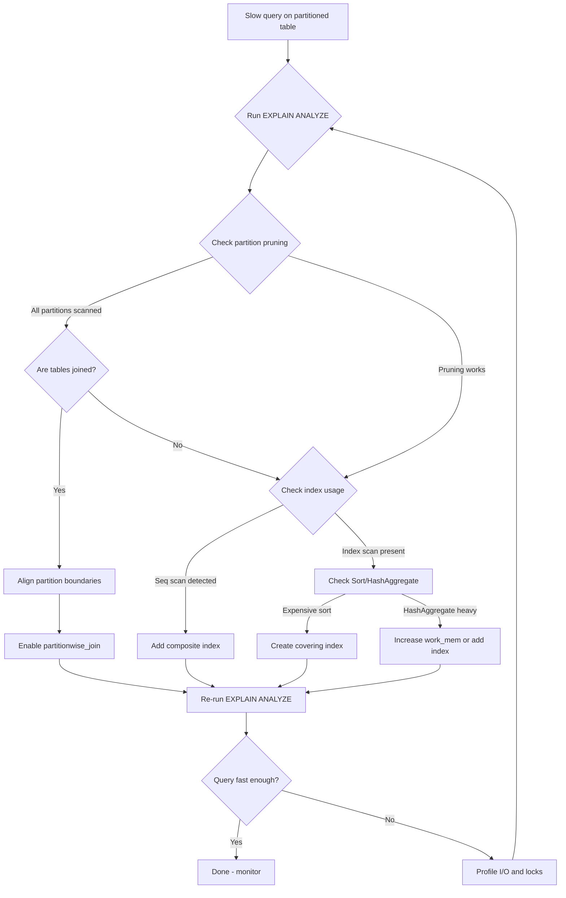

| Difficulty | Channel | Tags |
|---|---|---|
| intermediate | database | explain, query-plan, partitioning |

It was nearly midnight when the CPU alert fired. Adyen, the global payments company processing billions of transactions, watched their critical database spike above 100% CPU usage — right before the December shopping season [1]. The culprit wasn't a bad query or missing index. It was the way they had partitioned their tables. If you've ever stared at a slow query on a partitioned table and wondered why EXPLAIN ANALYZE looks fine but performance still stinks, this story will change how you think about PostgreSQL partitioning forever.

---

> ### Real-World Case — Adyen
>
> Adyen, a global payments company processing massive transaction volumes, had a 10TB+ orders table partitioned by date that was experiencing severe query performance degradation. When joining partitioned tables (ledger with 40 partitions joined to ledgerLine with 40 partitions), PostgreSQL was scanning all 80+ partition combinations, causing CPU spikes above 100% during critical peak shopping seasons.
>
> | | |
> |---|---|
> | **Challenge** | Queries joining partitioned tables were performing full scans across all partitions because partition boundaries weren't aligned between tables. PostgreSQL's LockManager was overflowing when accessing 80+ individual tables simultaneously, exceeding the 16 fast-path locks threshold. Adding even a single new partition to an existing table would bring critical databases to their knees. |
> | **Solution** | Adyen adopted a 'partition the environment, not individual tables' approach: 1) Identified a universal 'leading figure' (transaction ID) as the partition key for ALL related tables, 2) Denormalized the ledger table to include the transaction ID directly (intentionally violating normalization), 3) Aligned all partition boundaries across every table to match exactly, 4) Enabled enable_partitionwise_join so PostgreSQL could prune partitions across joined tables, 5) Built a custom open-source partitioning framework that manages partitions with minimal locks. |
> | **Outcome** | Query performance for joins between transactions and ledgers improved by a factor of almost 70x. CPU usage went from spiking above 100% during partition creation to maintaining a healthy profile. The solution scaled to handle 100TB+ across database shards while maintaining consistent query performance. Adyen recommends partitioning any table expected to grow beyond 100GB. |
> | **Lesson** | Partitioning individual tables without aligning the entire database environment can actually DESTROY performance. PostgreSQL's partition pruning only works on the first table in a join unless partitions are perfectly aligned AND enable_partitionwise_join is enabled. Without alignment, a 40-partition join becomes an 80-table scan with LockManager overflow. The counterintuitive requirement: you must denormalize your schema to make partitioning work efficiently. |

---

## Hook — The Partition Trap That Crashed a Payments Giant

Picture this: you have a 10TB+ orders table, neatly partitioned by date. Your queries look reasonable in EXPLAIN. And yet, every time you join your ledger table to your ledger line table, the system crawls to a halt. You add more indexes. You tweak work_mem. Nothing works. This isn't a hypothetical — it's exactly what happened at Adyen, where joining two partitioned tables with 40 partitions each forced PostgreSQL to scan all 80+ partition combinations [1]. The result? CPU usage above 100% during peak shopping season, and query performance that degraded catastrophically with every new partition added. The most unsettling part? Most developers would never suspect partitioning itself as the root cause. After all, partitioning is supposed to make things faster, right? Not always — and understanding when it backfires is the difference between a system that scales and one that collapses under load.

## Problem — When Partitioning Makes Things Worse

Many developers discover partitioning as a silver bullet for large tables. You've read the docs, you know partition pruning eliminates unnecessary scans, and your single-table queries are lightning fast. But here is the thing though: the moment you start joining partitioned tables, you've entered a fundamentally different performance regime. The core issue is lock acquisition and partition scanning overhead. When you join an unpartitioned transactions table with an unpartitioned ledger table, PostgreSQL needs roughly 6 locks — three for table objects and three for indexes [1]. That's comfortably within PostgreSQL's fast-path lock threshold of 16. But partition those same tables into 40 partitions each, and suddenly a join between them can require 160+ locks, catapulting you past the fast-path threshold and into the slower LockManager path [1]. Moreover, without aligned partition boundaries, PostgreSQL cannot prune partitions on the inner side of a join. It will scan every single partition of the second table, even when you only need data from one. This means that adding more partitions — which should help — actually makes joins progressively slower. Consider this: a sequential scan on a single table takes a certain amount of time. But when you've partitioned two joined tables and partition pruning fails, you're doing index scans on 80 individual tables while holding 160 locks. The planner can't help you because it has no way to determine which partitions of the inner table correspond to the outer table's partition at either planning or execution time [1].

## Real-World Case — Adyen's Partitioning Nightmare

Adyen's experience is a cautionary tale for any team dealing with large-scale PostgreSQL deployments [1]. They had partitioned their ledger and ledgerLine tables independently — each with 40 partitions — without aligning their partition boundaries. When joining these tables, PostgreSQL was scanning all 80+ partition combinations. The CPU spikes were so severe that Adyen's team could literally correlate CPU usage with the dates when new partitions were created. Here is the kicker: the denormalized setup, where both tables shared the same partition key and aligned boundaries, was almost 70 times faster than the misaligned configuration [1]. After implementing aligned, co-partitioned tables with enable_partitionwise_join turned on, Adyen achieved consistent query performance across their 100TB+ database shards. They now recommend partitioning any table expected to grow beyond 100GB, but with a critical caveat: partition the environment, not individual tables [1]. The lesson is stark. If you're going to partition joined tables, you must partition them around the same leading figure with identical boundary ranges. Anything less creates a performance trap that gets worse with scale — precisely the opposite of what partitioning is supposed to achieve.

## Deep Dive — Reading the EXPLAIN Plan Like a Surgeon

Once you understand the partition-joining pitfall, the next question becomes: how do you diagnose this in your own queries? The answer lies in mastering EXPLAIN ANALYZE output. Here's what to look for when a query on a partitioned table is performing poorly. First, check partition pruning. PostgreSQL's planner examines partition constraints and excludes partitions that cannot contain matching rows [3]. In your EXPLAIN output, look for how many partitions appear in the Append or MergeAppend nodes. If you see all partitions listed, pruning has failed — and that's your first clue. Second, examine the scan type on each partition. A sequential scan on a partition that should be filtered by an index suggests either a missing index or a planner misestimation. Third, look for Sort and HashAggregate nodes consuming disproportionate cost. Expensive sorts often indicate missing composite indexes that could satisfy ORDER BY directly from the index. Finally, check the buffers output. If shared read buffers are high across many partitions, you're pulling far more data into memory than necessary. Here's a comparison of what good versus bad partition pruning looks like: Bad plan: Append → Seq Scan on events_2024_01 → Seq Scan on events_2024_02 → ... (all partitions scanned). Good plan: Append → Index Scan on events_2024_01 only (single partition accessed). The gap between these two represents the difference between a query that runs in milliseconds versus one that times out at scale.

## Workflow — The Five-Step Diagnostic Process

When faced with a slow query on a partitioned table, follow this systematic workflow. The Mermaid diagram below illustrates the decision path from initial diagnosis to resolved query. ```mermaid flowchart TD A[Slow query on partitioned table] --> B{Run EXPLAIN ANALYZE} B --> C{Check partition pruning} C -->|All partitions scanned| D{Are tables joined?} C -->|Pruning works| E{Check index usage} D -->|Yes| F[Align partition boundaries] D -->|No| E E -->|Seq scan detected| G[Add composite index] E -->|Index scan present| H[Check Sort/HashAggregate] F --> I[Enable partitionwise_join] I --> J[Re-run EXPLAIN ANALYZE] G --> J H -->|Expensive sort| K[Create covering index] H -->|HashAggregate heavy| L[Increase work_mem or add index] K --> J L --> J J --> M{Query fast enough?} M -->|Yes| N[Done - monitor] M -->|No| O[Profile I/O and locks] O --> B ``` Start by running EXPLAIN (ANALYZE, BUFFERS) on the slow query. This reveals actual execution times, buffer usage, and row counts versus planner estimates. If partition pruning is failing, the root cause is usually misaligned boundaries or a missing partitionwise_join setting. If pruning works but the query is still slow, look for missing composite indexes that cover your WHERE clause. Create those indexes concurrently to avoid blocking writes. Finally, validate your changes by re-running EXPLAIN ANALYZE and comparing the before-and-after buffer counts.

## Code Example — Diagnosing and Fixing a Slow Partitioned Query

Here's a practical walkthrough of diagnosing and optimizing a query on a 100M-row partitioned events table. First, run the diagnostic query with full execution details: ```sql -- Step 1: Diagnose - run with ANALYZE and BUFFERS for full visibility EXPLAIN (ANALYZE, BUFFERS, FORMAT TEXT) SELECT * FROM events WHERE event_date BETWEEN '2024-01-01' AND '2024-01-31' AND status = 'completed'; -- Step 2: Check if partition pruning is active SHOW enable_partition_pruning; -- Should be 'on' -- Step 3: Create a composite index covering the WHERE clause -- CONCURRENTLY avoids blocking writes during index creation CREATE INDEX CONCURRENTLY idx_events_date_status ON events (event_date, status); -- Step 4: If joining multiple partitioned tables, enable partitionwise join -- This lets PostgreSQL prune partitions on BOTH sides of the join SET enable_partitionwise_join = on; -- Step 5: Re-run the diagnostic to verify improvement EXPLAIN (ANALYZE, BUFFERS, FORMAT TEXT) SELECT * FROM events WHERE event_date BETWEEN '2024-01-01' AND '2024-01-31' AND status = 'completed'; -- Step 6: For tables where data access follows the index order, -- consider CLUSTER to physically reorder rows on disk CLUSTER events USING idx_events_date_status; -- Note: CLUSTER acquires an exclusive lock. Use pg_repack for -- online clustering without blocking writes. ``` The diagnostic query in Step 1 tells you exactly which partitions were scanned, how many buffers were read, and whether indexes were used. Step 2 confirms partition pruning is enabled — if it's off, every query scans all partitions regardless of your WHERE clause [3]. The composite index in Step 3 ensures that once PostgreSQL prunes to the right partition, it can find matching rows via index scan instead of sequential scan [4]. For joined queries, Step 4 is critical: enable_partitionwise_join changes the planner to evaluate each partition pair individually, enabling pruning on both sides of the join [1]. Step 6's CLUSTER physically reorders the table on disk to match the index, which can dramatically improve sequential read performance for range queries.

## Lessons Learned — What to Do Differently Tomorrow

Here are the key takeaways from this journey. First, partition the environment, not individual tables. If you're joining partitioned tables, they must share the same partition key with aligned boundaries [1]. Otherwise, you'll create a performance trap that worsens with every partition you add. Second, always check EXPLAIN (ANALYZE, BUFFERS) before assuming a query is optimized. Partition pruning, index usage, and lock acquisition patterns are only visible when you look at the actual execution plan [3]. Third, composite indexes on (partition_key, filtered_columns) are essential. A single-column index on the partition key helps pruning but doesn't help the planner skip sequential scans within a partition [4]. Fourth, be cautious with CLUSTER. It acquires an exclusive lock and rewrites the entire table. For production systems, pg_repack provides online reclustering without downtime [5]. Fifth, remember that PostgreSQL's fast-path lock optimization handles up to 16 locks efficiently [1]. Once you exceed that — which happens easily with partitioned joins — every additional partition adds measurable overhead. Finally, if you're managing partition lifecycle, automate it. Tools like pg_partman can handle partition creation, detachment, and cleanup, preventing the dreaded 3am call when a partition fills up [6]. The single most important insight? Partitioning is not a free performance upgrade. It's a tradeoff between single-table scan speed and join complexity. Get the alignment right, and you get 70x improvements. Get it wrong, and you get CPU spikes during your busiest season.

---

## Partitioned Query Diagnostic Workflow



<details>
<summary><strong>Original Interview Question</strong></summary>

**Q:** You have a PostgreSQL table with 100M rows partitioned by date. A query filtering on a specific date range is still slow. What would you check in the EXPLAIN plan and how would you optimize it?

**A:** Check partition pruning effectiveness, index utilization patterns, and expensive sort operations. Create composite indexes on (date, filtered_columns) and evaluate clustering strategies for optimal data access.

</details>

## Conclusion

The Adyen story proves that partitioning is not a set-it-and-forget-it optimization. It's a architectural decision that demands alignment across your entire data model. If you take one thing from this: the next time a partitioned query is slow, don't just check the indexes — check whether your partitions are aligned with the tables you're joining. Run EXPLAIN (ANALYZE, BUFFERS), verify pruning is working on both sides of the join, and create composite indexes that cover your WHERE clause. That 70x improvement Adyen achieved? It wasn't from a clever index or a config tweak. It came from recognizing that partitioning the environment — not individual tables — is the only approach that scales.

---

## References

1. [Adyen: Partitioning an environment not individual tables](https://www.adyen.com/knowledge-hub/partitioning-an-environment-not-individual-tables) — blog
2. [PostgreSQL Documentation: Table Partitioning](https://www.postgresql.org/docs/18/ddl-partitioning.html) — documentation
3. [PostgreSQL Documentation: Partition Pruning](https://www.postgresql.org/docs/18/ddl-partitioning.html#PARTITION-PRUNING) — documentation
4. [PostgreSQL Documentation: Using EXPLAIN](https://www.postgresql.org/docs/18/using-explain.html) — documentation
5. [pg_repack: PostgreSQL表在线重建工具](https://github.com/pgrepack/pg_repack) — documentation
6. [pg_partman: PostgreSQL Partition Management](https://github.com/pgpartman/pg_partman) — documentation
7. [Adyen: Table Partitioning at Adyen](https://www.adyen.com/knowledge-hub/partitioning-at-adyen) — blog
8. [Wikipedia: Database Partitioning](https://en.wikipedia.org/wiki/Partition_(database)) — documentation

---

**Author:** Satishkumar Dhule — [GitHub](https://github.com/satishkumar-dhule) · [LinkedIn](https://linkedin.com/in/satishkumar-dhule) · [Website](https://satishkumar-dhule.github.io)
