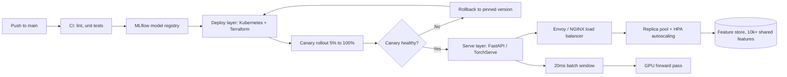

| Difficulty | Channel | Tags |
|---|---|---|
| beginner | devops | mlops, deployment |

By 2015, Uber's machine learning teams were burning 80% of their time on plumbing — servers, pipelines, and infrastructure — instead of the models that actually move the business [1]. When prediction volume crossed millions per second, the patchwork of team-managed stacks hit a scaling wall that no clever algorithm could fix. The recovery taught the industry a lesson that still confuses interviewers and engineers alike: model deployment and model serving look like synonyms, but they are two different jobs with two different failure modes. Here is what happens when you treat them as one.

---

> ### Real-World Case — Uber
>
> By 2015, Uber's ML was fragmented across isolated teams spending 80% of their time on manual plumbing — managing servers, data pipelines, and infrastructure instead of building models. It took months to get a single model from laptop to production. As they crossed millions of predictions per second, the ad-hoc infrastructure hit a scaling wall that forced a complete architectural rethink.
>
> | | |
> |---|---|
> | **Challenge** | Uber needed to serve millions of ML predictions per second with sub-10ms latency across hundreds of use cases (ETA prediction, fraud detection, ride matching, Eats recommendations), while eliminating the training-serving skew problem where features computed offline didn't match what was available at inference time. The deployment pipeline (CI/CD, packaging, monitoring) and serving infrastructure (real-time inference, request routing, feature fetching) were tangled together, making independent scaling impossible. |
> | **Solution** | Built Michelangelo, an end-to-end ML platform that explicitly separates deployment concerns from serving concerns. Deployment layer handles model packaging, CI/CD, infrastructure provisioning, and monitoring via Spark and Kubernetes. Serving layer uses pure-Java inference (not Python) for sub-10ms latency, with a centralized feature store called Palette that precomputes features in batch and streams them via Kafka → Samza → Cassandra for online serving. The feature store ensures training/serving consistency through double-writes to both the data lake (for training) and the online store (for inference). Models are packaged as Java libraries and deployed to containers, with the serving infrastructure handling routing, A/B testing, and autoscaling independently from the deployment pipeline. |
> | **Outcome** | Scaled from zero to 10+ million real-time predictions per second at sub-10ms P95 latency. The platform supports 5,000+ models in production across 400+ active ML projects with 10,000+ shared features. Model development time dropped from months to days for new teams. The Kubernetes migration achieved 99.9% scheduling success rate with 100+ Custom Resource Definitions. Customer support models alone sped up ticket handling by 16% (10% from boosted trees, additional 6% from deep learning). ETA prediction models reduced average error by over 50%. |
> | **Lesson** | The hardest part of ML in production isn't the model — it's the data pipeline. Feature stores that ensure training/serving consistency solve the most common production ML failure mode. Separating deployment infrastructure from serving runtime enables independent scaling and language choices (Java for latency-critical serving, Python/Spark for model development). Treating ML as software engineering — with version control, reproducibility, and monitoring — transforms ad-hoc experiments into reliable production systems. |

---

## Hook — The Deploy That Wasn't

It is 11:47 pm. Your CI pipeline turns green, and you push the button that 'deploys' the new fraud model into production. By midnight, the latency graphs are spiking and the pager is lighting up. You scramble to re-deploy the old model — only to realize you never kept the old version around. Sound familiar?

That night was not the model's fault. The algorithm was fine. What broke was the unseen machinery between 'train this model' and 'answer 100,000 requests a second with it.' Teams call that entire machine 'deployment' and move on. Meanwhile, production systems that reach real scale learn the hard way that deployment and serving are two distinct layers — and confusing them is exactly how 3am rollbacks happen.

Here is the stakes part: as machine learning moves from demos to revenue, the difference between these two words scales from trivia to your job's hardest problem. Get it right and you ship models in days. Get it wrong and you spend your nights fighting infrastructure you never meant to own.

## Problem — Two Words, One Confusing Production Nightmare

Developers naturally lump 'deployment' and 'serving' into a single bucket. On paper it seems harmless: get the model running, return predictions, done. In practice, the two jobs answer completely different questions.

Deployment asks: How does this model get from a trained artifact to a running service, safely and repeatably? It lives in the world of CI/CD pipelines, infrastructure-as-code, monitoring dashboards, and rollback strategies [7]. Serving asks a different question: Now that it is running, how do real requests become predictions with sane latency? It is request routing, model loading, batching, and response optimization.

The confusion gets expensive fast. Consider the concrete stakes: a real-time endpoint needs sub-100ms responses (often sub-10ms), while a batch job can tolerate seconds. Design one for the other and you get either idle GPU capacity or angry users — sometimes both. Moreover, a team that has not separated the two finds that 'just scale it up' means babysitting servers on a weekend.

Consequently, the favorite interview follow-up — 'design a serving system that handles 10K QPS at sub-50ms latency' — is really asking whether you can keep the deployment layer boring so the serving layer can be fast. The answer always starts with what Uber discovered the hard way.

## Real-World Case — Uber's Michelangelo

By 2015, Uber's ML footprint was fragmented across isolated teams, each running its own ad-hoc stack [1]. Engineers spent roughly 80% of their time on manual plumbing — managing servers, data pipelines, and infrastructure — instead of building models. It took months to move a single model from a laptop to production. And as traffic climbed toward millions of predictions per second, that patchwork hit a wall [1].

The result was an architectural rethink that became Michelangelo, Uber's ML-as-a-platform, and the numbers tell a story worth stealing from:

- Scaled from zero to 10+ million real-time predictions per second at sub-10ms P95 latency.
- Supports 5,000+ models in production across 400+ active ML projects, backed by 10,000+ shared features.
- Model development time for new teams dropped from months to days.
- A Kubernetes migration reached 99.9% scheduling success with 100+ Custom Resource Definitions.
- Customer support models sped up ticket handling by 16% (10% from boosted trees, 6% more from deep learning).
- ETA prediction models cut average error by more than 50% [1].

Here is the counterintuitive part: none of these wins came from a smarter algorithm. They came from standardizing the boring machinery — a shared feature store, a managed serving layer, and a deployment pipeline that made shipping boring. That is the plot twist worth pausing on.

## Deep Dive — Siblings, Not Twins: The Technical Split

Building on Uber's experience, look at how the two layers actually divide the work in a modern stack. They are complementary, but they optimize for opposite things.

| Concern | Deployment | Serving |
|---|---|---|
| Question it answers | 'Is the artifact safely in production?' | 'Can I get a fast prediction per request?' |
| Core activities | CI/CD, infra-as-code, monitoring, rollback | Routing, model loading, batching, tuning |
| Typical tools | Kubernetes, Terraform, MLflow, SageMaker [5][7] | TorchServe, TensorFlow Serving, FastAPI, gRPC [3][4][6] |
| Failure mode | A broken rollout or a silent regression | High latency, hot GPU, OOM crashes |
| How you scale | Replicas via autoscaling and canary rollouts [2] | Batching plus load-balanced replicas [8] |
| Health signal | Pipeline status and deployment metrics | P95 latency, throughput, queue depth [9] |

Deployment is the boring superpower. It wraps your model in containers, ships it through CI/CD, and gives you the ability to roll back when things go sideways [10]. Your serving layer, by contrast, is where latency is born or destroyed: model loading, request routing, batch coalescing, and response formatting all happen here.

This leads to the trade-offs at the heart of system design. First, latency versus throughput: batching improves throughput but adds waiting time — your P95 budget decides the ceiling. Second, batch versus real-time inference: near-synchronous prediction serves interactive products, while queued batch jobs power offline scoring. Third, cold starts: a model loaded from disk on demand turns your snappy endpoint into a 3-second crawl, so production servers warm models eagerly.

On scaling, horizontal growth means adding pod replicas to spread load, while vertical growth means throwing GPU memory and CPU at a single instance — the right choice depends on whether your bottleneck is throughput or single-request compute [2]. And when you need to test a new model, you use traffic splitting and gradual rollouts, not big-bang swaps. Many developers think adding replicas fixes everything; actually, one badly written serving loop can defeat any scaling budget — which is why Uber pairs its orchestrator with purpose-built model servers that own the innermost loop [3][4].

## Workflow — The Journey from git Push to Fast Prediction

So what does this look like as an actual flow? The full journey from code to client has two clearly separated halves — and a good platform keeps them visible as distinct stages.

1. Commit and CI: Push code, run lint, and unit tests against a golden dataset. Nothing ships broken.
2. Registry: Register the trained artifact and its metadata in a model store like MLflow [5]. Versioning starts here.
3. Deploy: Provision infrastructure with Terraform and roll out the container through Kubernetes [2].
4. Canary: Route 5% of traffic to the new version, watch P95 latency and error rate, then ramp to 100%.
5. Verify and rollback: If the canary misbehaves, flip back to the pinned previous version — a config change, not an infra rebuild.
6. Serve: The model server loads the artifact, exposes a gRPC or REST endpoint, and owns batching and routing [3][6].
7. Autoscale: Kubernetes horizontal pod autoscaler reacts to latency and request rate, keeping the replica count honest.

Watch the whole loop in the diagram below. The vertical line between 'deploy' and 'serve' is the boundary most teams fail to draw — and it is precisely the boundary Uber built Michelangelo around.

The diagram visualizes this as a linear lifecycle: every rollout is a loop from registry to canary to serving, with rollback arrows as the safety net. Notice where scaling hooks in: not at the model code, but at the orchestration layer between load balancer and replica pool [8][9].

## Code Example — Batching, Versioning, and Your First 2am-Free Rollback

Let's make this concrete with a small, FastAPI-based inference service that quietly embodies both layers. The deployment side is a pinned model registry with instant rollback; the serving side is a batch-coalescing loop that squeezes the GPU instead of hammering it one request at a time.

There are three details worth your attention. First, the registry keeps old artifacts around — rollback is a one-line config flip, not a late-night redeploy. Second, the batching logic lets concurrent requests coalesce into a single forward pass, which is the difference between 10% and 90% GPU utilization at scale. Third, the health endpoint is the contract with your orchestrator: Kubernetes probes it to autoscale, so the serving layer never has to guess about capacity.

It is intentionally small, but it contains the exact pattern Uber scaled to 10 million predictions per second: boring deployment, fast serving, and a health signal that lets the platform do the thinking [1][2]. The full, runnable version lives inside your model server of choice, but the skeleton is what matters.

## Lessons Learned — What the War Story Taught You

After following Uber's journey, step back and collect the battle scars so you do not earn them yourself. Several patterns also hold for fairly generic production ML systems, which makes them worth internalizing.

- Treat deployment and serving as separate systems with separate metrics. Mix them and you optimize the wrong bottleneck.
- Pin versions and always keep the last artifact. Rollback should be a config flip, never a redeploy-from-memory exercise.
- Measure latency in percentiles, not averages. The P95 is what your users feel; the P999 is what wakes you at 3am [9].
- Prefer horizontal scaling for throughput, vertical for single-request compute — and keep the decision at the orchestration layer, not inside model code [2].
- Batch when latency budget allows. Even a 20ms window can double or triple effective throughput on a GPU.
- Build the feature store before the fifth project. Uber's 10,000+ shared features are why new teams ship in days, not months [1].

⚠️ Watch Out: arbitrary torch.load() of untrusted artifacts is a security risk — modern tooling uses weights-only or safetensors loading in production.

💡 Insight: the biggest lever is not a framework. It is making the normal path so boring that the abnormal path is rare. If this feels overwhelming, you are not alone: Uber's whole platform took years. Start with versioning and a health endpoint. That alone collapses your rollout risk dramatically.

---

## Model Lifecycle Flow

<strong>Original Interview Question</strong>

**Q:** Explain the key differences between model serving and model deployment in ML systems, including specific technologies, scaling considerations, and real-world implementation patterns?

**A:** Deployment encompasses CI/CD pipelines, infrastructure setup, and monitoring using tools like Kubernetes, MLflow, and SageMaker. Serving focuses on runtime inference APIs with frameworks like TensorFlow Serving, TorchServe, or BentoML, handling request routing, model versioning, and autoscaling. Key trade-offs include latency vs throughput, batch vs real-time inference, and cold start optimization.

## Conclusion

Uber's story ends with 10 million predictions per second and a platform that made model shipping boring — but the moral is even closer to home. Deployment is the slow, careful, repeatable journey of getting a model into the world; serving is the fast, hot, request-for-request path of turning that model into predictions. Treat them as one system and your rollbacks become 3am emergencies; separate them cleanly and your new model is a config flip away. Tomorrow, do two things: add a pinned version registry to your inference service, and expose a health endpoint your orchestrator can actually probe. You will sleep through the next rollout — and that is the whole point.

---

## References

1. [Uber incident report](https://www.uber.com/blog/scaling-michelangelo) — blog
2. [Kubernetes Pods documentation](https://kubernetes.io/docs/concepts/workloads/pods/) — documentation
3. [TensorFlow Serving (GitHub)](https://github.com/tensorflow/serving) — documentation
4. [TorchServe (GitHub)](https://github.com/pytorch/serve) — documentation
5. [MLflow documentation](https://mlflow.org/docs/latest/) — documentation
6. [gRPC introduction](https://grpc.io/docs/what-is-grpc/introduction/) — documentation
7. [AWS SageMaker documentation](https://docs.aws.amazon.com/sagemaker/latest/dg/whatis.html) — documentation
8. [Envoy proxy documentation](https://www.envoyproxy.io/docs/envoy/latest/) — documentation
9. [Prometheus overview](https://prometheus.io/docs/introduction/overview/) — documentation
10. [Docker Get Started guide](https://docs.docker.com/get-started/) — documentation

---

**Author:** Satishkumar Dhule — [GitHub](https://github.com/satishkumar-dhule) · [LinkedIn](https://linkedin.com/in/satishkumar-dhule) · [Website](https://satishkumar-dhule.github.io)
