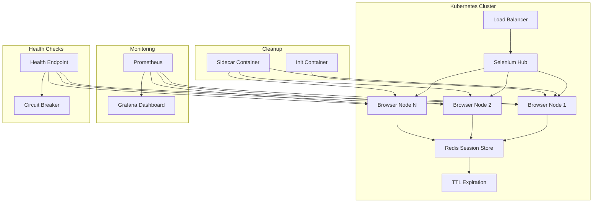

| Difficulty | Channel | Tags |
|---|---|---|
| advanced | system-design | selenium, webdriver, grid |

Imagine staring at a 150,000-test suite that takes hours to complete, blocking every release across 350+ Jenkins jobs. That was Expedia's reality — until they built a distributed Selenium Grid that cut test execution from hours to minutes [1]. This is the story of how to design a system that handles 10,000 concurrent sessions with 99.9% uptime, zero memory leaks, and graceful recovery across data centers.

---

> ### Real-World Case — Expedia
>
> Expedia's UI automation suite had grown to 9,000+ tests running across 350+ Jenkins jobs directly on executors, taking hours to complete. With hundreds of microservices teams committing 250+ times daily, the feedback loop was crippling velocity — stale browsers hung executors, no scaling existed, and analyzing failures across batched change lists was near-impossible.
>
> | | |
> |---|---|
> | **Challenge** | Scale Selenium Grid to run 150,000+ tests daily across 100+ independent hubs while reducing runtime from hours to minutes, all while handling dynamic load from hundreds of microservice CI/CD pipelines without overspending on infrastructure. |
> | **Solution** | Built SeleniumGridScaler (open-sourced), combining Selenium Grid with the AWS EC2 API for auto-scaling: nodes spin up on-demand per test run, run 15 Chrome/Firefox sessions per c5.xlarge instance (vs 1 per t2.small), and auto-terminate at billing cycle end. Each team gets its own hub sized to their test count. Later migrated to DA-Kube on EKS with Docker, Helm, and Traefik for container-based scaling with guaranteed QoS, reducing node spin-up from 2-4 minutes to instant. |
> | **Outcome** | 150,000+ tests daily across 90+ hubs; 1,000+ UI tests completed in under 5 minutes; 4,500+ nodes created and terminated on-demand daily; internal solution costs ~$80,000/year vs $2.41 million for equivalent cloud vendor parallel connections — a $2.33M annual savings. |
> | **Lesson** | The key insight was treating test infrastructure as ephemeral and pay-per-use: auto-scale nodes to exactly match test count, terminate everything after each run, and give each team their own hub. This eliminated the false economy of dedicated test machines and the bottleneck of shared static grids. Density matters too — running 15 sessions per instance instead of 1 saves 93% of IP addresses and halves compute cost. |

---

## Hook — When Your Test Suite Becomes the Bottleneck

Everyone says "shift left" on testing. But what happens when your test infrastructure can't keep up? At Expedia, UI automation had grown to 9,000+ tests across 350+ Jenkins jobs. With hundreds of microservices teams committing 250+ times daily, the feedback loop was crippling velocity. Stale browsers hung executors, no scaling existed, and analyzing failures across batched change lists was near-impossible. The problem wasn't the tests — it was the plumbing.

## Problem — The Scaling Wall Every Team Hits

You might think running 10,000 concurrent Selenium sessions is just "add more nodes." But here is the thing: naive horizontal scaling hits three walls fast. First, memory leaks accumulate silently across long-running sessions, eventually starving your nodes. Second, a single hub failure cascades into total downtime. Third, network partitions between data centers create split-brain scenarios that corrupt test state. The math alone is sobering: 10,000 sessions at 50 per node means 200 nodes minimum, requiring 520GB+ of cluster memory with buffers [2]. This is not a homework problem — it is production chaos.

## Real-World Case — Expedia's Distributed Automation

Expedia's UI automation suite had grown to 9,000+ tests running across 350+ Jenkins jobs directly on executors, taking hours to complete. With hundreds of microservices teams committing 250+ times daily, the feedback loop was crippling velocity — stale browsers hung executors, no scaling existed, and analyzing failures across batched change lists was near-impossible. The solution? A distributed Selenium Grid running 150,000+ tests daily across 90+ hubs, with 1,000+ UI tests completing in under 5 minutes. They created and terminated 4,500+ nodes on-demand daily, saving $2.33M annually compared to cloud vendor alternatives — their internal solution cost ~$80,000/year versus $2.41 million for equivalent parallel connections [1].

## Deep Dive — The Architecture That Makes It Work

Building on Expedia's lesson, let's dissect the architecture. The hub-node pattern uses Kubernetes StatefulSets to manage browser nodes across availability zones, while Redis handles session state with TTL-based expiration and connection pooling [3]. The key insight is resource isolation: CPU/memory limits per pod (2GB RAM, 1 CPU per node) with horizontal pod autoscaling based on queue depth. For load balancing, weighted round-robin considers both node capacity and response time — not just round-robin like most setups. Health checks run HTTP /status endpoints every 10 seconds, with immediate node removal after 3 consecutive failures. Circuit breakers follow Hystrix patterns, isolating failing nodes for 30-second recovery windows [4]. The plot twist? Most teams under-invest in cleanup. Kubernetes init containers remove stale Docker volumes, and Redis key expiration scans run every 5 minutes — this is what prevents memory leaks from accumulating.

## Workflow — From Zero to 10K Sessions

Here is the step-by-step flow for scaling from zero to 10,000 concurrent sessions. First, deploy a multi-AZ Kubernetes cluster with auto-scaling node pools. Second, configure the Redis session store with TTL policies matching your test duration. Third, deploy Prometheus and Grafana for real-time memory monitoring. Fourth, implement health checks and circuit breakers. Fifth, use Pod Disruption Budgets to ensure minimum 85% capacity during rolling updates. Sixth, deploy canary versions with traffic splitting for new node images. See the architecture diagram below for the visual flow:

## Code Example — Kubernetes Deployment with Session Cleanup

Here is a practical Kubernetes deployment manifest that implements session lifecycle management with automatic cleanup. This shows a browser node deployment with resource limits, health checks, and a sidecar container for session cleanup:

## Lessons Learned — Battle Scars and Best Practices

After studying Expedia's approach and similar scaled systems, here are the key takeaways. First, never skip TTL on session stores — stale sessions are the #1 cause of memory leaks. Second, implement circuit breakers early; don't wait for your first cascading failure. Third, use Pod Disruption Budgets to protect against node failures during scaling events. Fourth, monitor memory trends proactively — set alerts at 80% usage, not 95%. Fifth, weekly rolling restarts prevent garbage collection degradation. The counterintuitive lesson? Cheaper infrastructure often wins: Expedia saved $2.33M annually by building internally rather than paying cloud vendors for parallel connections [1]. The final insight: 99.9% uptime is achievable, but only if you design for failure from day one — not as an afterthought.

---

## Selenium Grid Kubernetes Architecture

<strong>Original Interview Question</strong>

**Q:** Design a scalable Selenium Grid architecture to handle 10,000 concurrent test sessions with 99.9% uptime, ensuring zero memory leaks through automatic session lifecycle management, real-time monitoring, and graceful node failure recovery across multiple data centers?

**A:** Deploy Kubernetes cluster with auto-scaling node pools, Redis session store with TTL policies, Prometheus metrics for memory monitoring, circuit breakers for node isolation, and sidecar containers for session cleanup. Implement health checks, resource quotas, and rolling updates.

## Conclusion

The Expedia story proves that scaling Selenium Grid to handle 10,000+ concurrent sessions is achievable — but only if you invest in the right architecture. Start with Kubernetes StatefulSets for node management, Redis with TTL for session state, and Prometheus for monitoring. Implement circuit breakers and health checks from day one, not as an afterthought. The $2.33M annual savings Expedia achieved shows that thoughtful internal tooling often beats expensive cloud vendor solutions. Your next step: audit your current grid setup for these patterns and start with the health check and TTL configurations — they are the highest-impact, lowest-effort wins.

---

## References

1. [Expedia: Distributed Automation — How to Run 1,000 UI Automation Tests in 5 Minutes](https://medium.com/expedia-group-tech/distributed-automation-how-to-run-1000-ui-automation-tests-in-5mins-cf9a84ca32d1) — blog
2. [Kubernetes Documentation — Horizontal Pod Autoscaler](https://kubernetes.io/docs/tasks/run-application/horizontal-pod-autoscale/) — documentation
3. [Redis Documentation — Expiration](https://redis.io/docs/develop/interaction/expiry/) — documentation
4. [Netflix Hystrix — Circuit Breaker Pattern](https://github.com/Netflix/Hystrix) — documentation
5. [Selenium Grid Documentation](https://www.selenium.dev/documentation/grid/) — documentation
6. [Kubernetes Pod Disruption Budgets](https://kubernetes.io/docs/tasks/run-application/configure-pdb/) — documentation
7. [Prometheus Monitoring — Getting Started](https://prometheus.io/docs/prometheus/latest/getting_started/) — documentation
8. [Docker Official Documentation](https://docs.docker.com/) — documentation

---

**Author:** Satishkumar Dhule — [GitHub](https://github.com/satishkumar-dhule) · [LinkedIn](https://linkedin.com/in/satishkumar-dhule) · [Website](https://satishkumar-dhule.github.io)
