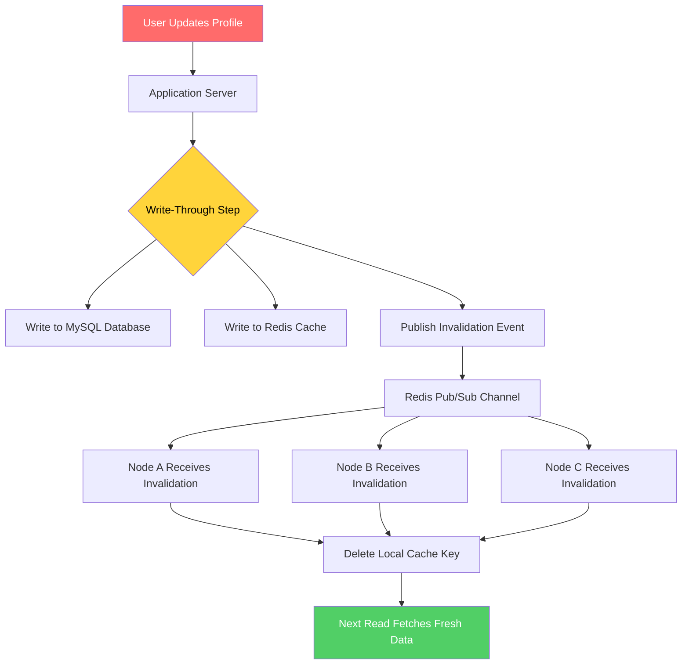

| Difficulty | Channel | Tags |
|---|---|---|
| beginner | backend | redis, memcached, cache-invalidation |

Every time a user updates their profile picture, a silent race begins — one that, if lost, serves stale data to millions. Facebook's engineering team stared down this exact problem at a staggering scale: 1.3 billion users, billions of cached objects, and a caching layer that had become so error-prone that developers dreaded touching it. Their journey from Memcache lookaside hacks to a consistency-guaranteed system called TAO didn't just fix a bug — it redefined what 'correct' means at scale [1]. If you've ever wrestled with cache invalidation for a user profile service, this story is your roadmap.

---

> ### Real-World Case — Meta
>
> Facebook's social graph required caching billions of objects across multiple geographic regions, serving 1.3+ billion users. They originally used Memcache as a lookaside cache in front of MySQL, but product engineers had to manually manage cache consistency across both stores — leading to bugs, stale data, and slow development cycles.
>
> | | |
> |---|---|
> | **Challenge** | Cache invalidation across a geographically distributed system serving 1+ quadrillion queries per day. Race conditions between cache fills and invalidations caused permanent stale data: when a cache fill and invalidation raced, the older value could overwrite newer data indefinitely. Memcache's lookaside design left all consistency logic to client code, which was error-prone and slow to iterate on. |
> | **Solution** | Facebook built TAO (The Associations and Objects), a write-through graph-aware cache that replaced Memcache for most data types. TAO uses a leader-follower tier architecture per region: followers serve reads, leaders handle writes and maintain consistency. Invalidation messages are embedded in the MySQL replication stream, ensuring they're only delivered after database replication completes. They also built Polaris, a consistency observability service that monitors client-observable invariants across all cache replicas, and a consistency tracing library that logs mutations only during the critical race window where bugs can occur. |
> | **Outcome** | Improved cache consistency from 99.9999% (six nines) to 99.99999999% (ten nines) — less than 1 in 10 billion cache writes remain inconsistent after 5 minutes. TAO handles 1+ quadrillion queries daily with 1 billion reads and millions of writes per second. When a rare interleaving bug was found, consistency tracing reduced debugging time from weeks to under 30 minutes. |
> | **Lesson** | At massive scale, Memcache's simplicity becomes a liability — pushing cache consistency responsibility to every product engineer creates compounding bugs. A write-through cache with infrastructure-managed invalidation (like TAO) moves complexity into a single well-tested layer. The plot twist: the 'simpler' technology (Memcache) actually created more complexity for the organization, while the 'complex' solution (TAO with write-through caching) made everything simpler for the 10,000+ engineers building on top of it. |

---

## Hook — It's 2 AM, and Someone Just Updated Their Profile

Picture this: a user edits their bio on your platform. Your Redis cache still holds the old version. Another user loads that profile and sees outdated information. Multiply that by a few thousand concurrent edits per second, and you've got a trust problem. Cache invalidation is notoriously one of the two hardest problems in computer science [2] — and it's not just an academic concern. At production scale, a stale profile cache means confused users, support tickets, and eroded confidence in your product. The question isn't whether you'll face this. It's whether you'll handle it before or after your first incident.

## Problem — The Stale Data Trap in Profile Caching

When you cache user profiles, you're making a bet: reads vastly outnumber writes, so storing a profile in memory is worth the complexity. And the bet usually pays off — until a user updates their avatar, changes their display name, or toggles a privacy setting. Suddenly, you have a consistency problem. Your cache and database disagree, and every read after the update returns a lie. For a beginner backend engineer, the temptation is to implement TTL-based expiration and call it a day. But TTL is a blunt instrument — it's a timer, not a guarantee. If your TTL is 5 minutes, a user could see stale data for up to 5 minutes after editing. At scale, even a few seconds of inconsistency can cascade. The core tension is clear: performance demands caching, but correctness demands freshness. You need a strategy that bridges both.

## Real-World Case — Meta's Quest for Ten-Nines Consistency

Meta's engineering team faced this exact dilemma, but at a scale that makes most backend problems look quaint. Facebook originally used Memcache as a lookaside cache in front of MySQL — meaning the cache was a performance optimization, but the database remained the source of truth. Product engineers had to manually write code to keep both stores in sync [1]. The result? A patchwork of bugs, stale data incidents, and development velocity that ground to a halt every time someone touched the caching layer. The impact was real: even at 99.9999% (six nines) consistency, that missing 0.0001% meant millions of stale reads per day across their user base. Their solution was TAO — The Associations and Objects — a caching layer that doesn't just store data but enforces consistency guarantees. After implementation, consistency jumped to 99.99999999% (ten nines), meaning fewer than 1 in 10 billion cache writes remain inconsistent after 5 minutes [1]. TAO handles over 1 quadrillion queries daily with 1 billion reads and millions of writes per second. And when a rare interleaving bug was found, consistency tracing reduced debugging time from weeks to under 30 minutes.

## Deep Dive — Write-Through, Pub/Sub, and the Redis vs Memcached Fork

So how do you avoid Meta's manual-sync nightmare without building your own TAO? The answer starts with a write-through caching pattern. When a user updates their profile, you don't just write to the database and hope the cache expires. You delete the cache key AND write the new data to both the database and the cache in the same operation. This ensures consistency by design, not by accident. On the read side, you use a cache-aside pattern: check the cache first, fall back to the database, and repopulate the cache on a miss. But here's where Redis and Memcached diverge in a way that matters deeply for distributed systems. Redis supports pub/sub messaging natively. When a cache key is invalidated on one server, Redis can broadcast that invalidation to all other nodes in the cluster automatically. Memcached, by contrast, is stateless and silent — each node knows nothing about the others. If you invalidate a key on Node A, Node B still happily serves stale data until its own TTL expires. In a multi-server deployment, this is a ticking time bomb. Redis also offers persistence (RDB snapshots and AOF logging), advanced data structures (hashes, sorted sets, lists), and built-in clustering with automatic failover. Memcached is simpler, lighter, and for pure caching workloads with no need for durability, it can be marginally faster due to lower memory overhead. Here's the real trade-off summarized:

## Workflow — A Step-by-Step Cache Invalidation Architecture

Here's the workflow for implementing write-through cache invalidation across a distributed user profile service. Each step builds on the last to ensure you never serve stale data.

## Code Example — Python Write-Through Cache Invalidation with Redis

Below is a production-style implementation of write-through caching with Redis pub/sub invalidation for a user profile service.

## Lessons Learned — What to Take Back to Your Codebase

Meta's journey from manual cache coordination to ten-nines consistency offers lessons that apply whether you're serving 100 users or 100 million. Cache invalidation isn't a problem you solve once — it's a discipline you maintain.

---

## Write-Through Cache Invalidation with Redis Pub/Sub

<strong>Original Interview Question</strong>

**Q:** You're building a user profile service that caches frequently accessed profiles. How would you implement cache invalidation when a user updates their profile, and what trade-offs would you consider between Redis and Memcached?

**A:** Implement write-through caching with TTL-based expiration. On profile update, invalidate the cache by deleting the key and writing new data to both the database and cache. Redis offers pub/sub for automatic distributed invalidation, while Memcached requires manual coordination across nodes.

## Conclusion

Meta went from six-nines to ten-nines consistency not by being cleverer, but by making consistency a structural guarantee rather than a developer responsibility [1]. For your user profile service, the takeaway is straightforward: implement write-through caching with pub/sub invalidation from day one. Yes, TTL is your safety net, but invalidation-on-write is your real defense. The five minutes you save skipping this today will cost you hours of debugging stale-data incidents tomorrow. Start with Redis if you need distributed consistency. Start with Memcached only if you have a single node and zero durability requirements. And always, always measure your cache hit rate — it's the pulse of your caching strategy. Here's the one insight to carry with you: cache invalidation is not a bug to be fixed. It's a system to be designed.

---

## References

1. [Meta engineering blog: Cache made consistent](https://engineering.fb.com/2022/06/08/core-infra/cache-made-consistent) — blog
2. [Wikipedia: Cache invalidation](https://en.wikipedia.org/wiki/Cache_invalidation) — documentation
3. [Redis documentation: Pub/Sub](https://redis.io/docs/latest/develop/interact/pubsub/) — documentation
4. [Memcached wiki: Distributed cache invalidation](https://github.com/memcached/memcached/wiki) — documentation
5. [MDN Web Docs: HTTP Cache-Control headers](https://developer.mozilla.org/en-US/docs/Web/HTTP/Headers/Cache-Control) — documentation
6. [DigitalOcean tutorial: An Introduction to Redis](https://www.digitalocean.com/community/tutorials/understanding-redis-cache-for-beginners) — documentation
7. [AWS ElastiCache documentation: Redis vs Memcached](https://docs.aws.amazon.com/AmazonElastiCache/latest/mem-ug/WhatIs.html) — documentation
8. [Wikipedia: Write-through cache](https://en.wikipedia.org/wiki/Cache_(computing)#Write-through) — documentation
9. [Martin Kleppmann: Designing Data-Intensive Applications (ArXiv companion)](https://arxiv.org/abs/1701.05639) — paper

---

**Author:** Satishkumar Dhule — [GitHub](https://github.com/satishkumar-dhule) · [LinkedIn](https://linkedin.com/in/satishkumar-dhule) · [Website](https://satishkumar-dhule.github.io)
