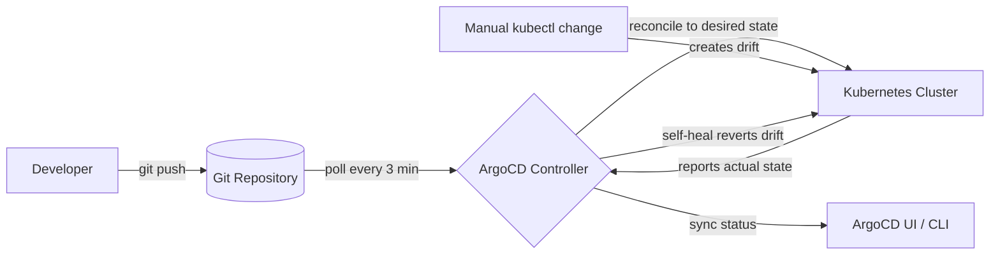

| Difficulty | Channel | Tags |
|---|---|---|
| beginner | devops | argocd, flux, declarative |

At 3 a.m., no one thinks about their pipeline. But while you chase that 500 error, a quieter failure is brewing: commands typed against live clusters nobody wrote down, hotfixes patched in a hurry, and manifests drifting further from Git with every sprint. Adobe lived this every day — nearly 50,000 environments running on fragile, queue-based pipelines that begged for manual intervention [1]. This is the story of how they bet on GitOps, and what it teaches us about the declarative vs. imperative divide.

---

> ### Real-World Case — Adobe
>
> Adobe's legacy internal container platform (Moonbeam) had become hard to scale, secure, and operate reliably across thousands of services. Teams depended on fragile, queue-based deployment pipelines that required manual intervention and suffered configuration drift.
>
> | | |
> |---|---|
> | **Challenge** | Migrate the majority of Adobe's active services to a GitOps operating model at enterprise scale: keep Git as the single source of truth, enforce declarative delivery, prevent configuration drift (including reverting manual kubectl/IAM changes), and remain auditable while eliminating fragile imperative deployment workflows — across hundreds of teams and thousands of production services. |
> | **Solution** | Adobe built 'Flex,' a governed delivery platform on Kubernetes and the Argo project ecosystem (Argo CD, Argo Workflows, Argo Events, Argo Rollouts). Argo CD continuously reconciles live environments against Git, enforcing auto-sync and self-healing so the cluster always matches the declared state and drift is automatically reverted. They coupled it with onboarding, service registration, secrets management, and change-workflow guardrails, and orchestrated the migration itself (with start/pause/continue controls) via Argo Workflows. |
> | **Outcome** | Over 6,000 services across nearly 50,000 environments (including ~19,000 production environments supporting 3,300+ production services); 10,400 pipelines migrated or decommissioned; roughly 80% of identified stale/duplicate services retired with meaningful cost savings; significantly reduced deployment queue times; GitOps now standard across deployment infrastructure supporting 3,000+ developers. |
> | **Lesson** | Adopting Argo CD is only part of the challenge — the governance model, workflow experience, and lifecycle controls around it are what make GitOps practical at enterprise scale. Declarative Git-based delivery (auto-sync + self-heal) beats imperative queue/pipeline-based deploys, and the cleanup forced by the migration surfaced unexpected cost savings by retiring forgotten services. |

---

## Hook — The Deploy Looked Fine. Then 50,000 Environments Said Otherwise.

Picture this: a platform quietly running nearly 50,000 environments for more than 6,000 services, where the only thing standing between you and a clean rollout is a fragile, queue-based pipeline that needs a human babysitter every single time. That was the reality inside Adobe's legacy internal container platform, Moonbeam, before one audacious bet on GitOps changed everything [1]. The stakes could not be higher — every manual `kubectl` run, every bit of drift between environments, every uncoordinated change was another grain of sand in the machinery. Sound familiar? If you have ever waited “one deploy deep” in a queue while your CEO stares at the dashboard, you already know the feeling.

## Problem — Configuration Drift Is Eating Your Cluster (and Your Sleep)

You have been here: a `kubectl apply` saves the day at 2 a.m., and you forget to reflect it in Git. A month later the environment rebuilds from the repository, your life-saving fix evaporates, and the entire incident replays with you as the only witness [5]. That is the imperative approach in a nutshell — direct, immediate, and dangerously undocumented. The consequences are predictable: configuration drift between environments, rollbacks that feel like archaeology, and on-call rotations nobody volunteers for. Meanwhile, queue-based deployment pipelines throttle your throughput — every deploy waits in line behind someone else's job, and debugging a failed one is like untangling a knotted extension cord.

The deeper you sink, the harder it becomes to answer a single question: *what is the actual intended state of this system?*

Here is the plot twist: many developers reach for imperative commands because they feel fast. But speed without a source of truth is just velocity in the wrong direction.

## Real-World Case — Adobe's Moonbeam Migration: 6,000 Services, One Source of Truth

Adobe's story shows exactly how high the stakes climb when craft scales to thousands of services. Moonbeam was battle-tested over a decade, yet scale became the enemy: hundreds of nightly queues, manual babysitting, and fragile automation made the platform hard to secure and reliably operate [1]. So Adobe bet on GitOps.

Building on that decision, the numbers are the kind executives pay attention to: over 6,000 services across nearly 50,000 environments — including roughly 19,000 production environments supporting more than 3,300 production services — now flow through Git-driven workflows. A staggering 10,400 pipelines were migrated or decommissioned, and about 80% of stale or duplicate services were retired, unlocking meaningful cost savings while dramatically shrinking deployment queue times [1]. Today, GitOps is the standard across Adobe's deployment infrastructure, backing more than 3,000 developers.

Observe the most impressive flip: Adobe didn't add pipeline machinery — they removed it. Simplicity, it turns out, is a scaling strategy.

## Deep Dive — Declarative vs. Imperative: The Plot Twist Most Developers Miss

The Adobe story hinges on two words everyone throws around but few truly internalize: *declarative* and *imperative*. In an imperative world, you describe **how** to change things — run this command, update this deployment, scale these replicas. Kubernetes accepts the outcome, but nothing remembers why that state was chosen [5]. In a declarative world, you describe **what** you want — this Deployment at three replicas running image `v2.1.0` — and the platform figures out how to get there [4].

Consequently, ArgoCD becomes the referee in that declarative game: an operator that watches your Git repository and continuously reconciles the cluster's actual state with the declared desired state [2][3]. Sync it on a health-check interval (commonly one to five minutes), enable self-healing, and it will revert unauthorized manual changes faster than you can say “who did that?” [3].

Let's lay the tradeoffs side by side — because each approach wins somewhere different:

| | Declarative (ArgoCD + Git) | Imperative (kubectl) |
|---|---|---|
| Source of truth | Git repository (single, auditable) | The last command typed |
| Change path | Code review → merge → sync | Immediate, no review |
| Rollback | `git revert` + sync | Re-running old commands (painful) |
| Audit trail | Full history in Git | Terminal scrollback |
| Drift handling | Self-healed automatically [3] | Inevitable [5] |
| Collaboration | 3,000+ developers at Adobe [1] | Copy-paste culture |

💡 **Insight:** a reconciliation loop turns *enforcement* — not just *deployment* — into your strongest safety control.

⚠️ **Watch out:** self-healing is a double-edged sword. If someone drills into a cluster to debug, ArgoCD will rip out their manual patch. Debug pods and escape hatches need deliberate exceptions.

🔥 **Hot take:** “faster without Git” is a mirage. At Adobe's scale the constraint was never command speed — it was drift [1].

## Workflow — From `git push` to Self-Healing Cluster in Five Steps

Building on the declarative foundation, here is the five-step path your team can follow — the same shape Adobe used, minus the 6,000 services:

1. **Put the cluster in a repo** — snapshot your Kubernetes manifests, Helm charts, or Kustomize overlays into Git [8][9].
2. **Install ArgoCD** in its own namespace (e.g., `argocd`).
3. **Define an Application CRD** pointing at the repository, target branch, and path [3].
4. **Enable automated sync** with a health-check interval and `selfHeal: true` [3].
5. **Make every change a pull request** — merge, and let ArgoCD do the rest [10].

The diagram below tells that story visually: a developer pushes to Git, ArgoCD polls the repository, reconciles the cluster, and reacts the moment actual state drifts from desired — even when the drift came from a manual `kubectl` command [4].

This workflow is why Adobe could decommission 10,400 pipelines: the machinery that *watches* replaced the machinery that *pushes* [1].

## Code Example — Pointing ArgoCD at Your Repository Like a Pro

This is where theory becomes a merge request away from production. The snippet below creates an ArgoCD Application manifest entirely from the terminal — the reproducible way to skip the GUI and make the setup itself declarative [3].

The Application CRD is the heart of the workflow: `source` points ArgoCD at the repository path and branch, `destination` names the target namespace and cluster, and `syncPolicy.automated` turns on the magic — `prune` removes resources that vanished from Git, `selfHeal` reverts manual edits, and the retry/backoff policy keeps reconciliation resilient [3]. Applying it through `kubectl` is intentionally mundane: once the manifest exists, ArgoCD takes over.

## Lessons Learned — What 10,400 Migrated Pipelines Taught Adobe

After watching 10,400 pipelines disappear, Adobe's journey condenses into a handful of rules worth stealing [1]. Here is what you need to know:

- **Start boring.** Adopt GitOps on one microservice before the fleet. Prove the loop, then scale.
- **Commit the debugging hacks.** A temp patch in a terminal is a debt you'll replay on call at 3 a.m.
- **Enable `prune` last.** Self-heal first; prune on day one across hundreds of apps is how a misconfigured overlay deletes a namespace.
- **Watch the sync status before you trust it.** Monitor the controller's output in your pipeline before ArgoCD owns production.

⚠️ **Battle scar:** the most common mistake is enabling `selfHeal: true` *and* `prune: true` simultaneously across the estate. Ramp gradually — namespace-linked release channels first, shared namespaces only after your rollback path is proven.

🎯 **Key point:** declarative deployment changed Adobe's operating model at every layer — from `git push` to cost sheet. After migrating those pipelines, GitOps became the standard not because it was trendy, but because it was boringly reliable [1].

---

## ArgoCD GitOps Reconcile Loop

<strong>Original Interview Question</strong>

**Q:** You're setting up GitOps for a microservices deployment. How would you configure ArgoCD to automatically sync changes from your Git repository to Kubernetes, and what's the difference between declarative and imperative approaches in this context?

**A:** I'd configure ArgoCD by setting up a Git repository containing Kubernetes manifests or Helm charts, creating an Application CRD that points to the Git repository, enabling auto-sync with a health check interval of 3 minutes, and implementing self-healing to automatically revert any manual changes. The declarative approach involves defining the desired state in Git through YAML manifests, Helm charts, or Kustomize configurations, where ArgoCD continuously reconciles the actual state with the desired state. In contrast, the imperative approach uses kubectl commands to make direct changes to the cluster, bypassing the Git repository as the single source of truth.

## Conclusion

Here is the moral of the story: Adobe didn't build a faster pipeline — they replaced the pipeline category entirely. Nearly 50,000 environments now hum along on the unglamorous, boringly reliable idea that Git is the truth and the cluster always yields to it [1]. Tomorrow, pick one namespace, one manifest, and one `git push`. Once you feel the relief of a deploy that fixes itself, you won't go back to kubectl roulette. And the next time someone hotfixes production from a terminal, you'll be the one asking the question that matters: “is that in the repo?”

---

## References

1. [Adobe: From pipelines to GitOps with Argo CD — CNCF case study](https://www.cncf.io/case-studies/adobe/) — article
2. [Argo CD Documentation](https://argo-cd.readthedocs.io/en/stable/) — documentation
3. [Argo CD Application CRD — Declarative Setup](https://argo-cd.readthedocs.io/en/stable/operator-manual/declarative-setup/) — documentation
4. [Kubernetes — Declarative Configuration Management](https://kubernetes.io/docs/tasks/manage-kubernetes-objects/declarative-config/) — documentation
5. [Kubernetes — Imperative Commands with kubectl](https://kubernetes.io/docs/tasks/manage-kubernetes-objects/imperative-command/) — documentation
6. [GitOps — Wikipedia](https://en.wikipedia.org/wiki/GitOps) — documentation
7. [Infrastructure as Code — Wikipedia](https://en.wikipedia.org/wiki/Infrastructure_as_code) — documentation
8. [Helm — The Package Manager for Kubernetes](https://helm.sh/docs/) — documentation
9. [Kustomize — Kubernetes-native configuration management](https://github.com/kubernetes-sigs/kustomize) — documentation
10. [An Introduction to GitOps — DigitalOcean](https://www.digitalocean.com/community/tutorials/an-introduction-to-gitops) — blog

---

**Author:** Satishkumar Dhule — [GitHub](https://github.com/satishkumar-dhule) · [LinkedIn](https://linkedin.com/in/satishkumar-dhule) · [Website](https://satishkumar-dhule.github.io)
