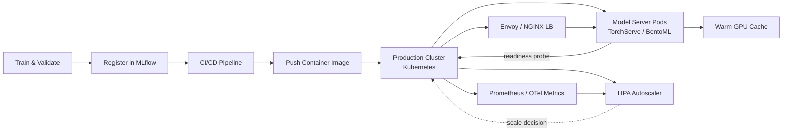

| Difficulty | Channel | Tags |
|---|---|---|
| beginner | devops | mlops, deployment |

In May 2026, NetEase Games revealed something that made ML engineers everywhere do a double take: model cold starts on their Kubernetes-based LLM platform had collapsed from 42 minutes to under 30 seconds — an 84x speedup that turned serverless LLM inference from an architectural pipe dream into an operationally viable reality [1]. The fix wasn't a faster GPU or a smarter model. It was finally understanding the difference between deployment and serving, and giving each job the right tooling. That distinction is the quiet skill separating teams whose models generate revenue from teams whose models gather digital dust.

---

> ### Real-World Case — NetEase Games
>
> NetEase Games built an AI platform (Tmax) on Kubernetes to serve LLMs for intelligent NPCs, content generation, and internal AI services across multiple game titles. Traffic was bursty — different titles peaked at different times of day — making static GPU provisioning wasteful and serverless GPU autoscaling the natural choice.
>
> | | |
> |---|---|
> | **Challenge** | The deployment layer (Kubernetes autoscaling, container orchestration) could provision GPU nodes quickly, but loading 70B-class LLM model weights — hundreds of gigabytes — from remote storage into inference nodes took up to 42 minutes. This completely erased the value of autoscaling: by the time the model was loaded, the traffic spike had passed. Deployment and serving were decoupled but neither worked without the other. |
> | **Solution** | They adopted CNCF's Fluid project to separate data orchestration from compute scheduling, implementing prefetch workflows, cross-namespace model sharing, and cache-aware scheduling via Alluxio. This eliminated repeated caching of the same foundation model across teams and enabled pre-warming model weights before inference Pods even started. Three iterations: (1) cross-region direct storage (42 min), (2) Alluxio cache layer (14 min), (3) Fluid prefetching (3 min), then further tuned to under 30 seconds in production. |
> | **Outcome** | Model cold-start time reduced from 42 minutes to under 30 seconds — an 84x improvement. This turned serverless LLM inference from an architectural concept into something operationally viable, reducing GPU provisioning costs during quiet periods and enabling aggressive scaling for traffic spikes. |
> | **Lesson** | Elastic compute is only useful if data can move just as fast. Teams often invest heavily in deployment infrastructure (Kubernetes, autoscaling, CI/CD) while neglecting the serving-side data access bottleneck. The real gap between deployment and serving is model loading and data movement — not scheduling containers. As NetEase put it: 'The issue was never just where the model files lived. The challenge was making them available quickly, predictably, and affordably for production inference.' |

---

## Hook — The 3am Panic No One Puts in a Slide Deck

Every model has an expiry date. Not the data-rot kind — the operational kind. You can spend six weeks training something genuinely clever, push it through a green CI/CD pipeline, and still find yourself at 2am staring at a 500 error because the inference endpoint takes 42 minutes to wake up. Here is the uncomfortable truth: most teams conflate two very different disciplines — deployment and serving — and the confusion is expensive. Deployment is how the model ships. Serving is how it behaves under fire. They live in the same system, but they demand different instincts, tooling, and failure modes. Sound familiar? If you have ever debugged a "deployed" model that refused to answer requests, you already know the pain.

## Problem — Running Is Not the Same as Being Ready

Here is the trap. When a team says "we deployed the model," what they usually mean is "a container is running somewhere." But running is not ready. Serving is the discipline of making a model answer queries fast, correctly, and cheaply — at scale, under load, with versioning and rollbacks that users never feel. The stakes are concrete: an inference endpoint that answers in 900ms instead of 90ms can reshape the entire product UX and quietly double your cloud bill. And unlike a typical web API, a model server carries gigabytes of weights in memory, needs GPU allocators, and suffers cold starts measured in minutes rather than milliseconds [1]. This is why static GPU provisioning keeps failing teams. Demand is bursty, bursty demand means idle hardware, and idle hardware means finance starts asking pointed questions. The core challenge, then, is not training accuracy — it is building a pipeline where a model can appear, be verified, and start serving under load without anyone noticing the seam.

## Real-World Case — NetEase Games and the 84x Cold Start

Nobody demonstrates this better than NetEase Games, which built an AI platform called Tmax on Kubernetes to serve LLMs for intelligent NPCs, content generation, and internal AI services across multiple game titles [1]. The traffic pattern was brutal: different games peaked at different hours, which made static GPU capacity either wasting money during lulls or choking during spikes. Initially, cold starts on their LLM serving stack took a jaw-dropping 42 minutes — long enough that "serverless inference" was a punchline, not an architecture. The breakthrough came from decoupling the serving layer from the provisioning model. By embracing serverless GPU autoscaling on Kubernetes — warming model caches, shrinking idle pools, and scaling aggressively only when players actually triggered traffic — the team cut cold starts to under 30 seconds: an 84x improvement [1]. Static GPU pools still ran for steady workloads, but bursty inference now cost a fraction of what it used to. The takeaway is counterintuitive and important: NetEase did not buy better hardware. They restructured how serving relates to infrastructure, which is exactly the deployment-versus-serving divide this entire article is about.

## Deep Dive — Deployment vs. Serving, and the Trade-offs Nobody Mentions

Building on that story, let's separate the two disciplines cleanly — because the failure modes live on opposite sides. Deployment is the release engineering half: CI/CD pipelines, infrastructure provisioning, container registries, and monitoring frameworks powered by tools like Kubernetes, MLflow, and SageMaker [2][4][12]. It answers "how does a new model version arrive safely?" Serving is the runtime half: inference APIs with frameworks like TorchServe, TensorFlow Serving, or BentoML, plus request routing, model versioning, autoscaling, and response optimization [6][7][8]. It answers "how does the model behave at 3pm on a Saturday?"

## Workflow — The Journey From Training Branch to Production Traffic

So how does a working model actually get from a Jupyter notebook to a scale-to-zero replica set? Teams that do this well follow a repeatable journey — and each stage is a handoff between the deployment mindset and the serving mindset. First, train and validate the model, then register it with a tracking server like MLflow so every artifact gets an ID and a lineage [4]. Second, run CI/CD to build the container, push it to the registry, and apply infrastructure with Terraform or Kubernetes manifests [2]. Third, roll out behind a load balancer with readiness probes so the cluster refuses to route traffic to a half-warm pod [2]. Fourth, split traffic for A/B testing and gradual rollouts. Finally, let the Horizontal Pod Autoscaler react to QPS and latency signals, and stream metrics into Prometheus or OpenTelemetry so the blast radius of a bad release stays small [3][10][11]. The Mermaid diagram below captures the full loop — notice that scaling isn't a one-way street, it's a feedback cycle.

## Code Example — A Production-Minded Serving Endpoint

The fastest way to internalize the lesson is to look at what good serving code actually does. Here is a stripped-down Python model server that takes cold starts, versioning, and liveness seriously — the three things that separate serving from merely running. It uses FastAPI, but the patterns apply to any serving framework.

## Lessons Learned — What the 42-Minute Disaster Taught Us

The NetEase case and the deployment-versus-serving split converge on a few hard-won lessons. First, treat cold start as a serving problem, not an infrastructure problem: preload the default model, warm caches, and probe readiness before routing traffic — that single shift is what collapsed 42 minutes into 30 seconds [1]. Second, never let static pools own bursty workloads: autoscaling exists precisely because demand is uneven, and paying for idle GPUs is the most expensive habit in MLOps [3]. Third, version models like you version code — immutable, registered, and rollback-ready — because the #1 cause of "works in staging, broken in prod" is ambiguous model references [4]. Finally, instrument everything: latency, queue depth, GPU utilization, and error rates across the serving path, because you cannot autoscale what you cannot observe [10][11]. Many developers think the hard part of ML ends at training. The real fight starts at the endpoint — and the teams that win it are the ones who stopped treating deployment and serving as one undifferentiated blob.

---

## Model Deployment to Serving Feedback Loop

<strong>Original Interview Question</strong>

**Q:** Explain the key differences between model serving and model deployment in ML systems, including specific technologies, scaling considerations, and real-world implementation patterns?

**A:** Deployment encompasses CI/CD pipelines, infrastructure setup, and monitoring using tools like Kubernetes, MLflow, and SageMaker. Serving focuses on runtime inference APIs with frameworks like TensorFlow Serving, TorchServe, or BentoML, handling request routing, model versioning, and autoscaling. Key trade-offs include latency vs throughput, batch vs real-time inference, and cold start optimization.

## Conclusion

So here is the moral of the story: deployment and serving are two different jobs that happen to run in the same cluster, and the teams that treat them as one undifferentiated blob are the ones paged at 3am. NetEase Games cut a 42-minute cold start to under 30 seconds not by buying better GPUs, but by treating serving as its own discipline — warming caches, probing readiness, and autoscaling bursty workloads instead of renting static capacity that idles during quiet hours [1]. Tomorrow, take one concrete step: look at your model serving path and ask whether a new version can ship, be verified, and be rolled back without a single user noticing. If the answer is no, you now know exactly which side — deployment or serving — is failing you. And the one insight worth sharing with your team: "deployed" means the container exists; "served" means the user already got their answer.

---

## References

1. [How NetEase Games achieved 30-second LLM cold starts on Kubernetes](https://www.cncf.io/blog/2026/05/21/how-netease-games-achieved-30-second-llm-cold-starts-on-kubernetes/) — article
2. [Kubernetes Deployments documentation](https://kubernetes.io/docs/concepts/workloads/controllers/deployment/) — documentation
3. [Kubernetes Horizontal Pod Autoscaling](https://kubernetes.io/docs/tasks/run-application/horizontal-pod-autoscale/) — documentation
4. [MLflow documentation](https://mlflow.org/docs/latest/) — documentation
5. [MLOps overview](https://en.wikipedia.org/wiki/MLOps) — documentation
6. [TorchServe documentation](https://pytorch.org/serve/) — documentation
7. [TensorFlow Serving guide](https://www.tensorflow.org/tfx/guide/serving) — documentation
8. [BentoML GitHub repository](https://github.com/bentoml/BentoML) — documentation
9. [gRPC documentation](https://grpc.io/docs/) — documentation
10. [Prometheus overview](https://prometheus.io/docs/introduction/overview/) — documentation
11. [OpenTelemetry documentation](https://opentelemetry.io/docs/) — documentation
12. [Amazon SageMaker — What is it?](https://docs.aws.amazon.com/sagemaker/latest/dg/whatis.html) — documentation

---

**Author:** Satishkumar Dhule — [GitHub](https://github.com/satishkumar-dhule) · [LinkedIn](https://linkedin.com/in/satishkumar-dhule) · [Website](https://satishkumar-dhule.github.io)
