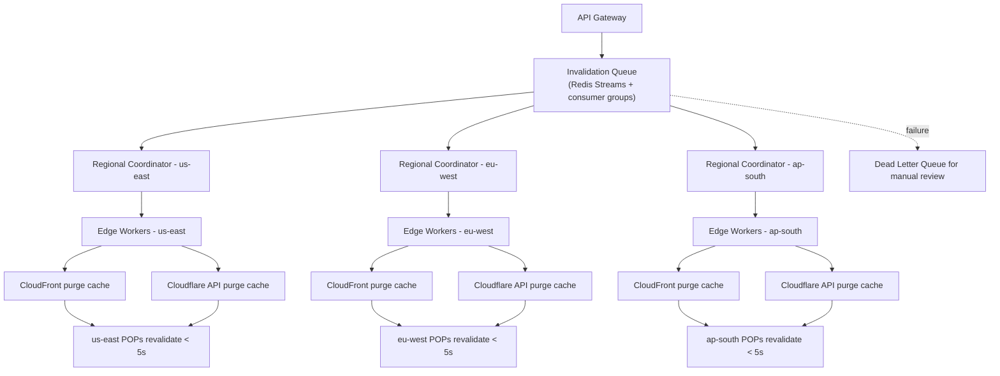

| Difficulty | Channel | Tags |
|---|---|---|
| intermediate | system-design | edge, caching, purging |

On June 8, 2021, a single routine cache purge operation was enough to knock 85% of Fastly's global edge network offline, taking Reddit, GitHub, Twitch, The New York Times, and gov.uk down with it [1]. There is the paradox of cache invalidation: the exact mechanism that propagates content worldwide in milliseconds is what turns one bad operation into a global outage. Designing a system that purges 10,000 URLs per second inside a 5-second window is not a performance exercise — it is an exercise in blast-radius engineering. This is the story of how to build one that survives contact with production.

---

> ### Real-World Case — Fastly
>
> On June 8, 2021, a routine, valid customer configuration change — widely reported as a cache purge operation — triggered a dormant software bug on Fastly's global edge network, knocking 85% of its POPs into a 503 error state. Reddit, GitHub, Twitch, The New York Times, Amazon, Shopify storefronts, and gov.uk went dark simultaneously for nearly an hour. The outage exposed how the very mechanism that guarantees near-instant global propagation of cache-control operations is also what turns a single bad operation into a global blast radius.
>
> | | |
> |---|---|
> | **Challenge** | Fastly's edge platform must propagate cache purges and service configurations to every POP worldwide in milliseconds (its purge system distributes operations across the whole network via gossip protocol, and batch surrogate-key purges cover up to 256 keys per request). The engineering challenge is that this speed creates a single-fleet amplification point: one customer operation that hits a bad code path runs simultaneously on every POP, with no staging boundary or canary to absorb the failure. |
> | **Solution** | Post-incident, Fastly (1) identified and disabled the triggering configuration within minutes to restore traffic, (2) shipped a permanent fix for the underlying bug, and (3) overhauled deployment practices — adding canary/graduated rollouts for configuration and validation changes, enhanced testing to cover the class of config-triggered bugs, and faster rollback procedures in the config/purge propagation plane. |
> | **Outcome** | 85% of Fastly's global network returned errors within seconds; the disruption was detected within one minute, 95% of the network recovered in 49 minutes, and a permanent fix was deployed later that day. Kantar estimated roughly $29 million in lost global ad revenue from the hour-long outage, and affected customers (e.g., NYT redirecting to GCP origin, Amazon load-balancing across Akamai/CloudFront) showed that multi-CDN redundancy was the practical mitigation. |
> | **Lesson** | In a multi-region CDN purge system, propagation speed and blast radius are the same coin: the sub-second,全球 propagation that guarantees 5-second freshness also means one bad purge/config operation instantly hits every POP. So a purge platform must engineer safety into propagation itself — canary stages, automatic halt conditions, rollback, and circuit breaking — because a uniform global fleet with no staging boundary turns a single valid request into an 85%-network outage. |

---

## Hook — It was 3:54 PM GMT and the internet was quietly going dark

It was June 8, 2021, and one customer pushed a routine, valid configuration change — a cache purge, by most accounts — onto Fastly's edge network. A dormant software bug turned it into a kill switch. Within seconds, 85% of Fastly's points of presence were answering every request with HTTP 503 [1]. Reddit. GitHub. Twitch. Amazon. Shopify storefronts. Even gov.uk. All dark, at the same instant. 

The uncomfortable truth: this outage was not caused by a purge that failed. It was caused by a purge that worked exactly as designed — and exposed everything downstream of the propagation mechanism. Before any queue design or time-to-live header, sit with that for a second. The same system that promises "fresh content everywhere, now" is the system that can deliver "nothing everywhere, now." If that does not command a little respect, you have not been on-call long enough yet.

## Problem — The two masters every cache purge system serves

Here is the core tension: a cache exists to make reads fast, and invalidation exists to make data correct again. Every purging system is pulled between two masters — availability, which wants you to serve from the cache and never miss, and consistency, which demands a re-fetch the moment data changes. Now add the real-world constraints on top: global propagation under 5 seconds, 10,000 concurrent invalidations per second, 99.99% availability, and consistent behavior across every region you operate in [7]. 

You might assume the throughput is the hard part. It is not. Throughput is solved by queues and fan-out — well-trodden territory [5]. The genuinely hard part is the consistency math. HTTP caching is best-effort by specification [6], CDN purge APIs are eventually consistent under the hood [4], and a network partition can silently tear a hole in your 5-second promise while every health dashboard reads green. 

Many developers discover this at 2 a.m., staring at a production cache that is happily serving ghost data while their monitoring shows a pile of 503s. And if you are single-CDN, there is no safety net underneath you. That is the real question every design review should start with: what happens when the purge mechanism itself is the thing that breaks?

## Real-World Case — Fastly, June 8, 2021

Fastly's June 8 outage is the definitive case study in why cache purging deserves architectural respect. A routine customer configuration change — widely reported as a purge operation — triggered a dormant bug in an untested edge code path, forcing 85% of the network's points of presence into an error state [1]. The numbers tell the story of a fast and competent response that still could not prevent the blast: disruption detected within one minute, 95% of the network recovered in 49 minutes, and a permanent fix shipped the same day [1]. 

But the economics are where it stings. Kantar estimated roughly $29 million in lost global ad revenue from that single hour [1]. Because the services that went dark — The New York Times, Amazon, Twitch, GitHub — are the internet's traffic backbone, the downstream cost dwarfed Fastly's own direct exposure. 

The lesson that emerged was pragmatic rather than glamorous: multi-CDN redundancy was the practical mitigation. The NYT redirected to GCP origin; Amazon load-balanced across Akamai and CloudFront [1]. If one propagation pipe can black out 85% of your edge in seconds, the answer is not a better purge API — it is not having all of your eggs in one API.

## Deep Dive — Queues, batches, and the counterintuitive power of a 2-second TTL

Building on the Fastly story, the reference architecture for a 5-second global purge looks like a funnel, not a fire hose. The flow: API Gateway receives invalidations, a distributed queue absorbs the load, regional coordinators fan out to edge workers, and those workers push to the actual CDN providers — Cloudflare and CloudFront [8]. 

Redis Streams with consumer groups are the workload backbone. They give you ordered, replayable, chunk-distributable work with acknowledgment — exactly what you need when a worker dies mid-purge [5]. Each regional coordinator consumes its own shard, so one slow region does not stall the others. On the provider side, batching is where the cost math changes: Cloudflare's purge API accepts up to 100 files per call, which turns 10,000 invalidations into 100 API calls and cuts per-request costs by roughly 90% [3]. CloudFront supports pattern-based invalidation with wildcards, but every batch is billed, which is a strong argument for only invalidating what actually changed [4]. 

Now the plot twist. The single most effective "purging system" engineers can deploy is a 2-second TTL sent as a `Cache-Control: max-age=2, must-revalidate` header [2]. Bounded staleness means users are never more than 2 seconds behind, so an aggressive purge is rarely necessary at all. RFC 9111 is unambiguous that HTTP caching is best-effort — no cache is obligated to honor your invalidation perfectly [6] — so the system that assumes staleness and reconciles is the system that survives. Under a network partition, you abandon strict consistency and settle for eventual consistency plus reconciliation, delivered through dead-letter queues and regional health checks. Strong consistency across regions within 5 seconds is a myth; bounded staleness is a design decision.

## Workflow — The lifecycle of a single invalidation

Here is how a purge request travels through the system, step by step. Figure 1 below shows the full path, and each step corresponds to the stages in the diagram. 

1. **Ingest** — A client posts a batch of up to 100 URLs through the API Gateway, which authenticates, validates, and normalizes the paths. 
2. **Enqueue** — The request lands in the distributed invalidation queue (Redis Streams), where consumer groups shard work across regions [5]. 
3. **Coordinate** — Each regional coordinator picks up its share and translates the request into region-specific purge calls. 
4. **Fan out** — Edge workers in each region call the CDN provider APIs in parallel — Cloudflare's purge_cache endpoint and CloudFront's invalidation endpoint — so one region does not wait on another [3]. 
5. **Retry with backoff** — Any failed call retries with exponential backoff plus random jitter, capped at 3 attempts, to avoid a thundering herd. 
6. **Trip the circuit** — After 5 consecutive failures, a circuit breaker fails fast rather than hammering a degraded provider. 
7. **Reconcile** — Requests that exhaust their retries land in a dead-letter queue for manual review, and a reconciliation job re-diffs origin state with what the caches actually serve. 

Figure 1: Multi-Region Cache Purging Flow. The queue absorbs the burst, regions fan out independently, and failures drain to a dead-letter queue instead of blocking the pipeline.

## Code Example — A production-minded regional purge coordinator

The code below is the heart of the workflow: a coordinator that batches URLs, fans out to Cloudflare's purge API with retry logic, and degrades gracefully instead of amplifying an outage. It encodes the two lessons from the design — batch aggressively, and fail fast when the provider is already struggling [3].

## Lessons Learned — The takeaways your next incident review needs

If the Fastly postmortem taught the industry anything, it is that purge systems fail in the most ironic way possible: the propagation machinery is also the amplification machinery [1]. Here is what the design journey above boils down to. 

- **Chase bounded staleness, not fake strong consistency.** A 2-second TTL with `must-revalidate` makes most of your purges unnecessary [2]. Design for a 5-second ceiling you can actually prove, not a consistency guarantee the RFC explicitly refuses to promise [6]. 
- **Batch or pay the tax.** Cloudflare's 100-URL batch API and CloudFront's wildcard invalidation exist to save your budget [3][4]. Ten thousand single calls will empty your cloud bill and saturate provider rate limits. 
- **Build the off-ramps.** Circuit breakers, dead-letter queues, and reconciliation jobs are not optional extras — they are what keeps a failed purge from staging a global outage under the weight of retries. 
- **Never be single-CDN.** The practical mitigation for the June 8 outage was redundancy across Akamai, CloudFront, and GCP origin [1]. Satirize the meeting where that is called "over-engineering." 
- **Chaos-test the kill switch.** Run a game-day that disables your primary purger and watches the reconciliation path do its job. What you find will be worth the sprint. 

Start your change not with a queue, but with the cache headers. Ship a 2-second TTL first, measure how often you actually purge, and only then invest in the fan-out machinery. It is a cheaper version of the same journey — and it will not take the internet down with it.

---

## Multi-Region Cache Purging Flow

<strong>Original Interview Question</strong>

**Q:** How would you design a multi-region CDN cache purging system that guarantees content propagation within 5 seconds while handling 10,000 concurrent invalidations per second?

**A:** Implement Cloudflare API + AWS CloudFront with distributed invalidation queue, edge compute coordination, and 2-second TTL. Use batch invalidation, exponential backoff, and regional cache headers for 5-second SLA.

## Conclusion

Here is the moral of the journey: the Fastly outage was never about a bad purge — it was about invisible coupling between a propagation mechanism and global availability [1]. Every cache control system ships with the same physics: speed makes correctness easier and failure wider. So the engineering that matters is not the fastest purge; it is the safest one — bounded staleness via short TTLs, batch fan-out that respects provider limits, circuit breakers that fail fast, dead-letter queues that keep the pipeline alive, and at least one other CDN watching your back. Tomorrow, start with the headers, prove your 5-second ceiling, and game-day the failure path. The insight to carry to your team: treat every cache purge as if it could take down the internet — because with enough users, it can.

---

## References

1. [Fastly incident report](https://www.fastly.com/blog/summary-of-june-8-outage) — blog
2. [MDN: Cache-Control header](https://developer.mozilla.org/en-US/docs/Web/HTTP/Headers/Cache-Control) — documentation
3. [Cloudflare: Purge cache](https://developers.cloudflare.com/cache/how-to/purge-cache/) — documentation
4. [AWS CloudFront: Invalidating files](https://docs.aws.amazon.com/AmazonCloudFront/latest/DeveloperGuide/Invalidation.html) — documentation
5. [Redis: Streams data type](https://redis.io/docs/latest/develop/data-types/streams/) — documentation
6. [RFC 9111: HTTP Caching](https://datatracker.ietf.org/doc/html/rfc9111) — paper
7. [Wikipedia: Content delivery network](https://en.wikipedia.org/wiki/Content_delivery_network) — article
8. [Cloudflare Workers documentation](https://developers.cloudflare.com/workers/) — documentation
9. [MDN: HTTP caching overview](https://developer.mozilla.org/en-US/docs/Web/HTTP/Caching) — documentation

---

**Author:** Satishkumar Dhule — [GitHub](https://github.com/satishkumar-dhule) · [LinkedIn](https://linkedin.com/in/satishkumar-dhule) · [Website](https://satishkumar-dhule.github.io)
