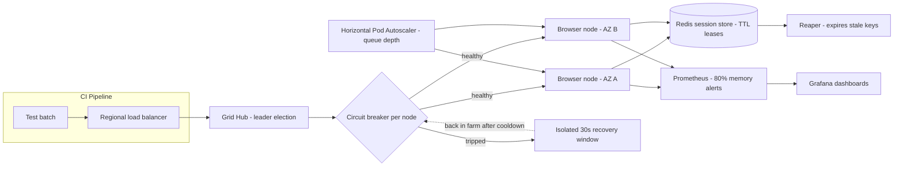

| Difficulty | Channel | Tags |
|---|---|---|
| advanced | system-design | selenium, webdriver, grid |

Back in 2011, Google's internal 'Selenium Farm' was quietly running one million browser test executions every single month [1]. Today, that same lineage of Selenium, WebDriver, and JsUnit infrastructure pushes millions of tests through CI every day [1]. Scaling that far was never about driving more browsers - it was about deciding what fails, when it fails, and how fast anyone notices. This is the story of how to design a Selenium Grid that swallows 10,000 concurrent sessions while holding the line on memory leaks and 99.9% uptime.

---

> ### Real-World Case — Google
>
> Google runs browser automation tests (Selenium, WebDriver, JsUnit) continuously across products like Gmail and Google Docs. As early as 2011 their internal web-testing platform — the grid-scale 'Selenium Farm' and its successor — was handling 1 million test executions per month; it has since grown to run millions of tests every day across many browsers and operating systems.
>
> | | |
> |---|---|
> | **Challenge** | A single Selenium Grid hub becomes a bottleneck past ~50 nodes, and raw horizontal scaling with static nodes cannot handle tens of thousands of concurrent browser sessions reliably. Google needed a distributed platform that could schedule browser tests at massive scale, provision fresh environments, keep browser processes from leaking/degrading, and stay highly available so internal developers could trust test results in CI. |
> | **Solution** | Instead of just racking up more Selenium nodes, Google built a grid-scale service layer (initially the 'Selenium Farm' supported by engineers like Jason Huggins, later the Atlas-style platform) that decoupled test scheduling from execution: a fleet of machines runs WebDriver sessions, with centralized orchestration, environment provisioning per session, monitoring/dashboards for live status, and robust results handling — effectively running N independent grids behind one service instead of one congested hub. |
> | **Outcome** | Scaled from '1 Million Executions Per Month' in 2011 to 'millions of Selenium, WebDriver, and JsUnit tests every day on a variety of browsers and operating systems' at Google today, giving product teams CI test results with minimal latency and high reliability. |
> | **Lesson** | You can't scale Selenium by simply adding more nodes to one hub — at Google scale, availability and concurrency come from treating the browser farm as a distributed system (central scheduling, per-session provisioning, real-time monitoring, and failure handling), not from throwing hardware at a static Grid topology. |

---

## Hook — It's 3 a.m. and Your Test Grid Is on Fire

Picture the pager going off at 3 a.m. A nightly regression suite queued 40,000 browser sessions, and by 2:47 the grid had started eating its own tail - nodes OOM-killed in sequence, orphaned sessions stacking in the hub, and a fresh wave of retries making everything worse. Everyone who has woken up to that dashboard knows the sinking feeling: 500 errors, a grid that looks healthy, and zero explanation.

The stakes are brutal. In a serious CI shop, broken test infrastructure does not just delay a pull request - it stalls delivery for every team waiting on that pipeline. Sound familiar? Maybe. But here is the twist: the failure almost never lives in the Selenium code itself. It lives in the lifecycle plumbing underneath.

This is the architecture tour that keeps a 10,000-session grid alive: Redis TTL leases, Kubernetes autoscaling, circuit breakers, and a reaper that never sleeps. By the end, the 3 a.m. pager can stay quiet.

## Problem — 10,000 Sessions Is Not 10,000 Browsers

You might assume that 10,000 concurrent sessions means 10,000 browsers, and 10,000 browsers means a capacity problem. In reality, compute is the easy part - and that is exactly the trap.

A naive grid hands a handful of hub processes every browser child process on a fleet of nodes [2]. Chrome and Firefox are gloriously leak-prone under load; every abandoned profile, orphaned driver, and stale Docker volume becomes a slow species of memory rot. Given enough runs, nodes creep toward their limits until the OOM killer does what the team was supposed to do earlier [4].

Now add the failure modes that love ambushes: a node that dies mid-session and never releases its lease, a network partition that makes every healthy node look dead, and a load balancer routing fresh sessions to a half-dead box because nobody checked /status.

Here is the math that should scare you. 99.9% uptime allows only 525.6 minutes of downtime per year. For a grid running thousands of sessions a day, every zombie node is minutes ticking down. Consequently, memory management in a test grid is really a lifecycle management problem [5].

## Real-World Case — Google

In 2011, Google stood on a Selenium conference stage and revealed the scale of its internal web-testing platform: a grid called the 'Selenium Farm' running 1,000,000 test executions per month [1]. The talk surfaced a less obvious signal, however - testing at that scale was no longer a QA chore; it was a performance and reliability exercise for the entire software pipeline. Google runs browser automation continuously across Gmail, Google Docs, and a widening set of web properties.

A decade later, the story is even bigger. The Selenium, WebDriver, and JsUnit suites that grew out of that farm now execute millions of tests every single day, across a huge spread of browsers and operating systems, feeding product teams CI results with minimal latency and high reliability [1].

Why does this matter for a team running, say, 40 nodes? Because the problems Google met at scale are the same problems that appear at one-hundredth of the volume - they just arrive sooner. Session leaks, capacity surprises, and node churn are not exotic Google problems; they are everyday developer problems in a sharper costume. Designing for the 10,000-session future forces the decisions that make a 100-session grid boring and reliable today.

## Deep Dive — The Anatomy of a Leak-Proof Grid

Building on that reality, the first design decision is where browser nodes live. A hub-and-node pattern paired with Kubernetes StatefulSets gives every worker a stable identity and the ordered startup and shutdown guarantees needed for graceful lifecycle control [4]. Nodes spread across multiple availability zones so a single datacenter hiccup does not take down the whole farm [10].

Next comes the session store. Redis handles leases with TTL-based expiration, connection pooling, and automatic cleanup - a session that dies without ceremony is still reaped on schedule [5]. Each pod gets hard CPU and memory limits (1 CPU, 2 GB per node) enforced by the scheduler, and a Horizontal Pod Autoscaler grows the pool based on queue depth behind the hub rather than raw CPU [7].

The memory budget is the part everyone checks twice:

| Metric | Value |
| --- | --- |
| Nodes needed | 10,000 / 50 sessions per node = 200 |
| Baseline memory | 200 x 2 GB = 400 GB |
| With 30% headroom | 520 GB cluster memory |
| Latency target | P99 session initiation < 2 s |

Here is the plot twist: more memory is not the answer to memory leaks. Teams keep adding RAM until the clouds are heavy, when the real fix is reclamation. The pattern that actually works pairs prevention with cleanup: weekly rolling restarts, garbage-collection tuning, and memory alerts at 80% through Prometheus with Grafana dashboards [6][11]. Kubernetes init containers scrub stale Docker volumes before a pod starts, and a reaper scan expires orphaned Redis keys every five minutes [5].

Failing nodes get a Hystrix-style circuit breaker: three consecutive failed health checks pull a node out of rotation for a 30-second recovery window [9]. Meanwhile, Pod Disruption Budgets ensure upgrades never drop the fleet below 85% capacity [8]. The counterintuitive insight lands here: availability is engineered at the edge, not at the center. Search your memory of the last few outages - how many were caused by the hub, and how many by the node nobody was watching?

## Workflow — From Test Submission to Green Pipeline

With the pieces in place, the whole system becomes a repeatable workflow, and like any good pipeline each step hands cleanly to the next. The Grid Session Lifecycle and Failover diagram at the end of this section is the map; the journey below is the itinerary.

1. **Test submission** - a CI job posts a new batch to the regional load balancer, which picks the least-loaded hub using weighted round-robin.
2. **Session lease** - the hub atomically claims a Redis key with SET NX + TTL; only one node may own a session, which removes double-allocation races [5].
3. **Node assignment** - the scheduler routes the request to a pool member with free capacity, kept honest by /status heartbeats every 10 seconds.
4. **Test execution** - WebDriver drives the browser through the suite, and a sidecar renews the lease TTL with each heartbeat so long-running tests are not killed [3].
5. **Completion** - on success the lease is released immediately; on crash the 5-minute reaper expires the orphan.
6. **Failure isolation** - three straight failed health checks trip the circuit breaker, and the node cools down for 30 seconds [9].
7. **Autoscaling** - queue depth grows the node pool via HPA; falling demand shrinks it just as smoothly [7].
8. **Version changes** - canary deployments split traffic, so a janky new node image never takes down the entire farm in one stroke.

Now, the diagram: a load balancer feeding a leader-elected hub, a per-node circuit breaker deciding who survives, and every session tracked by Redis TTL leases with Prometheus watching for memory pressure. It is the whole story in one picture.

## Code Example — A Leaser, a Reaper, and a Breaker Walk Into a Grid

Enough theory. Here is the trio of mechanisms that automate the boring work and prevent those 3 a.m. pages - a session leaser, a circuit breaker, and a reaper. This is the production-shaped core of a leak-proof grid, not a toy:

```python
import time
import requests
import redis

SESSION_TTL = 30 * 60          # max lease: 30 minutes per session
R = redis.Redis(host='redis-cluster', port=6379, decode_responses=True)

class CircuitBreaker:
    # Hystrix-inspired guard: 3 straight failures trip the breaker for 30s.
    def __init__(self, name, threshold=3, cooldown=30):
        self.name = name
        self.threshold = threshold
        self.cooldown = cooldown
        self.failures = 0
        self.open_until = 0.0

    def call(self, fn):
        if time.time() < self.open_until:
            raise RuntimeError(f'breaker {self.name} is OPEN - node isolated')
        try:
            result = fn()
            self.failures = 0          # one success resets the counter
            return result
        except Exception:
            self.failures += 1
            if self.failures >= self.threshold:
                # isolate the node for a bounded 30s recovery window
                self.open_until = time.time() + self.cooldown
            raise

def acquire_session(node_id, session_id):
    # Claim a lease atomically with SET NX + TTL - only one caller wins.
    claimed = R.set(f'grid:session:{session_id}', node_id, nx=True, ex=SESSION_TTL)
    if claimed:
        R.expire(f'grid:node:{node_id}', SESSION_TTL)   # heartbeat refresh
    return claimed

def reap_stale_leases():
    # Orphaned keys that skipped graceful teardown die here, not in memory.
    for key in R.scan_iter('grid:session:*', count=500):
        if R.ttl(key) < 0:          # no expiry set - a lifecycle leak
            R.delete(key)

def monitor_node(node_id, endpoint, active_session_ids):
    # Hub sidecar: heartbeat /status every 10s, isolate on 3 failures.
    breaker = CircuitBreaker(f'node:{node_id}')
    try:
        ok = breaker.call(lambda: requests.get(f'{endpoint}/status', timeout=2).status_code == 200)
        if ok:
            for sid in active_session_ids:
                acquire_session(node_id, sid)
    except RuntimeError:
        R.srem('grid:active_nodes', node_id)   # immediate removal from capacity
```

The breaker wraps every remote call and counts failures instead of hoping for the best; after three strikes it bricks the node for 30 seconds, which buys the cluster time to route around the sick box [9]. `acquire_session` leans on Redis SET NX with an expiry in one atomic operation, so two schedulers can never lease the same session twice [5]. The reaper is the quiet hero: it scans keys with no TTL and deletes them, which closes the loop on in-flight crashes that skip graceful teardown. Finally, `monitor_node` ties it together - heartbeat, lease renewal, and isolation on the same cadence.

## Lessons Learned — What a Million Runs Teach You

After watching hundreds of sessions die in interesting ways, here is what sticks:

- **Memory is a lease problem, not a capacity problem.** TTL everything, expire everything, and keep a reaper running [5].
- **Health checks are only as good as their aggression.** Ten-second intervals and three-strike removal turn 'probably fine' into determinism.
- **Autoscaling needs a demand signal.** Queue depth behind the hub beats CPU-based rules for browser workloads [7].
- **Isolate fast.** A circuit breaker buys a recovery window; a Pod Disruption Budget keeps the fleet above 85% even during a bad rollout [8][9].

Battle scars worth avoiding:
- Skipping init-container cleanup and watching stale volumes pile up across every restart [4].
- Alerting at 95% memory and discovering that alerts only fire when it is already too late; 80% is the number that gives you time [6].
- Rolling a new node image to the whole fleet at once - canary traffic splitting exists for this exact reason.

Monday action plan:
1. Put TTLs and a reaper on the session store this week. It is a day of work with outsized return.
2. Wire /status heartbeats with a three-strike circuit breaker on every node.
3. Add a queue-depth Horizontal Pod Autoscaler before buying a single new node [7].

What should you do differently tomorrow? Treat the test farm like production. For the thousands of engineers waiting on CI, it already is production.

---

## Grid Session Lifecycle and Failover



<details>
<summary><strong>Original Interview Question</strong></summary>

**Q:** Design a scalable Selenium Grid architecture to handle 10,000 concurrent test sessions with 99.9% uptime, ensuring zero memory leaks through automatic session lifecycle management, real-time monitoring, and graceful node failure recovery across multiple data centers?

**A:** Deploy Kubernetes cluster with auto-scaling node pools, Redis session store with TTL policies, Prometheus metrics for memory monitoring, circuit breakers for node isolation, and sidecar containers for session cleanup. Implement health checks, resource quotas, and rolling updates.

</details>

## Conclusion

Circle back to Google's Selenium Farm: one million executions a month in 2011, millions of tests a day now [1]. That journey was never about buying faster browsers - it was about making failure cheap, visible, and recoverable. Your grid does not need Google's scale to need Google's discipline: TTL leases for memory, a reaper for orphans, breakers for sick nodes, and autoscaling keyed to real demand instead of hope. Call it the rule of the grid: design for what can die, and the sessions that survive will carry the pipeline. Tomorrow morning, start with the lease - one Redis TTL and a reaper is all it takes to feel the difference.

---

## References

1. [Google incident report](https://www.selenium.dev/conf-archive/editions/sf2011/speakers) — article
2. [Selenium (software) - Wikipedia](https://en.wikipedia.org/wiki/Selenium_(software)) — documentation
3. [WebDriver - W3C Recommendation](https://www.w3.org/TR/webdriver/) — documentation
4. [StatefulSets - Kubernetes Documentation](https://kubernetes.io/docs/concepts/workloads/controllers/statefulset/) — documentation
5. [EXPIRE command - Redis Documentation](https://redis.io/docs/latest/commands/expire/) — documentation
6. [Prometheus Overview - Documentation](https://prometheus.io/docs/introduction/overview/) — documentation
7. [Horizontal Pod Autoscaling - Kubernetes Documentation](https://kubernetes.io/docs/tasks/run-application/horizontal-pod-autoscale/) — documentation
8. [Configure Pod Disruption Budgets - Kubernetes Documentation](https://kubernetes.io/docs/tasks/run-application/configure-pdb/) — documentation
9. [CircuitBreaker - Martin Fowler](https://martinfowler.com/bliki/CircuitBreaker.html) — blog
10. [Running in Multiple Zones - Kubernetes Best Practices](https://kubernetes.io/docs/setup/best-practices/multiple-zones/) — documentation
11. [Grafana Documentation](https://grafana.com/docs/grafana/latest/) — documentation

---

**Author:** Satishkumar Dhule — [GitHub](https://github.com/satishkumar-dhule) · [LinkedIn](https://linkedin.com/in/satishkumar-dhule) · [Website](https://satishkumar-dhule.github.io)
