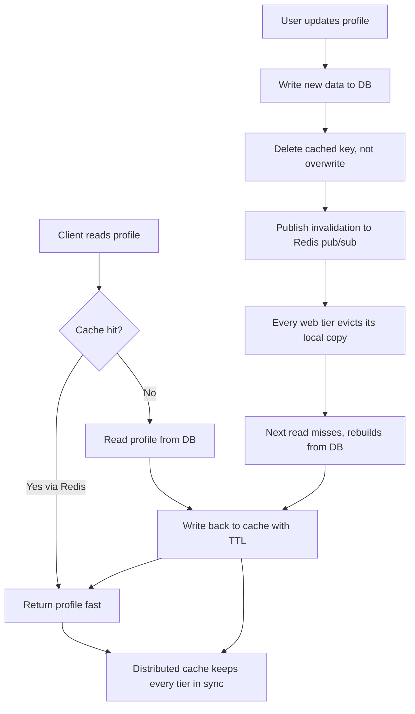

| Difficulty | Channel | Tags |
|---|---|---|
| beginner | backend | redis, memcached, cache-invalidation |

Stack Overflow serves more than 300 million HTTP hits a day across a network of 100+ sites, backed by roughly 124 million active Redis keys and 1.58 billion Redis commands per day [1]. Yet the hardest part of that system was never raw throughput — it was keeping user data consistent the moment someone edited it. This article is the journey every backend developer takes when they discover that caching is easy and cache invalidation is a distributed-systems problem in disguise.

---

> ### Real-World Case — Stack Overflow
>
> Stack Overflow serves more than 300 million HTTP hits per day while hosting the entire Stack Exchange network of 100+ sites inside a single app process, so user objects, top-bar counts, and question lists are cached on nearly every page request. As traffic grew, the team needed a shared cache fast enough to back their per-server in-memory caches and keep user-related data consistent across every web tier machine.
>
> | | |
> |---|---|
> | **Challenge** | Decide how to cache frequently accessed user data across many web servers without serving stale data, and pick between Redis and Memcached for the shared (L2) tier while making cache invalidation practical at scale. |
> | **Solution** | They chose Redis over Memcached for the shared cache tier 'because it works, and it works well' - familiar, rock-solid, with pub/sub built in for pushing real-time updates (rep, scores) to every connected client and server. Reads go to an in-process L1 memory cache first (nanoseconds) and fall back to the ~0.2-0.5ms Redis L2 tier (0.17ms LAN round-trip); they cache only what pays for its own invalidation, purging entries through Redis whenever the underlying data changes. |
> | **Outcome** | At peak the system handled 308,065,226 HTTP hits/day and 64.7M question pages/day served by ~124M active Redis keys (423M including replicas), processing 1.58B Redis commands/day (3.7B with replicas) at only ~2% CPU utilization - 'far from any limits'. In-process reads were measured 2,000-5,000x faster than the network round-trip to Redis. |
> | **Lesson** | The shared cache isn't the biggest win - in-process L1 memory is - but Redis earned its place over Memcached through pub/sub for real-time invalidation, rock-solid operability, and the discipline of only caching data whose invalidation cost you can afford. |

---

## Hook — Two words that strike fear into every backend engineer

Two words strike fear into every backend engineer: cache invalidation. Many developers have lived this exact nightmare: a user edits their profile, the database confirms the write, and yet the next page load still shows the old bio, old avatar, old location — for minutes. The stakes go beyond a stale email address. Stale user data means broken sessions, phantom permissions, and a support inbox filling with the same question: "why does it still show...?" So the real question isn't how to cache — it's how to know when yesterday's fast answer becomes today's wrong answer.

## Problem — Where reads get fast, correctness goes to die

Here is the thing though: caching is where your reads become lightning-fast, and also where your correctness quietly expires. In-process memory reads measure 2,000-5,000x faster than a network round-trip to a shared cache [1], so those local copies feel irresistible. But every update now has two homes to keep in sync: the database and any number of caches. Multiply that by 100+ web servers, each holding its own local copy of the same user profile, and one simple profile update suddenly means invalidating hundreds of copies scattered across your fleet. Keep them all consistent and you defeat the purpose of caching. Ignore them and you serve ghost data. Sound familiar? This is the tension at the heart of every profile service: speed on reads, consistency on writes, and rarely any easy answer for both.

## Real-World Case — Stack Overflow

Nobody has wrestled this problem at a bigger scale than Stack Overflow. The team runs the entire Stack Exchange network inside a single app process, which means user objects, top-bar counts, and question lists are effectively cached on nearly every page request [1]. As traffic grew, per-server in-memory caches weren't enough — they needed a shared cache fast enough to back them and keep user data consistent across every web tier machine. The result is staggering: at peak the system handled 308,065,226 HTTP hits in a single day and 64.7 million question pages, served by roughly 124 million active Redis keys (423 million counting replicas), processing 1.58 billion Redis commands per day at just 2% CPU utilization — "far from any limits" [1]. Yet even with a fleet that size, the strategy stayed deliberately conservative: most consistency is ensured locally, and Redis is treated as a shared backstop where invalidation events propagate to every tier [1]. If caching can stay correct for traffic that big, the principles can work for your profile service too.

## Deep Dive — Write-through caching, delete vs overwrite, and the Redis vs Memcached showdown

Building on the Stack Overflow story, the classic solution is the write-through pattern: on update, write the new data to both the database and the cache, so reads and writes agree by construction [4]. But there is a plot twist most developers discover only after a production incident: overwriting the cache on update is riskier than it looks. If a slow, old write lands in the cache after a fast, new write, the old value silently clobbers the new one — the famous stale-write race. Deleting the key instead sidesteps the race entirely: the next read simply misses, rebuilds from the database, and repopulates the cache with a fresh TTL [4]. That TTL is your second safety net. For profiles, 5-30 minutes balances freshness against DB load. Too long and users see yesterday's data; too short and you invite a thundering herd the moment a hot profile expires [5]. Now the tooling choice. Redis shines here because its pub/sub channel lets one writer notify every subscriber — which is exactly how a distributed web tier signals "evict this user's key everywhere" [2]. Memcached, by contrast, is a lean, blazing-fast key-value store with lower memory overhead and simpler horizontal scaling, but it offers no built-in pub/sub and no persistence — invalidation must be coordinated manually across nodes [3]. Redis pub/sub means automatic, instant distributed invalidation; Memcached means you build the messaging layer yourself [3].

## Code Example — A write-through profile cache with fleet-wide invalidation

Putting the workflow into code, here is a production-shaped version of the pattern described above. The class wraps a Redis client, reads cache-aside, writes through to the database, and broadcasts invalidation so every tier evicts its local copy. This mirrors how teams minimize cross-node network traffic while keeping user data consistent [1][7].

## Lessons Learned — What the profile service teaches every developer

The journey ends with a few battle scars worth keeping. First: delete, don't overwrite — the stale-write race is real, and a missing key is safer than a wrong key [4]. Second: a TTL is a promise about freshness, not a substitute for invalidation — set 5-30 minutes for profiles, but never rely on expiry alone [5]. Third: if your cache sits in each server's RAM, your invalidation must reach each server's RAM, which is precisely why Redis pub/sub outperforms manual Memcached coordination in a distributed fleet [2][3]. Fourth: watch the numbers — if hit rate collapses after a deploy, or Redis commands surge, the write path is misbehaving before your users file a single ticket [6]. The actionable takeaway: implement write-through with delete-on-update, broadcast invalidation over Redis pub/sub, add jitter to TTLs to blunt stampedes, and instrument hit rates from day one. Tomorrow, apply this to your slowest read path: it might not be 300M requests a day, but your users deserve the same honest freshness that Stack Overflow ships to its first.

---

## Cache Invalidation Flow

<strong>Original Interview Question</strong>

**Q:** You're building a user profile service that caches frequently accessed profiles. How would you implement cache invalidation when a user updates their profile, and what trade-offs would you consider between Redis and Memcached?

**A:** Implement write-through caching with TTL-based expiration. On profile update, invalidate the cache by deleting the key and writing new data to both the database and cache. Redis offers pub/sub for automatic distributed invalidation, while Memcached requires manual coordination across nodes.

## Conclusion

The moral of the story: caching rewards you with 2,000-5,000x faster reads, but it bills you in invalidation complexity — and Stack Overflow proves the bill is payable at massive scale if you pay it with the right pattern [1]. Start tomorrow by applying three moves to your slowest read path: delete-on-update instead of overwrite, TTLs of 5-30 minutes with jitter for profiles, and a Redis pub/sub invalidation channel so every tier evicts its local copy. Before you write a single line, instrument your cache hit rate — because the team that measures freshness ships it, and the team that doesn't keeps answering "why does it still show...?"

---

## References

1. [Stack Overflow incident report](https://stackoverflow.blog/2019/08/06/how-stack-overflow-caches-apps-for-a-multi-tenant-architecture/) — blog
2. [Redis](https://en.wikipedia.org/wiki/Redis) — documentation
3. [Memcached](https://en.wikipedia.org/wiki/Memcached) — documentation
4. [Cache invalidation](https://en.wikipedia.org/wiki/Cache_invalidation) — documentation
5. [Cache stampede](https://en.wikipedia.org/wiki/Cache_stampede) — documentation
6. [HTTP caching](https://developer.mozilla.org/en-US/docs/Web/HTTP/Caching) — documentation
7. [redis/redis](https://github.com/redis/redis) — documentation
8. [memcached/memcached](https://github.com/memcached/memcached) — documentation
9. [RFC 9111 — HTTP Caching](https://datatracker.ietf.org/doc/html/rfc9111) — documentation
10. [functools — caching in Python](https://docs.python.org/3/library/functools.html) — documentation

---

**Author:** Satishkumar Dhule — [GitHub](https://github.com/satishkumar-dhule) · [LinkedIn](https://linkedin.com/in/satishkumar-dhule) · [Website](https://satishkumar-dhule.github.io)
